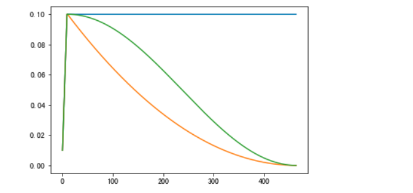
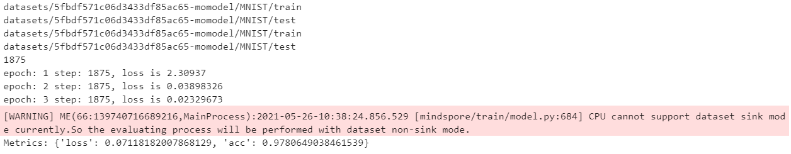
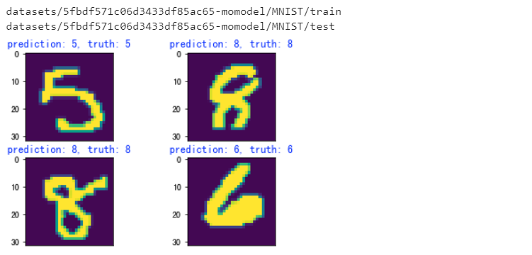

# MobileNetV2 垃圾分类

| 实验名称 | MobileNetV2 垃圾分类 |
| -------- | -------------------- |
| 姓名     | 宗威旭               |
| 学号     | 3180102776           |
| 学院     | 计算机科学与技术     |

## 一、问题重述

题目要求基于 MindSpore 开发框架，首先基于 MNIST 手写数字数据集，通过 LeNet5 神经网络开发并训练一个手写数字识别模型，并检验模型精度。在完成此实验，掌握 MindSpore 框架的基本搭建过程后，基于 MobileNetV2 实现一个垃圾分类模型，并提高其验证精度。

实验的主要目的是，通过前半部分的手写数字模型构建，了解 MindSpore 的相关功能调用方式，以及如何通过 MO 平台训练模型。在训练垃圾分类模型时，主要是尝试各种手段提高准确率。

实验报告主要讲解垃圾分类模型，手写数字数据集部分只简单描述原理及运行过程。

## 二、设计思想

### 1. 手写数字识别模型

`LeNet-5` 则是基于 CNN 的一种层次结构，包括三个卷积层，两个池化层和一个全连接层，最后一个输出层共七层。（实际是现是两个卷积层，最后三个为全连接层和输出层）其中，卷积层使用的都是 stride 为 1 的 5×5 的卷积核。池化层则使用一个 stride 为 2 的 2×2 的平均池化层。每一层的卷积/池化后，与 bias 相加得到的和，输入激活函数，激活函数的输出作为下一层的输入。LeNet-5 的特殊之处，其一是 C3 层并未使用 S2 产生的所有特征，从而使网络对计算的要求降低（事实上现在很少这么做了，因为算力提高了）。

实验使用的数据集是MNIST数据集，广泛用于机器学习的训练和测试。我们使用其训练图像处理，即手写数字的识别。其中，手写数字包括六万个训练集数据和一万个测试集数据，有较好的代表性。输入图像为28×28，位深度为8的灰度图像。使用的框架为 MindSpore。

### 2. 垃圾分类模型

垃圾分类模型基于 MobileNetv2 实现。我们主要利用 mindspore 提供的预训练模型进行 Fine-Tune。在训练过程中，结合 MobileNetv2 的层次结构，我们可以冻结网络的 backbone（用于特征提取），只训练网络的 Head 层。将特征提取得到的 feature map 作为训练 Head 的数据集，减少训练时间。

训练的微调过程中我们主要处理的超参有以下几个：

* learning rate, decay type
* momentum, weight decay (Momentum Optimizer)
* epochs
* other: batch size

针对学习率。模型在训练过程中趋于收敛，学习率应该是一个动态衰减的过程，减小训练后期的抖动。项目实现的学习率下降策略有：`cosine decay` 和 `square decay`。两者的主要区别在于衰减的发生时期。前者（下图绿色）在后期逐渐衰减，而后者（下图橘色）在训练前期就有较大衰减，相对均匀。



针对优化器，项目中默认使用 `Momentum` 优化器，来加快梯度下降过程中模型的收敛速度。也可以尝试其他优化器：在 MindSpore 1.0 中支持的包括 SGD, Adam 等优化器。（该版本并不支持 Adagrad）

训练过程中，应该及时保存中间的模型。保存的 checkpoint 可选取精度高的模型进行预测。对于中间模型，也可以进一步作为预训练模型，应用于更细化的训练场景。

## 三、代码内容

### 1. 手写数字识别模型

MindSpore 通过设置上下文指定执行模式、设备等。优先进行设置：

```python
has_gpu = (os.system('command -v nvidia-smi') == 0)
print('Excuting with', 'GPU' if has_gpu else 'CPU', '.')
context.set_context(mode=context.GRAPH_MODE, device_target='GPU' if has_gpu else 'CPU')
```

准备好训练和测试数据，并对数据进行预处理。数据集从 MNIST 提供的手写数字数据集获取。对数据集的预处理包括打标，将数据打乱后分批处理等。

```python
def create_dataset(data_dir, training=True, batch_size=32, resize=(32, 32),
                   rescale=1/(255*0.3081), shift=-0.1307/0.3081, buffer_size=64):
    data_train = os.path.join(data_dir, 'train') # 训练集信息
    data_test = os.path.join(data_dir, 'test') # 测试集信息
    print(data_train)
    print(data_test)
    ds = ms.dataset.MnistDataset(data_train if training else data_test)

    ds = ds.map(input_columns=["image"], operations=[CV.Resize(resize), CV.Rescale(rescale, shift), CV.HWC2CHW()])
    ds = ds.map(input_columns=["label"], operations=C.TypeCast(ms.int32))
    # When `dataset_sink_mode=True` on Ascend, append `ds = ds.repeat(num_epochs) to the end
    ds = ds.shuffle(buffer_size=buffer_size).batch(batch_size, drop_remainder=True)

    return ds
```

设计实现 Lenet 5 训练网络，中间用到的卷积、池化、全连接层等可以直接调用 MindSpore 提供的接口。

```python
class LeNet5(nn.Cell):
    def __init__(self):
        super(LeNet5, self).__init__()
        ...
        self.fc3 = nn.Dense(84, 10)

    def construct(self, x):
        x = self.relu(self.conv1(x))
        ...
        x = self.fc3(x)

        return x
```

之后，实现训练部分。训练部分包括训练策略的指定，Callback过程和评估。选取的损失函数为交叉熵函数，用 Momentum 作为优化器加快收敛。训练超参使用 `learning rate`, `momentum`, `num_epochs` 三个。训练后的 Callback 过程包括保存 checkpoint 以及监控 loss 值。并在每一次训练结束后，用当前模型基于测试集进行评估。

```python
def train(data_dir, lr=0.01, momentum=0.9, num_epochs=3, ckpt_name="lenet"):
    ds_train = create_dataset(data_dir)
    ds_eval = create_dataset(data_dir, training=False)
    steps_per_epoch = ds_train.get_dataset_size()

    net = LeNet5()
    loss = nn.loss.SoftmaxCrossEntropyWithLogits(sparse=True, reduction='mean')
    opt = nn.Momentum(net.trainable_params(), lr, momentum)

    ckpt_cfg = CheckpointConfig(save_checkpoint_steps=steps_per_epoch, keep_checkpoint_max=5)
    ckpt_cb = ModelCheckpoint(prefix=ckpt_name, directory=CKPT_DIR, config=ckpt_cfg)
    loss_cb = LossMonitor(steps_per_epoch)

    model = Model(net, loss, opt, metrics={'acc', 'loss'})
    model.train(num_epochs, ds_train, callbacks=[ckpt_cb, loss_cb], dataset_sink_mode=False)
    metrics = model.eval(ds_eval, dataset_sink_mode=False)
    print('Metrics:', metrics)

train(DATA_PATH)
```

保存模型后，测试部分读取该 model 在测试集上进行评估。也可以直接应用该模型对目标图像进行预测。

```python
def eval(data_dir):
    ds_eval = create_dataset(data_dir, training=False)
    net = LeNet5()
    loss = nn.loss.SoftmaxCrossEntropyWithLogits(sparse=True, reduction='mean')
    load_checkpoint(CKPT, net=net)
    model = Model(net, loss, metrics={'acc', 'loss'})
    metric = model.eval(ds_eval, dataset_sink_mode=False)
    print(metric)
    
def infer(data_dir):
    ds = create_dataset(data_dir, training=False).create_dict_iterator(output_numpy=True)
    data = ds.get_next()
    images = data['image']
    labels = data['label']
    net = LeNet5()
    load_checkpoint(CKPT, net=net)
    model = Model(net)
    output = model.predict(Tensor(data['image']))
    preds = np.argmax(output.asnumpy(), axis=1)

    for i in range(1, 5):
        plt.subplot(2, 2, i)
        plt.imshow(np.squeeze(images[i]))
        color = 'blue' if preds[i] == labels[i] else 'red'
        plt.title("prediction: {}, truth: {}".format(preds[i], labels[i]), color=color)
        plt.xticks([])
    plt.show()
```

### 2. 垃圾分类模型

定义训练过程中需要的上下文和超参，参数如下所示：

```python
# 训练超参
config = EasyDict({
    "num_classes": 26, # 分类数，即输出层的维度
    "reduction": 'mean', # mean, max, Head部分池化采用的方式
    "image_height": 224,
    "image_width": 224,
    "batch_size": 64, # 鉴于CPU容器性能，太大可能会导致训练卡住
    "eval_batch_size": 10,
    "epochs": 60, # 在训练集上训练的代数
    "lr_max": 0.03, # 动态学习率的最大值
    "decay_type": 'cosine', # 学习率下降策略
    "momentum": 0.9, # Momentum优化器的动量参数，通常为0.9
    "weight_decay": 4e-5, # 正则化项的系数
    "dataset_path": "./datasets/5fbdf571c06d3433df85ac65-momodel/garbage_26x100",
    "features_path": "./results/garbage_26x100_features", # 临时目录，保存冻结层Feature Map，可随时删除
    "class_index": index,
    "save_ckpt_epochs": 1,
    "save_ckpt_path": './results/ckpt_mobilenetv2',
    "pretrained_ckpt": './src_mindspore/mobilenetv2-200_1067_cpu_gpu.ckpt',
    "export_path": './results/mobilenetv2.mindir'
})
```

实现学习率的动态变化，包含常数变化、平方衰减和余弦衰减。其余设置 warmup 和最终学习率。

```python
def build_lr(total_steps, lr_init=0.0, lr_end=0.0, lr_max=0.1, warmup_steps=0, decay_type='cosine'):
    lr_init, lr_end, lr_max = float(lr_init), float(lr_end), float(lr_max)
    decay_steps = total_steps - warmup_steps
    lr_all_steps = []
    inc_per_step = (lr_max - lr_init) / warmup_steps if warmup_steps else 0
    for i in range(total_steps):
        if i < warmup_steps:
            lr = lr_init + inc_per_step * (i + 1)
        else:
            if decay_type == 'cosine':
                cosine_decay = 0.5 * (1 + math.cos(math.pi * (i - warmup_steps) / decay_steps))
                lr = (lr_max - lr_end) * cosine_decay + lr_end
            elif decay_type == 'square':
                frac = 1.0 - float(i - warmup_steps) / (total_steps - warmup_steps)
                lr = (lr_max - lr_end) * (frac * frac) + lr_end
            else:
                lr = lr_max
        lr_all_steps.append(lr)

    return lr_all_steps
```

训练中冻结 backbone 层，只需要将该层提取的特征作为 Head 层的输入。该层提取 Feature Map 过程如下。并加载预训练模型。

```python
def extract_features(net, dataset_path, config):
    if not os.path.exists(config.features_path):
        os.makedirs(config.features_path)
    dataset = create_dataset(config=config)
    step_size = dataset.get_dataset_size()
    if step_size == 0:
        raise ValueError("The step_size of dataset is zero. Check if the images count of train dataset is more \
            than batch_size in config.py")

    data_iter = dataset.create_dict_iterator()
    for i, data in enumerate(data_iter):
        features_path = os.path.join(config.features_path, f"feature_{i}.npy")
        label_path = os.path.join(config.features_path, f"label_{i}.npy")
        if not os.path.exists(features_path) or not os.path.exists(label_path):
            image = data["image"]
            label = data["label"]
            features = net(image)
            np.save(features_path, features.asnumpy())
            np.save(label_path, label.asnumpy())
        print(f"Complete the batch {i+1}/{step_size}")
    return

backbone = MobileNetV2Backbone()
load_checkpoint(config.pretrained_ckpt, net=backbone)
extract_features(backbone, config.dataset_path, config)
```

下面是 Head 层的实现和训练。这里只放部分训练部分的实现。冻结backbone层

```python
backbone = MobileNetV2Backbone()
# Freeze parameters of backbone. You can comment these two lines.
for param in backbone.get_parameters():
    param.requires_grad = False
```

定义损失函数，优化器，并调用给对应网络

```python
loss = nn.SoftmaxCrossEntropyWithLogits(sparse=True, reduction='mean')
lrs = build_lr(config.epochs * step_size, lr_max=config.lr_max, warmup_steps=0, decay_type=config.decay_type)
opt = nn.Momentum(head.trainable_params(), lrs, config.momentum, config.weight_decay)
net = nn.WithLossCell(head, loss)
train_step = nn.TrainOneStepCell(net, opt)
train_step.set_train()
```

开展 epochs 次训练，记录每次训练时长以及 loss 值，并将中间训练结果进行保存。

```python
for epoch in range(config.epochs):
    random.shuffle(idx_list)
    epoch_start = time.time()
    losses = []
    for j in idx_list:
        feature = Tensor(np.load(os.path.join(features_path, f"feature_{j}.npy")))
        label = Tensor(np.load(os.path.join(features_path, f"label_{j}.npy")))
        losses.append(train_step(feature, label).asnumpy())
    epoch_seconds = (time.time() - epoch_start)
    epoch_loss = np.mean(np.array(losses))

    history.append(epoch_loss)
    print("epoch: {}, time cost: {}, avg loss: {}".format(epoch + 1, epoch_seconds, epoch_loss))
    if (epoch + 1) % config.save_ckpt_epochs == 0:
        save_checkpoint(network, os.path.join(config.save_ckpt_path, f"mobilenetv2-{epoch+1}.ckpt"))
```

可以每隔一个固定周期，在训练集上进行一次评估，实时跟踪中间训练模型在训练集上的准确率

```python
eval_model = Model(network, loss, metrics={'acc', 'loss'})
acc = eval_model.eval(eval_dataset, dataset_sink_mode=False)
```

最终做模型评估时，对于输入图像进行处理 (rescale)，并调用训练的模型进行预测：

```python
def image_process(image): 
    mean=[0.485*255, 0.456*255, 0.406*255]
    std=[0.229*255, 0.224*255, 0.225*255]
    image = (np.array(image) - mean) / std
    image = image.transpose((2,0,1))
    img_tensor = Tensor(np.array([image], np.float32))
    return img_tensor

def predict(image):
    image = cv2.resize(image,(config.image_height, config.image_width))
    image = image_process(image)
    
    logits = network(image)
    pred = np.argmax(logits.asnumpy(), axis=1)[0]
    
    return inverted[pred]
```

## 四、实验结果

### 数字识别

训练过程较短，使用 Notebook 控制台。训练过程如下。共执行三个 epoch，每次的 loss 值监控如下。当 `epoch = 3` 该模型在测试集的正确率达到 97.8%。infer 过程的预测基本正确。





### 垃圾分类

这里主要讲的不仅是实验结果，更主要的是整个调参和调优的思路历程。

垃圾分类模型的训练周期较长，调参过程较长。因此，主要使用 GPU 进行训练，辅以 CPU 用于训练规模较小的训练任务，或者进行单个 checkpoint 的评估。最终调参结果正确率最高为 80.8%。下面是实验过程的记录。

初次直接运行题目中给定的默认参数，运行效果如下所示：

```python
config = EasyDict({
    "epochs": 10, # 请尝试修改以提升精度
    "lr_max": 0.01, # 请尝试修改以提升精度
    "decay_type": 'constant', # 请尝试修改以提升精度
    "momentum": 0.8, # 请尝试修改以提升精度
    "weight_decay": 3.0, # 请尝试修改以提升精度
})
```

| dataset            | loss  | accuracy |
| ------------------ | ----- | -------- |
| train (epoch = 10) | 2.528 | 0.514    |
| test               |       | 0.523    |

可以看到模型的正确率并不高。上面给定的参数并不适用：`epochs` 过小（针对上面的参数来说），会导致训练过程不充分。`learning rate` 是一个常数，我们可以选择不同的取值以及衰减函数，使学习率动态变化。`momentum` 取值可以进一步增大，例如 0.9，0.99来加速收敛。`weight_decay` 设置的过大，很难在一个最低点稳定下来，一般我们设置为 0 - 0.1的一个值。这一点应该根据学习率动态调整。调整这里参考了https://stats.stackexchange.com/questions/70101/neural-networks-weight-change-momentum-and-weight-decay 可以看到，weight decay 不应该增加一个过大的扰动。

根据上面的参数经验值，我们对上述参数进行微调后。这里对数据集了解还不怎么充分，先把 epochs 开大点。运行效果如下所示：

```python
config = EasyDict({
    "epochs": 300,
    "lr_max": 0.01,
    "decay_type": 'cosine',
    "momentum": 0.99,
    "weight_decay": 0.1,
})
```

| dataset            | loss  | accuracy |
| ------------------ | ----- | -------- |
| train (epoch = 40) | 0.650 | 0.897    |
| test               |       | 0.769    |

基于经验参数进行微调，首先思路是设置一个合适的 epochs 和较低的学习率。学习率动态下降采用 `cosine` 动态变化，让其学习率在训练前半部分下降较慢。这里的 weight_decay 还是比较大的，容易在训练后期产生较大的震荡，可以进一步调小，或改变学习率的 lr_end。过程中也对于学习率、momentum, weight_decay 进行微调。下面只依次记录了调参过程中准确率依次调高的 checkpoint。

| epochs  | lr_max      | decay_type | momentum | weight_decay | accuracy | 备注                                  |
| ------- | ----------- | ---------- | -------- | ------------ | -------- | ------------------------------------- |
| 130/150 | 0.01        | cosine     | 0.99     | 0.1          | 0.777    | loss比较大且持续较快降低，训练不充分  |
| 255/300 | 0.01        | cosine     | 0.99     | 0.1          | 0.785    | 难以取得进一步本质进展，250后基本重复 |
| 247/300 | 0.01-0.0001 | cosine     | 0.99     | 0.1          | 0.792    |                                       |

这个过程中，尝试保存一些训练结果较好的模型作为 checkpoint 进一步训练。事实上这个思路确实不可行。因为即使是较好的模型可能也是一个局部最小值，也缺失了预训练的值。事实上，这一过程适度放缓 momentum 并减小 weight_decay，如果设置一个较大的学习率，结果则是非常不准确，正确率后面会持续走低。如果设置一个较小的学习率慢慢递减，则预测结果趋于平稳，也并不准确。可以说基本都属于过拟合情况。

经过上面的尝试，会想到较多的改善点，也能对测试集使用的数据特征有一个大概的猜测：

* 数据集的差异可能较大，训练集的特征可能提取的不够充足（例如：光照、旋转、位移、缩放相干性等）
* 学习率的变化不太符合，因为默认的 `build_lr` 一直在下降，可能并不符合实际
* batch 大小不适配，特征提取的特征过多 or 过少

因此这时想到了以下几种微调模型的思路：

* 换一个优化器：SGD 和 Adam 都尝试一下，应用一下 Nesterov 加速
* 更改 batch 的大小，用一个较低的学习率横向比较
* 学习率动态变化：换其他学习率方法，或者增加弱监督信息及时提高学习率
* 数据增强

首先修改成本最低的是修改 optimizer, 尝试使用其他的优化器进行调参，例如 Adam, SGD等 。MindSpore 也提供了对应接口，与 Mementum 优化器的调用方式类似。参数使用多数框架采用的默认参数，MindSpore的接口使用的默认参数和大多框架基本一致。自己尝试则是主要修改学习率、或者尝试其他调参手段，例如 warmup, nesterov 加速等。

| epochs             | learning rate    | weight decay | accuracy | 备注                 |
| ------------------ | ---------------- | ------------ | -------- | -------------------- |
| 100/100 (training) | 0.001            | 0.001        | 0.942    | 这个是训练集的准确率 |
| 90/100             | 0.001            | 0.001        | 0.764    | 测试集的准确率       |
| 100/100            | 0.1              | 0.001        | 0.769    | SGD, momentum = 0.9  |
| 110/150            | 0.1-0.005 cosine | 0.01         | 0.785    | warmup = 20          |
| 10                 | 0.0001           | 0.00001      | 0.777    | Nesterov 加速        |

普通的 Adam 优化器可以在以更高的效率达到75%左右的正确率。增加了 Nesterov 的 Adam 优化器可以在学习率较小的情况下，非常快的收敛到一个局部最小值，在训练集上有 94% 的准确率，在测试集有 77% 的准确率。然而只是较多的提高了效率，在超参调试上并没有实质上的进展。

接下来是选用其他大小的 batch 进行尝试。我优先选择将 batch 改的大一些，因为对于预设的 batch 大小，数据集相对来说还是比较多的，很可能特征提取的过多，垃圾种类的区分度不够高。

| epochs | learning rate   | weight decay | batch_size | accuracy |
| ------ | --------------- | ------------ | ---------- | -------- |
| 40     | 0.1-0.03 cosine | 4e-5         | 256        | 0.764    |
| 40     | 0.03            | 4e-5         | 150        | 0.793    |
| 40     | 0.1-0.03 cosine | 4e-5         | 128        | 0.808    |
| 40     | 0.15-0.1        | 1e-4         | 64         | 0.800    |
| 40     | 0.03            | 4e-5         | 32         | 0.785    |

一般 `batch size` 设置的比较大，收敛的速度会更快，模型的泛化能力也更强。当然过大的 batch size 并不能提升训练效果，而且会导致空间消费变得额外的大。根据经验来说，一般将 batch size 设置为 2 的幂次，GPU 会表现出更好的计算性能。这个时候已经可以打到80%以上的准确率。然而也存在另一个问题：学习率等其他参数的调整对准确率提高的影响变的很小。也就是说模型还是过于泛化，并不利于进一步的精准调参。

结合上面结果和使用经验，选择 `batch size = 64`。观察了一下数据集，发现这数据集其实还是可以做一些优化。华为官方提供的数据增强文档：https://www.mindspore.cn/tutorial/zh-CN/0.1.0-alpha/use/data_preparation/data_processing_and_augmentation.html。针对数据集处理，我们可以稍微调大 repeat 来扩充数据集的大小，这一点在项目中 `create_dataset` 提供了对应接口。查看 `create_dataset` 接口发现，函数使用 `c_transform` 做了一个数据增强，包括 `RandomCropDecodeResize`, `RandomHorizontalFlip`, 'RandomColorAdjust'，对图片做一个位移、缩放和光照的相干性。因此，这里我们最好做一个 repeat 操作，一方面扩充数据集，并增强上述的相干性。

另外查看数据集发现：eggshell (03-02) 的训练集是空的...最终根据测试集的五张图片补充生成为 100 张作为训练集。

| repeat | epochs | learning rate    | accuracy(train) | accuracy |
| ------ | ------ | ---------------- | --------------- | -------- |
| 2      | 20/40  | 0.03-0.01 cosine | 0.953           | 0.831    |
| 3      | 60/80  | 0.03-0.01 cosine | 0.963           |          |
| 4      | 60/80  | 0.03-0.01 cosine | 0.975           | 0.846    |
| 8      | 40/80  | 0.03-0.01 cosine | 0.981           | 0.431    |

随着 repeat 的增大，训练集上的评估正确率越来越高。在上面的训练中均达到 95% 以上。在测试集上的训练结果，在同样的其他参数情况下，明显正确率整体提高很多。但是当 repeat 过大，可能会导致训练集和测试集产生较大偏差。

后来发现好像训练和测试用的图像色彩空间不一样... 换成 RGB 之后，上面 84.6% 对应的 checkpoint 正确率飙升到 96.15%，心态复杂。


## 五、总结

在计算机视觉那门课做过基于 Tensorflow 实现 MNIST + LeNet5 实现手写数字识别，所以前半部分主要了解 MindSpore 框架的实现过程。这一过程感觉和 Tensorflow 其实差别并不太大。有一个值得一提的槽点是，MindSpore 也有着和 Tensorflow 一样 1.0 和 2.0 版本的许多冲突问题。我最初尝试本地运行，部署了 2.0 版本的 Mindspore，然后发现 mo 上的代码是 1.0 版本呢，很多接口已经不支持了。

主要占用时间的是后面提高垃圾分类模型准确率的过程。因为没有那种参加过深度学习相关比赛的经验，对于调参其实并不怎么有经验。只是知道一些损失函数，优化器相关概念。不死心的慢慢尝试占用了 5h 的 GPU 运行时间。从这一过程感觉 mindspore 设计的接口还是蛮灵活的。在数据集创建过程，可以经过 shuffle, map, batch, repeat 一系列操作，并在 map 过程中可以进行数据强化。通过调节常用的训练参数，对于这些参数的经验取值有了更深的理解。最大的收获还是对于如何从训练集、测试集的评估结果反馈到参数调整上，以及对于优化模型的整体过程和切入点有了更好的思路。

题目尝试了几个超参的调试，以及数据强化的修改。对于监督信息的添加和其他模型还没有尝试。因为学业及各方面的大程...还是挺想在课余时间尝试部署到移动端。

顺便吐槽一波训练过程。实验由于其他课程作业导致时间是分开的。五月底完成了 lenet+mnist 数字识别模型，以及最基本的垃圾分类参数尝试。6.15 尝试更复杂的调参（更多尝试，调优化器，batch）。最终 6.18 开始调数据增强，边写软工前端边等结果。结果遇到了 mo 平台的严重拥堵。测试久久不出结果，GPU 训练经常被一个超长 Job 占用将近半小时。虽然有临终抱佛脚的心态，不过确实刚刚看到原来数据集处理最有效，都能稳定提到 83% 的正确率，最高调到 84.62% 了。当时一直在想 mo 加个调度算法就好了，比如对训练量做一个预评估（听上去好像也挺难的）。能免费白嫖 50h 的 GPU 已经非常感激了。这一点算是给 MO 的一个反馈意见吧。
