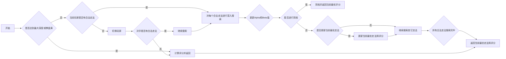

<center>
  <font face="黑体" size = 5>
    黑白棋AI算法
  </font>
   <center><font face="黑体" size = 5>
Alpha-Beta 剪枝 实现
  </font>
  <center><font face="黑体" size = 4>
    姓名： 周炜
  </font>
  <center><font face="黑体" size = 4>
    学号： 32010103790
  </font>
</center> 

# 对抗搜索算法

## **MiniMax搜索**：

优点：

- 算法简单易懂，易于实现。
- 在搜索树较小且有限深度时，能够找到最佳解。

缺点：

- 在搜索树较大或深度较深时，需要搜索大量节点，计算复杂度高。
- 不考虑对手的最佳应对，容易受到波动的影响，即对手选择了一种不同的策略，可能会导致最终的决策完全不同

比如下例中，如果最后一排是终止节点，那么`MIN`则会选择其中最小的数值，如上图中红色框中所选择出来的数值。而`MAX`会从MIN选择最小的数值之后从中选择一个最大的数值`3`。 在`minimax`算法里面，`MAX`会选择后续玩法最大的一种玩法。而`MIN`会选择后续玩法里面最小的一种玩法。两者轮流竞争。


## **Alpha-Beta 剪枝搜索**：

优点：

- 在MiniMax搜索的基础上引入了剪枝策略，大大减少了搜索空间，提高了搜索效率。
- 能够在搜索树较大的情况下，更快地找到最佳解。

缺点：

- 仍然需要考虑搜索树的所有节点，对于非常大的搜索树依然计算复杂度高。
- 可能会出现剪枝不彻底的情况，导致不能得到最优解。


接MinMax中例子：假设我们已近搜完了B节点，得到其最小收益为`3`，然后开始搜C节点，当搜到`2`的时候，剩下的两个`4`和`6`就没有必要搜索下去了，因为不管接下来搜到什么，整个C CC得出来的结果都会比B BB的结果`3`要小。可以看出，如果对于一颗非常巨大的树来说，如果可以剪枝一部分对搜索结果没有影响的分支，将会大大提高搜索的效率。整个的搜索流程可展示为下图所示过程：


## **蒙特卡洛树搜索算法**：

优点：

- 不同于传统的基于启发式搜索的算法，蒙特卡洛树搜索是一种随机化搜索算法，适用于状态空间非常大、复杂的问题。
- 通过模拟大量的随机对局，能够较为准确地评估每个动作的价值。

缺点：

- 在开始阶段可能表现较差，因为需要随机模拟大量对局才能产生可靠的结果。
- 对于某些状态空间较小的问题，可能不如传统的搜索算法效果好。

# Alpha-Beta剪枝算法实现解析

## 算法流程

- **Alpha值**：假设$n$是`MIN`节点，如果$n$的一个后续节点可提供的收益小于$α$，则$n$及其后续节点可被剪枝
- **Beta值**：假设$n$是`MAX`节点，如果n的一个后续节点可获得收益大于$β$，则n及其后续节点可被剪枝

  每个节点有两个值，分别是α值和β值。节点α和β值在搜索过程中不断变化。其中α从负无穷大逐渐增加、β从正无穷大逐渐减少，如果一个节点中α > β，则该节点的后续节点可剪枝。

做出流程图大致如下



## 代码实现

`def alphaBeta(self,board,color,a,b):`函数是实现了Alpha-Beta剪枝算法的核心部分，我只介绍这个函数的实现

递归终止条件：如果搜索深度超过最大深度，则返回当前局面的估值

```python
if self.deepth > self.maxdeepth:
    if color == self.color:
        return None, self.calculate(board,color)
    else:
        return None, -self.calculate(board,color)
```

根据当前玩家颜色确定对手的颜色

```python
if color == 'X':
    colorNext ='O'
else:
    colorNext ='X'
```

`action_list = list(board.get_legal_actions(color))`是当前玩家的合法行动列表,  下面根据其状态进行决策

若当前玩家没有合法行动，则检查对手是否有合法行动，若无，则返回当前局面的估值。

```python
if len(action_list) == 0:
    if len(list(board.get_legal_actions(colorNext))) == 0:
        return None,self.calculate(board,color)
    return self.alphaBeta(board,colorNext,a,b)
```

对于每一个合法行动，进行以下操作：

- 执行行动，更新棋盘状态。

- 递归调用 `alphaBeta` 方法，计算对手的估值。
- 回溯棋盘状态。
- 根据当前玩家的角色进行 alpha-beta 剪枝。

```python
for p in action_list:
    flipped_pos = board._move(p,color)
    self.deepth += 1
    p1, current = self.alphaBeta(board,colorNext,a,b)
    self.deepth -= 1
    board.backpropagation(p,flipped_pos,color)
    
    # alpha-beta 剪枝
    if color == self.color:
        if current > a:
            if current > b:
                return p,current
            a = current
        if current > max:
            max = current
            action = p
    else:
        if current < b:
            if current < a:
                return p,current
            b = current
        if current < min:
            min = current
            action = p
```

返回最优动作和对应的估值。

```python
if color == self.color:
    return action,max
else:
    return action,min
```

## 测试结果

通过了所有的6个测试棋手


