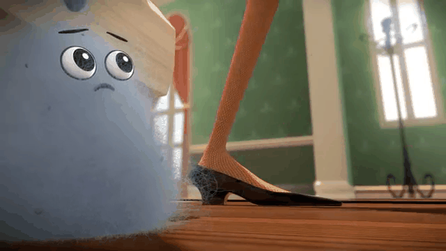

# GIFer

A very simple video-to-gif tool.

The implementation is ugly, but at least it worked somehow.


# Requirements

opencv

Pillow


# Usage

```python
from video2gif import Vid2Gif

# cut video from 00:02:00 to 00:02:10
v2g = Vid2Gif("input.mp4", cut=True, st="00:02:00", et="00:02:10")
v2g.write_gif(gif_file='from_bmp.gif')
```

the result is:

 


