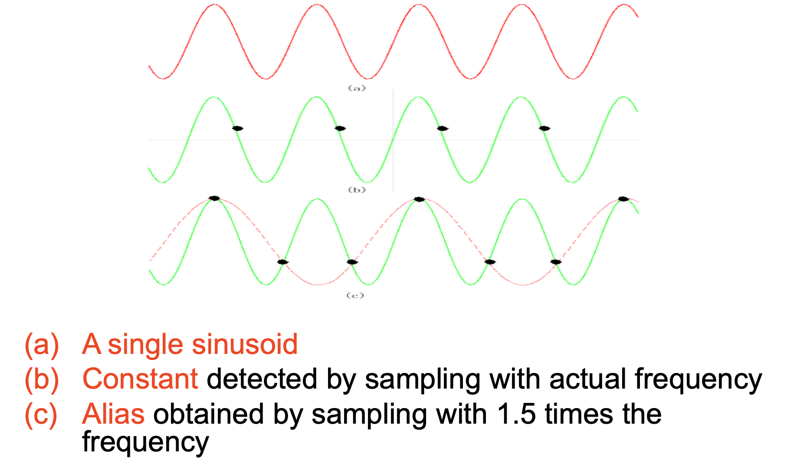
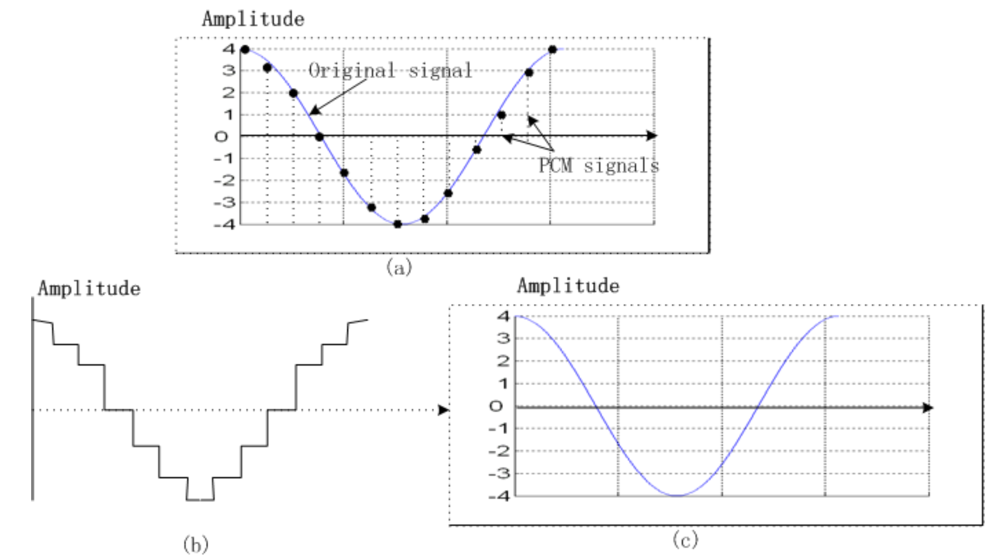
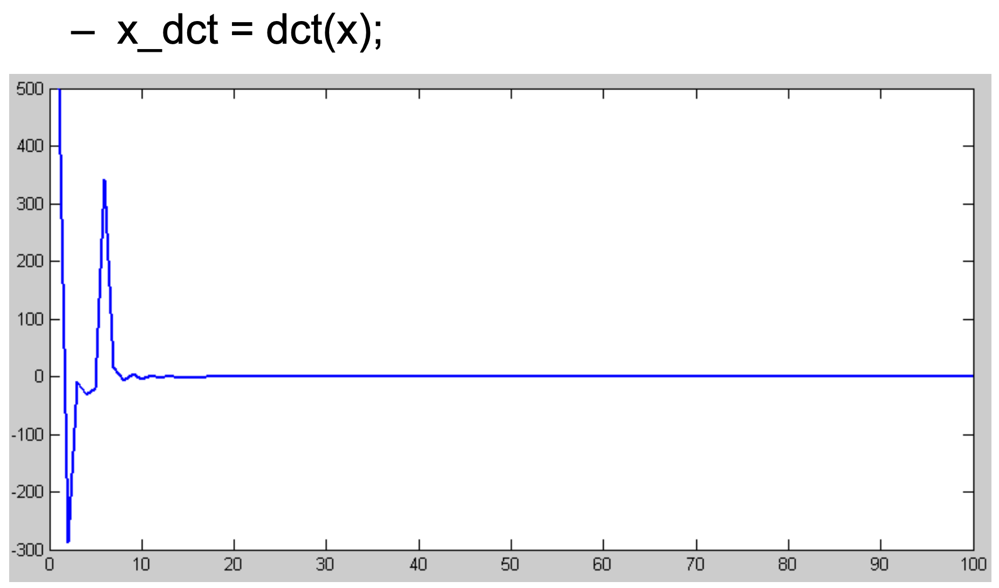
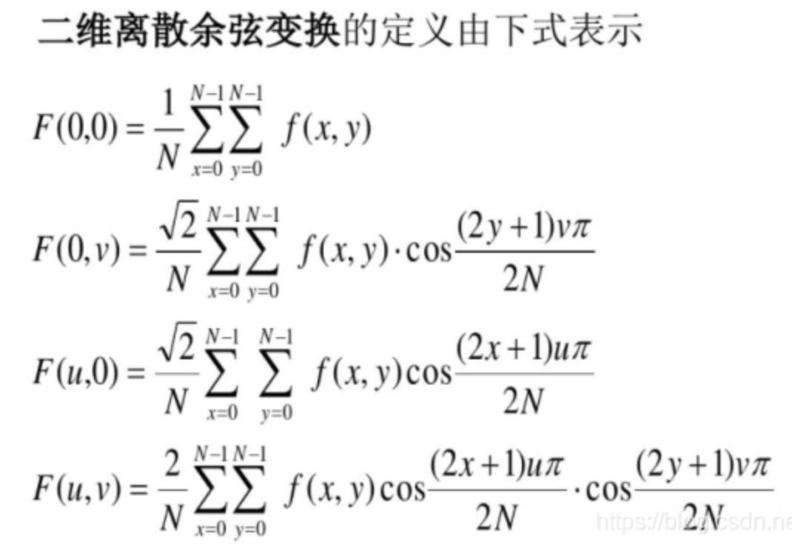
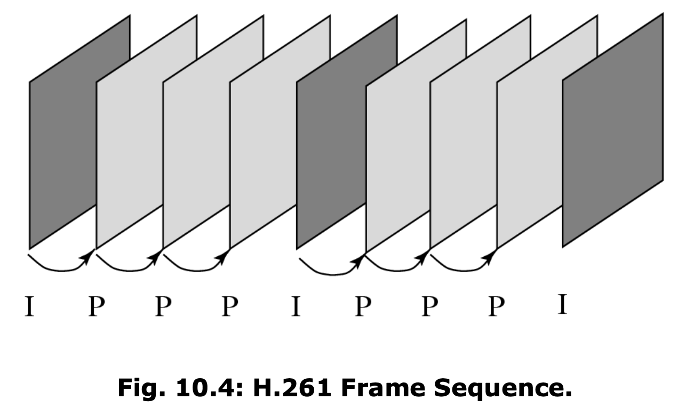
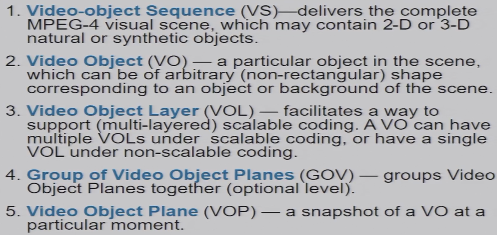

# 一、图像

## 抖动算法

### 灰度位图

位图不借助任何压缩算法，逐像素直接表示。

n-Bit灰度代表每个像素需要n-Bit编码，对应有2^n级灰阶。特殊的，1-Bit灰度图像也叫二值图像。

### 抖动算法

打印机是二元输出设备（墨头/激光头只有开或关、黑或白两种状态），原生只能打印二值图像。要让打印机打出灰阶，就需要抖动算法。抖动算法将一个像素细分，将像素细分再填入二值图像以欺骗人眼模拟灰度。

DPI（Dot Per Inch）指在1英寸长度内可以打多少个点。DPI的高低直接决定了打印机可以打印的灰阶等级，例如想要25级灰阶，则在一个像素面积内至少要打24个点（记得减一），否则就会失真。

现在又有新的问题，现在每一个像素都细分为5*5=25个小方格，假设灰度为15，那么哪15个点应该为白色？

抖动矩阵具体规定了不同灰度下哪些小方格应该被涂色/打点。抖动矩阵关系到人眼对灰度的认知，由人研究设计得到。各家打印机抖动矩阵可不同，写在打印机驱动中。

## 颜色查找表

### 8-Bit彩色

不同于常见的24-bit（RGB三个通道各8-Bit）真彩色，如果希望减小数据量，每个像素只用一个Byte表示，那么：

- 8不能被3整除，怎么均衡的表示RGB三个通道的值
- 怎么兼容24-Bit真彩色设备

### LUT

8-Bit彩图像素中的值不直接表示颜色，而是表示颜色查找表（**LUT**）的索引。LUT完成从像素值到24-Bit颜色值的映射，写在输出相关设备的驱动中。

使用LUT带来一个额外的好处是，只要替换颜色查找表，就可以方便的得到不同颜色特征的图像。

### 聚类算法

前面8-Bit位图借LUT完成了颜色的转换，现在进一步关心怎么设计一个LUT，怎么反向将真彩色信息压缩到256色更好。

**颜色直方图**统计像素RGB值的分布情况，下面是一个例子：

如果我们简单的线性划分RGB范围作为聚类算法，很快会发现问题：有的桶里大量不同色彩的像素被聚类到了一起，而有的桶里一个像素都没有，这显然是浪费。很直观的想到，**像素分布越密集的地方，桶的划分应该越稠密。**为了解决这个问题，一个常用的算法是**Medium Cut中值切分算法**。

### Medium Cut

先统计所有像素的红色分布，找到一个值使得其两侧的像素数量相等。现在你得到了两个桶。

两个桶**分别**统计绿色分布，**各自**找到一个值使得其两侧像素数量相等。现在你得到了四个桶。

四个桶**分别**统计蓝色分布，**各自**找到一个值...

先找哪个颜色没有所谓，只要**颜色之间是交替进行的**，每个颜色有几个bit表示就进行上述的切分几次。

# 二、颜色

## 显示器与Gamma

### CRT

三束不同能量的电子（能量分别对应三原色）轰击荧光屏。

### Gamma矫正

无论是CRT还是液晶屏，都存在的问题是电压与亮度不成正比，而是**Gamma次幂关系**。这意味着如果直接将亮度比例作为输出电压比例，最终显示的颜色将会失真，暗部层次丢失。比如上图中输出电压为0.8（我们希望得到的亮度是0.8），而最终得到的亮度是0.6。

所以我们需要Gamma矫正。

Gamma矫正即使用**1/Gamma次幂**作为矫正曲线，补偿曲线与原曲线相乘后回到理想的线性关系。比如同取Gamma=2.2，得到数据源亮度为0.6时，先查矫正曲线得到输出电压为0.8；再向显示设备输出0.8电压，得到显示亮度0.6。

## 人眼的特点

- **对亮度的感知比对颜色的感知更敏感**
- **对相对变化的感知比对绝对变化的感知更敏感**
  - 

这两个特点看似废话，但是它们极大的影响了各种色彩空间与压缩算法的设计。

## 色彩模型

### CMY

$$
\begin{bmatrix}
R\\
G\\
B
\end{bmatrix}
=
\begin{bmatrix}
1\\
1\\
1
\end{bmatrix}
-
\begin{bmatrix}
C\\
M\\
Y
\end{bmatrix}
$$
RGB称为加色模型，CMY称为减色模型。两者一个是光直接叠加，一个是吸收光谱的叠加。**现实中的颜料/染料混色遵循的都是CMY规则。**

因此印刷业广泛使用的颜色标准是**CMYK**，在CMY的基础上加一个K纯黑色用于调节灰度。

### YIQ、YUV、YCbCr

三者都是视频领域常用的色彩表示，**共同点是都有Y代表灰度信息**，区别仅在于对颜色的分解方式不同。在电子设备上显示时还是要转换回RGB。

视频使用这类编码有极其突出的有点：

- 在模拟信号时代，分离灰度让黑白/彩色相互兼容十分方便，黑白电视只接Y通道就可以兼容彩色频道，彩色电视只接Y通道也可以兼容黑白频道。
- 在数字信号时代，**将人眼敏感的灰度与人眼不敏感的颜色分离**，以便于压缩颜色信息而保留灰度，在减小数据量的同时控制视觉上的差异。

# 三、视频

## 显示原理

无论是CRT中电子轰击还是液晶显示器中液晶反转，都是按行扫描的：

- 单向扫描
- 对CRT，竖直和水平的回溯都需要时间
- 可以严格逐行扫描，也可以隔行扫描（先135后246），两次从上到下对应一帧完整图像

## 模拟制式

## 数字制式

相比模拟制式的显著优点：

- 便于计算机处理、使用
- 可以对任意位置直接访问，便于剪辑、处理
- 方便复制、加密，于是便于传播

## 颜色下采样

**重要！**

前面说过单独分离灰度信息方便压缩颜色，这里是具体的做法，相邻像素一般而言颜色接近，直接合并。这个过程称为下采样。下采样几乎是所有图像/视频压缩算法的第一步。

JPEG、MPEG都在使用420压缩。

写题的时候注意被融合的部分是一个值而不是几个一样的值。

# 四、音频

## 采样与量化

### 采样

声音从物理上是连续的，为了能够交由计算机处理，它需要通过采样离散化。采样的频率越高，还原之后越接近原声。下面是一个采样率过低导致声音失真的例子。

**奈奎斯特定理**：采样频率至少应该是模拟信号带宽的两倍，才能保证不丢失信息。

- Nyquist Rate：原始信号带宽的两倍
- Nyquist Frequency：奈奎斯特Rate的一半

### 量化

采样将时域离散了，但是取值仍然是连续的，这就需要量化。自然的想到，类似颜色，在量化时可以均匀的划分近似区间，也可以将人耳敏感的频段划分的细致一些而将不敏感的频段划分的粗糙一些。

下面是两种非线性的音频量化公式，了解即可。

## 分贝

声音领域常以分贝为单位。

计算响度的分贝时，分母po为人耳能听见的最小声音的**功率**，分子是需要计算的声音的**功率**，因此人耳能听见的最小声音就是0db。

在计算信噪比时，仍然以分贝为单位，但是分母为噪声的功率，分子为信号的功率。在模拟电路中，可以认为功率与**电压**呈平方关系，所以公式可以如下改写。

## 音频编码

前面采样与量化将音频的时域和值域都离散了，现在进行文件的编码。

### PCM

PCM脉冲编码调制是最基础的音频编码，直接离散采样并量化即可。记得还原PCM时**反量化**。

在传统电话系统中，用户的带宽是4kHz（采样频率8kHz），在输入时需要滤波分离出人声集中的频段；数模转换时会引入无限高频的噪声（模电相关，直接记吧），所以输出时需要低通滤波器将它消除。

除对输入输出的处理之外，内部就是PCM编码。

### DPCM

PCM储存的是直接的量化值，它的范围可以很大，取得的值可能很离散，导致数据量大且难以压缩。所以我们引入了差分编码：

- PCM：2, 4, 5, 9, 7
- 差分：2, 2, 1, 4, -2

储存的值不是量化直接得到的值而是前后的差。显然差分编码**缩小了数据分布的范围，让值变得集中**，这对压缩非常有利。且差分编码相对PCM是**无损的**，没有损失任何信息。

下面的图可以直观的看出，查分编码让数据分布变得集中：

### 预测编码

考虑下面这种情况：

- PCM：0, 2, 4, 6, 8
- 差分：0, 2, 2, 2, 2

自然的想到PCM的分布可能存在规律，可以猜测下一个PCM的值大致为10。我们约定预测编码中的值含义如下：

即编解码双方约定一个共同的**预测函数**，它通过前面几个值预测下一个值，我们只需要**储存预测值与真实值之间的差**（可见它也用到了差分编码的思想）。预测编码**利用音频本身的规律性让数据分布进一步集中**。预测编码相对PCM也是**无损的**。

下面这个例子体现了预测编码在优化数据统计特性方面的作用。

下面是预测编码的硬件设计，注意解码时使用的是输出作为预测结果。

### 再次量化

如果经过差分/预测编码，数据还是过多，我们可以再次使用量化（Mapping），将细粒度的原始值映射到粗粒度的新值以进一步压缩。下面是一个简单的例子，显然第二次量化之后压缩不再是无损的。

二次量化原理不难，难点在于硬件实现：

特别注意，预测编码要求编解码双方的预测函数相同。而经过二次量化，解码端只能还原出有损的数据，也即只能用有损的数据放到预测函数里。**这反过来要求了编码端也只能用经过量化的有损数据做预测，而不能使用原始数据**。不这样做的后果可见class5附加材料。

务必理解编码器硬件图的逻辑与$f_n,\ \hat f_n,\ \tilde f_n$三者之间的关系。

# 五、无损压缩

## 信息论

$$
\begin{aligned}
& 对数据中所有出现过的值做统计\ 得到字母表S=\{s_1,s_2,s_3...\}; \\
& 定义某个字母(或者叫信元)的信息量为log_2(\frac{1}{p_i}),\ 其中p_i=\frac{|s_i|}{|S|}即该信元出现的概率; \\
& 信息论证明了,\ 编码字母表S中的某个信元s_i需要的比特数不小于它的信息量。 \\
\\
& 定义某段数据的信息熵为H(S) = \Sigma^{n}_{i=1}p_i*log_2(\frac{1}{p_i})=-\Sigma^{n}_{i=1}p_i*log_2(p_i); \\
& 即对各个信元的信息量根据概率做加权平均; \\
& 显然这段数据的平均码长不小于其信息熵,\ L(C)\geq H(S),\ 于是可以定义编码的效率\eta=\frac{H(S)}{L(C)}。
\end{aligned}
$$

## 无损压缩编码

### Run-length Coding

游程编码，即用一个重复次数代替一串连续的相同的值。前面说过在图像视频领域经常压缩相邻的颜色，因此经常会出现大量连续相同的颜色数字，此时游程编码非常适用。

### Huffman Code

霍夫曼编码，先统计各个信元出现的概率，放到小顶堆内。每次小顶堆pop两个节点合并成新节点，再放回堆中，直到只剩一个节点。霍夫曼编码保证了出现频率越多的信元，编码的长度越短，这就使得总长度最短。

霍夫曼编码可以改进为在线的算法，一边接受新的数据一边动态的调整编码树而不需要先离线的统计信元概率。只要动态调整过程中收发双方持有的霍夫曼树时刻相同，就可以实现编解码。

### Directory Code

目录编码是一个典型的**在线**压缩编码，这里以S={A, B, C}，输入串为“ABABBABCABABBA”为例。

首先约定字母表的编码A-1、B-2、C-3

1. 开始读取输入
   1. 读到A，压栈
   2. 读到B，**与栈中字母组合成串“AB”，而“AB”没有出现在码表中**
      1. 出栈A，并将A的编码1作为输出
      2. 入栈B
      3. 赋予“AB”编码3，加入码表
   3. 读到A，**与栈中字母组合成串“BA”，而“BA”没有出现在码表中**
      1. 出栈B，并将B的编码2作为输出
      2. 入栈A
      3. 赋予“BA”编码4，加入码表
   4. 读到B，**与栈中字母组合成串“AB”，而“AB”已经在码表中了**
      1. 入栈B
   5. 读到B，**与栈中字母组合成串“ABB”，而“BA”没有出现在码表中**
      1. 出栈AB，并将AB的编码3作为输出
      2. 入栈B
      3. 赋予ABB编码5
   6. 读到A......

目录编码的核心思想是，为了实现**在线编码**，码表不能事先约定而应该由此前的输入**动态生成**。最终的输出是“1 2 4 5 2 3 4 6 1”，从14个字符压缩到9个字符。

### Arithmetic Code

首先，统计字母表与字母出现的概率。得到概率之后简单将[0, 1)区间按概率划分给各个字母，比如下图将A划在[0, 0.2)。

然后可以开始压缩，比如现在希望压缩源数据中的一个短串"CAEE\$"：

1. 第一个字母C划分在[0.3, 0.5)，将其视作[0, 1)
2. 第二个字母A划分在[0, 0.1)，所以将[0.3, 0.5)的[0, 0.2)，即[0.3, 0.34)看作[0, 1)
3. 第三个字母E划分在[0.55, 0.85)，所以[0.3, 0.34)的[0.55, 0.85)，即[0.322, 0.334)看作[0, 1)
4. 第四个字母...

依次类推直到短串结束，我们可以得到一个很小的范围；这个范围内任取一个浮点数，这个数即原串的编码。

解码需要先拿到最初的区间划分表，然后逐层范围检查直到遇到**结束符**即可。这是算数编码的缺点，每一个子串末尾必须有结束符，否则数学上区间可以无限细分，无法解码。

## JPEG无损模式

JPEG无损压缩模式使用的是预测编码+差分编码，预测编码又有多种可以选择，但是因为压缩率不理想所以很少人用。

# 六、有损压缩

信息论证明了，**把数据转换成向量再压缩，效率高于直接进行压缩**。关键在于用什么样的变换T将原始数据无损转换为向量最好。

下面介绍两种最常见的转换。注意转换本身都是无损的，转换只是把数据变成方便做量化压缩的样子，**而损失只来自于量化**。

## DCT

### 数学原理

DCT正交预先变换先将图像函数变换成偶函数形式，再对其进行二维离散傅立叶变换，故DCT变换可以看成是一种简化的傅立叶变换。

我们也可以用更线性代数的角度去看待它，下面是一个长度为4的一维向量的DCT矩阵与计算过程：

$$
F'(x) = 
\left[ 
\begin{array}{1} 
F_1 \\
F_2 \\
F_3 \\
F_4 \\
\end{array}
\right]
=
\left[ 
\begin{array}{1} 
a_{11} & a_{12} & a_{13} & a_{14} \\
a_{21} & a_{22} & a_{23} & a_{24} \\
a_{31} & a_{32} & a_{33} & a_{34} \\
a_{41} & a_{42} & a_{43} & a_{44} \\
\end{array}
\right]
\left[ 
\begin{array}{1} 
f_1 \\
f_2 \\
f_3 \\
f_4 \\
\end{array}
\right]
=AF(x)
$$
可以直观的知道，DCT是无损的可逆的。同时**注意系数**，一维向量长度位4时F1就是平均值的sqrt(4)倍，二维向量大小为8*8时F(0,0)就是平均值的sqrt(64)倍。

### 物理意义

从矩阵入手，我们把变换矩阵的每一行单独拆开。任意长度的向量的转换方程都有相同的性质，下面以长度为8的向量为例。

- 第一行的值画成直方图

  

- 第二行的值画成直方图

  

- 其他行同理

  

可以看见第一行是完全线性的，我们将它称为原始信号的**直流分量（DC）**；其余所有的行都是相互正交频率不同的余弦函数，我们称它为**交流分量（AC）**。

DCT本质上在做信号分解，**将一个原始信号分解为正交的直流信号和余弦信号的叠加**，算法输出的向量含义是不同分量的系数。它是傅立叶变换的弱化。

### 直观效果

DCT最重要的效果是让**数据分布集中**。对这样的一个函数（图像上均匀取了100个离散的点）：

应用DCT变换之后得到：

可见信息高度集中于一小部分，信息熵很低，这就非常有利于压缩。这里即使我只取最低的8个值，高位直接量化为0，iDCT逆变换得到的结果仍然非常接近原图像：

### 2维DCT

x、y方向的波函数叠加即可，思路同上。

## WT

WT小波变换主要利用了**图像的低频信息量往往高于高频信息量的特性**，这与DCT是相通的。

小波变换的具体做法是，取相邻的两列像素，两者做和放到左半边，两者做差放到右半边。**图像的高频信息量很少，意味着做差之后像素的值往往趋于0，有损压缩就先朝他们下手。**

上面的过程对行也同理，每一个轴向又可以重复若干次。

## JPEG有损模式

### General

JPEG2000用WT，JPEG用二维DCT，但总之压缩着手于以下几点：

- 人眼对于明暗变化的敏感度大于对颜色的敏感度
- 人眼对于低频信息的敏感度大于高频信息的敏感度
- 视频中低频部分的信息量大于高频部分的信息量

于是的到JPEG有损压缩的一般步骤：

1. 颜色转换，从RGB到YIQ/YUV，然后**4:2:0下采样**
2. 8\*8块大小（经验结果）上做**DCT变换**
3. **量化**
4. Zigzag之字形遍历8\*8的块
5. DC分量做**DPCM差分编码**
6. AC分量做**RLE游程编码**
7. 两者组合做**熵编码**

信息的**损失来自于下采样和量化**，编码本身不带来信息损失，除非二次量化。下面对部分步骤展开说明。

### 编码

#### Quantization

量化具体做法是整数除法取商。二维DCT变换后的8\*8矩阵中，每个位置的数据对应的被除数展示如下。

从中我们可以得到两点信息：

1. 低频信息保留的更多：

   DCT越靠左上角频率越低，而除数表中越靠坐上值越小，即量化到同一个值的范围越小，量化越精细

2. 灰度信息保留的比颜色信息更精细：

   显然上图中灰度的除数表是精心设计过的，而颜色的除数表粗暴的多

#### Zigzag Scan

对量化的结果（还是8\*8矩阵）进行编码，注意编码的顺序是左上斜对角到右下，而不是逐行或者逐列。这是为了把高频信号放在一起，方便后面编码。

#### RLE/DPCM Coding

对AC做RLE游程编码。下图中第一行是Zigzag Scan得到的一维值序列，**AC部分即除第一个数以外的部分**，游程编码结果如第二行所示。

对DC部分做DPCM差分编码。即把第一个值单独拎出来差分，这是因为直流分量往往较大，差分将缩小值的分布范围，便于后续编码。

**此时AC/DC两者是分开的，在熵编码才合在一起。**

### 解码

- **序列模式**

  原图中8\*8的块逐行传输，逐行解码并展示。表现为图片从上往下按行加载。

- **渐进谱系选择**

  先传每个块的直流系数，再传慢慢从低频到高频传信息。表现为图像最开始很模糊，然后逐步变得清晰。

  能这么做的数学基础是DCT是线性变换，8\*8矩阵可以拆开按任意顺序传，各自拟变换再加和，结果与整体做拟变换是相等的。

- **渐进近似**

  思路和渐进谱系选择是一样的，只不过这次不是先传DC/低频再传AC/高频，而是按bit位从高到低传，先传第8bit，再传第7bit，再第6bit......

  数学基础同上，DCT变换是完全线性的，iDCT的和等于和的iDCT。

# 七、视频压缩

## 整体思路

从空间冗余性上，视频的每一帧都是图片，前面学过的图片压缩算法都可以使用。从时间冗余性上，每一帧之间的差往往很小，视频压缩使用了之前提过的差分编码+预测编码的形式以提升信息的熵。

基于这样的整体思路，我们可以大致将帧分类：

- Intra-Frame: similar as JPEG

  ​		独立的帧，也叫I.ndependent帧，自身的信息不来源于任何其他帧

- Inter-Frame: based on motion prediction and compensation

  ​		又可以分为P.revious/B.idirection帧，分别对应前向与双向预测算法；在H.264标准中又有进化，所有预测帧都有多个参考帧。

## 运动补偿

考虑到视频的运动特性，在做差分和预测时我们并不是直接对相同位置的前后两帧计算，而是加入运动补偿：

1. 拿到需要编码的帧，将其分块（流行块大小是8\*8/16\*16，**要配合图片压缩中的分块大小**）
2. 对任何一个分块，在其周围一定区间内找有没有跟他长得像的块（流行搜索范围是p=7/15）
3. 记录2中选定的长得最像的块与目标块的相对位置
4. 对2中选定的块做差分和预测

数学上定义两个块是否相像的方法见课本。

接下来我们具体的关心如何找到运动向量（从目标块指向参考块的向量）。

### 线性搜索

枚举取min，保证找到最优解但是也显然非常慢。

### 对数搜索

1. 在搜索区域内均匀取N\*N个块（图中取3\*3，标号为1的块）
2. 这些块中找长得最像的，在它附近一定范围再取N*N个块（图中标号为2的块）
3. 每一次迭代范围缩小多少，迭代多少次可以自己定

对数搜索的到的不一定是最优解，但是我们也不必要找到最优解，只要一定程度相似能减小编码最终的信息量即可。

### 层次化搜索

逐级压缩原图，在低分辨率的帧中找到最相近的块；再到高分辨率一些的帧中，在低分帧中目标块附近找到最相近的块；逐层重复。

显然**层次化搜索和前面两种搜索算法是可以嵌套使用的**，具体。

## H.261

### 流程

- 默认使用4:2:0图像压缩
- 只有前向预测，每隔一段时间必须有一个I帧防止有损压缩导致误差积累
- 即使是P帧，也不一定要强行做运动补偿、差分预测，找不到就存原数据没关系

I帧就是普通的图片压缩：

注意P帧中运动向量也要存：

### 量化

H.261中量化比较粗暴直接：

不同压缩率由选用不同的量化系数实现。

## H.263

- 支持可变大小的GOB
- 支持以半个像素为单位找最佳匹配（需要插值）
- 更高级的运动预测算法（4MV）
- **PB模式双向编码**（双向预测需要后向参考，这一定会带来延迟）

## MPEG-1

- **双向预测**

- 以半像素为单位搜索运动向量，搜索的范围更大不局限于前后I帧

- 对inter和intra用不用的量化策略

- 视频画面划分slice，以slice为粒度设置参数

- 只能逐行扫描

### 双向预测

双向预测的应用场景如下：

在搜索找到最佳匹配的块后，按照如下的流程进行编码。注意对16*16的原始块应用颜色4:2:0压缩后，Y通道得到4个8\*8的块，Cb、Cr都只得到一个8\*8的块。

因为双向预测的存在，它解码时必须先解出I帧，再解P帧，最后接B帧。注意下图中编解码的顺序。

### Slice

MPEG支持将数据划分为若干Slice，比如下图中每个块对应16*16像素，同种形状的块构成一个Slice。**Slice之间独立编码**，这使得MPEG-1有很强的抗干扰性，某一个小区域数据损坏至多印象其所在Slice的范围。

### 编码格式

最终的编码格式如下：

## MPEG-2

- 提高视频质量上限
- 支持更灵活的压缩率（多种压缩方式、多种下采样方式）
- 支持隔行扫描（奇偶数两个场相互参考，依赖关系可能非常复杂）
- 支持非线性量化
- **可伸缩编码**
    - 本质上是传输方式的改进而不是压缩的进化

### SNR可伸缩编码

假想现在有一个清晰度非常高的视频，但是不同用户（不同网速条件不同设备条件）需求的质量不同，我们应该怎么做。

如果能提供多少种清晰度就制作多少份码流太浪费，应该制作一个压缩率很高的基础层（只有一个），再把每一次画质升级作为基础层的叠加（提高层可以有很多，利用差分编码很容易实现叠加），于是请求不同清晰度只要接受不同数量的提高层即可。这就是**SNR可伸缩编码**。

### 其他可伸缩编码

可以从空间上伸缩，比如像素n合1；可以从时间上伸缩，比如抽帧；以上伸缩又可以混合使用。

## MPEG-4

更关注用户的交互性，同时支持**基于对象的编码**。（静态纹理编码）

### 对象编码

MPEG-4编码内大致包括如上层次，
