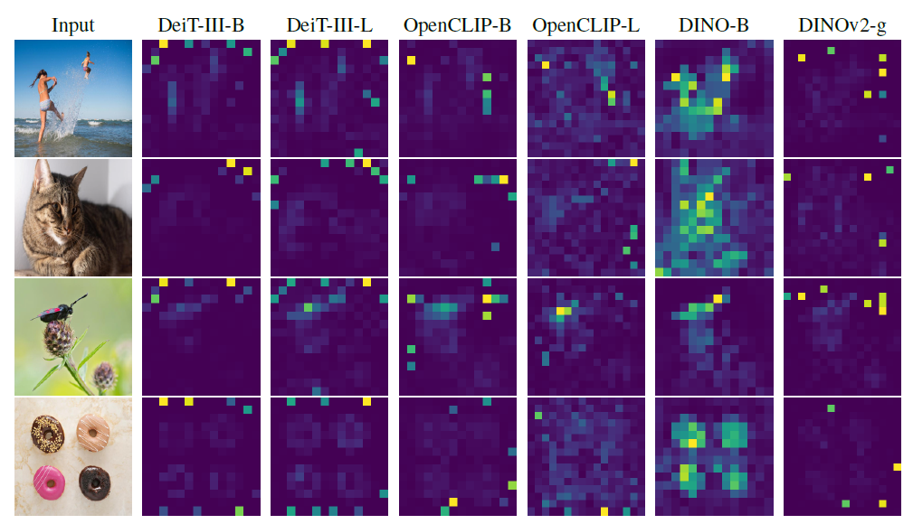
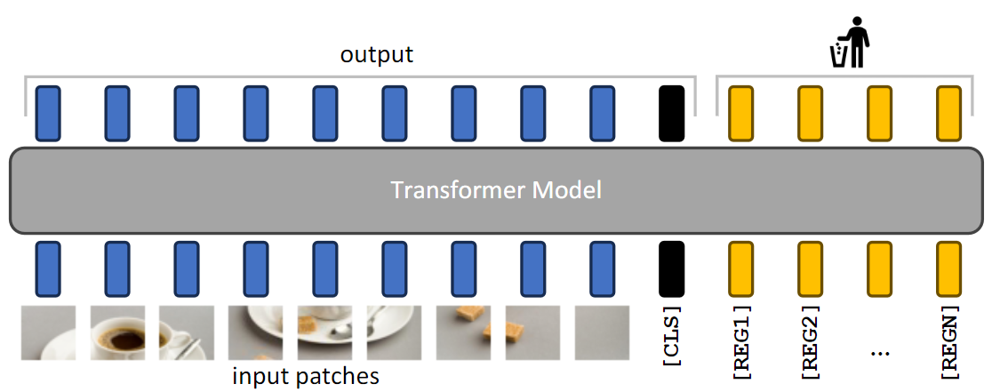
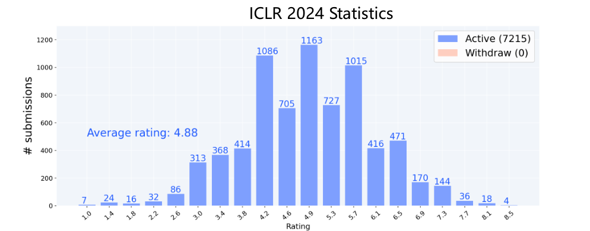
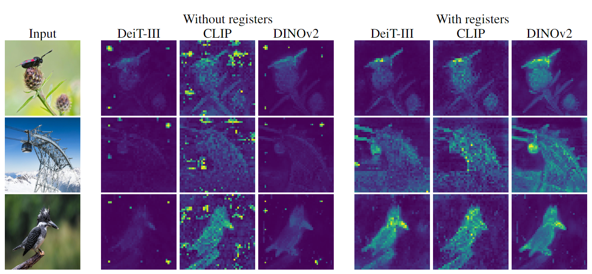
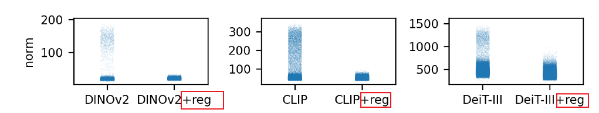
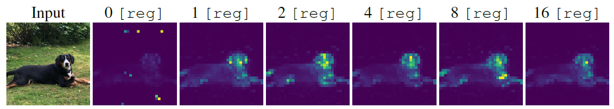
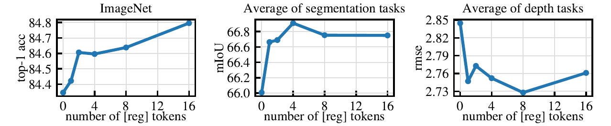

# Vision Transformers Need Registers

### 背景介绍

这是一篇来自[ICLR2024](https://openreview.net/group?id=ICLR.cc/2024/Conference)的论文, 论文中有大量的可视化图表

**Vision Transformers** (ViT）通过将图像分割成多个小块，并将这些小块输入到Transformer网络中，从而学习图像的特征表示。但是，ViT网络存在特征映射的异常点，这些异常点通常出现在图像的背景区域(非主体区域)。这些异常点以 **high-norm tokens**的形式出现(可视化表现为下图中的图片中**主体之外的亮点)**，会影响模型在下游任务上的表现

为了解决这一问题，研究者提出了一种简单有效的方法，即向输入序列中添加额外的tokens(下图中黄色的部分)，以填补这些异常点的角色,来解决伪影的问题

 它在OpenReview中的最终得分为`10,6,8,8`, 在所有投稿论文中排到了[第13](https://guoqiangwei.xyz/iclr2024_stats/iclr2024_submissions.html)

| **# (7215)** | Title                                                        | R1   | R1-std | Ratings     |
| ------------ | ------------------------------------------------------------ | ---- | ------ | ----------- |
| 13           | [Vision Transformers Need Registers](https://openreview.net/forum?id=2dnO3LLiJ1) | 8.00 | 1.41   | 10, 6, 8, 8 |

### 可视化介绍

 **对比图**是一种强大的可视化工具，能够直观展现变化前后的差异。在这个例子中，对比图清晰地揭示了寄存器对于模型生成注意力图的改善作用

此外，还展示了**high-norm tokens**的**分布图**，，可以直观地看到不同模型配置下的变化和分布特征对，可以发现输出特征映射在加上reg之后峰值降低并且更加集中

使用了**格式塔理论中的相似原则**，额外的tokens增加越多，伪影现象逐渐消失

并且用**折线图**表现了在下游任务上的性能不断提升

合使用多种可视化方法，如对比图、分布图和性能图表，能够从不同角度展示复杂数据的特性。这种多角度的视觉展示有助于全面理解问题和解决方案的效果，特别是在解释复杂模型如Vision Transformers时尤为重要

### 亮点介绍

1. Attention机制本质上是查询矩阵，论文采用特殊处理方法将其呈现为可视化图像，具有高表达能力，并提高ViT的解释性。
2. 运用丰富可视化技术，清晰展示问题及解决方案，直接证明有效性。特别地，通过对比图明显展示引入寄存器前后模型注意力图与特征映射的显著变化，使缺乏专业知识的人也能轻松理解问题及解决方案。此外，该可视化方法有助于阐述复杂概念，帮助读者快速掌握文章核心与创新点。
