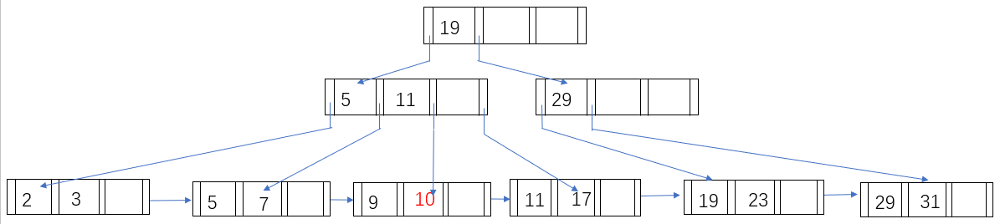

### **14.3[a]** 

>Construct a B+-tree for the following set of key values: 
>$$
>(2, 3, 5, 7, 11, 17, 19, 23, 29, 31)
>$$
>Assume that the tree is initially empty and values are added in 
>ascending order. Construct B+-trees for the case where the number
>of pointers that will fit in one node is as follows: 
>
>a. Four

### **14.4**

> For each B+-tree of Exercise 14.3, show the form of the tree after each of 
> the following series of operations: 
>
> a. Insert 9. 
>
> b. Insert 10. 
>
> c. Insert 8. 
>
> d. Delete 23. 
>
> e. Delete 19. 

### **14.11**

> In write-optimized trees such as the LSM tree or the stepped-merge index, entries in one level are merged into the next level only when the level is full. Suggest how this  policy can be changed to improve read performance during periods when there are many reads but no updates. 

在长期没有更新的情况下，再加上索引内索引查询的频率很高，将某一级别的条目合并到下一级别是可行的。这种方法的好处是避免了读取时在某一级条目所在的层搜索索引的需要，从而减轻了读取操作中产生的相关消耗

### **24.10**

> The stepped merge variant of the LSM tree allows multiple trees per level. What are the trade-offs in having more trees per level?

1. 增加内存使用量：由于额外的元数据和簿记信息，每个级别更多的树会导致更高的内存开销

2. 写入放大更高：每个级别的多棵树会导致写入放大增加，因为合并和压缩多棵树涉及额外的 I/O 操作

3. 读取性能提升：每个级别有多个树可以通过减少磁盘寻道和改进引用的局部性来提高读取性能

4. 压缩开销增加：压缩变得更加资源密集型多树，需要额外的 CPU 和 I/O 资源

5. 写入性能的潜力提高：跨多个树传播写入可以减轻写入操作期间的争用并实现并行性，尽管这种好处可能会被增加的写入放大和压缩开销所抵消
