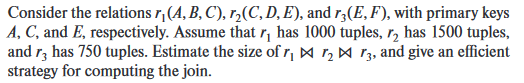
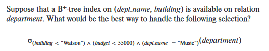

### **16.5** 

> 

#### 计算 $r_1⋈r_2⋈r_3$

$r_1⋈r_2$ ,   最多产生1000行的关系, 因为$C$是$r_2$的key

再$(r_1⋈r_2)⋈r_3$,  ,   最多产生1000行的关系, 因为$E$是$r_3$的key

因此最终结果是1000

#### 有效策略:

在关系$r_2$的属性$C$和$r_3$的属性$E$上建立索引

这样就可以通过遍历$r_1$, 然后根据索引从$r_2$中寻找对应的$C$,  然后根据$r_2$对应的那一行, 从$r_3$中寻找对应的$E$      

### 16.16

> 

首先定位到第一个`dept name = “Music”`, 然后 按pointer链 取出下面所有 `building < “Watson”` 的, 对于每个tuple , 判断是否`budget < 55000.`

