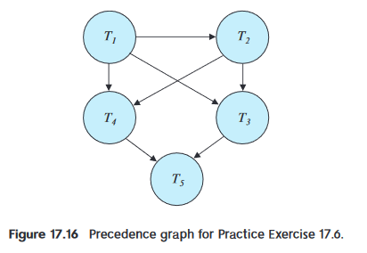

### **17.6**

> Consider the precedence graph of Figure 17.16. Is the corresponding schedule conflict serializable? Explain your answer.
>
> 

由于这张流程图中没有环，因此可以串行

可以通过拓扑排序来获得`schedule`: `T1`, `T2`,` T3`,`T4`,`T5`(不唯一)

### 17.7

> What is a cascadeless schedule? Why is cascadelessness of schedules desirable? Are there any circumstances under which it would be desirable to allow noncascadeless schedules? Explain your answer.

`cascadeless schedule`,:当一个事务被允许读取数据时，直到最后一个写入数据的事务被提交或中止

**Why is cascadelessness of schedules desirable? **

事务的执行顺序与事务的依赖关系无关，确保事务的执行不会导致级联效应或事务之间不希望出现的干扰

可以防止由于事务的依赖性而产生的冲突和异常情况，利于保证数据库系统内的数据一致性和完整性

**noncascadeless schedules?**

比如主要考虑性能并且对数据一致性不那么在意的时候，由于`noncascadeless`可以放宽事务之间的严格排序限制来提供更好的并发性，提高吞吐量和更好的整体系统性能
