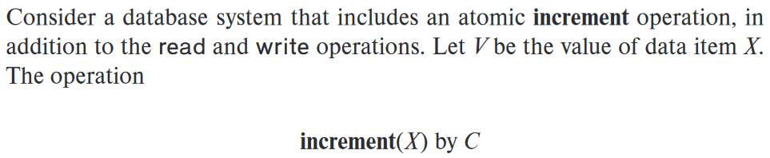
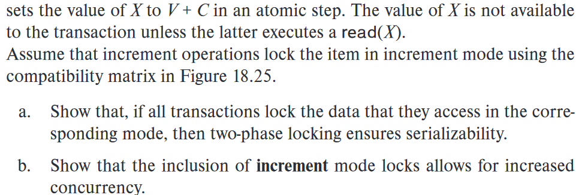

### 18.1

> Show that the two-phase locking protocol ensures conflict serializability and that transactions can be serialized according to their lock points.
>

假设两阶段锁定协议不保证冲突可串行性，则存在一个时间表$T_0, T_1, ..., T_{n-1}$，遵循两阶段锁定协议但不可串行化

一个不可串行化的时间表意味着在其先序图中存在环路，我们将证明两阶段锁定协议不会产生环路。在不失一般性的情况下，假设以下环路存在于先序图中：$T_0, T_1, T_2, ..., T_{n-1}, T_0$。让我们观察事务$T_i$获取最后一个锁的时间点$a_i$（即$T_i$的锁定点）

$a_0 < a_1 < a_2 < ... < a_{n-1} < a_0$

由于$a_0 < a_0$产生矛盾，因此不存在环路。在这个过程中，事务$T_i$和$T_j$（其中$i < j$）的锁定点顺序即为拓扑排序顺序，而锁定点顺序是可串行化的。因此，事务可以按照它们的锁定点进行串行化

### 18.7

> 
>
> 

a. 为了显示可串行化，我们观察两个事务，如果它们对同一项具有**increment mode**的锁定，那么它们的递增操作可以交换，就像读操作一样。然而，任何冲突的操作必须按照对应事务的锁定点顺序进行序列化

b. 递增模式锁与其自身允许多个递增操作并发进行，从而增加了协议的并发性。如果没有这种模式，想要增加数据值的事务必须以**exclusive mode**对该数据项进行锁定。排他锁是不兼容的，会增加锁的等待时间，阻碍整个并发过程

### 18.18

> Most implementations of database systems use strict two-phase locking. Suggest three reasons for the popularity of this protocol.

使用严格两阶段锁（**strict 2PL**）协议，因为它保证了严格性，易于实现，并提供了适度的并发度

以下是该协议受欢迎的三个原因：

1. 保证严格性：严格两阶段锁协议确保事务直到执行结束（提交/中止）后才释放所有的锁。这种严格性避免了一个事务的中止导致其他事务发生级联中止的情况，从而减少了回滚操作的次数。这有助于维护数据库的一致性和可靠性
2. 实现简单：相比其他复杂的并发控制协议，严格两阶段锁协议的实现相对简单。它只需要维护锁的状态以及对锁的获取和释放操作进行管理。这使得数据库系统的开发和维护更加容易，降低了实施的复杂性和成本
3. 适度的并发度：严格两阶段锁协议在保证严格性的同时，提供了一定程度的并发度。事务在获取所需的锁之前需要等待其他事务释放相应的锁，这可能导致一定程度的阻塞和资源争用。然而，通过合理的锁粒度和并发控制策略，可以在不牺牲严格性的情况下实现相对高的并发性能
