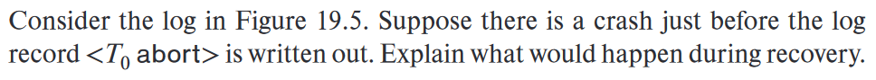

### 19.2

> Explain the purpose of the checkpoint mechanism. How often should checkpoints be performed? How does the frequency of checkpoints affect: 
>
> -  System performance when no failure occurs? 
> - Thetimeittakestorecoverfromasystemcrash? 
> - The time it takes to recover from a media (disk) failure?  

检查点机制的目的是确保系统在故障发生时能够有效恢复，检查点应**根据系统需求进行定期执行**。因此，检查点的频率需要平衡系统性能和恢复时间的考虑，频繁的检查点可以提高系统性能，减少无故障情况下的恢复时间。然而，过于频繁的检查点**可能增加系统开销**。

系统崩溃时，检查点频**率影响恢复时间**。较低的频率增加了恢复时间，而较高的频率减少了恢复时间

媒体故障恢复时间也受检查点频率影响，较低的频率增加了恢复时间

### 19.10

> Explain the reasons why recovery of interactive transactions is more difficult to deal with than is recovery of batch transactions. Is there a simple way to deal with this difficulty? (Hint: Consider an automatic teller machine transaction in which cash is withdrawn.)

这是因为交互式事务中的某些操作是**不可撤销的**

比如在自动提款机的交易场景下，当现金被取款时，该操作是不可逆的。如果在交互式事务的执行过程中出现中断或异常，可能无法简单地撤销或回滚已进行的交互操作，因为涉及到现实世界的资源和操作

相比之下，批处理事务在恢复过程中更容易处理。因为批处理事务通常按照预定的顺序进行，可以在事务的最后阶段执行所有输出操作。这样，如果在事务的中间阶段发生中断，**可以相对容易地进行回滚操作，而不会对系统或资源造成损害**。

针对这种困难，一种简单的方法是采**用物理日志记录技术**。通过将交互式事务的操作和状态变化记录到物理日志中，可以在需要时进行**手动恢复**。物理日志可以包含关键的操作信息，例如交互式事务的开始和结束时间、执行的具体操作以及相关资源的状态变化。通过分析和应用物理日志，可以重建中断或异常发生前的交互式事务状态，以实现恢复。

### 19.21

> 
>
> 

恢复过程中的重做阶段如下：

1. 重做列表redolist = T0，T1。
2. 从检查点开始执行重做。
3. 将C设为600。
4. T1从重做列表中移除，因为它已经提交。
5. 将T2加入重做列表，因为T2已经开始。
6. 将A设为400。
7. 将B设为2000。

恢复过程中的撤销阶段如下：

1. 首先处理T2，然后处理T0。
2. 从日志的末尾向前扫描。
3. 将A设为500，并输出"<T2, A, 500>"。
4. 输出T2的撤销记录"<T2 abort>"。
5. 将B设为2000，并输出"<T0, B, 2000>"。
6. 输出T0的撤销记录"<T0 abort>"。

最终，A为500，B为2000，C为600。

日志记录添加如下：

```sql
<T2, A, 500>
<T2 abort>
<T0, B, 2000>
<T0 abort>
```

可以使用ARIES算法来优化，以去除冗余的记录

### 19.25

> In the ARIES recovery algorithm:
>
> a. 19 Recovery System a. If at the beginning of the analysis pass, a page is not in the checkpoint dirty page table, will we need to apply any redo records to it? Why? 
>
> b. What is RecLSN, and how is it used to minimize unnecessary redos?

a.

根据ARIES恢复算法，在分析阶段开始时，如果一个页面不在检查点的脏页表中，我们不需要对其应用任何重做记录。这是因为该页面已经被刷新到磁盘并从脏页表中移除。然而，分析过程结束后，该页面可能会再次被更新，并可能重新出现在脏页表中

b.

**RecLSN**是**脏页表**中的一个条目，它记录了页面被添加到脏页表时的日志结束LSN（日志序列号）。在ARIES算法的重做过程中，通过使用RecLSN可以最小化不必要的重做操作。如果重做过程遇到的更新日志记录的LSN小于脏页表中对应页面的RecLSN，那么该记录不会被重做，而是被跳过。此外，重做过程从RedoLSN开始，该LSN是检查点脏页表中最早的RecLSN，因为更早的日志记录肯定不需要进行重做操作。（如果检查点中没有脏页，RedoLSN被设置为检查点日志记录的LSN）。通过使用RecLSN和RedoLSN，ARIES算法能够减少不必要的重做操作，提高恢复效率
