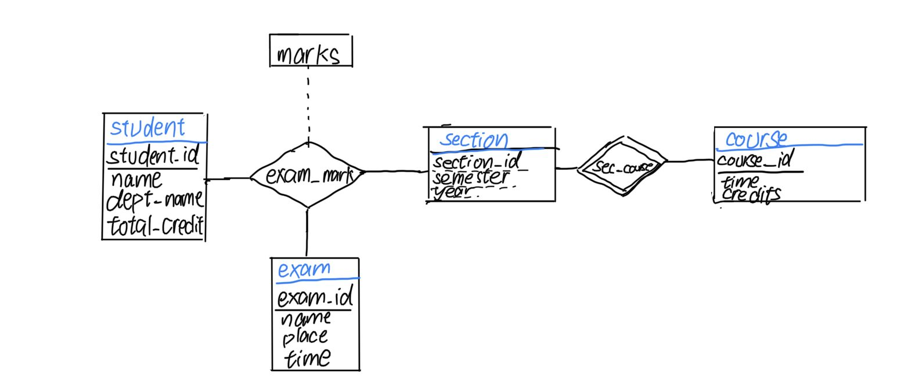
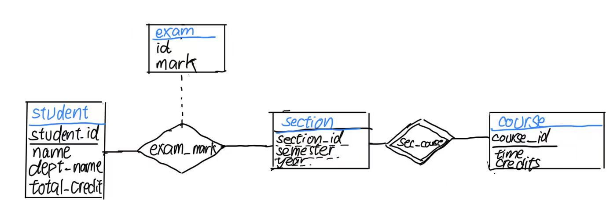
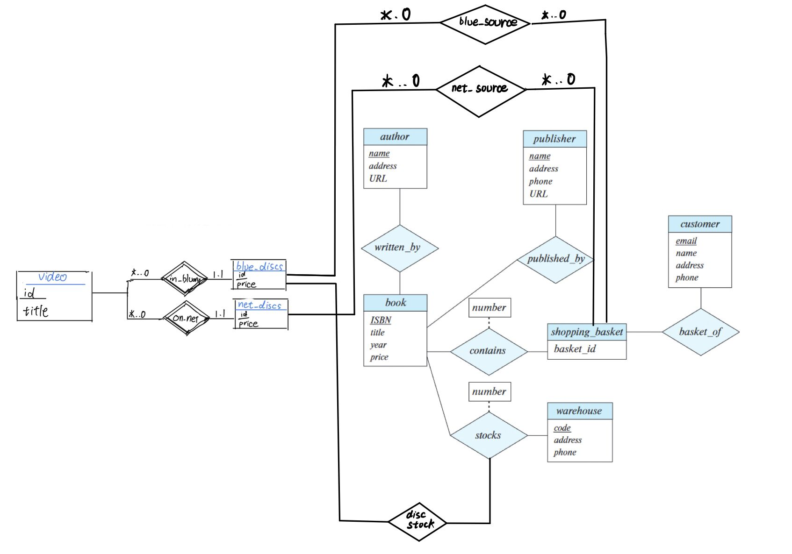

# 6.1

# 6.2

##### a. Construct an E-R diagram that models exams as entities and uses a ternary relationship as part of the design. 

##### b. Construct an alternative E-R diagram that uses only a binary relationship between student and section. Make sure that only one relationship exists between a particular student and section pair, yet you can represent the marks that a student gets in different exams.

# 6.21

### a. 

### b.

