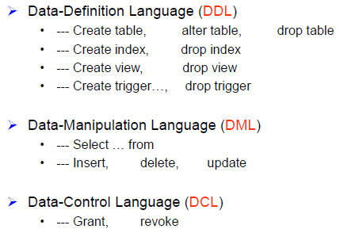
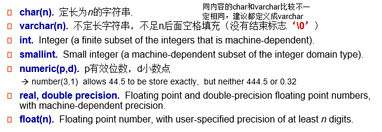
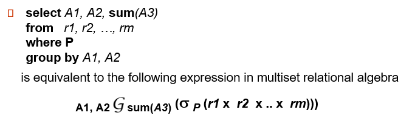
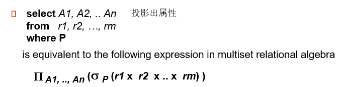
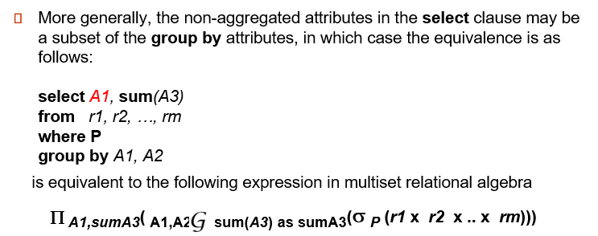

# SQL

```sql
with a(value) as 
(select v 
 from c)
select department,avg(salary)
from depart as d,salary as s
where d.id = s.id and a.value > some
(select value
 from d)
group by department 
order by id [desc]
limit 5
having avg(salary)>100
```


==特别注意下SQL转关系代数==

## 基本概念

- **SQL：结构化查询语言**，分为`DDL`,`DML`,`DCL`几种类型



- **非过程式的语言** 
- ==不区分大小写==
- 需要用；结尾


## 创建，更新，删除

- SQL支持的数据类型

  - char, varchar, int, numeric(p,d), null-value,  date, time, timestamp。 `char(6)`表示存放6个字符的字符类型1

  

  - 所有的数据类型都支持null作为属性值，可以在定义的时候声明一个属性的值not null(非空)作为条件(任何和null的逻辑运算返回 `unknown` , 而非`true`或者`false`)

- 创建数据表

  ```sql
  create table table_name(
    	variable_name1 type_name1 [condition_1],
    	variable_name2 type_name2 [condition_2],
  ……,)
  ```

  - `integrity-contraint` 完整性约束：**指定primary key**, **foreign key references xxx, not null** (primary key会自动保证not null并且unique)
  - 

- 删除数据表 `drop table` 

- 更新数据表的栏目 `alter table` 

  - `alter table R add A D`  添加一条新属性
    - 其中A是属性名，D是A的domain
  - `alter table R drop A`  删除A属性
  
  > ```sql
  > CREATE TABLE branch(
  > 	branch_name char(20) not null ,
  > 	branch_city char(30),
  > 	assets integer,
  > 	primary key (branch_name ), 
  >     # 或者组合：primary key(branch_name,branch_city)
  > 	check assets >= 0));
  > ```

## 查询

```sql
# 去重
select distinct dept_name
from instructor
# 关键字all指定不删除重复项
select all dept_name
from instructor
# 选出所有的属性
select *
from instructor

where salary is null #返回salary为null的元组
where salary between 9 and 10
where (instructor.ID, dept_name)=(teachers.ID, 'Finace')

# 重命名
SELECT distinct T.branch_name
FROM branch as T，  branch as S
WHERE T .assets > S .assets and S .branch_city ==‘Brooklyn’
# natrue join(虽然不用using改为放在where中也行,但是建议用using)
# natrue join 还可以换成 natural left outer join ， natural full outer join...
select name, title
from (instructor natural join teaches）join course using(course_id);
where instructor.dept_name <> teachers.dept_nmae # 不等于

# 排序
select ...
from ...
order by name desc #默认为asc升序
limit offset, row_count #从第offset取row_cout个

order by name desc limit 3 #表示取排序的前三个
      
# 集合操作  union并， intersect all 交   except 差
(SELECT customer_name FROM depositor )
UNION
(SELECT customer_name FROM borrower )
      
```


最重要的SQL语句，考试考的一般都是查询语句

- SQL查询的基本形式：select语句

  ```sql
  select list_name1,list_name2,…,list_namen  ##如果select * 则表示查询表中所有列(这个应该是正则表达式)
  from table_name1,table_name2,…,table_namen
  [where P]
  ```

  - 上述查询等价于$\prod_{A_1,A_2,\cdots,A_k}(\sigma_{p}(r_1\times r_2\times \dots\times r_m))$   $A_1$代表list_name1, $r_1$代表table_name1
  - SQL查询的结果是一个关系

- select子句的一些**细节** 

  - SQL中的**保留字**对于**大小写不敏感** 

  - 去除重复：`select distinct`，防止重复丢失的办法`select all`

  - select子句中的表达式支持基本的**四则运算**(加减乘除)，比如

    ```SQL
    select ID, name, salary/2
    from instructor;
    ```

  - where子句中：

    - 支持`and or not`等逻辑运算
    - 支持`between and`来查询范围

  - 聚合操作（**自动过滤NULL**）：

    - 支持的操作有`avg/min/max/sum/count`，获取的是表中的统计量

    ```sql
    select dept_name,avg(salary) as avg_salary
    from instructor
    group by dept_name; #分组
    having avg(salary)>1000; #where是分组之前过滤，having是分好组过滤
    order by avg_salary #在升序排序
    ```
    
    - 事实上SQL语句的聚合操作和关系代数中的聚合运算是完全对应的，关系代数中的聚合运算表达式$_{G_1,G_2,\dots,G_n}{\cal G}_{F_1(A_1),\dots,F_n(A_n)}(E)$对应的SQL语句是
    
      ```sql
      select G1,G2,…,Gn,F1(A1),…,Fn(An)
      from E
      group by G1,G2,…,Gn;
      ```
  
- Nested Subquery 嵌套查询

  `in` 和 `not in`, 以及逻辑运算比如`>`

  ```sql
  select A1,A2,…,An
  from r1,r2,…,rn
  where P
  
  # 比如
  select distinct course_id
  from section
  where semester = ’Fall’ and year= 2009 
  		and course_id*10 in (select course_id  #支持算数运算
                            from section
                            where semester = ’Spring’ and year= 2010);
  # 上面的 course_id 也可以换成一个集合，比如(course_id,sec_id,smester,year)
  
  # exists和not exists	   
  select course_id
  from section as S
  	where semester = ’Fall’ and year= 2009 and
  		exists (select * 
                  from section as T
                  where semester = ’Spring’ and year= 2010                                      and S.course_id= T.course_id);
                  
  select T.course_id
  from course as T
  where unique (select R.course_id
                from section as RR
                where T.course_id= R.course_id and R.year = 2009) ;
                
                
                >
  ```
  
  ==其中的A，r，P都可以被替换为一个**子查询**==
  
  - 集合关系：用 `in/not in +子查询`来判断否些属性是否属于特定的集合中
  
    - `some+子查询` 用于判断集合中是否存在满足条件的元组，用来判断存在性
    - `all+子查询` 可以用来筛选最值
    - `exists+子查询` 判断子查询的结果是否不为空
    - `not exists+子查询` 判断是否为空集
  
  - with子句：对子查询定义一个变量名，可以在之后调用
  
  - scalar子查询：用于需要一个值作为查询结果的时候
  
  - join子句：可以对若干张表进行各种join之后再查询
  
    - `natural join` 自然连接
    - `A join B on(xxx)` 
  
  

## 插入，删除，更新

- 插入: 

  ```sql
  insert into table_name(list_name1,list_name2,...)values(list_name1_value1,list_name2_value2,... ) values(list_name1_value1,list_name2_value2,... )  #(list_name1,list_name2,...)可以省略
  ```

  - 可以用select查询子句得到的结果作为values，此时可以同时插入多条结果

- 删除：

  ```sql
  delete from table_name where condition
  delete from table_name #删除table的所有内容，但是table保留
  drop table table_name #整个table都删了
  ```

- 更新：

  ```sql
  update table_name 
  set list_name1=list_name1_value1,.... where xxxxx
  # case子句：用于分类讨论
  update instructor
  	set salary = case
  		when age>10 then salary*1.05
  		when then..
  		else salary *1.03
  	end
  	
  ```

## view 视图, index 索引

- 视图：一种**只显示数据表中部分属性值**的机制

  - 不会在数据库中重新定义一张新的表，而是隐藏了一些数据(因此对view操作，实际上是对原表操作)
  - 创建视图的定义语句：
    - xxx是视图的名称，内容是从某个table中select出的

  ```sql
  create view xxx as (a subquery)
  ```

- 视图的更新

  - 也需要使用insert语句更新视图
  - 可以更新的条件
    - 创建时只使用了一张表的数据
    - 创建时没有进行distinct和聚合操作
    - 没有出现空值和default

- Domain创建新类型

  - `create domain new_name + data type`(比如 char(20))

  - domain可以设置约束条件，比如下面这一段domain定义表示degree_level只能在这三个中进行选择

    ```sql
    create domain degree_level varvhar(10)
    constraint degree_level_test
    check(value in ('Bachelors', 'Masters', 'Doctorate'));
    ```

  - Large-Object Types 大对象类型，分为blob(二进制大对象)和clob(文本大对象)两种，当查询需要返回大对象类型的时候，取而代之的是一个代表大对象的指针

- Index索引

  - 在对应的表和属性中建立索引，加快查询的速度

```sql
create index index_name on table_name(attribute)
create unique index index_name on table_name(attribute) #candidate key
drop index index_name
```

## Integrity 完整性控制

- 单个关系上的约束

  - 主键 primary key， **unique**， not null

  - check子句：写在数据表的定义中

    - check(P) 检查某个属性是否为特定的一些值
    
  - Domain constraints 值域的约束
    - 在domain的定义中加入check
    
    ```sql
    create domain domain_name constraints check_name check(P)
    ```
    
  - **Referential Integrity** 引用完整性
    - 被引用表中主键和外键的关系

 - 对于整个数据库的约束

   - Assertions

     - 对于数据库中需要满足的关系的一种**预先判断** 

     - `create assertion <assertion-name> check <predicate>` 下面是一段例子

       ```sql
        create assertion credits_constaint check
       ( not exists(
        select *
           from student S
        where total_cred <>(
           	select sum(credits)
           	from takes nature join course
           	where takes.ID = S.ID and grade is not null and grade <> 'F'
       ```


- Trigger触发器

  - 在修改了数据库时会自动执行的一些语句

  - 时间节点的选择

    - **referencing old row as** 对旧的行进行操作，用于删除和更新
    - **referencing new row as** 对新的行进行操作，用于插入和更新
  - `on delete cascade` *连锁，*一起删|set *null |restrict(**或称为**none action* 不准删*) |set default*
  - `on update cascade` *连锁，*一起更新 |set null |restrict |set default,
  
- trigger event触发事件
  
    - insert/delete/update等操作都可以触发设置好的trigger
    - 触发的时间点可以是before和after，触发器的语法如下
    
  ```sql
    create trigger trigger_name before/after trigger_event of table_name on attribute
    referencing xxx
    for each row
    when xxxx
    begin 
    xxxx(SQL operation)
    end
  ```


# SQL转关系代数






