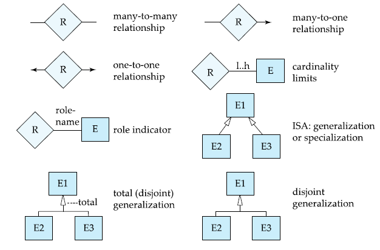
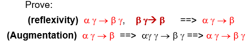
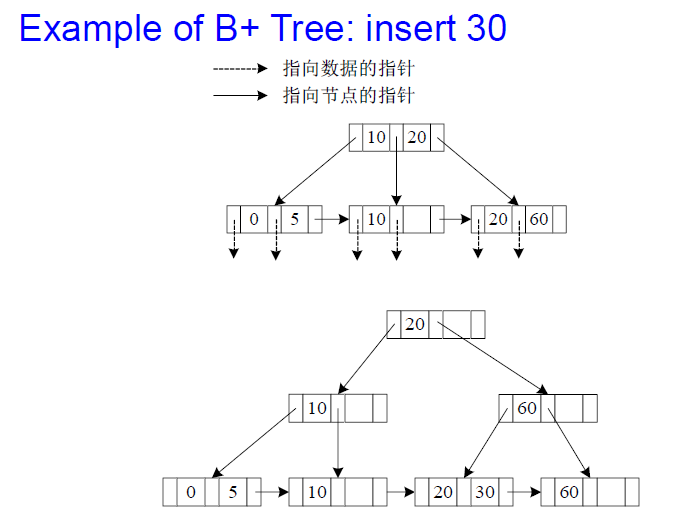

关系代数和SQL语句：感觉聚合操作和嵌套语句考的比较多

- ER图：画ER图，设计数据库schema，注意各个实体之间的参与关系
- 范式，闭包，函数依赖的相关计算，感觉必考BCNF分解
- B+树的插入和删除，以及buffer的计算
- 查询和join的估计：很诡异，有的题不能套公式（要从根本上理解为什么是这个公式，index、代价估计部分的公式全部动手推了一遍，特别看了一下书上LSM树的部分）

~~XML今年应该不考了~~

- 陈刚特地提了很多column-oriented 

- 查询优化，数据存储，规范化不考大题
- 关系代数选择判断

猜测大题：

1. SQL语句 重点可能在join和select  还有 on delete cassacade， update avg group
2. ER模式，会画图，会转换
3. buffer tree是整个试卷最难的部分（ch14里面）
4. Aries算法

[TOC]

#### 第一部分：基本概念和关系代数

##### 1.0 课程绪论

> 介绍数据库基本概念、数据库主要特征、数据库与文件系统的区别、数据模型、数据库系统三级模式结构、数据库用户和系统管理员、数据库系统结构等基本概念和专业术语。
>
> 介绍关系数据库的基本概念;讲述SQL语言基础

$database$ $application \to DBMS(数据库管理系统) \to OS \to database$

数据库系统的目的：

1. 原子性 **Atomicity**  最重要（全有或者全无）
2. **Integrity** 完整性问题
3. **Concurrent access** 并发访问
4. **Security** 安全性

数据库的特征:

1. data persistence(**数据持久性**)  断电不遗失
2. convenience in accessing data(**数据访问便利性**)
3. data integrity （**数据完整性**）
4. concurrency control for multiple user(**多用户并发控制**)
5. failure recovery（**故障恢复**）
6. security control（**安全控制**）

图灵奖得主：Ted Codd，Charles W. Bachman， Edgar F. Codd ， Jim Gray，Michael Stonebraker 

程序开发不归数据库管理员管

##### 1.1 关系型数据库 Relational Database

> 关系数据模型因为其简单有效而在数据库领域占据主导地位。讲授关系模型的数学模型，包括关系模型的数据结构、数据完整性、数据操作；重点讲授关系代数及基本关系操作及附加关系操作，学习用关系代数表达式表达数据查询要求。

###### 关系型数据的一些基本特点


##### 1.2  基本概念和结构

- a relation r is a subset of $D_{1}\times D_{2}\times …\times D_{n}$，一条relation就是其中的一个n元的**元组(tuple)** 
- attribute属性($A_i$)，指表中的**列名**  
  - attribute value 属性值，某个属性在某条relation中的值
    - 关系型数据库中的属性值必须要是atomic的，即**不可分割**的
    - domain：属性值的值域，**null是所有属性的domain中都有的元素**，但是null值会造成一些问题
- Relation Schema 关系模式
  - $R=(A_{1},A_{2},…,A_{n})$ 其中$A_i$是一系列属性，关系模式是对关系的一种**抽象** 
  - r(R)表示关系模式R中的一种关系，table表示这个关系当前的值(关系实例)
    - 每个关系r中的元素是table中的一行
    - 不过经常用相同的名字命名关系模式和关系
  - 关系是**无序**的，关系中行和列的顺序是irrelevant的

##### 1.3 Keys键

- ==super key超键==：能够**唯一标识**元组的属性集，即对于每一条关系而言超键的值是唯一的
  - 超键**可以是多个属性的组合**
  - 如果A是关系R的一个超键，那么(A, B)也是关系R的一个超键
  - 超键的“唯一标识”各个元组是可以有冗余信息的
- ==candidate key候选键==：**不含多余属性**的超键
  - 如果K是R的一个超键，**而任何K的真子集不是R的一个超键**(candidate key 是最小的super key)，那么K就是R的一个候选键
- ==primary key主键==：
  - 数据库管理员**指定**的元组标识的一个候选键，不能是null值
- ==foreign key外键==：用来描述两个表之间的关系，可以有空值
  - 如果关系模式R1中的一个属性是另一个关系模式R2中的一个**主键**，那么这个属性就是R1的一个外键
    - a foreign key from r1 referencing r2


##### 1.4 Relational algebra关系代数

- Select 选择：$\sigma_{p}(r)=\{t|t\in r \and p(t) \}$ 
  - 筛选出所有满足条件p(t)的元素t
  
  $\sigma_{dept_name='Physics'\and salary > 90000} (instructor)$
  
- Project投影：$\prod_{A_1,A_2,\cdots,A_k}(r)$
  - 运算的结果是原来的关系r中各列只保留属性$A_1,A_2,\dots,A_k$ 后的关系
  - 会**自动去掉重复**的元素(可能舍弃的属性是可以标识关系唯一性的属性)
  
- Union 并操作：$r \cup s=\{t|t\in r \or t \in s\}$   Set difference 差操作：$r-s=\{t| t\in r \and t \notin s\}$ 
  - 两个关系的属性个数(**arity**)必须相同
  - 各属性的**domain必须是可以比较大小的**
  
  $\Pi_{customer-name}(depositor)\cup\Pi_{customer-name}(borrower) $
  
- Cartesian-Product笛卡尔积：$r\times s=\{tq| t\in r\and q\in s\}$ 
  - 两个关系**必须是不相交的（disjoint）**，如果相交则需要对结果中重复的属性名进行重命名
  - 笛卡儿积运算的结果关系中元组的个数应该是rs的个数之乘积
  
- Renaming重命名：$\rho_{X}(E)$ 
  
  将E重命名为x, 让一个关系拥有多个别名（类似于C++中的**引用**），同时X可以写为$X(A_1,A_2,\dots,A_n)$ 表示对属性也进行重命名

> Find the largest salary in the university
>
> 

- Additional Operations : **可以用前面的六种基本运算得到**(没有增加表达能力，但是更方便了)
  - Intersection 交运算$r \cap s=\{t|t\in r \and t \in s\}=r-(r-s)$   
  - Natual-Join 自然连接：$r\Join s$ (没有公共属性的时候就是笛卡尔积)
    - 两个关系中同名属性在自然连接的时候当作**同一个属性**来处理
    - **Theta join** 满足某种条件的合并：$r\Join_{\theta} s=\sigma_{\theta}(r\Join s)$  

  > $R = (A, B, C, D)$
  >
  > $S = (E, B,D)$
  >
  > Result schema = $(A, B, C, D, E)$
  > $$
  > r \Join s =
  >     \Pi_{r.A,r.B,r.C,r.D,s.E}(\sigma_{r.B=s.B\and r.D=s.D} (r\times s))
  > $$
  > 

  - Division除法：$r\div s=\{t|t\in\prod_{R-S}(r)\and \forall u \in s (tu\in r)\}$

    Given relations r(R) and s(S), such that $S \subset R$, $r \div s$ is the largest relation $t(R-S) $such that $ t \times  s \sub r$
    $$
    can \quad write\quad r \div s \quad as:\\
    &temp1\leftarrow \Pi_{R-S} (r )\\
    &temp2\leftarrow \Pi_{R-S}((temp1 \times s ) - \Pi_{R-S,S}(r ))\\	&result \leftarrow= temp1 – temp2
    $$

    > 
  - Assignment声明操作，类似于变量命名用$\leftarrow$  可以把一个关系代数操作进行命名 

- Extended 增加了表达能力

  Generalized projection广义投影， $\Pi_{F1, F2, …, Fn}(E)$, Fn可以是计算，头战略普通的投影，比如$\Pi_{ID, name,dept_name, salary/12}(instructor)$

  Aggregation operations聚合操作

  - 基本形式：$_{G_1,G_2,\dots,G_n}{\cal {G}}_{F_1(A_1),\dots,F_n(A_n)}(E)$ 
  - G是聚合的标准，对于关系中所有G值相同的元素进行聚合，F( )是聚合的运算函数(常见的有SUM/MAX/MIN/AVG/COUNT)

>  
>
> 

数据库更新操作：

delete  $r \leftarrow r-E$

Insertion $r\leftarrow r \cup E$

update $r \leftarrow \Pi_{F1,F2,...,FN}(r)$

#### 第三部分：ER模型和Normal Form(范式)

##### 3.1 E-R模型

> 实体-联系模型（Entity-RelationshipModel）是一种概念模型，用于数据库分析阶段为现实世界建模。它使用ER图描述现实世界的实体（Entity）以及实体之间的联系（Relationship）。实体用以描述现实世界中可以区分的对象。实体所具有的特征称为实体的属性（Attribute）。实体之间存在着各种联系
>
> 通过实体-联系方法得到现实世界的一个抽象模型，但这一模型并不能为数据库管理系统接受。要完成从现实世界到信息世界的转化，还必须将实体—联系方法所得的ER图转化为关系模式，并用SQL语句定义相应的表
>
> 讲授实体-联系模型的各种要素，重点掌握采用实体-联系方法为现实世界建模的一般过程和要点。讲授ER模型中实体（包括弱实体）和联系（包括一对一、一对多、多对多联系）等的转换方法

- E-R模型由**enitites(实体)**和**relation(关系)**组成

- Entity set 实体集
  - 实体是一系列独特的对象，用一系列属性来表示

  - 同一类实体共享相同的Properties，实体集就是由同类型的实体组成的集合

  - 表示方法
    - ==长方形代表实体集合==,  ==菱形表示关系集==
    - 属性写在长方形中，**primary key用下划线**标注 
    
    
    
  - 实体集中对于属性的定义和之前的几乎一样

    - 实体集中属性定义可以存在组合与继承的关系，下面是一个样例
  
      
  
- Relationship set 关系集
  - 一个relationship是几个实体之间的联系，关系集就是同类关系之间构成的集合
  - 一个relationship至少需要两个及以上的实体，一个关系集至少和两个实体集有关联
    - 一个关系集所关联的实体集的个数称为**degree**，其中以二元关系集为主
    - 关系上的标签用==虚线==
    
    
  
- E-R model constraints 约束
  - mapping cardinalities **映射基数** 
    - 二元关系中映射基数只有一对一，一对多，多对一，多对多
    - E-R模型中表示映射关系：==箭头==表示一，==直线==表示多
    - 三元（**ternary** ）及以上中：**箭头只能出现一次**，否则会出现**二义性** (**所有多元关系都能转换为二元关系)**
    
    > 这里一个instructor可以指导多个学生
    >
    > 
    >
    > 每个学生都必须有一个指导老师
    >
    > 
    >
    > 会产生歧义
    >
    > 
    
  - 参与度约束
    - total participation： 若一个实体集全部参与到关系中，要用==两条线==
    - partical participation 部分参与(原来的单条直线就是部分参与)
    
  - **弱实体集weak entity set**：一些实体集的属性不足以形成主键，就是弱实体集，与之相对的是强实体集
    
    - 用于表示一些关系中的依赖性，弱实体集需要和强实体集关联才有意义
    - 经常出现在一对多的关系中，在ER图中需要==用**双线方框**==表示
    
    > 例如，section不能脱离course
    >
    > 
  
- 数字符号

> 一个客户可以借多笔或 0 笔贷款，一笔贷款至少、至多属于一个客户
>
> 

- **Aggregation 聚合**

  - 可以把一部分E-R关系聚合成一个Entity进行操作
  - 在ER图中用方框将一些关系集和实体集括起来表示一个聚合后的实体集

- **Specialization 特殊化**

  - 自顶向下的设计过程**Top-down**
  - Attribute inheritance：overlapping，disjoint
  - 画图的方式就是从上往下画，Entity的内容逐渐细分，但是都继承了上一阶的所有attribute

  > 

- **Generalization 泛化**

  - 自底向上的设计过程
  - 从下往上，下层的内容合成上层的内容
  
  $\{number\}$ 不止一个值==比如题目有说several==
  
  转换为schema的时候要**单独作为一个**schame，包括原entiy的primary key作为其primary key，属性即为多重值的名称
  
  $number()$ 派生属性：可以被其他的算出来




> 在陈璐老师的ppt里面，ER图设计应该不考weak entity set，specialization/generalization，aggregation
>
> 设计的时候尽量用实体，关系会麻烦一些

##### 3.2 ER图转schema

many-to-many 可以直接用primary key转换

>

Many-to-one and one-to-many relationship 一般要合并，因为有冗余的存在

>
>
>简化不简化的实现方式实现不一样，各有利弊
>
>不是简化就好（冗余，插入层面无ID时的问题，commit的问题etc）

**Composite and Multivalued Attributes**转换后可能会flattened（结构信息消息）

>
>
>

##### 3.3 Normal Form 范式

> 一个不好的关系数据模式会产生数据冗余、数据更新异常等问题。通过函数依赖的概念分析关系模式的规范化程度，并把不规范的关系模式分解为规范化的关系模式。讲授函数依赖的概念、Armstrong公理系统、关系模式的候选关键字（candidate key）以及关系模式分解的原则，即无损连接的分解和保持函数依赖的分解。
>
> BCNF是函数依赖范畴内规范化程度最高的关系模式，而3NF是比BCNF低的规范化形式。一个关系模式总能无损连接地分解为BCNF 的关系模式，但不一定能保持函数依赖；若要求分解既是无损连接的又是保持函数依赖的，则保证可以分解为3NF。 通过考察多值依赖，还可以获得更高规范化的关系模式，即4NF。讲授函数依赖的相关概念 ，以及3NF和BCF的定义**、**分解为BCNF和3NF的算法；介绍多值依赖及4NF的概念。

###### 3.3.2 First Normal Form 第一范式

- 原子性atomic ：不能再继续拆分，属性不能再向下拆分
- 第一范式的定义：一个关系模式R的**所有属性都是atomic的**，这个关系模式R就是**第一范式** 
- 存在的问题
  - redundancy 冗余
  - complicates updates 更新数据很复杂
  - null-values---difficult to insert/remove
- - **Lossless join** 无损分解的定义：
    - R 被分解为(R1, R2)并且$R=R_1\cup R_2$  
    - 对于任何关系模式R上的关系r有 $r=\prod_{R_1}(r)\Join \prod_{R_2}(r)$
  - lossy 有损，合起来信息变多了（说明某些以来丢失了）


###### 3.3.3 Functional dependency 函数依赖 

- **函数依赖**的定义
  - 对于一个关系模式R，如果$\alpha \subset R$ 并且$\beta\subset R$ 则函数依赖$\alpha \rightarrow\beta$ 定义在R上，当且仅当
    - 如果对于R的任意关系r(R)  当其中的任意两个元组t1和t2，如果他们的$\alpha$属性值相同可以推出他们的$\beta$属性值也相同
  - 如果某个属性集A可以决定另一个属性集B的值，就称$A\rightarrow B$是一个函数依赖
  - 函数依赖和键的关系：函数依赖实际上是键的概念的一种泛化
    - K是关系模式R的**超键**当且仅当 $K\rightarrow R$ 
    - K 是R上的**候选主键**当且仅当 $K\rightarrow R$ 并且不存在 $\alpha\sub K, \alpha\rightarrow R$ 
  - **trivial**（平凡）：子集一定对自己函数依赖
  - $\alpha \to \beta$, if $\beta \subseteq \alpha$

###### 3.3.4 闭包 Closure 

- 闭包, 对于原始的函数$F$依赖集合F可以推出的所有函数依赖关系产生的集合就是**F的闭包** 
  
- 符号用$F^+=\{...\}$​表示, n 个属性，最多有$2^n*2^n$个函数依赖
  
- **函数依赖的性质**

  - reflexity自反：$\alpha$的子集一定关于$\alpha$函数依赖  if $\beta \subseteq \alpha$ 则 $\alpha \to \beta$,
  - augmentation增补：如果$\alpha\rightarrow \beta$ 则有$\lambda\alpha\rightarrow \lambda\beta$ 
  - transitivity传递：如果$a\rightarrow \beta \and \beta\rightarrow\gamma$ 则有$a\rightarrow \gamma$ 
  - union合并：如果$\alpha\rightarrow \beta\and \alpha\rightarrow \gamma$ 则有$\alpha \rightarrow \beta\gamma$ 
  - decomposition分解：如果$\alpha \rightarrow \beta\gamma$ 则有$\alpha\rightarrow \beta\and \alpha\rightarrow \gamma$ 
  - pseudotransitivity伪传递：如果$\alpha\rightarrow \beta\and \beta\gamma\rightarrow \delta$ 则有$\gamma\alpha\rightarrow\delta$  

  > 如果存在公共属性，右边的可以去掉
  >
  > 

- 计算闭包的方法

  可以用有向图表示属性之间的关系，通过图来写出所有的函数依赖，能够到达的都是其依赖

- 属性集的闭包

  - 闭包中所有关于$\alpha$函数依赖的属性集构成的集合
    - 即如果$(\alpha\rightarrow \beta)\in F^+$则有$\beta\in\alpha^{+}$ 
  
  > $R = (A, B, C, G, H, I )$
  >
  > $F=\{A \to B, A\to B, CG \to H,CG\to I,B\to H\}$
  >
  > 
  >
  > 由图可知，$(AG)^* = ABCGHI$, 即A,G一起能够达到的最大范围
  >
  > AG是candidate key，因为AG能够到达R中的所有元素，并且AG的任何一个子集不行

  属性闭包**Attribute Closure**的作用：
  
  - 测试是否为主键：如果$\alpha$的闭包包含了所有属性，则α就是主键
  - 测试函数独立：为了验证$\alpha\rightarrow \beta$是否存在只需要验证β是否在α的闭包中
  - 计算$F^+$：通过每个属性的闭包可以得到整个关系模式的闭包
  
  > 
  
- ==判定是否为Lossless Join的办法==

  - 当且仅当$R_1\cap R_2\rightarrow R_1$ 或者$R_1\cap R_2\rightarrow R_2$至少有一个$F^+$中

###### 3.3.5 BCNF/3NF

- BC 范式(Boyee-Codd Normal Form)   BCNF的左边都是candidate key

  - BC范式的条件是：闭包$F^+$中的所有函数依赖$\alpha \rightarrow \beta$ 
    - $\alpha \rightarrow \beta$ 是平凡的(也就是β是α的子集)
    
    **或**
    
    - α是关系模式R的一个**超键**，即$\alpha \rightarrow R$ 
    
  - 如何验证BCNF：
    - 检测一个非平凡的函数依赖$\alpha\rightarrow\beta$是否违背了BCNF的原则
      - 计算α的属性闭包
      - 如果这个属性闭包包含了所有的元素，那么α就是一个**超键** 
      - 如果α不是超键而这个函数依赖又不平凡，就打破了BCNF的原则
    
    

- 当我们对关系模式R进行分解的时候，我们的目标是

  - 没有冗余，每个关系都是一个good form

  - 无损分解

  - Denpendency preservation依赖保持：用$F_i$表示只包含在$R_i$中出现的元素的函数依赖构成的集合，我们希望的结果是 ==$(F_1\cup F_2\cup\dots\cup F_n)^+=F^+$==  最终的结果result包含了所有属性

    > 
    
    > 
  
- Third normal form 第三范式

  - 第三范式的定义：对于函数依赖的闭包$F^+$中的所有函数依赖$\alpha\rightarrow\beta$ 下面三条至少满足一条
    - $\alpha\rightarrow\beta$ 是平凡的
    - $\alpha$是关系模式R的超键
    - 每一个$\beta-\alpha$ 中的 属性A都包含在一个R的候选主键中 (允许了更多的冗余)
  - **BCNF一定是3NF，**实际上3NF是为了保证独立性保护的BCNF（Denpendency preservation） **4NF一定是BCNF**

- 3NF的判定

  - 不需要判断闭包中的所有函数依赖，只需要对已有的F中的所有函数依赖进行判断
  - 用闭包可以检查$\alpha\rightarrow \beta$中的α是不是超键
  - 如果不是，就需要检查β中的每一个属性包含在R的候选键中

###### 3.3.6 最小覆盖

- **Canonical conver 最小覆盖问题**

  - 函数依赖关系的最小集合(也就是没有冗余，$和F等价$可以推导出F+的关系集合)
  - 无关属性Extraneous Attributes：
    - 定义：对于函数依赖集合F中的一个函数依赖$\alpha\rightarrow\beta$
      - α中的属性A是多余的，如果F逻辑上可以推出$(F-\{\alpha\rightarrow\beta\})\or \{(\alpha-A)\rightarrow\beta\}$ 
      - β中的属性A是多余的，如果$(F-\{\alpha\rightarrow\beta\})\or \{\alpha\rightarrow(\beta-A)\}$ 逻辑上可以推出F
        - 更强的函数逻辑上可以推导出更弱的函数
    - 判断$\alpha\rightarrow\beta$中的一个属性是不是多余的
      - 测试α中的属性A是否为多余的
        - 计算$(\alpha-A)^+$
        - 检查结果中是否包含β，如果有就说明A是多余的
      - 测试β中的属性A是否为多余的
        - 只用$(F-\{\alpha\rightarrow\beta\})\or \{\alpha\rightarrow(\beta-A)\}$中优的依赖关系计算$\alpha^+$ 
        - 如果结果包含A，就说明A是多余的
  - 最小覆盖$F_c$的定义
    - 和F可以互相从逻辑上推导出，并且最小覆盖中没有多余的信息（最小覆盖可能是Lossless Join）
    - 最小覆盖中的每个函数依赖中**左边的内容都是unique的**
    - 如何计算最小覆盖（==可以理解为只留下一条路，把多余的路都去掉==）
      - 先令Fc=F
      - ==用Union rule==将Fc中所有满足$\alpha\rightarrow\beta_1 \and \alpha\rightarrow\beta_2$的函数依赖替换为$\alpha\rightarrow\beta_1\beta_2$ 
      - 找到Fc中的一个函数依赖==去掉里面重复的属性==
      - 重复2，3两个步骤直到Fc不再变化
      
      > 

==问key的时候尤其要注意单立的值==

#### 第四部分: 数据库设计理论

##### 4.1 存储和文件结构

> 数据持久存放于以磁盘为代表的存储设备中，处理时需读入主存。磁盘和主存之间存在着巨大的访问速度鸿沟。讲授以块为单位的内外存数据传输、缓冲区管理与替换策略、记录在块中的存放方式，以及数据文件组织的主要形式


###### 4.1.1 磁盘 Magnetic Disks

- 组成结构
  - read-write head 读写头
    - 和磁盘表面very close to the platter surface靠得很近
    - 用于读写磁盘中的文件信息
  - tracks 磁道, 由磁盘表面划分，每个硬盘大概有50k到100k个磁道
    - sectors 扇区，由磁道划分而成
      - 扇区是数据读写的最小单位
      - 每个扇区的大小是512字节，每个磁道有500-1000个扇区
  - 磁盘控制器：计算机系统和磁盘之间的接口
  - Disk subsystem 磁盘子系统：由**disk controller**操纵若干个磁盘组成
  
  
  
- 磁盘的性能评价标准
  - **access time**： 访问时间，包括
    - **seek time**：读写头的arm正确找到track的时间，平均的seek time是最坏情况的一半
    - **rotational latency**：旋转造成的延迟，平均时间是最坏的一半
  
  
  
  - **data-transfer rate** 数据从磁盘读写的速度
  - **MTTF(Mean time to failure)**：出现failure之前的平均运行时间
  
  > An MTTF of 1,200,000 hours for a new disk means that given 1000 relatively new disks, on an average one will fail every 1200 hours(50 days)
  
- 磁盘访问的优化
  - block ：一个磁道中的若干连续扇区组成的序列
  - buffering 缓存
  - read-ahead 预取
  
  > read-block access
  >
  > Non-volatile RAM: **battery backed up RAM** or **flash memory**
  >
  > Then writes can be reordered to minimize disk arm movement
  >
  > **log disk(日志磁盘)** is used exactly like nonvolatile RAM
  
  - disk-arm-scheduling磁盘臂调度算法（比如电梯算法）
  - file organization:  通过按照访问数据的方式来组织block优化访问时间
  
  > Some systems have utilities to **defragment反碎片化** the file system, in order to speed up file access 把碎片整理

###### 4.1.2 File organization 文件组织

- 数据库存储在一系列的文件中，**每个文件是一系列的记录**，每条记录包含一系列的fields
  - fixed-length records
  
    每个文件被划分为固定长度的block，block是数据存取/存储空间分配的基本单位
  
    record的存储不能跨block（优化后的可以）
  
    Store record *i* starting from byte $n (i – 1)$, where *n* is the size of each record.

  - Free List 用链表的形式来存储records
  
  优点：更节省空间的表示法：重新使用空闲记录的正常属性空间来存储指针。(没有指针存储在使用中的记录中）, 左图为定长，右图为free list
  
  
  
  - Variable-length records 变长记录
    - 典型的变长记录
  
      - 属性按照顺序存储
      - 变长的变量用**offset+data**的形式存储，空值用**null-value bitmap**存储
  
      
  
    - **slotted page分层页**结构，它的header包含
      
      - 记录的总数
      - block中的空闲区域的end
      - 每条记录所在的位置和大小
      
      页内无碎块 : 删除时页内移动记录
      
      
  
- Storage Access
  - 通过将数据放到**主存**中来提高访问效率
    - buffer manager：用于管理缓冲区中的内存分配, 当需要从磁盘读取block的时候，数据库会调用buffer mananger的功能
      
      - 如果block已经在buffer中了，就直接返回这个block的地址
      
      - 如果不在，则buffer manager 会动态分配buffer中的内存给block，并且可能会覆盖别的block，然后将磁盘中block中的内容写入buffer中
      
        - 替换策略
          1. **LRU** strategy (Least Recently Used, 最近最少使用策略）替换掉最近使用频率最低的
          2. Toss immediate strategy: 一旦一个区块的最后一个元组被处理，就释放该区块所占用的空间
          3. MRU strategy (Most recently used, 最近最常用策略）系统必须钉住当前正在处理的块。 在该区块的最后一个元组被处理后，该区块被取消钉住，成为最近使用的区块
          4. 
      
        > LRU的例子
        >
        > 
      
    - ==pinned block== 内存中的不允许写回磁盘的block，表示正在**处理事务**或者**处于恢复阶段**
    
    被多少个事务使用，那么这个page的pincount就是多少
  
- **Column-Oriented Storage(columnar representation)**


Benefits:

数据分析、投影、压缩的时候数据属性相同压缩比更高

- Reduced IO if only some attributes are accessed

- Improved CPU cache performance

- Improved compression

- Vector processing on modern CPU architectures
- in memory it can reduces memory requirement
- thus: Columnar representation found to be more efficient for decision support

Drawbacks:

join操作，tuple重建和删除不方便

- Cost of tuple reconstruction from columnar representation
- Cost of tuple deletion and update
- Cost of decompression
- thus: Traditional row oriented representation preferable for transaction processing

ORC and Parquet 是Column-Oriented的文件组织格式，在大数据方面非常流行


可以直接放在主存，而**不需要buffer manager**


##### 4.2 B+树索引

> 索引是数据库管理系统提高数据访问速度的主要措施之一。介绍稠密索引和稀疏索引的原理和区别，重点讲解B+树索引,以及面向写优化的索引(buffer tree、LSM tree)

###### 4.2.1 索引

- 数据库系统中引入索引机制，用于加快查询和访问需要的数据

  - search key 通过一个属性值查找一系列属性值，用于文件中查询

  - Index file 索引文件包含一系列的search key和pointer(两者的组合被称为**index entry**)，查询方式是通过search key在index file中查询data的地址(pointer)，然后再从data file中查询数据

    > 

    - 两种search key的排序方式：ordered index，hash index

    - ordered index 顺序索引

      - index entry按照search key的值来进行排列
      - primary key 指定文件顺序的索引 **secondary key 次关键字**(辅助索引)

      > 

    - 索引的不同方式

      - Dense index 密集的索引：每一条记录都有对应的索引
      - Sperse index 稀疏的索引
        - 需要的空间和插入删除新索引的开销较小，但是比密集的索引要慢

      

      - Secondary indice索引通过一个大的bucket来寻找所指向的地方

      实际应用中常有多种属性作为查询条件（辅助索引不能使用稀疏索引，每条记录都必须有指针指向)

      - Multilevel index 多级索引，分为outer index和inner index

      

###### 4.2.2 B+树索引

优点：自动局部变动，不需要调整整个文件

缺点：性能随着文件的增长而下降，因为会产生许多溢出块。需要定期对整个文件进行重组。额外的插入和删除开销；空间开销。

> 

- B+树文件索引: 通过B+树的索引方式来寻找文件中数据的地址

  树的非叶节点由指向儿子的指针和search-key相间组合而成, 两个search-key之间的指针指向的数据的值==左小右大==, 

  B+树中的$n(n \ge 3)$， 即可以容纳的指针的个数，查询的时间复杂度是$logn$：

  

  - **内部**的子$\lceil n \rceil , n$个
  - **叶节点**有$\lceil (n-1)/2 \rceil , n-1$个  $P_i$指向search-key $K_i$的值，$P_n$指向旁边的叶子
  - 查询的路径长度：不会超过==$\lceil \log_{n/2}(K)  \rceil$==其中K是B+树中的索引的个数(即规模N)
  - 根往下$i$层，至少有个$2*(\lceil n/2 \rceil)^i$值
  - B+树的一个节点的大小和一个磁盘区块一样大(往往是4KB)而在n的规模一般在100左右

- B+树的更新：插入和删除

  - 插入的算法：先找到该插入的位置直接插入，如果当前的节点数量超过了阶数M则拆成两个部分，并向上更新索引
  - 删除的算法: 直接把要删除的节点删除，然后把没有索引key了的非叶节点删除，从旁边找一个叶节点来合并出新的非叶节点

  > 
  >
  > 
  >
  > 
  >
  > 
  >
  > 
  >
  > 

- B+树的相关计算

  - 高度的估计：这部分存疑

    - B+树高度最小的情况：所有的叶节点都满，此时的$h = \lceil \log_{N}(K)\rceil$ 
    - 最大的情况，所有的叶节点都半满，此时的$h=\lfloor \log_{[n/2]}(\frac{K}{2})\rfloor+1$ 

  - size大小的估计：也是两种极端情况

    > 由于有1M，因此是3层的，不可能2层或者4层
    >
    > 

- 自底向上构建B+树

  方便顺序扫描，B+树合并

  > 这里n=3
  >
  > 首先对输入序列排序       **(23 25 27 29 1 5 7 9 11 31 37 41 45 15 17 19)** 
  >
  > ​     $\to$ **( 1  5  7 9 11 15 17 19 23 25 27 29 31 37 41 45)** 
  >
  > 
  >
  > cost： **1 seek + 9 block transfers**（9个块)
  >
  > 如果要再插入(21 33 35 39 43 47 49 3 13)  $\to$  ( 3 13 21 33 35 39 43 47 49) 
  >
  > 
  >
  > cost: 2 seeks + 19 block transfers (1次seek和原B+树底下的6个块取出+1次seek把现在的13个block写入)
  
  

###### 4.2.3 文件索引

- LSM **Log Structured Merge**  tree

  $L_i$满了就向下拿去和$L_{i+1}$合并， 使用insert+delete处理更新

  Benefits 

  1. Inserts are done using only sequential I/O operations
  2. Leaves are full, avoiding space wastage
  3. Reduced number of I/O operations per record inserted as compared to normal B tree (up to some size)

  Drawbacks:

  1. Queries have to search multiple trees
  2. Entire content of each level copied multiple times

  变体Stepped merge index， 每一层有多课B+树
  降低了写入成本，但是查询成本更高了

  

- buffer tree

Key idea: each internal node of B+-tree has a buffer to store inserts

​        Inserts are moved to lower levels when buffer is full

​		With a large buffer, many records are moved to lower level each time

​		Per record I/O decreases correspondingly 

Benefits

1. Less overhead on queries

2. Can be used with any tree index structure

3. Used in PostgreSQL Generalized Search Tree (GiST) indices

Drawback: more random I/O than LSM tree


###### 4.2.4 总结：存储结构和B+树的计算

- 记录的存储：
  - 数据库的记录在block中存储，一个block中有大量的记录存储，有线性存储的，也有使用B+树索引的
  - 线性存储的记录：
    - 假设一条记录的长度位L，block的大小为B，那么一条记录中最多有$\lfloor \frac{B}{L}\rfloor$ 条记录
    - 如果一共有N条记录，一个block中有M条记录，那么一共需要$\lceil\frac{N}{M}\rceil$ 个block，而 $M=\lfloor \frac{B}{L}\rfloor$ 
  - B+树索引block的计算，假设block的大小为B，指针的大小是a，被索引的属性值大小是b
    - 要注意指针节点比属性值多一个，所以一个块上的扇出率n(fan-out rate)是$\lfloor \frac{B-a}{a+b}\rfloor+1$ 
    - n也就是这个B+树的阶数，然后根据公式来估算B+树的高度，其中M应该是作为索引的值可以取到的个数

##### 4.3 查询处理 QueryProcess

> 查询处理是数据库管理系统的主要功能之一。介绍关系数据库管理系统查询处理的主要过程，关系数据库基本操作（选择，连接，排序等）的算法实现及代价估算，以及关系表达式的求值方式。
>
> 以套公式计算为主

- 查询处理的基本步骤
  - Parsing and translation 解析和翻译
  - Optimization 优化
    - 一种SQL查询可能对应了多种等价的关系代数表达式
    - 可以通过估计每种方式的cost来评判方法的好坏
    - 查询优化会选择最节约的方式进行查询
  - Evaluation 评估

  一个评估计划确切地定义了每个操作使用什么算法 操作，以及如何协调这些操作的执行
  
  > 
  
- Query cost的计算
  - 主要的cost来源：disk access(写比读的代价要高，因为写还要检验是否成功写入)（CPU和网速被忽略）
    - seeks
    - block read
    - block written
    
    $t_T$ 表示一次block transfer的时间， $t_S$一次seek的时间
  - cost计算的方式：在B个blocks中查询S次所消耗的时间=B*转移到一个block的时间+S\*一次查询的时间：$B\times t_T+S\times t_S$ 其中
    - cost依赖于主存中**缓冲区的大小**：更多的内存可以减少disk access
    - 通常考虑**最坏的情况**：只提供**最少的内存**来完成查询工作


###### 4.3.1 select的cost估计

- Select 操作的cost计算

  - Algorithm1:线性搜索，查询每个block判断是否满足查询条件

    - $cost=b_r \times t_T+t_S$      $b_r$ 是关系r中**存储了记录的block的数量** 

    - 如果通过key来搜索，在找到的时候就停止，则$cost=(b_r/2) \times t_T+t_S$  

      二分搜索此时不起作用，因为数据不是连续存储的，如果起作用$cost=\lceil \log_{2}(b_r)\rceil *(t_S+t_T)$

  - Index scan--使用索引进行搜索

      Algorithm2: primary index，equality on key，搜索一条记录

      - $cost = (h_i+1)\times(t_T+t_S)$   $h_i$是索引的高度

      Algorithm3: primary index, equality on non-key 需要搜索多条记录, 想要的结果会存储在连续的consecutive block中(因为有主索引) 或primary index comparison并且$\sigma_{A \ge v}(r)$($\sigma_{A \le v}(r)$不使用index)

      - $cost =h_i (t_T + t_S) + t_S + t_T * b$     b表示包含匹配记录的block总数
  
- 算法4：Secondary index
  
  - 用候选主键作为索引检索单条记录 $cost = (h_i + 1) \times (t_T + t_S)$ 
  
  - 用候选主键检索了n条记录(不一定在同一个block上面)， n个指针存在m个不同的块里面
  
    $Cost = (h_i +m+ n) \times (t_T + t_S)$ (m 一般不说就是0)
  

###### 4.3.2 sort和join的cost估计

- Sort：**external** **sort-merge** 外部归并排序
  
  > 
  
  - M表示内存的大小，$b_r$表示block的数量，N表示归并段的长度（n-way merge）
    - 基本步骤如下
      - create sorted **runs归并段**
      - merge the runs， $N \ge M$, 每一轮中M-1个runs被合并
    
    > If br= 1000 blocks, M = 11, and one pass reduces thenumber of runs to 91, each 10 times the size of the initial runs
    >
    > $Pass 0: N_0 = \lceil 1000/11\rceil = 91 runs;$
    > $Pass 1: N_1 = \lceil 91/10\rceil = 10 runs;$
    > $Pass 2: N_2 = \lceil 10/10\rceil = 1 runs.$
    >
    > 
    
    - 需要的merge pass总数 $\lceil \log_{M-1}(b_r/M) \rceil$ , total number of runs $\lceil b_r/M\rceil$
    
      创建和每次run过程中的disk access数量 $2b_r$
    
      外部排序中总的disk access次数 $(2\lceil \log_{M-1}(b_r/M) \rceil+1)b_r$ 
    
    - seek总数  $2\lceil b_r/M\rceil+ b_r(2\lceil \log_{M-1}(b_r/M) \rceil-1)$ 最后一次不写进磁盘，才有-1
    
    - 
  
- Join 操作的cost估计
  $$
  cost=blockTransfer+seek
  $$
  

  - nested-loop join

    - 计算theta-join表达式：$r\Join_{\theta} s$ 算法的伪代码如下

    ```c
    for each tuple tr in r do begin	
        for each tuple ts in s do begin	
            test pair (tr,ts) to see if they satisfy the join condition
            if they do, add tr • ts to the result
        end
    end
    ```

    - block transfer次数: $n_r\times b_s+b_r$
    - seeks的次数 $n_r+b_r$ 

    

  - block nested-loop join $r\Join_{\theta} s$  

    ```c
    for each block Br of r do begin		
        for each block Bs of s do begin			
            for each tuple tr in Br  do begin				
                for each tuple ts in Bs do begin								Check if (tr,ts) satisfy the join condition 				if they do, add tr • ts to the result.
    ```

    - 最坏情况的cost
      - block transfer $b_r\times b_s+b_r$
      - seeks $2b_r$ 
    - 最好情况的cost
      - block transfers $b_r+b_s$ with 2 seeks
    - 优化：使用M-2个block作为blocking unit(M是内存可以容纳的block数量)，此时的
      - block transfer次数=$\frac{b_r}{M-2}\times b_s+b_r$ 
      - seek次数= $\frac{2b_r}{M-2}$ 

    

    优化;

    

  - Index nested-loop join

    用索引代替file scan

    - $cost=b_r(t_T+t_s)+c\times n_r$ 其中c表示遍历索引和找到所有匹配的s中的tuple所消耗的时间，可以用**一次s上的单个selection来估计s的值** 

  - Merge-Join

    - (两个都已经排好序)
    - block transfer的次数=$b_r+b_s$，seek的次数=$\lceil b_r/b_b\rceil+\lceil b_s/b_b\rceil$ 

    $b_b$是归并块的长度，有时候r和s的块不等长，那么有$x_s+x_r=M$

    

  - Hash join：使用hash函数进行join

    只能在**natural-join和equal-join中使用**
    
    - *h* maps JoinAttrs values to {0, 1, ..., $n_h$},  将两个关系进行比较和同类型的匹配
    - cost of hash-join without partition
      - block transfer: $3(b_r+b_s)+4n_h$
      - seeks: $2([b_r/b_b]+[b_s/b_b])*2n_h$ 
      
      with partition(cl的ppt里面$\lfloor M/b_b-1\rfloor$是$M-1$)
      
      - block transfer: $2(b_r+b_s)\lceil log_{\lfloor M/b_b-1\rfloor}(b_s/M)\rceil +b_r+b_S$
      - seek  $2(\lceil b_r/b_b\rceil+\lceil b_s/b_b\rceil)\lceil  log_{\lfloor M/b_b \rfloor-1}(b_s/M)\rceil$ 

- Evaluation of Expression 表达式求值

  - **Materialization** 实体化
    - 依次进行表达式的计算，构建前缀树递归进行
  - Pipelining 流水线，同时评估多个操作
    - evaluate several operations simultaneously , passing the results of one operation on to the next.


##### 4.4 查询优化 Query Optimization

> 1）查询优化为什么要用到数据库的统计信息？2）数据库应用的运行会带来统计信息的变化，这对查询优化会产生怎样的影响？

- 两种查询优化的办法:找到等价的查询效率最高的关系代数表达式, 指定详细的策略来处理查询

###### 4.4.1 等价关系代数表达式

- Equivalent Expressions 等价的关系代数表达式

  - **evaluation plan**：类似于算术表达式的前缀树，表示了每部操作进行的过程
  
  - Cost-based optimization基于cost的优化
  
    - 基本步骤
      - 用运算法则找到逻辑上等价的表达式
      - 注释结果表达式来获得查询计划
      - 选择cost最低的表达式
    - cost的估算
      - 统计信息量的大小，比如tuples的数量，一个属性不同取值的个数 Statistical information 
      - 中间结果的数量，用于复杂表达式的优化 Statistics estimation for intermediate results（Cardinality Estimation）
      - 算法的消耗 Cost formulae for algorithms
    
  - **等价表达式的规则**
  
    一般选取最优的等价表达式是用启发式算法，或者经验（**选择，投影先做**）
  
- 合取选择和选两次等价：==$\sigma_{\theta_1\and\theta_2}(E)=\sigma_{\theta_1}(\sigma_{\theta_2}(E))$==
    - 选择两次的顺序可以交换；==$\sigma_{\theta_1}(\sigma_{\theta_2}(E))=\sigma_{\theta_2}(\sigma_{\theta_1}(E))$==
    
    - 嵌套的投影只需要看最外层的：==$\prod_{L_1}(\prod_{L_2}(\dots(E)))=\prod_{L_1}(E)$== 
    
  - 选择可以变成笛卡尔积和theta join
  
  - ==$\sigma_{\theta}(E_1\times E_2)=E_1\Join_{\theta}E_2$==
    
    - ==$\sigma_{\theta_1}(E_1\Join_{\theta_2}E_2)=E_1\Join_{\theta_1\and\theta_2}E_2$==
    - Theta-join和自然连接可以改变连接的两张表的顺序：==$E_1\Join_{\theta}E_2=E_2\Join_{\theta}E_1$==
    - 自然连接满足结合律：==$(E_1\Join E_2)\Join E_3=E_1\Join (E_2\Join E_3)$== 
    - Theta-join的结合规则
    
    ==$(E_1\Join_{\theta_1} E_2)\Join_{\theta_2\and\theta_3} E_3=E_1\Join_{\theta_1\and\theta_3} (E_2\Join_{\theta_2} E_3)$== 
    
    - 选择操作的优化（选择运算尽量先做）
      - 当$\theta_1$ 中的属性都只出现在E1中的时候：==$\sigma_{\theta_1}(E_1\Join_{\theta_2}E_2)=\sigma_{\theta_1}(E_1)\Join_{\theta_2}E_2$==
      - 当$\theta_1,\theta_2$ 分别只包含E1,E2中的属性时：==$\sigma_{\theta_1\and\theta_2}(E_1\Join_{\theta}E_2)=\sigma_{\theta_1}(E_1)\Join\sigma_{\theta_2}(E_2)$== 
    - 投影操作和Theta-join的混合运算
    
  - 当θ只包含$L_1\or L_2$ 中的属性的时候：==$\prod_{L_1\or L_2}(E_1\Join_{\theta}E_2)=(\prod_{L_1}(E_1))\Join_{\theta}(\prod_{L_2}(E_2))$==
    - 集合运算中的交运算和并运算满足交换律和结合律
    - 选择操作中有集合的运算时满足分配律(比如进行差运算再选择等价于分别选择再差运算)
    - 投影操作中有并运算时满足分配律(注意第11条有个错的)
    
    
  
  
  
  - Join的顺序优化：当有若干张表需要join的时候，**先从join后数据量最小的开始** 
  - 可以通过共享相同的子表达式来减少表达式转化时的空间消耗，通过动态规划来减少时间消耗
  
  > 
  >
  > 

###### 4.4.2 cost的估计

- 基本的变量定义（由粗略统计得到）
  - $n_r$ 表示关系r中元组的数量(也就是关系r的size)
  - $b_r$ 包含r中元组的block数量
  - $l_r$ r中一个元组的size
  - $f_r$ block factor of r 比如可以选取一个block能容纳的r中元组的平均数量
  - $V(A, r)$ 关系r中属性A可能取到的不同的值的数量
  - 当关系r中的元组都存储在一个文件中的时候 $b_r=\lceil \frac{n_r}{f_r} \rceil$ 
  
  没有直方图Histogram则假设为均匀分布
  
  
  
- 选择的估计

  - 等值查询$\sigma_{A=v(r)}$  $cost = \frac{n_r}{V(A,r)}$ 
  - $\sigma_{A \le v}(r)$
    - $cost=0$ if x < min(A,r)
    - $cost=n_r\times \frac{x-min(A,r)}{max(A,r)-min(A,r)}$
  - 选择A属性大于x，和上面的表达式是对称的symmetric
  
- complex selection 多重选择(下面假设是独立的，本课程都是基于独立的)

  假设$s_i$是满足条件$\theta_i$的元组的个数
  
  选中率selectivity，$s_i/n_r$
  
  - conjunction $cost=n_r\times\frac{s_1\times s_2\times …\times s_n}{n_r^n}$
  - disjunction  $cost=n_r\times(1-(1-\frac{s_1}{n_r})\times…\times(1-\frac{s_n}{n_r}))$ 
  - negation $cost=n_r-size(\delta_{\theta}(r))$ 
  
- join 的估计

  - 笛卡尔积的情况下，关系R,S的join最终元组的个数为$n_r\times n_s$ 
  - 如果R∩S为空，则自然连接的结果和笛卡尔积的结果相同
  - 如果R∩S是R的key，则 s 的元组将与至多 r 中的一个元组连接，结果$\le n_s$
  - 如果R∩S的结果是S到R的foreign key，则最后的元组数和s中的元组数相同为$n_s$
  - 一般情况 自然连接的最终结果的size估计值为$\frac{n_r\times n_s}{max(V(A,r),V(A,s))}$  
  
- 其他操作的估计

  - 投影的size= $V(A,r)$

  - 聚合操作的size=$V(A,r)$

  - 集合操作：根据DNA里的高中数学知识自己编

  > 

  - 外部连接：
  
    - 左外连接的size = 自然连接的size + r的size
    - 右外连接的size = 自然连接的size + s的size
    - 全连接的size = 自然连接的size + r的size + s 的size
  
    
  
  - 不同值个数的估计
  
  
  
  
  
  
  
- 基于cost的join顺序优化: n个关系进行自然连接有$\frac{(2n-2)!}{(n-1)!}$种不同的join顺序

#### 第五部分：事务处理  Transactions

##### 5.1 事务和并发控制

> 事务是数据库管理系统进行并发控制和恢复的基本单位。讲解事务的基本概念、事务的ACID性质、事务并发执行的好处和潜在问题，以及并发事务的可串行性和可恢复性

###### 5.1.1 基本的概念

- 事务的概念
  - 事务时程序执行的基本单位，会引起一些数据项的更新，需要解决的两个问题：
    - 数据库系统的硬件问题和系统奔溃
    - 多事务的并行执行
    
  - 事务开始和结束的时候数据库都必须是consistent的
  
  - 事物的四个性质==ACID==：
    - 事务的原子性 **Atomicity**  最重要（全由或者全无）
      
      事务中的所有步骤只能完全执行(commit)或者回滚(rollback)
      
    - 事务的持久性 **Durability**
      
      更新之后哪怕软硬件出了问题，更新的数据也必须存在
      
    - 事务的一致性 **Consistency**
    
      单独执行事务可以保持数据库的一致性（显式explicitly，如primary key； 隐式implicit），由开发人员定义
    
    - 事务的独立性 **Isolation** （通过并发控制来实现）
      
      事务在**并行执行的时候不能感知到其他事务正在执行**，执行中间结果对于其他并发执行的事务是隐藏的
  
- 事务的状态

  - active 初始状态，执行中的事务都处于这个状态
  - partially committed 在最后一句指令被执行之后，准备被提交
  - failed 执行失败
  - aborted 回滚结束，会选择是**重新执行事务**还是结束
  - committed 事务被完整的执行

  
  
- 并发执行异常
	
  - **Lost Update（丢失修改）**
  
  
  
  - **Dirty Read（读脏数据）**
  
  读到脏数据（另外一个实务正在修改的事务）
  
  - **Unrepeatable Read（不可重复读）**
  
    前后值不一样
  
    
  
  - **Phantom Problem（幽灵问题 ）**
  
    多出或者少了记录
  
  

###### 5.1.2 事务的并发执行

（并发：一个同时处理多个；并行:多个同时处理多个）

- 并发执行多个事务，**提高磁盘和CPU等资源利用率**，**可以提高运行的效率**，减少平均响应时间
  
  - **Schedules 调度**
  
    - 一系列用于指定并发事务的执行顺序的指令
      - 需要包含事务中的所有指令
      - 需要保证单个事务中的指令的相对顺序
    - 事务的最后一步
      - 成功执行，最后一步是commit instruction
      - 执行失败最后一步是abort instruction
    - **serial schedule** 串行调度：一个事务调度完成之后再进行下一个，一定满足隔离性
    - **equivalent schedule** 等价调度：改变处理的顺序但是和原来等价
  
    
  
    - **Serializability**可串行化
  
      如果一个（可能并发的 concurrent）调度等同于串行调度，则它是可序列化的。
  
      - 基本假设：事务不会破坏数据库的一致性，只考虑读写两种操作
    
      - 冲突可串行化 conflict serializability
        - 同时读不引发冲突，而读**写并行或者同时写会引发冲突**
        
        - **conflict equivalent**：两个调度之间可以通过改变一些不冲突的指令来转换，就叫做冲突等价
        
        - **conflict serializable**：冲突可串行化：当且仅当一个调度S可以和一个串行调度等价
        
        - **Precedence graph**  前驱图
          
          - 图中的顶点是各个**事务**，当事务$T_i, T_j$ 冲突并且$T_i$ 先访问出现冲突的数据的时候，就画一条边$T_i\rightarrow T_j$ (前指向后)
          - 一个调度是冲突**可串行化**的当且仅当前驱图是**无环图**
          - 对于无环图，可以使用**拓扑逻辑排序**获得一个合适的执行顺序
          
          > ==画出前驱图：检查wirte，如果write只能发生在某个事件之后，那么就应该有个箭头==
    
    - Other Notions of Serializability
    
      既不是冲突可串行也不是视图可串行，但是可以串行
    
      > 
      >
      > 最后值没变（加分结合律
    
    - **Recoverable Schedules 可恢复调度**
    
      - 如果一个事务$T_1$要读取某一部分数据，而$T_2$要写入同一部分的数据，则$T_1$必须在$T_2$commit之前就commit，否则就会造成dirty read
    
      > 
      >
      > 但是T8还未commit，T9得到的A是脏的，如果T8后面rollback了放弃，就很危险
    
    - **Cascading Rollbacks** 级联回滚
    
      - 单个事务的`fail`或`abort`造成了一系列的事务回滚
    
    - ==**Cascadeless Schedules** 无级联回滚的调度==
    
      - 对于每一组事务a和b并且b需要读入一个a写入的数据，那么==a必须在b的读操作开始之前commit==
      - **Cascadeless Schedules**也是可恢复的调度

A database must provide a mechanism that will ensure that all possible schedules are 

**either conflict or view serializable**, and are **recoverable** and **preferably cascadeless**

数据库内部是通过协议来产生理想的调度的

###### 5.1.3 Concurrency Control 并发控制

> 并发控制保证多个事务并发执行如同串行调度一样获得正确的运行结果。讲解基于锁的并发控制协议的主要思想、两阶段封锁协议（2PL）、死锁及解决办法、多粒度锁, 以及数据删除和插入情况下的并发控制。

- Lock-Based Protocols 基于锁的协议

  - lock是一种控制并发访问同一数据项的机制

  - 两种lock mode 
    - **exclusive(X)** ：表示数据项**可以读和写**，用**lock-X**表示
    - **shared(S)** ：表示数据项**只能读**，用**lock-S** 表示
    
  - 两个事务的冲突矩阵：

    |      | S     | X     |
    | ---- | ----- | ----- |
    | S    | true  | flase |
    | X    | false | false |

    - 如果请求的锁和其他事务对这个数据项已经有的锁不冲突，那么就可以给一个事务批准一个锁
    - 如果一个锁没有被批准，就会产生一个请求事务，等到所有冲突的锁被release之后再申请 

- 锁协议中的特殊情况

  - dead lock 死锁：两个事务中的锁互相等待造成事务无法执行，比如事务2的锁需要事务1先release，但是事务1的release步骤再事务2的申请锁后面，就会造成事务12的死锁

  - Starvation 饥荒：一个事务在等一个数据项的Xlock，一群别的事务在等他release，造成饥荒

- **Two-Parse Locking Protocol 二阶段锁协议**：==**确保冲突可串行化的调度**==（并且可以按照lock point串行化，也有可能可以按照其他串行化） **是充分条件，但不是必要条件**   ==前驱图有环，即不可冲突串行化，不能用两阶段锁协议==

  In the precedence graph corresponding to a schedule of a set of transactions $T_1, T_2, ..., T_n$, if there is an arc from $T_i$  to $T_j$ , then $LP(T_i)< LP(T_j)$  

     (LP : Lock Point) 按照两阶段， lock point的时间单调，因此不能有环

  

  - 两个阶段 growing和shrinking，**growing只接受锁而不释放**，shrinking反之。lock point是两阶段的分界点
  - **无法解决死锁deadlock的问题**(循环等待）)

  > 

  - **strict two-phase locking**严格两阶段封锁（==基本两阶段不能保证recoverable，需要strict==）
    - 每个事务都要保持所有的`X锁`直到`commit`或者`abort`
    - 为了解决级联回滚的问题cascading roll-backs; 但是会降低并发度
  - **Rigorous two-phase locking**强两阶段封锁
    - **所有的锁**必须保持到事务`commit`或者`abort`

> 不是必要条件
>
> 

- **Lock Conversions锁转换**：提供了一种**将S锁升级为X锁的机制**

  也是冲突可串行化的必要条件

  - 两个阶段
    - **lock-upgrade**第一个阶段可以设置锁，也可以**升级S锁**
    - **lock-downgrade**第二个阶段可以释放锁，也可以**降级X锁**
  - 事务不需要显式调用所得请求，**是系统自己加的**，而不是程序员，比如read和write的执行过程如下（这里来，所有的锁在事务commit或者abort之后再被释放）

  ```c
  if Ti has a lock on D
  	then read(D) 
  else
  	begin 
  		if necessary wait until no other  
  		transaction has a lock-X on D
  		grant Ti a  lock-S on D;
  		read(D)
  	end
  ```

  ```c
  if Ti has a  lock-X on D 
      then 
            write(D)
  else
      begin
      	if necessary wait until no other trans. has any lock on D,
          if Ti has a lock-S on D
          	then
              	upgrade lock on D  to lock-X
          	else
              	grant Ti a lock-X on D
          	write(D)
      end;
  ```

- 锁的实现**Implementation**：Lock Manager可以被作为一个独立的进程来接收事务发出的锁和解锁请求

  - Lock Manager会回复申请锁的请求
  - 发出请求的事务会等待请求被回复再继续处理
  - lock manager维护一个内存中的数据结构lock-table来记录已经发出的批准
    - Lock table 是一个**in-memory的hash表**
    - 通过被上锁的数据项作为索引，黑框代表上锁，而白框表示在等待
    - 新的上锁请求被放在队列的末端，并且在和其他锁兼容的时候会被授权上锁
    - 解锁的请求会删除对应的请求，检查后面的请求是否可以被授权
    - 如果一个事务aborts了，所有该事务的请求都会被删除
    - lock-manager会维护一个记录每个事务上锁情况的表来提高操作的效率

- Deadlock prevention protocols **死锁保护协议**，保证系统不会进入死锁
  - predeclaration 执行之前先检查会不会出现死锁，保证一个事务开始执行之前**对涉及到的所有的数据项都上锁**(一次性上锁，要么全给要不全部给)，但是不可行

  - **graph-based protocol**：使用偏序Impose partial ordering 来确定数据项上锁的顺序， 也不太可行，但是可以减少死锁。

    Protocol does not guarantee recoverability or cascade freedom

    Transactions may have to lock data items that they do not access.

    比如树协议锁，只能父锁了才能子锁(子节点都走过就可以随时放掉，只有X锁，解锁后不能再重新上锁——不是两阶段，冲突可串行，没有死锁)

  

  - **wait-die** scheme 被动

    **老的事务等待新事务释放**，但是新的事务不等老的而是直接回滚

  - **wound-wait** scheme  主动

    **老的事务强制让新的事务回滚**而不等待其释放，新的事务会等老的事务结束

  - **Timeout-Based Schemes**

    **只等待一段时间，过了时间就把这个事务回滚**

    容易实现，但是会导致**starvation（某个锁一直申请不到）**

  - Deadlock Detection 死锁检测
    - wait-for 图: 所有的事务表示图中的点，如果事务i需要j释放一个data item则图中画一条点i到点j的有向边，**如果图中有环，说明系统存在一个死锁**

      跟前驱图很相似（但箭头表示在等待锁，前驱图为事务存在不同的操作）

      

    - 死锁恢复
      - `total rollback `将事务`abort`之后重启
      - `partial rollback` 不直接`abort`而实仅回滚到能解除死锁的状态
      
    - 同一个事务经常发生死锁会导致starvation，因此避免starvation的过程中cost要考虑回滚的次数

    > **Following figure shows an example of a lock table. There are 6 transactions(T1-T6) and 6 data items(I1, I11, I5, I15, I9, I19, I29). Granted locks are filled (black) rectangles, while waiting requests are empty rectangles.**
    >
    > a)**Which transaction are involved in deadlock?**
    >
    > b)**To break the deadlock, which transaction should be rolled back?**
    >
    > c)**What kind data structure can be helpful for a transaction to efficiently release all locks its holds when it commits?**
    >
    > 把waitfor图换出来，看环即可
    >
    > 

- **Multiple Granularity** 多粒度

  l**fine granularity**（细粒度） (lower in tree): 高并发，高锁开销

  l**coarse granularity**（粗粒度）  (higher in tree)

  - 允许数据项具有不同的大小，并定义数据粒度的层次结构，其中小粒度嵌套在大粒度中

  - 可以用树形结构来表示

  - 锁的粒度 (level in tree where locking is done)

    database $\to$ area $\to$ file(table) $\to$ record

  **Intention Lock Modes**

  - **intention-shared** (IS): 指示在树的较低级别想加S锁（==explicit明确的==）

  - **intention**-exclusive (IX): 

  - **shared and intention**-exclusive (SIX):  以下节点有S锁，并且更低的有X锁意向

    同一层IS，SIX不冲突（即S+IX）

    冲突矩阵如下：✔表示相容

    

  **Multiple Granularity Locking Scheme**

  加锁自顶向下，解锁自下而上，且遵守两阶段协议

  > 

##### 5.2 Recovery System 事务恢复

> 数据库管理系统确保在系统发生各种故障的情况下，数据库能恢复到正常状态。讲解各种故障类型、基于日志的恢复策略、提高恢复效率的checkpoint方法,以及业界采用的ARIES恢复算法
>
> 这个必考，至少占10分的程度，sjl说特别特别重要

- 故障的分类
  - Transaction failure(Database application) **事务错误**：包含逻辑错误和系统错误，**死锁属于系统错误**
  - System crash(DBMS) **系统崩溃**导致的故障(磁盘没出事)  
  - Disk failure(Database) **磁盘**中的问题导致磁盘存储被销毁
- 恢复算法：保持数据库的一致性，事务的原子性和持久性
  - 在普通事务处理中要保证有足够的信息保证可以从故障中恢复
  - 在故障发生之后要保持**数据库的一致性**，**事务的原子性和持久性**
  - **Idempotent(幂等性)** : 恢复算法运行1次或者n次要效果一致

###### 5.2.1 log-based Recovery基于日志的恢复

假设是严格的两阶段锁strict two phase locking 

- 日志(log)被存储在稳定的存储中，包含一系列的日志记录
  - 事务开始`<Ti start>`
  - 写操作之前之前的日志记录`<Ti,X,V1,V2>`(X)是写的位置，V1，V2分别是写之前和之后的X处的值
  - 事务结束的时候写入`<Ti commit>`或者回滚`<Ti abort>`

- **Write-Ahead Logging** or **WAL(先写日志原则):**
  
  主存中的数据在输出到数据库之前，与数据相关的日志记录必须已经输出到stable storage
  
- **deferred database modification** 延迟数据库更新：先把所有的更新写在日志里，在写入commit之后再开始写入数据库
  
  - 假设事务是串行执行的
  - 事务开始的时候要写入`<Ti start>` 
  -  **write**(*X*) 操作对应的日志是 `<Ti, X, V>` ，V表示X新的值
  - 事务partially commits的时候需要写入commit
  - 然后根据日志来实际执行一些write的操作
    - 当错误发生时，当且仅当日志中start和commit都有的时候，事务需要redo
  
- **immediate database modification** 直接修改数据库

  - 先要写好日志记录，假设日志记录直接output到稳定的存储中

  - block的输出可以发生在任何时间点，包括事务commit前和commit后，block输出的顺序和write的顺序不一定相同

  - 恢复的过程中有两种操作

  - undo：撤回，将事务$T_i$ 中已经更新的值变回原本的值

    undo的条件：==日志中包含这个事务的start而不包含commit，即事务进行到一半中断了==
    
  - redo：从事务$T_i$ 的第一步开始重新做，将所有值设定为新的值

    redo的条件：==日志中包含这个事务的start和commit==

- 并行控制和恢复

  - 所有事务共用一个日志和disk buffer
  - 基本的假设
    - 如果一个事务改变了某个数据项，其他的事务直到这个事务commit或者abort之前都不能改变这个数据项的值
    - 没有commited的事务引起的更新不能被其他事务更新
  - 日志中不同事务的日志可能会相交

- check point

  - 通过定期执行checkpoint操作来完成简化的恢复,**进行检查点时所有更新都停止**

    > 1.将内存中的记录都写到稳定的存储中
    >
    > 2.将所有更改过的block写入磁盘中
    >
    > 3.写入日志记录< **checkpoint** **L**> ，其中L是一个在checkpoint时依然处于进行状态的事务
    
  - 通过checkpoint，在日志处理的时候就不需要处理所有的日志，只需要关注异常时正在活跃的事务，恢复的步骤如下

    - 从日志的**末尾向前**扫描，直到**发现最近的checkpoint记录**
    - 只有L中记录的，或者在L之后发生的事务需要redo或者undo
    - checkpoint之前的记录已经生效并保存在了稳定的存储中

  - 日志中更早的部分**或许需要**undo，但一定不需要redo

    - 继续向前扫描直到发现一个事务的start日志
    - 最早的start之前的日志不需要进行恢复操作，并且可以清除

- 恢复算法

  - 单个事务回滚时的基本操作

    - 从后往前扫描，当发现记录$<T_i,X_i,V_1,V_2>$ 的时候
    - 将X的值修改为原本的值V1
    - 在日志的末尾写入记录$<T_i,X_i,V_1>$  (**compensation log records(**补偿记录))
    - 发现start记录的时候，停止扫描并在日志中写入`<Ti abort>`记录
    
  - 恢复的两个阶段：redo和undo
  
  - redo需要先找到最后一个check point并且设置undo-list
  
    > 1.从checkpoint开始==往下读==
      >
      > 2.当发现修改值的记录的时候，redo一次将X设置为新的值
      >
      > 3.当发现start的时候将这个事务加入undo-list
      >
      > 4.当发现commit或者abort的时候将对应的事务从undo-list中移除
  
  - undo
  
    > 1.从日志的末尾开始==往回读==
      >
      > 2.当发现记录 <Ti, Xj,  V1,  V2>并且Ti在undo-list中的时候，进行一次回滚
      >
      > 3.当发现Ti start并且Ti在undo-list中的时候，写入abort日志并且从undo-list中移除Ti
      >
      > 4.当undo-list空了的时候停止undo
  
- log record buffering 缓冲日志记录

  - 日志记录一开始在主存的缓冲区中，当日志在block中满了的时候或者进行了log force操作(上面提到的checkpoint)时写入稳定的存储中, 采用group commit一起提交
  - no-force policy 非强制策略，即恢复算法对buffer的策略没有影响
  - 需要遵守的规则
    - 写入稳定存储中的时候日志记录按照原本的顺序写入
      - 在commit记录被写入稳定存储的时候，Ti才算进入commit状态
    - WAL(write-ahead logging)规则：在数据block写入数据库之前，必须先把日志写入稳定的存储

###### 5.2.2 **Recovery with Early Lock Release**

Support for high-concurrency locking techniques, such as those used for **B+-tree** concurrency control, which release locks early

Logical Logging，不记录执行结果，只记录对数据修改的操作如delete / update等

Physical Logging指在日志记录中记录对数据项的修改

ppt上还有很多内容，但是应该不重要

###### 5.2.3 ARIES Recovery Algorithm——Aries恢复算法

- 和普通恢复算法的区别：
  
  - 使用**LSN**(log sequence number)来标注日志
    - 以页的形式来存储LSN来标注数据库页表中进行了哪些更新
    
  - Physiological redo
  
    `Physical Log`：记录数据更新前后所在`Page`的地址，在`Page`内的偏移，以及具体的字节内容，优势是回放速度快，容易`Repeat History`。
  
    `Logical Log`：记录被修改数据的逻辑地址(比如主键值)，对于数据内容，可以记录逻辑操作，比如对值操作`inc 1`，优势是占据空间小，有更好的并发效率，允许`Page`内未`Commit`的内容被其他事务移动到其他`Page`的情况下仍能正常`Rollback`。
  
    `Physiological Log`：`Physical Log`和`Logical Log`各有优劣的情况下诞生的产物，比如记录修改某个`Page`内第`#slot`个`tuple`的第`#n`列。逻辑操作中间的物理操作都可以不做， 就是只做一个逻辑操作。 逻辑日志， 可以提高并发度
  
  - 使用脏页表(dirty page table) 来避免不必要的redo
  
  - **fuzzy checkpoint**机制，只记录脏页信息和相关的信息，不需要把脏页写入磁盘（原来的checkpoint的时候要把所有进程停下，现在是允许update发生在checkpoint的时候）
  
- ARIES中的数据结构
  - Log sequence number (LSN) 
    - 用于标识**每一条记录**，线性增长的
    - 其实是一个offset，方便从文件的起点开始访问
  - **Page LSN** 每一页的LSN
    - 是每一页中**最后一条** **起作用**的日志记录的LSN编号
    - 每当一个更新的操作在某一页发生的时候，Page LSN就变成对应的Page LSN
    -  在恢复的撤销阶段，LSN值不超过PageLSN的日志记录将**不会在该页上执行**，因为其动作已经在该页上了
    - 可以避免重复的redo
  - log record 日志记录
    - 每一条日志记录包含自己的LSN和**同一个事务中前一步操作**的LSN——PreLSN
    - CLR **compensation log record** ：在恢复期间不需要undo，是redo-only的日志记录
      - 有一个UndoNextLSN区域用于记录下一个(更早,往前搜索)的需要undo的记录
      - 在这之间的记录应该早就已经undo了
  - Dirty Page Table 脏页表
    - 存储在缓冲区的，记录已经被更新过的page的表
    - 包含以下内容
      - 每个页的==PageLSN==
      - 每个页的==RecLSN==，表示这一页的日志记录中，LSN在这之前的记录已经**都被写入磁盘中**了
        - 当page被插入脏页表的时候，**初始化为当前的PageLSN** 
        - 记录在checkpoint中，用于减少redo的次数
    - 只要页被写入磁盘，就从脏页表中移除该页
  - checkpoint处的日志记录
    - 包含：==脏页表==和==当前活跃的所有事务==
    - 对每一个活跃的事务，记录了LastLSN，即这个事务在日志中写下的**最后一条记录** 
    - 在checkpoint的时间点，==脏页的信息不会写入磁盘==

  
  
- **ARIES算法的恢复操作**

  - 分为三个阶段：分析阶段，redo阶段和undo阶段

    
    
  - **分析阶段**：需要决定哪些事务undo，哪些页是脏页

    - 从**最后一条完整的checkpoint日志记录**开始到末尾
    - 读取脏页表的信息
      - （从==哪里开始redo==）设置==**RedoLSN** === **min RecLSN**(脏页表中的)，如果脏页表是空的就设置为checkpoint的LSN标号。（注意，这里的RecLSN是开始分析前的）
      - 设置==**undo-list**==：checkpoint中记录的事务（$T_i$）
      - 读取undo-list中每一个事务的最后一条记录的==LSN==
    - 从checkpoint开始正向扫描
      - 如果发现了==不在undo-list中的记录就写入undo-list==
      - 当发现一条**更新记录**的时候，如果这一页**不在脏页表**中，==用该记录的LSN作为RecLSN写入脏页表中==
      - 如果发现了标志事务**结束**的日志记录(`commit`, `abort`) 就从undo-list中**移除**这个事务
      - 搜索直到undo-list中的每一个事务都到了最后一条
    
    - 分析结束之后
      - 所有undo-list中的事务都需要回滚
      - RedoLSN 决定从哪里开始redo
      - RecLSN for each page in DirtyPageTable used to minimize redo work
    
  - **Redo阶段**
  
    - 从RedoLSN开始**正向扫描**，当发现更新记录的时候
      - 如果这一页不在脏页表中。或者这一条记录的LSN小于页面的RecLSN就忽略这一条
      - 否则从磁盘中读取这一页，如果磁盘中得到的这一页的PageLSN比这一条要小，就redo，否则就忽略这一条记录
  
  - **Undo阶段**
    
    - 从日志**末尾先前向前搜索**，undo所有undo-list中有的事务（==从该事务的末尾到该事务的`begin`;不再undolist里面的记录可以跳过==）
    - 符合如下条件的记录可以**跳过** 
      - 用分析阶段的最后一个LSN来找到每个日志最后的记录
      - 每次选择一个最大的LSN对应的事务undo
      - 在undo一条记录之后
        - 对于普通的记录，将NextLSN设置为PrevLSN
        - 对于CLR记录，将NextLSN设置为UndoNextLSN
    - 如何undo：当一条记录undo的时候
      - 生成一个包含执行操作的CLR
      - 设置CLR的UndoNextLSN 为更新记录的LSN
    
    

> 
>
> （下一页的）系统crash之后，analysis过程首先先得到本页的Dirty Page Table和Active TXN Table, 并且RedoLSN=min（20，21，19）=19。之后分析本CKP 日志之后的日志项目，更新Dirty Page Table和Active TXN Table.
>
> 
>
> （本页的）系统crash之后：
>
> Analysis过程，首先从最近的CKP日志得到上页的Dirty Page Table和Active TXN Table, 并且RedoLSN=min（20，21，19）=19。之后分析CKP 日志之后的日志项，更新Dirty Page Table（由于日志27而增加P4）和Active TXN Table（由于日志26而删除T1，并且由于日志27而更新T3的LatsLSN）
>
> Read过程，repeat history,回复Crash时的“现场”，如本页的Buffer Pool. 其中只有P1需要redo, 因为日志22的LSN大于P1回复前的20,从磁盘中读取P1:17, 所以需要更新。
>
> Undo过程：需要undoT2,T3 依次undo 27$\to$21$\to$20$\to$ 19$\to$17$\to$16


> 
>
> 7564的修改就没有记录进去
