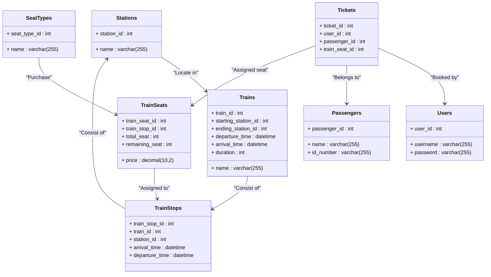

# ER图：



# 关系表：

```sql
CREATE TABLE Stations (
    station_id INT PRIMARY KEY,
    name VARCHAR(255) NOT NULL
);
CREATE TABLE Trains (
    train_id INT PRIMARY KEY,
    name VARCHAR(255) NOT NULL,
    starting_station_id INT NOT NULL,
    ending_station_id INT NOT NULL,
    departure_time DATETIME NOT NULL,
    arrival_time DATETIME NOT NULL,
    duration INT NOT NULL,
    FOREIGN KEY (starting_station_id) REFERENCES Stations(station_id),
    FOREIGN KEY (ending_station_id) REFERENCES Stations(station_id)
);
CREATE TABLE TrainStops (
    train_stop_id INT PRIMARY KEY,
    train_id INT NOT NULL,
    station_id INT NOT NULL,
    arrival_time DATETIME NOT NULL,
    departure_time DATETIME NOT NULL,
    FOREIGN KEY (train_id) REFERENCES Trains(train_id),
    FOREIGN KEY (station_id) REFERENCES Stations(station_id)
);
CREATE TABLE SeatTypes (
    seat_type_id INT PRIMARY KEY,
    name VARCHAR(255) NOT NULL
);
CREATE TABLE TrainSeats (
    train_seat_id INT PRIMARY KEY,
    train_stop_id INT NOT NULL,
    seat_type_id INT NOT NULL,
    price DECIMAL(10, 2) NOT NULL,
    total_seat INT NOT NULL,
    remaining_seat INT NOT NULL,
    FOREIGN KEY (train_stop_id) REFERENCES TrainStops(train_stop_id),
    FOREIGN KEY (seat_type_id) REFERENCES SeatTypes(seat_type_id)
);
CREATE TABLE Users (
    user_id INT PRIMARY KEY,
    username VARCHAR(255) NOT NULL,
    password VARCHAR(255) NOT NULL
);
CREATE TABLE Passengers (
    passenger_id INT PRIMARY KEY,
    name VARCHAR(255) NOT NULL,
    id_number VARCHAR(255) NOT NULL
);
CREATE TABLE Tickets (
    ticket_id INT PRIMARY KEY,
    user_id INT NOT NULL,
    passenger_id INT NOT NULL,
    train_seat_id INT NOT NULL,
    FOREIGN KEY (user_id) REFERENCES Users(user_id),
    FOREIGN KEY (passenger_id) REFERENCES Passengers(passenger_id),
    FOREIGN KEY (train_seat_id) REFERENCES TrainSeats(train_seat_id)
);
```

SQL查询：

##### 查询某天从A市（不是车站）到B市的所有火车（包括每种座位的剩余车票），按出发时间排列

```sql
SELECT t.train_id, t.name, s1.name AS starting_station, s2.name AS ending_station, ts.remaining_seat, st.name AS seat_type, ts.price
FROM Trains t
INNER JOIN TrainStops ts1 ON t.train_id = ts1.train_id
INNER JOIN TrainStops ts2 ON t.train_id = ts2.train_id
INNER JOIN Stations s1 ON ts1.station_id = s1.station_id
INNER JOIN Stations s2 ON ts2.station_id = s2.station_id
INNER JOIN TrainSeats ts ON ts1.train_stop_id = ts.train_stop_id
INNER JOIN SeatTypes st ON ts.seat_type_id = st.seat_type
WHERE s1.name = 'City A' AND s2.name = 'City B' AND DATE(ts1.departure_time) = '2023-04-10'
ORDER BY ts1.departure_time;
```

##### 订票时，系统应知道每个座位的已售或可用状态，以便订票。

```sql
SELECT remaining_seat
FROM TrainSeats
WHERE train_seat_id = <train_seat_id>;
```

##### 查询某日某站的所有列车

```sql
SELECT t.train_id, t.name, s1.name AS starting_station, s2.name AS ending_station, ts.remaining_seat, st.name AS seat_type, ts.price
FROM Trains t
INNER JOIN TrainStops ts1 ON t.train_id = ts1.train_id
INNER JOIN TrainStops ts2 ON t.train_id = ts2.train_id
INNER JOIN Stations s1 ON ts1.station_id = s1.station_id
INNER JOIN Stations s2 ON ts2.station_id = s2.station_id
INNER JOIN TrainSeats ts ON ts1.train_stop_id = ts.train_stop_id
INNER JOIN SeatTypes st ON ts.seat_type_id = st.seat_type_id
WHERE ts1.station_id = <station_id> AND DATE(ts1.departure_time) = '2023-04-10';
```

##### 查询某天某列车的行程（到达、出发时间、从起点到终点的所有站点的停靠时间）。

```sql
SELECT s.name AS station, ts.arrival_time, ts.departure_time, ts.duration
FROM Trains t
INNER JOIN TrainStops ts ON t.train_id = ts.train_id
INNER JOIN Stations s ON ts.station_id = s.station_id
WHERE t.train_id = <train_id> AND DATE(ts.arrival_time) = '2023-04-10'
ORDER BY ts.arrival_time;
```

##### 查询与某一列车上的某一乘客在同一车厢的所有乘客

```sql
SELECT p.name, p.id_number
FROM Tickets t
INNER JOIN TrainSeats ts ON t.train_seat_id = ts.train_seat_id
INNER JOIN TrainStops ts1 ON ts.train_stop_id = ts1.train_stop_id
INNER JOIN TrainStops ts2 ON ts.train_stop_id = ts2.train_stop_id
INNER JOIN Passengers p ON t.passenger_id = p.passenger_id
WHERE ts1.train_id = <train_id> AND ts2.train_id = <train_id> AND p.name <> '<passenger_name>'
AND ts1.departure_time <= ts2.departure_time AND ts1.departure_time >= '<departure_time>' AND ts2.departure_time <= '<arrival_time>';
```

##### 写一个订票交易： 一个用户为一名乘客购买了一张从A站到B站的某次卧铺列车的车票（包含等级、车厢和座位号、价格）。

```sql
BEGIN TRANSACTION;

UPDATE TrainSeats
SET remaining_seat = remaining_seat - 1
WHERE train_seat_id = <train_seat_id>;

INSERT INTO Tickets (user_id, passenger_id, train_seat_id)
VALUES (<user_id>, <passenger_id>, <train_seat_id>);
COMMIT;
```

##### 查询在某一列火车上与某一乘客在同一包厢的所有乘客

```sql
SELECT p.name, p.id_number
FROM Tickets t
INNER JOIN TrainSeats ts ON t.train_seat_id = ts.train_seat_id
INNER JOIN TrainStops ts1 ON ts.train_stop_id = ts1.train_stop_id
INNER JOIN TrainStops ts2 ON ts.train_stop_id = ts2.train_stop_id
INNER JOIN Passengers p ON t.passenger_id = p.passenger_id
WHERE ts1.train_id = <train_id> AND ts2.train_id = <train_id> AND p.name <> '<passenger_name>'
AND ts1.departure_time <= ts2.departure_time AND ts1.departure_time >= '<departure_time>' AND ts2.departure_time <= '<arrival_time>';
```

##### 写一个订票交易： 一个用户为一名乘客购买了一张从A站到B站的某次卧铺列车的车票（包含等级、车厢和座位号、价格）。

```sql
BEGIN TRANSACTION;
UPDATE TrainSeats
SET remaining_seat = remaining_seat - 1
WHERE train_seat_id = <train_seat_id>;
INSERT INTO Tickets (user_id, passenger_id, train_seat_id)
VALUES (<user_id>, <passenger_id>, <train_seat_id>);
COMMIT;
```

# 建议

1. 社交属性： 增加社交功能，如与朋友分享旅行计划或与同一列车上的其他旅行者联系的能力，可以提高用户体验。数据库模式可以包括社交功能的表格，如用户档案、朋友联系和团体旅行计划。

2. 与其他交通方式的整合： 如果12306能与其他交通方式（如公共汽车、地铁和出租车）整合，以提供无缝的旅行体验，那将是非常有用的。数据库模式可以扩展到包括其他交通方式和它们的时间表的表。

3. 个性化的推荐： 基于用户的旅行历史和偏好，12306可以提供个性化的旅行路线和住宿建议。这将需要数据库存储用户的偏好和旅行历史。

4. 实时更新： 目前的12306网站在列车时刻表和可用性方面可能很慢，有时还不准确。可以实施实时更新，为用户提供最新的列车时刻表、延误和取消的信息。这就要求数据库根据不同来源的信息进行实时更新。

5. 移动应用程序： 虽然12306网站对手机很友好，但一个专门的手机应用可以提供更好的用户体验，如推送通知和移动支付等功能。数据库模式的设计需要考虑到移动应用的开发，包括数据同步和离线功能等因素。

6. 使用AI进行优化查询，个性推荐等服务

```mermaid
erDiagram
    Stations{
        + station_id [PK]
        + name VARCHAR(255) [not null]
    }
    Trains{
        + train_id [PK]
        + name VARCHAR(255) [not null]
        --
        + starting_station_id [not null]
        + ending_station_id [not null]
        + departure_time DATETIME [not null]
        + arrival_time DATETIME [not null]
        + duration INT [not null]
    }
    TrainStops{
        + train_stop_id [PK]
        --
        + train_id [not null]
        + station_id [not null]
        + arrival_time DATETIME [not null]
        + departure_time DATETIME [not null]
    }
    SeatTypes{
        + seat_type_id [PK]
        + name VARCHAR(255) [not null]
    }
    TrainSeats{
        + train_seat_id [PK]
        --
        + train_stop_id [not null]
        + seat_type_id [not null]
        + price DECIMAL(10, 2) [not null]
        + total_seat INT [not null]
        + remaining_seat INT [not null]
    }
    Users{
        + user_id [PK]
        + username VARCHAR(255) [not null]
        + password VARCHAR(255) [not null]
    }
    Passengers{
        + passenger_id [PK]
        + name VARCHAR(255) [not null]
        + id_number VARCHAR(255) [not null]
    }
    Tickets{
        + ticket_id [PK]
        --
        + user_id [not null]
        + passenger_id [not null]
        + train_seat_id [not null]
    }
    Stations ||..o{ Trains : starting_station_id
    Stations ||..o{ Trains : ending_station_id
    Trains ||--|{ TrainStops : train_id
    Stations ||--|{ TrainStops : station_id
    TrainStops ||--|{ TrainSeats : train_stop_id
    SeatTypes ||--|{ TrainSeats : seat_type_id
    Users ||--|{ Tickets : user_id
    Passengers ||--|{ Tickets : passenger_id
    TrainSeats ||--|{ Tickets : train_seat_id

```

