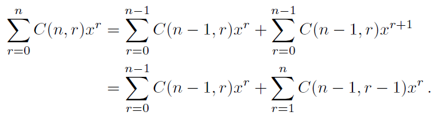
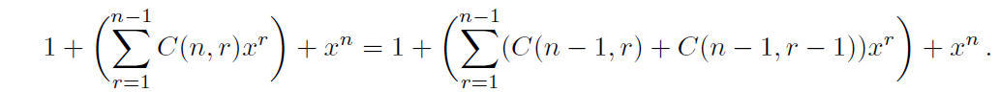

section 6.2 , section 6.3 , section 6.4 已经在上周作业中完成

# Section 6.5

### 15 

> 方程$x_1+x_2+x_3+x_4+x_5=21$有多少个解?其中$ x_i(i=1，2，3，4，5)$是非负整数，并且使得
> a)$x_1 \ge 1$
> b)$x_i \ge 2, i=1,2,3,4,5$
> c) $0≤x_1≤10$
> d)$0≤x_1≤3，1≤x_2<4，x_3≥15$

a) 对于$x_1≥1$，我们可以将方程转化为$x_1′+x_2+x_3+x_4+x_5=16$，其中$x_1′=x_1−1$。这样，我们就可以使用隔板法来解决这个问题。我们需要在$16$个球之间插入$4$个隔板，将它们分成$5$组。因此，答案为$C_{16+4}^4=C_{20}^4=10,626$

b) 对于$x_i≥2,i=1,2,3,4,5$，我们可以将方程转化为$x_1′+x_2′+x_3′+x_4′+x_5′=11$，其中$x_i′=x_i−2$。这样，我们就可以使用隔板法来解决这个问题。我们需要在11个球之间插入4个隔板，将它们分成5组。因此，答案为$C_{15}^{4}=1,365$

c) 对于$0≤x_1≤10$，我们可以将方程转化为$x_1+x_2+x_3+x_4+x_5=21−x_1′$，其中$x_1′=0,...,10$。这样，我们就可以使用隔板法来解决这个问题。对于每一个$x_1′$的值，我们需要在$(21−x_1′)$个球之间插入4个隔板，将它们分成5组。因此，答案为$∑_{x_1′=0}^{10}C_{25−x_1′}^{4}=11,649$

d)  对于$0≤x_1≤3，1≤x_2<4，x_3≥15$，我们可以枚举$x_1,x_2,x_3$的值，并计算剩余部分的方案数, 最后可以得到答案为$106$

### 21 

a) $13^2=169$

b) 如果左鞋和右鞋的颜色不同，并且区分哪种颜色穿在哪只脚上，那么他可以从13双鞋中任选两只鞋，并且有两种穿法。因此，答案为$2∗C_{13}^{2}=156$

c) 如果左鞋和右鞋的颜色不同，并且不区分哪种颜色穿在哪只脚上，那么他可以从13双鞋中任选两只鞋。因此，答案为$C_{13}^2=78$

d) 如果没有限制并且不区分哪种颜色穿在哪只脚上，那么他可以从13双鞋中任选两只鞋，或者选择一双相同颜色的鞋。但是，这样会重复计算两只相同颜色的鞋的情况。因此，答案为$C_{13}^2+13=91$

### 42

$$
\frac{16!}{4!3!5!4!}=50450400
$$

# Section 8.1

### 7

a) 当n ≥ 2时，$a_n = a_{n-1} + a_{n-2} + 2^n - 2$

b) $a_0 = 0$，$a_1 = 0$

c) 9个

### 17

a) 当n ≥ 2时，$a_n = 2a_{n-1}$

b) $a_1 = 3$

c) 96个

### 26

设a_n表示覆盖的方案数

a) 我们按照提示进行推导。如果最右边的多米诺骨牌竖着放，那么我们就相当于覆盖了最左边的n-1列，这样做有a_{n-1}种方案。如果最右边的多米诺骨牌横着放，那么它下面必须还有一块多米诺骨牌，这两块一起覆盖了最后两列。那么前n-2列就需要用多米诺骨牌来覆盖，这样做有a_{n-2}种方案。因此我们得到了斐波那契递推式：$a_n = a_{n-1} + a_{n-2}$。 

b) 显然有$a_1 = 1$和$a_2 = 2$。 

c) 我们得到的数列就是斐波那契数列，只是向右移动了一位。数列如下：1, 2, 3, 5, 8, 13, 21, 34, 55, 89, 144, 233, 377, 610, 987, 1597, 2584,…，所以这部分的答案是2584

### 48

由差分的定义式($\nabla a_n=a_n-a_{n-1}$)移项就可以得到$a_{n-1}=a_n-\nabla a_n$(所要证明的结论)

a) $r_n = \nabla a_n = a_n - a_{n-1} = 4 - 4 = 0$

b) $r_n = \nabla a_n = a_n - a_{n-1} = 2n - 2(n-1) = 2$

c) $r_n = \nabla a_n = a_n - a_{n-1} = n^2 - (n-1)^2 = 2n - 1$

d) $r_n = \nabla a_n = a_n - a_{n-1} = 2^n - 2^{n-1} = 2^{n-1}$

# Section 8.2

### 13

首先，我们求出这个递推关系的特征方程：

$x^3 - 7x - 6 = 0$

用有理根定理，我们可以找到一个根是x=3，然后用长除法，我们可以得到另外两个根是x=-2和x=-1。所以，这个递推关系的通解是：

$a_n = c_1(-1)^n + c_2(-2)^n + c_3 \cdot 3^n$

其中c_1,c_2,c_3是常数。为了确定这些常数，我们用初始条件代入通解，得到：

当n=0时，

$a_0 = c_1 + c_2 + c_3 = 9$

当n=1时，

$a_1 = -c_1 - 2c_2 + 3c_3 = 10$

当n=2时，

$a_2 = c_1 + 4c_2 + 9c_3 = 32$

解这个方程组，我们得到：

$c_1 = 8$

$c_2 = -3$

$c_3 = 4$

所以，最终的通项公式是：

$a_n = 8(-1)^n - 3(-2)^n + 4 \cdot 3^n$

### 20

这是一个四阶递推关系。特征多项式是$r^4 - 8r^2 + 16$，根据练习27，我们可以看到r=±2是唯一的根，每个根的重数都是2。因此，我们可以像往常一样写出通解：$a_n = \alpha_1 2^n + \alpha_2 n \cdot 2^n + \alpha_3 (-2)^n + \alpha_4 n \cdot (-2)^n$

### 35

首先，我们求出这个递推关系的特征方程：

$x^2 - 4x + 3 = 0$

用求根公式，我们可以得到两个根是x=3和x=1。所以，这个递推关系的齐次解是：

$a_n^h = c_1 \cdot 3^n + c_2 \cdot 1^n$

其中c_1,c_2是常数。为了求出非齐次解，我们用待定系数法，设：

$a_n^p = A \cdot n^2 + B \cdot n + C$

代入递推关系，得到：

$A \cdot n^2 + B \cdot n + C = 4(A \cdot (n-1)^2 + B \cdot (n-1) + C) - 3(A \cdot (n-2)^2 + B \cdot (n-2) + C) + 2n + n + 3$

展开并整理，得到：

$(A - 8A + 6A) \cdot n^2 + (B - 4B -12A + 6B +12A) \cdot n + (C -4C -6B -9A +9C +6B +9A) = 2n + n + 3$

比较同类项的系数，得到：

$-A = 0$

$-B -12A = 2$

$-C -6B -9A = 3$

解这个方程组，得到：

$A = 0$

$B = -\frac{1}{4}$

$C = \frac{1}{8}$

所以，非齐次解是：

$a_n^p = -\frac{1}{4} \cdot n^2 + \frac{1}{8}$

因此，通解是齐次解和非齐次解之和：

$a_n = a_n^h + a_n^p = c_1 \cdot 3^n + c_2 \cdot 1^n -\frac{1}{4} \cdot n^2 + \frac{1}{8}$

为了确定常数c_1和c_2，我们用初始条件代入通解，得到：

当n=0时，

$a_0 = c_1 + c_2 + \frac{1}{8} = 1$

当n=1时，

$a_1 = c_1 \cdot 3 + c_2 -\frac{1}{4} + \frac{1}{8} = 4$

解这个方程组，得到：

$c_1 = \frac{39}{8}$

$c_2 = -\frac{38}{8} = -\frac{19}{4}$

所以，最终的通项公式是：

$a_n = -4 \cdot 2^n -\frac{1}{4} \cdot n^2 -\frac{5}{2} \cdot n + \frac{1}{8} + (\frac{39}{8})\cdot 3^n$

### 43

首先，我们按照提示，令$b_n = a_n + 1$，那么原来的递推关系可以写成：

$b_n - 1 = b_{n-1} - 1 + b_{n-2} - 1 + 1$

整理得：

$b_n = b_{n-1} + b_{n-2}$

这是一个齐次的斐波那契递推关系。根据练习42，我们知道它的通解是：

$b_n = \alpha_1 f_n + \alpha_2 l_n$

其中f_n和l_n分别是斐波那契数列和卢卡斯数列，而$\alpha_1$和$\alpha_2$是常数。为了确定这些常数，我们用初始条件代入通解，得到：

当n=0时，

$b_0 = a_0 + 1 = 0 + 1 = 1$

所以，

$\alpha_1 f_0 + \alpha_2 l_0 = 1$

即

$\alpha_2 = 1$

当n=1时，

$b_1 = a_1 + 1 = 1 + 1 = 2$

所以，

$\alpha_1 f_1 + \alpha_2 l_1 = 2$

即

$\alpha_1 + \alpha_2 = 2$

代入$\alpha_2 = 1$，得到

$\alpha_1 = 1$

所以，最终的通解是：

$b_n = f_n + l_n$

为了得到a_n的通解，我们只需将b_n减去1，即：

$a_n = b_n - 1 = f_n + l_n - 1$

利用卢卡斯数列的性质：$l_n = f_{n-1} + f_{n}$，我们可以将$a_n$写成只含有斐波那契数列的形式：

$a_n=f_{n−1}+2f_n−1$

这就是最终的答案

# Section 8.4

### 18

假设罐子中每种颜色的球都有无限多个，不改变答案。这样做可以简化代数运算。对于红色和绿色球，生成函数是$1 + x + x^2 + ...$，但对于蓝色球，生成函数是$x^3 + x^4 + ... + x^10$，因此整个问题的生成函数是$(1 + x + x^2 + ...)^2(x^3 + x^4 + ... + x^10)$。我们要找到x^14的系数。这与以下表达式中$x^11$的系数相同：

$$(1 + x + x^2 + ...)^2(1 + x + ... + x^7) = (1 - x^8)/(1 - x)^3$$

由于$1/(1 - x)^3$的系数为$C(n + 2, 2)$，而分子确定了两个贡献项，因此我们的答案是$C(11 + 2, 2) - C(3 + 2, 2) = 68$

### 23

首先，考虑变量$x_1$。由于$x_1≥2$，我们可以将$x_1$的可能取值表示为$1 + x + x^2 + x^3 + x4^ + ..$.，其中每个项对应一个$x_1$值。

接下来，我们来考虑变量$x_2$。由于$0 ≤ x_2 ≤ 3$，我们可以将$x_2$的可能取值表示为$1 + x + x^2 + x^3$，其中每个项对应一个合法的$x^2$值。

最后，考虑变量$x_3$。由于$2 ≤ x_3 ≤ 5$，我们可以将$x_3$的可能取值表示为$x^2 + x^3 + x^4 + x^5 + ...$，其中每个项对应一个合法的$x_3$值。

现在，我们可以将所有变量的生成函数组合在一起。将$x_1$、$x_2$和$x_3$的生成函数相乘，得到：
$$
(1 + x + x^2 + x^3 + x^4 + ...)(1 + x + x^2 + x^3)(x^2 + x^3 + x^4 + x^5 + ...)
$$
简化上述表达式，我们得到：
$$
x^4(1 + x + x^2 + x^3)^2∕(1−x)
$$
b) 要找到a6，我们只需在生成函数中将x的系数对应到k = 6的项

展开生成函数，我们得到：
$$
x^4(1 + 2x + 3x^2 + 4x^3 + 3x^4 + 2x^5 + x^6 + ...)
$$
我们可以看到，系数为6的项只出现在$x^6$的位置上。因此，a6的值为系数为6的项的系数，即6

所以，$a_6 = 6$

### 33

a) 可以通过从 G(x) 中减去前三项来得到新序列的生成函数$G(x) − a_0 − a_1x − a_2x^2$

b) 可以通过将 x 替换为 x^2 来得到新序列的生成函数$G(x^2)$

c) 可以通过将 G(x) 向右移动四个单位来得到新序列的生成函数$x^4G(x)$

d) 可以通过将 x 替换为 2x 来得到新序列的生成函数$G(2x)$

e) 可以通过对 G(x) 进行积分来得到新序列的生成函数$\int_{0}^{x}{G(t)dt}$

f) 可以通过对 G(x) 进行求和来得到新序列的生成函数$G(x)/(1−x)$

### 44

首先我们注意到，如提示所示，(1+x)^n = (1+x)(1+x)^(n-1) = (1+x)^(n-1) + x(1+x)^(n-1)。通过使用二项式定理展开等式两边，我们有

因此，

通过逐项比较这两个表达式，我们可以看出对于 $1 \leq r \leq n-1$，系数 $C(n;r)$ 必须等于 $C(n-1;r) + C(n-1;r-1)$，如所求

### 53

考虑形式幂级数 $1/((1−x)(1−x^2)(1−x^3) ⋯) $的展开。我们可以将其写成如下形式：

$\frac{1}{(1-x)(1-x2)(1-x3)\cdots} = \frac{1}{(1-x)} \cdot \frac{1}{(1-x^2)} \cdot \frac{1}{(1-x^3)} \cdots$

我们知道，对于任意正整数 k，有：

$\frac{1}{(1-x^k)} = 1 + x^k + x^{2k} + x^{3k} + \cdots$

因此，我们可以将原式展开为：

$ \begin{aligned} \frac{1}{(1-x)(1-x2)(1-x3)\cdots} &= (1 + x + x^2 + x^3 + \cdots) \cdot (1 + x^2 + x^4 + x^6 + \cdots) \cdot (1 + x^3 + x^6 + x^9 + \cdots) \cdots \ &= 1 + (x + x^2 + x^3 + \cdots) \ &\quad+ (x^2 + 2x^3 + 3x^4 + 5x^5 + 7x^6 + 11x^7 + \cdots) \ &\quad+ (x^3 + 3x^4 + 6x^5 + 10x^6 + 15x^7 + 21x^8 + \cdots) \ &\quad+ \cdots \end{aligned} $

注意到，上式中每一项的系数都表示将 n 划分为若干个正整数之和的方案数。例如，当 n=4 时，有四种划分方案：$4$，$3+1$，$2+2$ 和 $2+1+1$。因此，上式中 $x^n $的系数 $p(n) $等于$ n $的划分数

