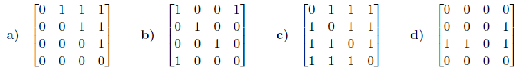
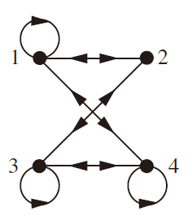
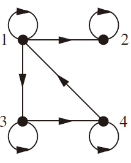
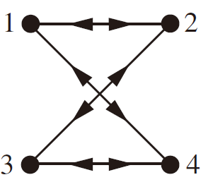

# Section 8.5

### 9

> How many students are enrolled in a course either in calculus, discrete mathematics, data structures, or programming languages at a school if there are 507, 292, 312, and 344 students in these courses, respectively; 14 in both calculus and data structures; 213 in both calculus and programming languages; 211 in both discrete mathematics and data structures; 43 in both discrete mathematics and programming languages; and no student may take calculus and discrete mathematics, or data structures and programming languages, concurrently?

可以用容斥原理来解决这个问题:设 $A$ 为微积分课程的学生人数，$B$ 为离散数学课程的学生人数，$C$ 为数据结构课程的学生人数，$D$ 为编程语言课程的学生人数。

则有

$A = 507$

$B = 292$

$C = 312$

$D = 344$

$A \cap C = 14$

$A \cap D = 213$

$B \cap C = 211$

$B \cap D = 43$

由于没有学生同时选修微积分和离散数学，或者数据结构和编程语言，所以：

$A \cap B = 0$

$C \cap D = 0$

根据容斥原理，可以计算出至少选修一门课程的学生人数为：

$A \cup B \cup C \cup D = A + B + C + D - (A \cap B) - (A \cap C) - (A \cap D) - (B \cap C) - (B \cap D) - (C \cap D) + (A \cap B \cap C) + (A \cap B \cap D) + (A \cap C \cap D) + (B \cap C \cap D) - (A \cap B \cap C \cap D)$

将已知数据代入上式，得：

$A \cup B \cup C \cup D = 507 + 292 + 312 + 344 - 0 - 14 - 213 - 211 - 43 - 0 + 0 + 0 + 0 + 0 - 0 =974$

### 22

> How many elements are in the union of five sets if the sets contain 10,000 elements each, each pair of sets has 1000 common elements, each triple of sets has 100 common elements, every four of the sets have 10 common elements, and there is 1 element in all five sets?

$$
5*10000-10*1000+10*100-5*10+1=40951
$$

# Section 8.6

### 5

> An integer is called squarefree if it is not divisible by the square of a positive integer greater than 1. Find the number of squarefree positive integers less than 100.

可以使用容斥原理来解决这个问题。首先，我们计算小于100的正整数中能被2²，3²，5²或7²整除的个数。这些数字分别是24，11，4和2。然而，这样计算会重复计算那些能被两个或更多平方数整除的数字。因此，我们需要减去那些能被两个平方数整除的数字（例如2²×3²=36），这样就不会重复计算了。这样的数字有1个（36）。最后，我们需要加上那些能被三个平方数整除的数字（例如2²×3²×5²=900），但是由于900大于100，所以没有这样的数字

综上所述，小于100的正整数中无平方因数的个数为：100 - (24 + 11 + 4 + 2) + 1 = 60 - 41 = **46**

### 9

> How many ways are there to distribute six different toys to three different children such that each child gets at least one toy?

5个空位中放置2个隔板的方案数。根据组合数学的知识，这个方案数为C(5,2)=10

但是，这只是把玩具分成了3组，还需要考虑把这3组玩具分给3个不同的孩子的方案数。由于3个孩子不同，所以这3组玩具可以任意分给他们，方案数为3!=6，因此，总方案数为10×6=60。

但是，我们还需要考虑每组玩具内部的排列顺序。由于每组玩具都是不同的，所以每组玩具内部都有多种排列顺序。设第$i$组有$a_i$个玩具，则第$i$组内部的排列方案数为$ai_!$。

综上所述，最终答案为$60×a_1!×a_2!×a_3!=540$

### 25

> How many derangements of {1, 2, 3, 4, 5, 6} begin with the integers 1, 2, and 3, in some order?

我们可以先计算出{1,2,3}的排列数，即3!，然后将剩下的数字进行错排，即求{4,5,6}的错排数。错排数公式为：$D_n=n!(1-\frac{1}{1!}+\frac{1}{2!}-\frac{1}{3!}+…+(-1)^n\frac{1}{n!})$。所以，答案为：$3!\times D_3=6\times 2=12$

# Section 9.1

### 7

a) Symmetric 

b) Symmetric, transitive 

c) Symmetric

d) Reflexive, symmetric, transitive 

e) Reflexive, transitive

f) Reflexive, symmetric, transitive 

g) Antisymmetric

h) Antisymmetric, transitive

### 31

a) {(a, b) ∣ a被要求阅读或已阅读b}

b) {(a, b) ∣ a被要求阅读并且已经阅读了b}

c) {(a, b) ∣ a被要求阅读b但没有阅读 或者a阅读了b但没有被要求阅读}

d) {(a, b) ∣ a被要求阅读b但没有阅读} 

e) {(a, b) ∣ a已阅读b但不被要求阅读}

### 42

a) $(a,b) \in R_1 \cup R_2$当且仅当 $a | b$ 或 $b | a$

b) $(a, b) \in R_1 \cap R_2$当且仅当$a |b$且$b | a$。这发生当且仅当$a =± b$且$a \neq 0$

c) $(a,b) \in R_1 - R_2$当且仅当$a|b$且$b\nmid a$来用符号表示。这等价于说$a | b$且$a \neq ± b$

d) $(a,b) \in R_2 - R_1$当且仅当$b | a$且$a \nmid b$来用符号表示。这等价于说$b | a$且$b \neq ± a$

e) $R_1 \oplus   R_2 = (R_1 - R_2) \cup (R_2 - R_1)$，因此，如果$R_1$成立且$R_2$不成立，或者反之亦然，则该关系在两个整数之间成立。这发生当且仅当$a | b$或$b | a$，但$a \neq ± b$

### 49

a) $2^{n(n+1)∕2} $

b) $2^n3^{n(n−1)∕2}$

c) $3^{n(n−1)∕2} $

d) $2^{n(n−1)} $

e) $2^{n(n−1)∕2} $

f) $2^{n^2}−2⋅2^{n(n−1)}$

### 57

使用数学归纳法

当$n = 1$时，显然成立

假设$R^n$是自反且传递的。根据定理1，$R^{n+1} ⊆ R$。为了看到$R ⊆ R^{n+1} = R^n◦R$，设$(a, b) ∈ R$

根据归纳假设，$R^n = R$，因此是自反的。因此，$(b, b) ∈ R^n$

因此，$(a, b) ∈ R^{n+1}$

# Section 9.3

### 2

如果$(i, j)$在关系中，就在矩阵位置$(i,j)$上放一个1，反之放0

### 14

a)
$$
\left( \begin{matrix}
   0 & 1 & 0  \\
   1 & 1 & 1  \\
   1 & 1 & 1  \\
\end{matrix} \right)
$$
b)
$$
\left( \begin{matrix}
   0 & 1 & 0  \\
   0 & 1 & 1  \\
   1 & 0 & 0  \\
\end{matrix} \right)
$$
c)
$$
{{M}_{{{R}_{1}}}}\odot {{M}_{{{R}_{2}}}}=\left( \begin{matrix}
   0 & 1 & 1  \\
   1 & 1 & 1  \\
   0 & 1 & 0  \\
\end{matrix} \right)
$$
d)
$$
{{M}_{{{R}_{1}}}}\odot {{M}_{{{R}_{2}}}}=\left( \begin{matrix}
   1 & 1 & 1  \\
   1 & 1 & 1  \\
   0 & 1 & 0  \\
\end{matrix} \right)
$$
e）
$$
XOR=\left( \begin{matrix}
  0 & 0 & 0  \\
   1 & 0 & 0  \\
   0 & 1 & 1  \\
\end{matrix} \right)
$$

### 21

a)

b)

c)

### 35

通过数学归纳法证明。

基础步骤： $n=1$时，显然成立

归纳步骤： 假设$k$为真。因为$R^{k+1} = R^k ◦R$，其矩阵为$M_R⊙M_{R^k}$。根据归纳假设这就是$M_R ⊙M_R^{[k]}=M_R^{[k+1]}$

证毕

# Section 9.4

### 2

把所有的对$(x,x)$加到给定的关系中时，我们就有了所有的$Z \times Z$, 因此这些关系一直成立

### 3

${(a, b) ∣ a除以b或b除以a}$

### 15

只有当R是irreflexive，它是它自己的封闭

### 27

a)
$$
\left( \begin{matrix}
   1 & 1 & 1 & 1  \\
   1 & 1 & 1 & 1  \\
   1 & 1 & 1 & 1  \\
   1 & 1 & 1 & 1  \\
\end{matrix} \right)
$$
b)
$$
\left( \begin{matrix}
   0 & 0 & 0 & 0  \\
   1 & 0 & 1 & 1  \\
   1 & 0 & 1 & 1  \\
   1 & 0 & 1 & 1  \\
\end{matrix} \right)
$$
c)
$$
\left( \begin{matrix}
   0 & 0 & 0 & 0  \\
   1 & 0 & 1 & 1  \\
   1 & 0 & 1 & 1  \\
   1 & 0 & 1 & 1  \\
\end{matrix} \right)
$$
d)
$$
\left( \begin{matrix}
   1 & 1 & 1 & 1  \\
   1 & 1 & 1 & 1  \\
   1 & 1 & 1 & 1  \\
   1 & 1 & 1 & 1  \\
\end{matrix} \right)
$$

# Section 9.5

### 9

a) $（x，x）∈R$，因为$f（x）=f（x）$。因此，$R$是reflexive。$(x，y)∈R$，当且仅当$f(x)=f(y)$，当且仅当$f(y)=f(x)$，当且仅当$(y，x)∈R$，这才成立。 因此，$R$是symmetric。如果$(x，y)∈R$ 和$(y，z)∈R$， 那么$f(x)=f(y)$，$f(y)=f(z)$。因此、$f(x)=f(z)$。因此，$(x，z)∈R$，由此可见，R是transitive传

b) 在$f$的范围内的$b$的集合$f -1(b)$

### 13

这从上一题（题目9）中可以看出，f是将长度为3或更多的比特串取为以其第一比特为第一分量，第三比特为第二分量的有序对的函数

### 31

a) 所有长度为3的比特串的集合 

b) 所有长度为4，结尾为1的比特串的集合 

c) 所有长度为5，结尾为11的比特串的集合 

d) 所有长度为8，结尾为10101的位串的集合

### 54

首先，假设$R1\subseteq R2$。我们必须证明$P_1$是$P_2$的细化。设$[a]_{R_1}$是$P_1$中的一个等价类。我们必须证明$[a]_{R_1}$包含在$P_2$中的一个等价类中。事实上，$[a]_{R_1} \subseteq  [a]_{R_2}$

为此，设$b \in [a]_{R_1}$, 则$(a, b) \in R_1 \subseteq R_2$。因此$b \in [a]_{R_2}$

反之，假设$P_1$是$P_2$的细化。由于$a \in [a]_{R_2}$，由细化的定义，可以得到$[a]_{R_1} \subseteq  [a]_{R_2}$，对所有$a \in A$成立。这意味着对所有$b \in A$，我们都有$(a, b) \in R_1 \to  (a,b) \in R_2$；换句话说，$R_1 \subseteq R_2$

### 60

a) 

引理：当且仅当$f(x)$是$O(g(x))$并且$g(x)$是$O(f(x))$时，$f(x)$是$Θ(g(x))$

为了证明$R$是自反的，我们需要证明$f(x)$是$O(f(x))$，这很明显，只要取$C=1$和$k=1$代入定义即可

对称性也是显然的，因为如果$f(x)$是$O(g(x))$并且$g(x)$是$O(f(x))$，那么$g(x$)是$O(f(x))$并且$f(x)$是$O(g(x))$

传递性可以直接从$O(~)$的传递性推出

b) 

这是所有函数的一个类别，它们在渐近地（即当n趋于无穷时）以$f(n)=n^2$的倍数增长。它是所有函数$g()$的集合，使得存在正常数$C_1$和$C_2$，使得
$$
\frac{f(n)}{g(n)} \in [C_1,C_2]
$$
