# Section 9.6

### 9

> In Exercises 9–11 determine whether the relation with the directed graph shown is a partial order.
>
> 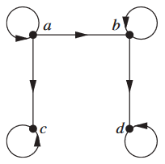

$No$

### 13

> Find the duals of these posets
>
> a) $(\{0, 1, 2\}, ≤) $
>
> b) $(Z, ≥) $
>
> c)$ (P(Z), ⊇) $
>
> d) $(Z^+, ∣)$

a) $\{(0, 0), (1, 0), (1, 1), (2, 0), (2, 1), (2, 2)\}$

b) $(Z,≤) $

c) $(P(Z),⊆) $

d) $(Z^+, 'is\quad a\quad multiple\quad of')$

### 35

>Answer these questions for the poset$ (\{\{1\}, \{2\}, \{4\}, \{1, 2\}, \{1, 4\}, \{2, 4\}, \{3, 4\}, \{1, 3, 4\}, \{2, 3, 4\}\}, ⊆)$
>
>a) Find the maximal elements. 
>
>b) Find the minimal elements. 
>
>c) Is there a greatest element? 
>
>d) Is there a least element? 
>
>e) Find all upper bounds of $\{\{2\}, \{4\}\}. $
>
>f) Find the least upper bound of $\{\{2\}, \{4\}\}$,if it exists. 
>
>g) Find all lower bounds of $\{\{1, 3, 4\},\{2, 3, 4\}\}$. 
>
>h) Find the greatest lower bound of $\{\{1, 3, 4\},\{2, 3, 4\}\}$, if it exists.

a) $\{1, 2\}, \{1, 3, 4\}, \{2, 3, 4\}$

b) $\{1\}, \{2\}, \{4\} $

c) $No $

d) $No $

e) $\{2, 4\}, \{2, 3, 4\} $

f) $\{2, 4\}$

g) $ \{3, 4\}, \{4\} $

h) $\{3, 4\}$

### 43

> Determine whether the posets with these Hasse diagrams are lattices.
>
> 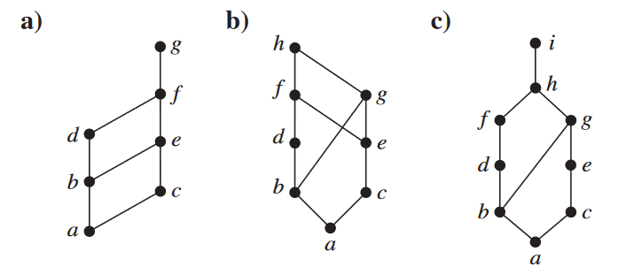

a) $Yes$ 

b) $No$ 

c) $Yes$

### 48

> Show that the set $S$of security classes$ (A, C)$ is a lattice, where $A$ is a positive integer representing an authority class and $ C$ is a subset of a finite set of compartments, with $(A_1,C_1) \preceq (A_2,C_2)$ if and only if $A_1 ≤ A_2$ and $C_1 ⊆ C_2$.

我们需要验证lattice的各个定义属性。首先，我们需要证明在给定的关系下，$S$ 是一个偏序集。显然，$(A,C) \preceq (A,C)$，因为 $A \leq A$ 并且 $C \subseteq C$；因此，我们已经证明了反身性

对于反对称性，假设 $(A_1,C_1) \preceq (A_2,C_2)$ 且 $(A_2,C_2) \preceq (A_1,C_1)$。这意味着 $A_1 \leq A_2$，$C_1 \subseteq C_2$，$A_2 \leq A_1$，以及 $C_2 \subseteq C_1$。根据 $\leq$ 和 $\subseteq$ 的性质，我们可以立即得出 $A_1 = A_2$ 和 $C_1 = C_2$，因此 $(A_1,C_1) = (A_2,C_2)$。类似地，可以用类似的方式证明传递性，使用 $\leq$ 和 $\subseteq$ 的传递性

其次，我们需要证明最大下界和最小上界的存在性。假设 $(A_1,C_1)$ 和 $(A_2,C_2)$ 是 $S$ 的两个元素；我们声称 $(\min(A_1,A_2),C_1 \setminus C_2)$ 是它们的最大下界。显然，$\min(A_1,A_2) \leq A_1$ 和 $\min(A_1,A_2) \leq A_2$；而 $C_1 \setminus C_2 \subseteq C_1$ 和 $C_1 \setminus C_2 \subseteq C_2$。因此，$(\min(A_1,A_2),C_1 \setminus C_2) \preceq (A_1,C_1)$ 和 $(\min(A_1,A_2),C_1 \setminus C_2) \preceq (A_2,C_2)$，因此它是一个下界

另一方面，如果 $(A,C)$ 是任意的下界，则 $A \leq A_1$，$A \leq A_2$，$C \subseteq C_1$ 和 $C \subseteq C_2$。根据 $\leq$ 和 $\subseteq$ 的性质，我们可以得出 $A \leq \min(A_1,A_2)$ 和 $C \subseteq C_1 \setminus C_2$, $(A,C) \preceq(\min(A_1,A_2),C_1 \setminus C_2)$. 这意味着 $(\min(A_1,A_2),C_1 \setminus C_2)$ 是最大下界

证明 $(\max(A_1,A_2),C_1 \cup C_2)$ 是最小上界与上述论证类似。我们可以验证 $\max(A_1,A_2) \geq A_1$，$\max(A_1,A_2) \geq A_2$，$C_1 \subseteq C_1 \cup C_2$ 和 $C_2 \subseteq C_1 \cup C_2$。因此，$(A_1,C_1) \preceq (\max(A_1,A_2),C_1 \cup C_2)$ 和 $(A_2,C_2) \preceq (\max(A_1,A_2),C_1 \cup C_2)$，因此它是一个上界

另一方面，如果 $(A,C)$ 是任意的上界，则 $A \geq A_1$，$A \geq A_2$，$C_1 \subseteq C$ 和 $C_2 \subseteq C$。根据 $\geq$ 和 $\subseteq$ 的性质，我们可以得出 $\max(A_1,A_2) \leq A$ 和 $C_1 \cup C_2 \subseteq C$。因此，$(\max(A_1,A_2),C_1 \cup C_2) \preceq (A,C)$。这意味着 $(\max(A_1,A_2),C_1 \cup C_2)$ 是最小上界

综上所述，我们证明了 $S$ 是一个lattice，其中最大下界由 $(\min(A_1,A_2),C_1 \setminus C_2)$ 给出，最小上界由 $(\max(A_1,A_2),C_1 \cup C_2)$ 给出

### 60

> Show that a finite nonempty poset has a maximal element

可以参照课本上的关于有最小元素的证明

为了证明一个有限非空的位置集（部分有序集）有一个最大的元素，我们需要确定该集中存在一个大于或等于所有其他元素的元素

让我们假设我们有一个有限非空的位置集P。我们可以通过矛盾法进行，假设P没有最大元素。这意味着对于P中的每个元素x，存在一个元素$y$，使得$y$严lattice大于$x$

既然$P$是有限的，那么它一定有有限的元素数。我们可以把P的元素表示为$x_1, x_2, x_3, ..., x_n$

从$x_1$开始，根据我们的假设，存在一个元素$x_2$，使得$x_2$严lattice大于$x_1$。继续这个过程，对于每个$x_i$，存在一个元素$x_{i+1}$，使得$x_{i+1}$严lattice大于$x_i$

现在，考虑元素$x_1, x_2, x_3, ..., x_n$的链。由于每个$x_{i+1}$都严lattice大于$x_i$，我们有以下严lattice不等式链：

$x_1 < x_2 < x_3 < ... < x_n$

然而，由于$P$的元素数量有限，这个链不能无限地继续下去。最终，我们将达到一个点，即对某些i来说$x_i$=$x_n$，这与我们关于$P$没有最大元素的假设相矛盾。

因此，我们关于P没有最大元素的假设一定是错误的。因此，我们可以得出结论，每个有限非空的位置集都有一个最大元素

# Chapter 10.1

### 11

> Let $G$ be a simple graph. Show that the relation $R$ on the set of vertices of $G$ such that $uRv$ if and only if there is an edge associated to $\{u, v\}$ is a symmetric, irreflexive relation on $G$

如果$uRv$，那么就有一条与${u, v}$相关的边。但是$\{u, v\} = \{v, u\}$，所以这条边与$\{v, u\}$相关，因此$vRu$。因此，根据定义，$R$是一个对称关系。一个简单的图不允许有循环

 因此，$uRu$从不成立，所以根据定义，$R$是不反射的

### 13

> The intersection graph of a collection of sets $A_1, A_2, ... ,A_n$ is the graph that has a vertex for each of these sets and has an edge connecting the vertices representing two sets if these sets have a nonempty intersection. Construct the intersection graph of these collections of sets.

#### a

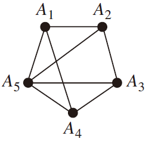

#### b

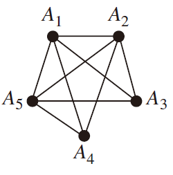

#### c

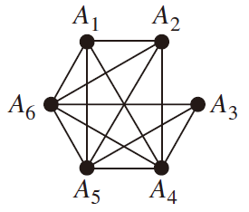

### 33

> Describe a graph model that represents traditional marriages between men and women. Does this graph have any special properties?

让顶点的集合是一个人的集合，如果两个人曾经结婚，则两个顶点由一条边连接

忽略复杂的情况，这个图的特性是有两种类型的顶点（男人和女人），每条边都连接着相反类型的顶点。属于相反类型的顶点

### 37

> Describe a discrete structure based on a graph that can be used to model relationships between pairs of individuals in a group, where each individual may either like, dislike, or be neutral about another individual, and the reverse relationship may be different.

用顶点代表群体中的人。将每一对顶点的一条有向 在图中为每一对顶点加上一条有向的边。给这条边贴上标签 从代表A的顶点到代表B的顶点的边 如果A喜欢B，就用 `+`；如果A不喜欢B，就用`-`；如果A对B持中立态度，就用 `0`

# Chapter 10.2

### 25

> determine whether the graph is bipartite. You may find it useful to apply Theorem 4 and answer the question by determining whether it is possible to assign either red or blue to each vertex so that no two adjacent vertices are assigned the same color.
>
> 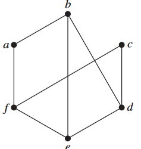

不是

### 26

> For which values of n are these graphs bipartite? 
>
> a) $K_n$ b) $C_n$ c) $W_n$ d) $Q_n$

a) 根据文本中给出的定义，$K_1$没有足够的顶点来构成二分图（分区中的集合必须非空）。显然，$K_2$是二分图。对于$n>2$，$K_n$中存在一个三角形，因此这些完全图不是二分图

b) 首先，我们需要$n≥3$才能定义Cn。如果n是偶数，则Cn是二分图，因为我们可以将其中一部分设置为每隔一个顶点。如果n是奇数，则Cn不是二分图。

c) 每个"wheel"都包含三角形，因此没有Wn是二分图。

d) 对于所有n≥1，Qn是二分图，因为我们可以将顶点分为两类：具有奇数个1的位字符串和具有偶数个1的位字符串

### 47

> Show that a sequence $d_1,d_2, ... ,d_n$ of nonnegative integers in nonincreasing order is a graphic sequence if and only if the sequence obtained by reordering the terms of the sequence $d_2 − 1, ... ,d_{d_1+1} − 1,d_{d_1+2}, ... ,d_n$ so that the terms are in nonincreasing order is a graphic sequence.

首先，假设 $d_1, d_2,..., d_n$ 是图形序列。我们需要证明，一旦将序列 $d_2−1, d_3−1, ..., d_{d_1+1}−1, d_{d_1+2}, ..., d_n$ 按非递增顺序排列，得到的序列仍然是一个图形序列。在练习46中，已经证明如果原始序列是图形序列，那么实际上存在一个具有该度序列的图，其中度为 $d_1$ 的顶点与度为 $d_2, d_3, ..., d_{d_1+1}$ 的顶点相邻。从该图中移除度最高的顶点（$d_1$），则得到的图具有所需的度序列

反过来，假设 $d_1, d_2, ..., d_n$ 是一个非递增序列，且通过将序列 $d_2−1, d_3−1, ..., d_{d_1+1}−1, d_{d_1+2}, ..., d_n$ 按非递增顺序排列后得到的序列是一个图形序列。取一个具有后一序列度数的图，其中顶点 $v_i$ 的度数为 $d_i−1$（$2 ≤ i ≤ d_1 + 1$），顶点 $v_i$ 的度数为 $d_i$（$d_1 + 2 ≤ i ≤ n$）。添加一个新顶点（称为 $v_1$），并在 $v_1$ 与顶点 $v_2, v_3, ..., v_{d_1+1}$ 之间加入边。得到的图具有度序列 $d_1, d_2, ..., d_n$

综上所述，我们证明了原序列和重新排列后的序列都是图形序列

### 55

> For which values of n are these graphs regular?
>
> a) $K_n$ b) $C_n$ c) $W_n$ d) $Q_n$

a) 任意 $ n ≥ 1$ 

b)  任意 $n ≥ 3 $

c)  $ n = 3 $

d)  任意 $ n ≥ 0$

### 57

> How many vertices does a regular graph of degree four with 10 edges have?

$$
10 = (4 * n) / 2
$$

解得$n=5$, 即有5条边

### 63

>  If the simple graph G has v vertices and e edges, how many edges does $\overline{G}$ have?

$$
v(v − 1)∕2 − e
$$

### 66

> Show that if G is a bipartite simple graph with v vertices and e edges, then $e ≤ v^2∕4$

假设这个二分图的两个部分的大小分别为k和v-k。那么图中可能存在的最大边数为k(v-k)（不同部分的每对顶点之间都有一条边）

由于函数$f(k) = k(v-k)$ 在$k = v/2 $时取得最大值，得到$f(k) = v^2/4$。因此，最多只有$v^2/4 $条边

# Chapter 10.3

### 9

##### a

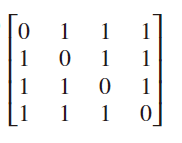

##### b

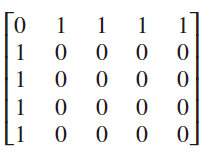

##### c

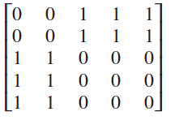

##### d

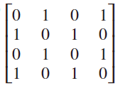

##### e

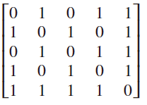

##### f

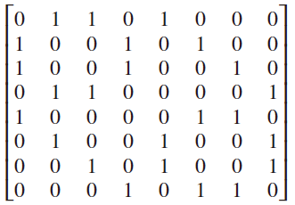

### 27

> (Requires calculus) For each of these families of graphs, determine whether the graph family is sparse, dense, or neither. (Refer to the results of Exercise 37 in Section 10.2.) 
>
> a) $K_n$ 
>
> b) $C_n$ 
>
> c) $K_{n,n}$ 
>
> d) $Q_n$ 
>
> e) $W_n$ 
>
> f) $K_{3,n}$

a) dense 

b) sparse

c) dense 

d) sparse 

e) sparse 

f) sparse

### 58

> How many nonisomorphic simple graphs are there with n vertices, when n is 
>
> a) $2$? b) $3?$ c) $4?$

##### a) 

有两个由2个顶点构成的图形——没有边的图和只有一条边的图

##### b) 

由三个顶点构成的图可以包含0、1、2或3条边。对于每个边数，最多只有一个图，考虑同构关系

答案是4

##### c) 

在这里，我们考虑由4个顶点构成的图。没有边的图只有1个（考虑同构），只有一条边的图也只有1个。如果有两条边，这些边可以相邻，也可以不相邻，因此有2种可能性。如果有三条边，这些边可以形成一个三角形、一个星形图或一个路径图，因此有3种可能性。由于具有四、五或六条边的图形只是具有两、一或无边的图形的补图（分别），因此同构类的数量必须与这些较早情况的相同。

答案是1 + 1 + 2 + 3 + 2 + 1 + 1 = 11

### 70

观察可知，同构

### 71

>Show that if $G$ and $H$ are isomorphic directed graphs, then the converses of $G $and $H $(defined in the preamble of Exercise 69 of Section 10.2) are also isomorphic

如果f是一个从有向图G到有向图H的同构，那么f也是一个从$G^{conv}$到$H^{conv}$的同构

$(u, v)$是$G^{conv}$的一条边，当且仅当$(v, u)$是G的一条边，当且仅当$(f (v), f (u))$是$H^{conv}$的一条边

