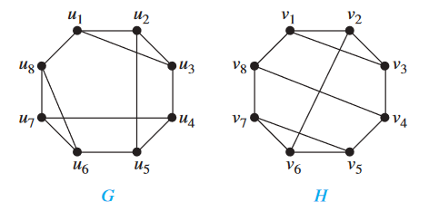
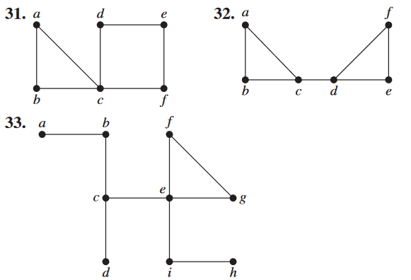
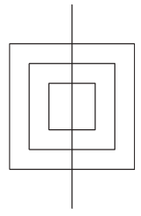

# Chapter 10.4

### 15

> Find the strongly connected components of each of these graphs.
>
> 

a) $\{a, b, f \}, \{c, d, e\}$ 

b) $\{a, b, c, d, e, h\},\{f\}, \{g\}$

c) $\{a, b, d, e, f, g, h, i\}, \{c\}$

### 19

> Find the number of paths of length n between two different vertices in $K_4$ if $n$ is 
>
> a) 2. b) 3. c) 4. d) 5.

a) 2 

b) 7 

c) 20

d) 61

### 22

> Use paths either to show that these graphs are not isomorphic or to find an isomorphism between them.
>
> 

每个图中有两个顶点不在大小为4的循环中。因此，让我们尝试构建一个与之匹配的同构体，例如$u_1\leftrightarrow v_2$和$u_8\leftrightarrow v_6$。现在$u_1$与$u_2$和$u_3$相邻，而$v_2$与$v_1$和$v_3$相邻，所以我们尝试$u_2\leftrightarrow v_1和u_3 \leftrightarrow v_3$

由于$u_4$是与$u_3$相邻的另一个顶点，$v_4$是与$v_3$相邻的另一个顶点（而且我们已经匹配了$u_3$和$v_3$），我们必须有$u4 \leftrightarrow v4$ 

沿着类似的思路，我们再以$u_5 \leftrightarrow v_8,$$u_6 \leftrightarrow v_7$$和u_7  \leftrightarrow v_5$完成双射。在找到唯一可能的同构之后，我们检查G的12条边与H的12条边完全对应，我们已经证明这两个图是同构的

### 29

> Let $G = (V, E) $be a simple graph. Let R be the relation on V consisting of pairs of vertices $(u, v)$ such that there is a path from u to v or such that $u = v$. Show that R is an equivalence relation.

reflexive

$R$在定义上是自反的。假设$(u, v) \in R$；那么从$u$到$v$存在一条路径。因此，$(v, u) \in R$，因为从$v$到$u$存在一条路径，即从$u$到$v$的路径反向遍历。假设$(u, v) \in R$且$(v, w) \in R$；那么从$u$到$v$和从$v$到$w$存在路径。将这两条路径组合起来，就得到一条从$u$到$w$的路径。因此，$(u, w) \in R$。由此可知，$R$是传递的

### 34

> Find all the cut edges in the graphs in Exercises 31–33.
>
> 

练习31中的图没有割边；任何边都可以被移除，结果仍然是连通的。

对于练习32中的图，$\{c, d\}$是唯一的割边

对于练习33中的图，有几条割边：$\{a, b\}, \{b,c\}, \{c, d\}, \{c, e\}, \{e, i\}$和$\{h,i\}$

### 36

> Show that a vertex $c$ in the connected simple graph $G$ is a cut vertex if and only if there are vertices $u$ and $v$,both different from $c$, such that every path between $u$ and $v$ passes through $c$.

首先，我们证明如果$c$是一个割顶，那么存在顶点$u$和$v$，使得它们之间的每条路径都经过$c$。由于移除$c$会增加连通分量的数量，因此在移除$c$后，图$G$中必定存在两个不同的顶点在不同的连通分量中。那么，连接这两个顶点的每条路径都必须经过$c$

反之，如果$u$和$v$是如上所述的顶点，那么它们必须在移除$c$后的图的不同连通分量中。因此，移除$c$会导致至少两个连通分量，因此$c$是一个割顶

### 38

> Show that an edge in a simple graph is a cut edge if and only if this edge is not part of any simple circuit in the graph.

首先假设$e = \{u, v\}$是一条割边。包含$e$的每个回路必须除了边$e$之外还包含一条从$u$到$v$的路径。如果从图中移除$e$，就不存在这样的路径。因此，每条这样的路径必须包含$e$。因此，$e$在回路中出现两次，所以该回路不是简单回路。反之，假设$e$不是一条割边。那么，在删除$e$的图中，$u$和$v$仍然在同一个连通分量中。因此，在这个删除了$e$的图中存在一条从$u$到$v$的简单路径$P$。由$P$和$e$组成的回路是包含$e$的简单回路

### 45

> Show that a simple graph $G$ with $n$ vertices is connected if it has more than $(n − 1)(n − 2)∕2$ edges.

假设图$G$不连通。那么它有一个包含$k$个顶点的连通分量，其中$1 \leq k \leq n - 1$。图$G$可能具有的最多边数是$C(k, 2) + C(n - k, 2) = [k(k - 1) + (n - k)(n - k - 1)]/2 = k^2 - nk + (n^2 - n)/2$。这个关于$k$的二次函数在$k = n/2$处取得最小值，并且在$k = 1$或$k = n - 1$处取得最大值。因此，如果图$G$不连通，则边的数量不会超过该函数在$k = 1$和$k = n - 1$处的值，即$(n - 1)(n - 2)/2$

### 47

> How many nonisomorphic connected simple graphs are there with n vertices when n is 
>
> a) 2? b) 3? c) 4? d) 5?

a) 1 b) 2 c) 6 d) 21

### 53

> Find $𝜅(K_{m,n})$ and $𝜆(K_{m,n})$, where $m$ and $n$ are positive integers.

$𝜅(K_{m,n})=𝜆(K_{m,n})=min\{m,n\}$

# Chapter 10.5

### 7

> In Exercises 1–8 determine whether the given graph has an Euler circuit. Construct such a circuit when one exists. If no Euler circuit exists, determine whether the graph has an Euler path and construct such a path if one exists.
>
> 

a, i, h, g, d, e, f, g, c, e, h, d, c, a, b, i, c, b, h, a

### 14

>In Exercises 13–15 determine whether the picture shown can be drawn with a pencil in a continuous motion without lifting the pencil or retracing part of the picture.
>
>

### 21

> In Exercises 18–23 determine whether the directed graph shown has an Euler circuit. Construct an Euler circuit if one exists. If no Euler circuit exists, determine whether the directed graph has an Euler path. Construct an Euler path if one exists.

该图正好有两个奇数度的顶点；因此它有一个欧拉路

### 28

> For which values of m and n does the complete bipartite graph $K_{m,n}$ have an 
>
> a) Euler circuit? b) Euler path?

a) 由于图中顶点的度数均为$m$和$n$，当且仅当正整数$m$和$n$均为偶数时，该图具有欧拉回路

b) 在(a)部分列出的所有图都有欧拉回路，它们同时也是欧拉路径。此外，对于奇数$n$（以及奇数$m$的情况下的$K_{m,2}$），图$K_{2,n}$有恰好2个奇度顶点，因此它们有欧拉路径但没有欧拉回路。另外，$K_{1,1}$显然有欧拉路径, 而其他完全二部图都有太多奇度顶点。

### 43

> Does the graph in Exercise 36 have a Hamilton path? If so, find such a path. If it does not, give an argument to show why no such path exists.
>
> 

a, b, c, f, i, h, g, d, e

### 45

> For which values of m and n does the complete bipartite graph $K_{m,n}$ have a Hamilton circuit?

$m = n ≥ 2$

# Chapter 10.6

### 5

练习2：a, b, e, d, z

练习3：a, c, d, e, g, z

练习4：a, b, e, h, l, m, p, s, z

### 27

San Francisco–Denver–Detroit–New York–Los Angeles–San Francisco

### 30

设$G$是我们的原始加权图，并构造一个新图$G_0$，具体步骤如下。$G_0$的顶点和边与$G$的顶点和边相同。对于$G$中的每一对顶点$u$和$v$，使用类似Dijkstra算法的算法找到$u$和$v$之间的最短路径（即总权重最小的路径之一）。将这条路径记录在一个表中，并将$G_0$中的边$\{u, v\}$赋予该路径的权重。现在很明显，在$G_0$中找到一条总权重最小的回路，且每个顶点恰好访问一次，等价于在$G$中找到一条总权重最小的回路，且每个顶点至少访问一次

# Chapter 10.7

### 15

因为没有环或多重边，也没有长度为3的简单回路，并且无界区域的度数至少为4，所以每个区域的度数至少为4。因此，$2e \geq 4r$，或者$r \leq e/2$。但是$r = e - v + 2$，所以我们有$e - v + 2 \leq e/2$，这意味着$e \leq 2v - 4$

### 23

Planar

### 28

依据上课所讲授的内容，答案为2，过程不再赘述

### 32

根据欧拉公式的推论1，我们知道在一个平面中，从具有$v$个顶点的图中最多可以画出$3v - 6$条不相交的边。因此，如果一个图有$v$个顶点和$e$条边，为了能够绘制所有的边而不相交，至少需要$e / (3v - 6)$个平面。由于厚度是一个整数，它必须大于或等于不小于这个值的最小整数，即$de = (3v - 6)e$

# Chapter 10.8

### 9

$2$

### 13

没有边的图形

### 15

$$
{{W}_{n}}=\left\{ \begin{matrix}
   3 & n  \\
   4 & n  \\
\end{matrix} \right.
$$

