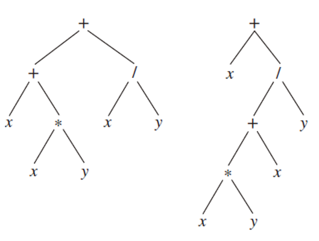

# Chapter 11.1

### 13

a) $3 $

b) $9$

### 21

$999$

### 29

a) 

$n=mi+1$ 且 $i+l=n$，因此，我们有$l=n-i$，所以
$$
l=（mi+1）-i=（m-1）i+1
$$
b) 

我们有$n=mi+1$，$i+l=n$，因此，$i=n-l$。由此可见，$n=m(n-l)+1$

解得$n=(ml-1)/(m-1)$

从而$i=[(ml-1)∕(m-1)]-l=(l-1)∕(m-1)$

### 44

首先把根节点染成红色

然后，我们将所有处于奇数层的顶点涂成蓝色，所有处于偶数层的顶点涂成红色。级的所有顶点涂成红色

### 46

树$T_n$中的顶点数满足递归关系：$v_n = v_{n-1} + v_{n-2} + 1$（其中的"+1"是指根节点），且$v_1 = v_2 = 1$。因此，序列起始为$1, 1, 3, 5, 9, 15, 25, \ldots$。很容易通过归纳法证明：$v_n = 2f_{n-1}$，其中$f_n$是第n个斐波那契数。叶节点的数量满足递归关系：$l_n = l_{n-1} + l_{n-2}$，且$l_1 = l_2 = 1$，因此$l_n = f_n$。由于$i_n = v_n - l_n$，我们有$i_n = f_n - 1$。最后，很明显$T_n$的高度比$T_{n-1}$的高度多1（对于$n \geq 3$），其中$T_2$的高度为0。因此，对于所有$n \geq 2$，$T_n$的高度为$n - 2$（当然$T_1$的高度为0）

# Chapter 11.2

### 9

至少需要$⌈log_3^{ 13}⌉ = 3$次称重。实际上，只需要三次称重就足够了。首先，将硬币1、2和3放在天平的左边，将硬币4、5和6放在右边。如果相等，将例子3应用于硬币1、2、7、8、9、10、11和12。如果不相等，将例子3应用于硬币1、2、3、4、5、6、7和8

### 21

$$
a: 000, e: 001, i: 01, k: 1100, o: 1101, p: 11110, u: 11111
$$

### 27

A:0001; 

B:101001; 

C:11001; 

D:00000; 

E:100;

F:001100; 

G:001101; 

H:0101; 

I:0100; 

J:110100101;

K:1101000; 

L:00001;

M:10101; 

N:0110; 

O:0010; 

P:101000;

Q:1101001000; 

R:1011; 

S:0111; 

T:111; 

U:00111; 

V:110101;

W:11000; 

X:11010011; 

Y:11011; 

Z:1101001001

### 32

我们通过对符号数量进行归纳证明来证明这一点。如果只有两个符号，则无需证明，因此假设归纳假设为：对于k个符号，Huffman编码是最优的。考虑存在k+1个符号的情况。首先注意，由于树是满的，底层的叶子节点成对出现。设a和b是频率最小的两个符号，它们的频率分别为$p_a$和$p——b$。如果在某个二进制前缀编码中，它们没有在底层成对出现，那么通过交换一些叶子节点上的符号，使得a和b在底层成为兄弟节点，可以得到一个至少与原编码一样高效的编码（因为将频率更高的符号靠近根节点只会有益）。因此，我们可以假设在最高效的树中，a和b始终是兄弟节点。现在假设我们将它们视为一个新符号c，其频率等于a和b的频率之和，并应用归纳假设，通过Huffman算法在k个符号上获得一个最优的二进制前缀编码$H_k$。注意，这相当于在k+1个符号上应用Huffman算法，并获得一个称为$H_{k+1}$的编码。我们必须证明$H_{k+1}$对于k+1个符号是最优的。注意，在$H_k$和$H_{k+1}$中，除了符号a、b和c之外，编码一个符号所需的平均位数是相同的，差异仅为$p_a + p_b$（因为与c相比，a和b需要额外的一位，而其他所有编码词都相同）。如果$H_{k+1}$不是最优的，则存在一个更好的编码$H'_k+1$（平均每个符号的位数更少）。根据上述观察，我们可以假设a和b在$H'_k+1$中是底层的兄弟节点。然后，通过将a和b替换为它们的父节点（并删除最后一位）得到的编码$H'_k$，对于k个符号的平均位数等于$H'_k+1$减去$pa + pb$的平均位数，这与假设$H_k$是最优的矛盾

# Chapter 11.3

### 17

a)



b) 
$$
++x ∗ xy∕xy, +x∕+ ∗ xyxy
$$
c) 
$$
xxy ∗ +xy∕+, xxy ∗ x+y∕+
$$
d) 
$$
((x + (x ∗ y)) + (x∕y)), (x + (((x ∗ y) + x)∕y))
$$

### 27

可以使用数学归纳法进行证明

对于只有一个元素的列表，结果是显而易见的。假设对于包含n个元素的列表，结果成立。对于归纳步骤，从末尾开始。找到以最后一个叶子节点开始，以根节点结束的列表末尾的顶点序列，每个顶点是其后面一个顶点的最后一个子节点。移除该叶子节点并应用归纳假设

### 31

可以使用数学归纳法证明

假设S(X)和O(X)分别表示良构公式X中的符号数和运算符数。对于长度为1的良构公式，结论显然成立，因为它们有1个符号和0个运算符。假设对于所有长度小于n的良构公式，该结论成立。现在考虑长度为n的良构公式，它必须具有形式∗XY，其中∗是一个运算符，而X和Y是长度小于n的良构公式。根据归纳假设，有S(∗XY) = S(X) + S(Y) = [O(X) + 1] + [O(Y) + 1] = O(X) + O(Y) + 2。由于O(∗XY) = 1 + O(X) + O(Y)，因此S(∗XY) = O(∗XY) + 1

# Chapter 11.4

### 11

a) $3 $

b) $16 $

c) $4 $

d) $5$

### 21

使用**广度优先搜索（BFS）**，我们从度数为m的顶点向度数为n的所有顶点扩展作为第一步。接下来，处理一个度数为n的顶点，并添加它到所有剩余的度数为m的顶点的边。结果是一个K1,n−1和一个K1,m−1，它们的中心通过一条边连接起来

使用**深度优先搜索(DFS）**，我们来回穿越两个部分集，直到无法再前进为止。如果m = n或m = n−1，则得到长度为m+n−1的路径。否则，路径在较大的部分集中的某些顶点未被访问时终止，因此我们在路径中的一个顶点v处回溯一条链接，并依次访问该集合中的其余顶点。结果是一条路径，路径的一端有额外的悬挂边

### 25

通过对路径长度进行归纳证明：

如果路径长度为0，则结果显而易见

如果长度为1，则u与v相邻，所以u在广度优先生成树中的层级为1

假设对于长度为l的路径，结果成立。如果路径长度为l + 1，设u'为从v到u的最短路径中倒数第二个顶点。根据归纳假设，u'在广度优先生成树中的层级为l。如果u的层级不超过l，那么从v到u的最短路径长度显然也不超过l。因此，在将第l层的顶点添加后，u尚未被添加到广度优先生成树中。由于u与u'相邻，它将在层级l + 1被添加（尽管连接u'和u的边不一定被添加）

### 28

a) 可能包含的最大数是**19**。由于19与列表中任何较小的数的和都大于20，我们得出结论：没有和为20的子集包含19。然后我们尝试14，得出相同的结论。最后，我们尝试11，注意到在我们包含8之后，列表已经耗尽且和不为20。因此，不存在和为20的子集

b) 从集合中选择27，我们很快发现子集{27, 14}具有所需的和**41**

c) 首先，我们尝试将27放入子集中。如果我们还包括24，则无法再添加其他数字，因此我们回溯并尝试将19与27一起包括。现在可以添加14，得到所需的和**60**

# Chapter 11.5

### 4

按{a, b}, {a, e}, {a, d}, {c, d}, {f, g}, {a, m}, {f, p}, {e, f}, {e, i}, {f, g}, {l, p}, {m, n}, {f, o}, {f, g}, {f, j} 和 {k, l}的顺序进行添加

总权重为**28**

### 34

该算法将G转换为其最小生成树，并且需要在开始之前按权重递减对边进行排序：

```pseudocode
procedure reverse-delete(G : weighted connected undirected graph with n vertices)
while G has more than n 􀀀 1 edges
	e := any edge of largest weight that is in a simple circuit in G
	G := G with edge e deleted
```

### 35

逆删除算法必定会终止并产生一棵生成树，因为该算法从不断开图，并且在终止时不会存在更多的简单回路。算法每个阶段删除的边必定是其所在回路中权重最大的边。因此，根据练习33，该边不可能出现在任何最小生成树中。由于只删除了不能出现在任何最小生成树中的边，结果必定是一棵最小生成树