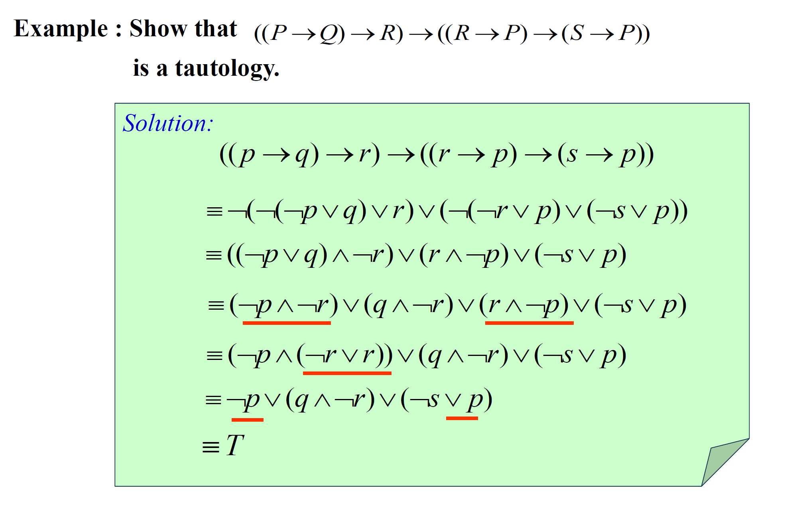
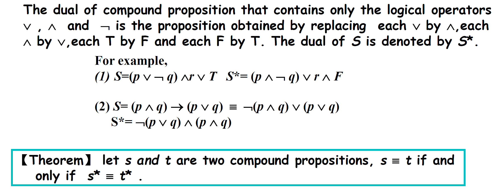

 Chapter 01 Logic and Proofs 逻辑与证明

> 所有内容都要考（加内容：命题范式△）很重要
>
>  掌握：命题逻辑，（合取析取），谓词逻辑，（量化）等价性
>
> 证明方法一定要知道（反证法：为什么可以用）
>
>  推理肯定做要求
>
> 范式：定义，等价关系得到合取析取，通过真值表得到完全析取合取范式（必须掌握）

## Proposition 命题

> A proposition is  a declarative sentence that is either true or false, **but not both**.
>
> 命题是一个==陈述语句==，它或真或假，但不能既真又假。

### 不是命题的几种典型反例

1. command 命令 (e.g. Read it loud!)
2. question 疑问  (e.g. What time is it?)
3. paradox 悖论 (e.g. This statement is false.)
4. equation with unknowns 含有未知数的等式 (e.g. x + y = z)

## Connectives 联结

Negation (NOT) 否定   **¬p** (not p)

Conjunction (AND) 合取   **p ∧ q** (p and q)

Disjunction (OR) 析取     **p ∨ q** (p or q)

Exclusive Or (XOR) 异或      **p ⊕ q** 

### Implication (if-then) 蕴含

Implication or conditional statement : **p → q** (if p, then q)

> Note: 再次注意，自然语言和逻辑语言是有区别的，生活中的逻辑也不要强行带入
>
> e.g. If the moon is made of green cheese, then I have more money than Bill Gates. 这句话的真值为T

- p → q

- ==**p only if/ not unless q**==

- ==**q unless ¬p**==

| *p*  | *q*  | $p \to q$ |
| ---- | ---- | --------- |
| T    | T    | T         |
| T    | F    | ==F==     |
| F    | T    | T         |
| F    | F    | T         |

### Converse, Contrapositive, and Inverse 逆命题、逆否命题、否命题

|  **p → q**  |  **Implication**   |
| :---------: | :----------------: |
|  **q → p**  | ==**Converse**逆== |
| **¬q → ¬p** | **Contrapositive** |
| **¬p → ¬q** | ==**Inverse**否==  |

### Biconditional (if and only if) 双条件  iff  p ↔ q

两者相同才为真

| *p*  | *q*  | p ↔ q |
| ---- | ---- | ----- |
| T    | T    | ==T== |
| T    | F    | F     |
| F    | T    | F     |
| F    | F    | ==T== |

### *Precedence 优先级*

==量词有限集最高，然后是非，然后先交再并==

| Operator | Precedence |
| :------: | :--------: |
|    ¬     |     1      |
|  ∧    ∨  |   2   3    |
|  →    ↔  |   4   5    |

### Two Related Problems

#### How many rows are there in ==a== truth table with n propositional variables?

==$$2^n$$==

#### With n propositional variables, we can construct ( ) distinct (i.e., not equivalent) propositions

==$$2^{2^n}$$==

稍加解释一下，有n个命题变量时，真值表就有了$$2^n$$种情况，而每一个命题对于每一种情况，它都可以有T和F两个值（注意，如果两个命题在这$$2^n$$个情况之下真值完全相同，则它们被视为完全等价的两个命题，即在这里被算为一个）那么此时，就有了$$2^{2^n}$$种不同的真值组合，对应$$2^{2^n}$$种不同的命题

Bitwise Operations 位运算   **Bit**: a symbol with two possible values , namely, **0 and 1**.  用 1 代替 T,  用 0 代替 F

# Propositional Equivalences 命题等价式

##### ==Tautologies 永真 （重言式）==

e.g. p ∨ ¬p

##### ==Contradictions 永假 （矛盾式）==

e.g. p ∧ ¬p

##### ==Contingencies 可能式==

A  contingency is a proposition which is **neither** a tautology **nor** a contradiction, such as  p

## Logical Equivalences 逻辑等价式

The compound propositions *p* and *q* are called **logically equivalent** if *p* ↔ *q* is a tautology.

证明两者等价，真值表相同，或者用逻辑运算算出来

**p ⇔ q** or **p ≡ q**

## Laws 一些等价定律

### De Morgan’s Laws 德·摩根律

- ¬(p ∧ q) ≡ ¬p ∨ ¬q

- ¬(p ∨ q) ≡ ¬p ∧ ¬q

拓展形式为

$$\neg(p_1\wedge p_2\wedge ...\wedge p_n)\equiv \neg p_1\vee \neg p_2\vee  ...\vee \neg p_n$$

$$\neg(p_1\vee p_2\vee ...\vee p_n)\equiv \neg p_1\wedge \neg p_2 \wedge  ...\wedge \neg p_n$$

We will sometimes use the notation $$\bigvee_{j = 1}^{n} p_j$$ for $$p_1 \vee p_2 \vee ... \vee p_n$$ and $$\bigwedge_{j = 1}^n p_j$$ for $$p_1 \wedge p_2 \wedge ... \wedge p_n$$. Using this notation, the extended version of De Morgan's laws can be written concisely as $$\lnot (\bigvee_{j = 1}^n p_j) \equiv \bigwedge_{j = 1}^n p_j$$ and $$\lnot (\bigwedge_{j = 1}^n p_j) \equiv \bigvee_{j = 1}^n \lnot p_j$$. (Methods for proving these identities will be given in Section 5.1)

### Key Logical Equivalences 重要的逻辑等价式

| **Name**            | **Equivalences**                                             |
| ------------------- | ------------------------------------------------------------ |
| Identity laws       | $$p \wedge T \equiv p, p \vee F \equiv p$$                     |
| Domination laws     | $$p \vee T \equiv T, p \wedge F \equiv F$$                     |
| Idempotent laws     | $$p \vee p \equiv p, p \wedge p \equiv p$$                     |
| Double negation law | $$\lnot \lnot p \equiv p$$                                     |
| Commutative laws    | $$p \vee q \equiv q \vee p, p \wedge q \equiv q \wedge p$$     |
| Associative laws    | $$(p \vee q) \vee r \equiv p \vee (q \vee r), (p \wedge q) \wedge r \equiv p \wedge (q \wedge r)$$ |
| Distributive laws   | $$p \vee (q \wedge r) \equiv (p \vee q) \wedge (p \vee r), p \wedge (q \vee r) \equiv (p \wedge q) \vee (p \wedge r)$$ |
| De Morgan's laws    | $$\lnot (p \wedge q) \equiv \lnot p \vee \lnot q, \lnot (p \vee q) \equiv \lnot p \wedge \lnot q$$ |
| Absorption  laws | $$p \vee (p \wedge q) \equiv p, p\wedge(p \vee q) \equiv p$$ |
| Implication law  | ==$$ p \to q \equiv \lnot p \vee q$$== |
| Equivalence law  | $$p↔ q \equiv (p \to q) \wedge(q \to p)$$ |

## Constructing New Logical Equivalences 构建新的逻辑等价式

### Using Truth Tables

Easy but time-consuming when the number of variables is large

### Using already-proved equivalences

#### 推理逻辑的基础——传递性

$$A_1\equiv A_2$$

$$A_2\equiv A_3$$

……

$$A_{n-1}\equiv A_n$$

#### Samples of Equivalence Proofs

> 

> 

## Propositional Satisfiability 命题的可满足性

A compound proposition is **satisfiable** if there is an assignment of truth values to its variables that make it true. (成真赋值)

When no such assignments exist, the compound proposition is **unsatisfiable**.

**一个复合命题是**satisfiable如果对它的变量赋值使它为真(此时这个变量称为解)。(成真赋值)   ,一个复合命题是不可满足的当且仅当它的否定永真, 

## Others 其他
### Other Logical Operators

#### Sheffer stroke    ==**|**== （Sheffer 竖）

p | q ≡ ¬(p ∧ q)  NAND ==与非==  ==(这个地方要额外注意，因为这个和C有点不一样)==

#### Peirce arrow ==**↓**==（Peirce 箭头）

p ↓ q ≡ ¬(p ∨ q)  NOR ==或非==

> p ↓ p ≡ ¬p
>
> (p ↓ q) ↓ (p ↓ q) ≡ p ∨ q

### The Dual of a Compound Proposition 对偶

**AND**，**OR**换一下，运算顺序不变（同数逻）

### Functionally Complete Collection of Logical Operators 功能完备的逻辑连接词集合

如果每一个复合命题在逻辑上都等同于只涉及这些逻辑运算符的复合命题，那么一个逻辑运算符的集合就被称为功能完整。

> e.g. {¬, ∧, ∨, →, ↔}, {¬, ∧, ∨}, {¬, ∧}, {¬, ∨}, **{|}**, **{↓}** are all functionally complete operators

