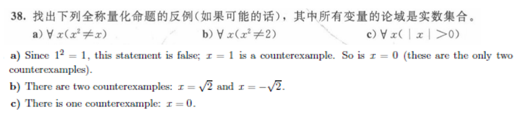

 Chapter 01 Logic and Proofs 逻辑与证明

Covering1.4 ~ 1.5

------

# Predicate Logic 谓词逻辑

### Predicate 谓词

 (**propositional function 命题函数**) 

$$P(x_1,x_2,...,x_n)$$ n-place (n-ary) predicate **n位谓词（n元谓词）**

### Quantifiers 量词

Universal Quantifier 全称量词  ∀

Existential Quantifier 存在量词    ∃

 Uniqueness quantifier 唯一性量词        ==$$\exists!$$ or $$\exists_1$$==              one and only one x

变量少的时候可以永穷举来检验

If U consists of the integers 1,2, and 3

$$\forall x P(x)\equiv P(1)\wedge P(2)\wedge P(3)$$

$$\exists x P(x)\equiv P(1)\vee P(2)\vee P(3)$$

#### Precedence of Quantifiers 量词优先级

#### Binding Variables 量词绑定

在语句∃x(x + y = 1)中，变量x被存在性量词∃x所约束**Bound Variable**，但变量y是自由**Free Variable**的，因为它没有被量词所约束，也没有为这个变量赋值。这说明在语句∃x(x+y=1)中，x被约束，但y是自由的。

然而，这个语句不是一个命题，因为y是未定义的，我们无法判断它是真还是假。

## Logical Equivalences Involving Quantifiers 涉及量词的逻辑等价式

**logically equivalent** ***iff*** 

- 量词辖域的扩张

$$\forall xP(x)\vee A\equiv\forall x(P(x)\vee A)$$

$$\forall xP(x)\wedge A\equiv\forall x(P(x)\wedge A)$$

$$\exists xP(x)\vee A\equiv\exists x(P(x)\vee A)$$

$$\exists xP(x)\wedge A\equiv\exists x(P(x)\wedge A)$$

- 量词辖域的收缩

$$\forall x(A\to P(x))\equiv A\to\forall xP(x)$$

$$\exists x(A\to P(x))\equiv A\to\exists xP(x)$$

==$$\forall x(P(x)\to A)\equiv\exists xP(x)\to A$$==

==$$\exists x(P(x)\to A)\equiv\forall xP(x)\to A$$==

## Negating Quantified Expressions 量化表达式的否定

### De Morgan’s Laws for Quantifiers 量词的德·摩根律

==$$\neg\forall xP(x)\equiv\exists x\neg P(x)$$==

==$$\neg\exists xP(x) \equiv \exists\forall x\neg P(x)$$==

上例中下面那个相当于上面那个取反

> determine whether each of the following formulate is true, if it is true,porve it, if not, give a counterexample. Where P(x) and Q(x) are predicates and the domain is nonempty
>
> a) $\forall x(P(x)\vee Q(x))\equiv \forall xP(x)\vee \forall xQ(x)$    
>
> b) $\exists x(P(x)\vee Q(x))\equiv \exists xP(x)\vee \exists xQ(x)$
>
> 
>
> a) $\forall x(P(x)\vee Q(x))\equiv \forall xP(x)\vee \forall xQ(x)$ 这个公式不是普遍成立的。以下是一个反例：
>
> 假设我们有两个谓词 `P(x)` 和 `Q(x)`，其中 `P(x)` 表示 `x` 是偶数，`Q(x)` 表示 `x` 是奇数。那么，对于整数集合 $\mathbb{Z}$ 中的所有元素，$\forall x(P(x)\vee Q(x))$ 是成立的，因为每个整数要么是偶数要么是奇数。但是，$\forall xP(x)\vee \forall xQ(x)$ 并不成立，因为并不存在一个整数集合 $\mathbb{Z}$ 中的所有元素都是偶数或者都是奇数。==$\forall xP(x)\vee \forall xQ(x)$的对偶是$\exists x(P(x)\wedge Q(x))$==
>
> 正确的形式应该是$\forall xP(x)\vee \forall xQ(x) \quad \to \quad \forall x(P(x)\vee Q(x))$    
>
> ​								 $\exists x(P(x)\wedge Q(x))\quad\to \quad\exists xP(x)\wedge \exists xQ(x)$   
>
> b) $\exists x(P(x)\vee Q(x))\equiv \exists xP(x)\vee \exists xQ(x)$ 这个公式是成立的。为了证明它，我们需要证明两个方向互相蕴含。
>
> $(\Rightarrow)$ 假设 $\exists x(P(x)\vee Q(x))$ 是真的。那么，域中至少存在一个元素满足 P(x) 或 Q(x) 中的一个或两个，不失一般性，假设存在一个元素 a 满足 P(a) 是真的。那么 $\exists xP(x)$ 是真的，因此 $\exists xP(x)\vee \exists xQ(x)$ 也是真的。
>
> $(\Leftarrow)$ 假设 $\exists xP(x)\vee \exists xQ(x)$ 是真的。那么有两种情况：要么存在一个元素 a 满足 P(a) 是真的，要么存在一个元素 b 满足 Q(b) 是真的。不失一般性，假设存在一个元素 a 满足 P(a) 是真的。那么 $P(a)\vee Q(a)$ 是真的，因此 $\exists x(P(x)\vee Q(x))$ 也是真的。
>
> 因此，$\exists x(P(x)\vee Q(x))\equiv \exists xP(x)\vee \exists xQ(x)$ 是真的。他的对偶$\forall x(P(x)\wedge Q(x))\equiv \forall xP(x)\wedge \forall xQ(x)$ 也正确

## Translating from English into Logical Expressions

The very first step is to decide on the domain U.  第一步是确定论域

### A Very Important Notice

1. Every student in this class has taken a course in Java

   if U is all people, also define a propositional function S(x) denoting “x is a student in this class”

   $$\forall x(S(x)\wedge J(x))$$ is **not** correct!!!

   if there is **one** x that does not belong to this class, then **the whole statement is false**!

2. Some student in this class has taken a course in Java

   if U is all people

   $$\exists x(S(x)\to J(x))$$ is **not** correct!!!

   if there is **one** x that does not brlong to this class, the **the whole statement is true**!

## Premises and Conclusion 前提和结论

 **premises**（**前提**） $\to$ **conclusion**（**结论**）的过程叫 **argument**（论证）.

一个论证是有效的valid， 如果它的所有前提为真蕴含着结论为真。  当$(p_1 \wedge p_2 \wedge ... \wedge p_n) \to q $为永真式时，带有前提$p_1,p_2,...,p_n$以及结论$q$的论证形式是有效的

# Nested Quantifiers 嵌套量词

e.g. $$\forall x\exists yC(x,y)$$

## Translating English into Logical Expressions Involving Nested Quantifiers

> Express the statement “Everyone has exactly one best friend” as a logical expression with a domain consisting of all people
>
> *Solution*
>
> Rewrite the original statement as **For every person *x* , *x* has exactly one best friend.**
>
> There is a person ***y*** who is the best friend of ***x***, and furthermore, that for every person ***z***, if ***z*** is not ***y***, then ***z*** is not the best friend of ***x***.
>
> Let *B*(*x, y*) be the statement *y* is the best friend of *x*.
>
> $$\forall x\exists y\forall z(B(x,y)\wedge((z≠y)\to\neg B(x,z)))$$

## The Order of Quantifiers 量词顺序

如果量词属于**不同的类型，那么嵌套的量词的顺序**很重要

e.g.   $$\forall x\forall yP(x,y)\equiv\forall y\forall xP(x,y)$$

However    $$\exists x\forall yP(x,y)$$ is **not** the same as $$\forall y\exists xP(x,y)$$

> **Explanation**
>
> Assume P(*x*,*y*) denote "*x* loves *y*", where the domain for variables *x* and *y* consists of all people
>
> $$\exists x\forall yP(x,y)$$ --> There is someone who loves everyone.
>
> $$\forall y\exists xP(x,y)$$ --> Everybodyi s loved by somebody.

## Negating Nested Quantifiers 嵌套量词的否定

通过连续应用否定包含单个量词的语句的规则来否定嵌套的量词（一个个放进去就好）

上面这题要参考微积分的极限定义（但是这个题问的是not exist，所以前面还要加个反）

## Quantifications of Two Variables 两个变量的量化式

|         Statement          |                      When True?                      |                      When False?                      |
| :------------------------: | :--------------------------------------------------: | :---------------------------------------------------: |
| $$\forall x\forall yP(x, y)\\\forall y\forall xP(x, y)$$ |         P(x, y) is true for every pair x, y.         |   There is a pair x, y for which P(x, y) is false.    |
|       $$\forall x\exists yP(x, y)$$       | For every x there is a y for which P(x, y) is true.  | There is an x such that P(x, y) is false for every y. |
|       $$\exists x\forall yP(x, y)$$       | There is an x for which P(x, y) is true for every y. | For every x there is a y for which P(x, y) is false.  |
| $$\exists x\exists yP(x, y)\\\exists y\exists xP(x, y)$$ |   There is a pair x, y for which P(x, y) is true.    |         P(x, y) is false for every pair x, y.         |

