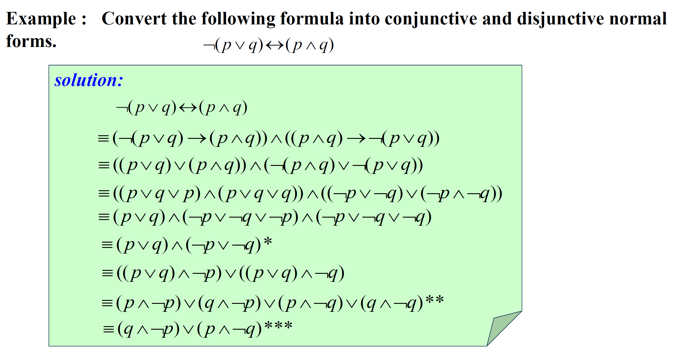
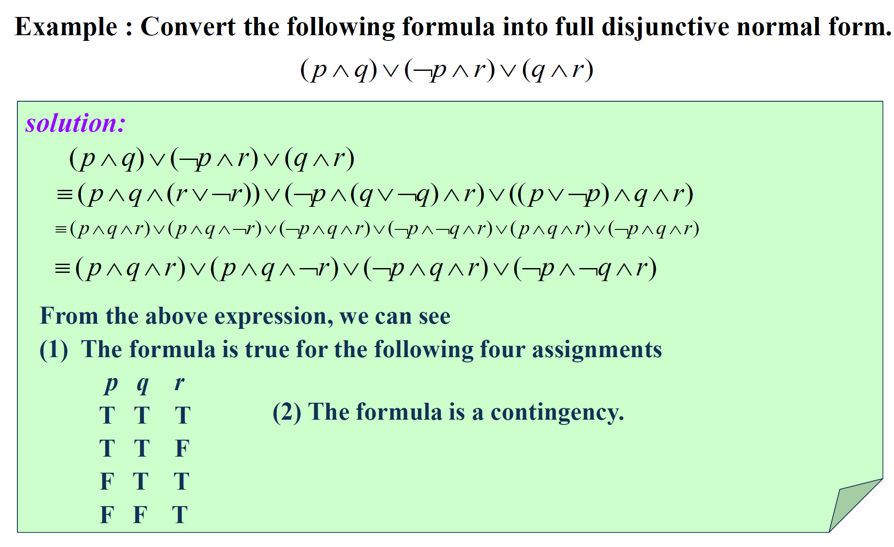
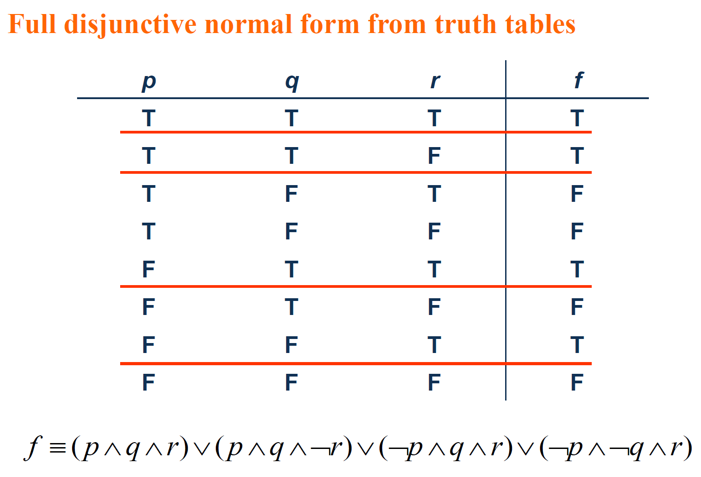
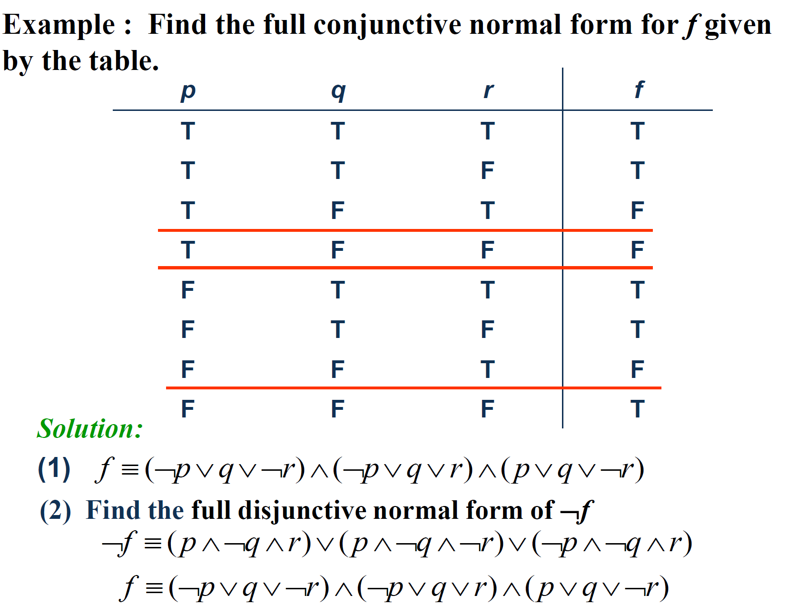
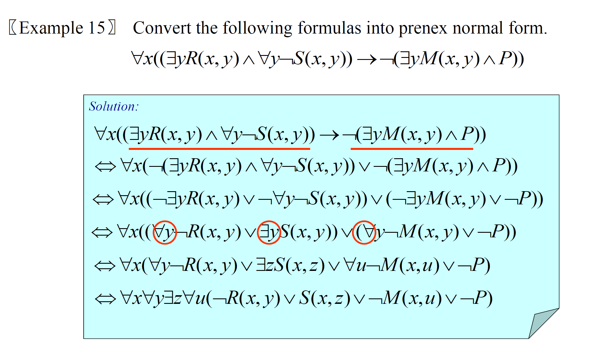

 Chapter 01 Logic and Proofs 逻辑与证明

补充部分

------

# Propositional Normal Forms 命题范式

变量及其否定统称为**文字literal**，如 $p$ 和 $\neg p$

### Disjunctive Normal Form 析取范式 DNF ==析取就是或==

由有限个简单**析取式的合取**子句clauses构成的命题公式称为**析取范式**，形如 $(p\land q)\lor(p\and q)$

### Conjunctive Normal Form 合取范式 CNF

由有限个简单**合取式的析取**子句clauses构成的命题公式称为**合取范式**，形如 $(p \lor q) \land (p \lor q)$

## Identify Normal Forms 判定范式

|              p               | **DNF & CNF** |
| :--------------------------: | :-----------: |
|          **¬p ∨ q**          | **DNF & CNF** |
|       **¬p ∧ q ∧ ¬r**        | **DNF & CNF** |
|      **¬p ∨ (q ∧ ¬r)**       |    **DNF**    |
| **¬p ∧ (q ∨ ¬r) ∧ (¬q ∨ r)** |    **CNF**    |

The trick lies in that in some cases, clauses can be seen **as a whole**, and **as a DNF or CNF**.

## How to Obtain Normal Form 产生范式的方法

1. Faced with **→ & ↔**

   p → q ≡ ¬p ∨ q

   p ↔ q ≡ (p → q) ∧ (q → p)

2. Faced with **¬**

   $$\neg(p_1\wedge p_2\wedge...\wedge p_n)\equiv\neg p_1\vee\neg p_2\vee...\vee\neg p_n$$

   ¬¬p ≡ p

3. 利用交换律、分配律和结合律得到范式

### Minterm and Maxterm 极小项、极大项

A **minterm** is a conjunctive of literals in which each variable is represented **exactly once**.  每个变量都要出现

A **maxterm** is a disjunctive of literals in which each variable is represented **exactly once**.

在含有n个命题变量的简单合取式（简单析取式）中，若每个命题变量和它的否定恰好出现一个且仅出现一次，而且命题变量或它的否定式按下标从小到大或按字典序排列，称这样的简单**合取式**（简单析取式）为**极小项（极大项）**

### Full Disjunctive(Conjunctive) Normal Form 主析取（合取）范式

If a formula is expressed as **a disjunction of minterms**, it is said to be in **full disjunctive normal form**.

If a formula is expressed as **a conjunctive of maxterms**, it is said to be in **full conjunctive normal form**.

> 所有简单合取式（简单析取式）都是极小项（极大项）的析取范式（合取范式）称为主析取范式（主合取范式）
>
> 简单合取的意思是对子句取和
>
> ==主析取范式：最小项之和       和析取范式一样，对子句进行析取==

### 范式与真值表的关系

 #### DNF & Truth Table

#### CNF & Truth Table

## Prenex Normal Form 前束范式

$$Q_1x_1Q_2x_2...Q_nx_nB$$

$$Q_i(i = 1,2,...,n)$$ is ∀ or ∃ 量词

**Any expression can be converted into prenex normal form.**

### How to obtain prenex normal form?

1. 消除有关公式中所有出现的→和↔。
2. 将所有的否定词向内移动，最后，否定词只作为字词的一部分出现。
3. 将变量分开（必要时）进行标准化。
4. 现在可以通过将所有的量词移到公式的前面来获得prenex正常形式。

e.g.

