 Chapter 01 Logic and Proofs 逻辑与证明

Covering 1.6~1.8

------

# Rules of Inference 推理规则

> Proofs in mathematics are ***valid arguments***
>
> An ***argument***（**论证**） is a sequence of statements that end with a conclusion
>
> By ***valid***（**有效性**）, we mean the conclusion must follow from the truth of the preceding statements (premises（**前提**）)

## Valid Arguments in Propositional Logic 命题逻辑的有效论证

An **argument** in propositional logic is a sequence of  propositions. 

All but the final proposition in the argument are called **premises** and the final proposition is called the **conclusion**. 

**An argument** **is** **valid合理的** 如果所以的前提都是对的，那结论就是对的

An **argument form**（**论证形式**） in propositional logic is a sequence of compound propositions involving propositional variables.

**An argument form is valid** 如果无论哪个特定命题在其前提中代替命题变量，如果前提premises都为真，结论为真（如果有一个前提为假，结论也很有可能为假）。

$$p_1\\p_2\\...\\p_n\\-\\\therefore q$$

An argument in propositional logic is valid when **its argument form is valid**.  $p_1 \wedge  p_2 \wedge ... \wedge p_n \to q$是一个永真式

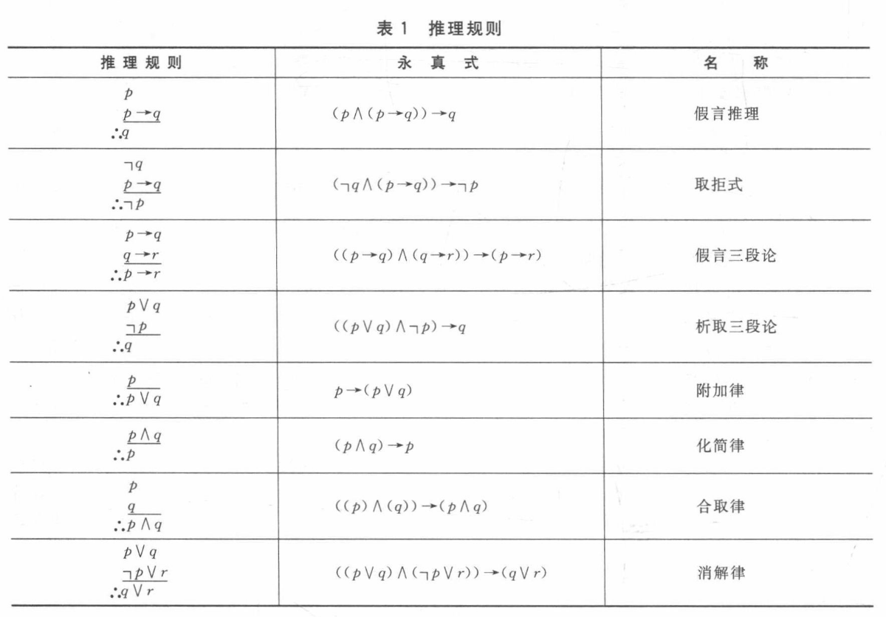

> 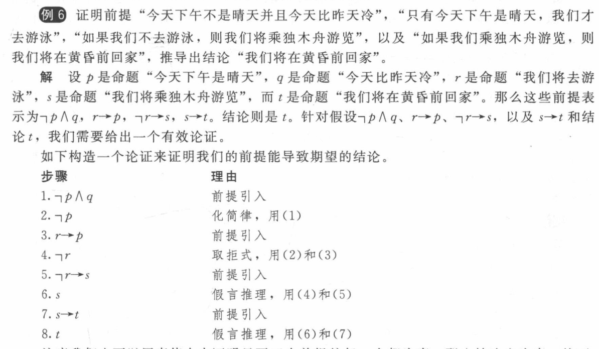

#### Resolvent 消解律

计算机的自动化证明需要依赖消解律

==$$((p\vee q)\wedge (\neg p\vee r))\to(q\vee r)$$==

$$q\vee r$$, is called the **resolvent**（消解式）

令r=F就可以得到析取三段论

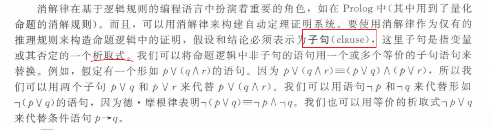

> 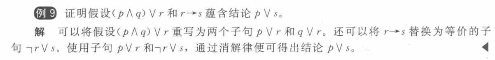

### Rules of Inference for Quantified Statements 量化命题的推理规则

|                      Rule of Inference                       |                             Name                             |
| :----------------------------------------------------------: | :----------------------------------------------------------: |
|           $$\forall xP(x)\\---\\\therefore P(c)$$            | Universal instantiation 全称实例（c是论域中的任意一个特定成员） |
| $$P(c) for\ an\ arbitrary\ c\\----------\\\therefore\forall xP(x)$$ |              Universal generalization 全称引入               |
| $$\exists xP(x)\\------------\\\therefore P(c)\ for\ some\ element\ c$$ |   Existential instantiation 存在实例（不是任意，是有一个）   |
| $$P(c)\ for\ some\ element\ c\\-----------\\\therefore\exists xP(x)$$ |             Existential generalization 存在引入              |

> 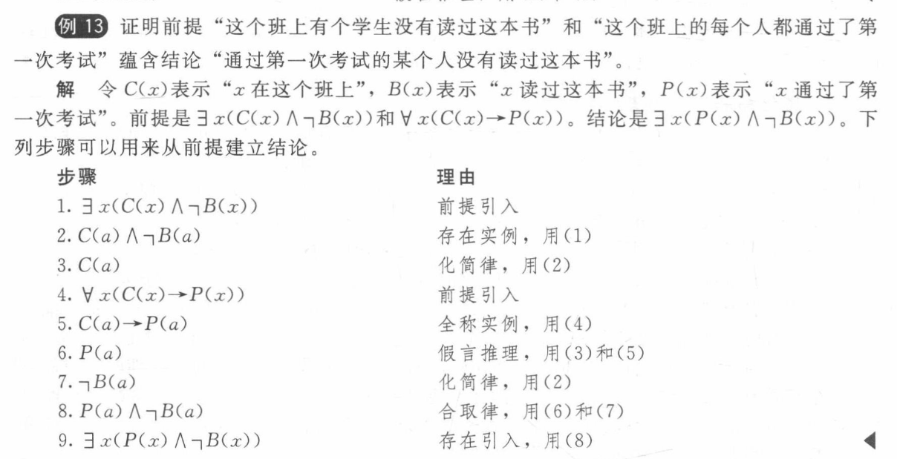

> 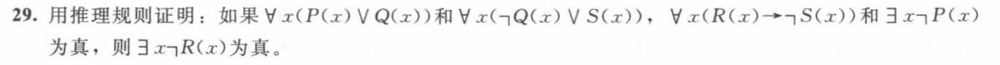
>
> 1. $∃x¬P(x)$   Premise前提
> 2. $¬P(c)$  Existential instantiation from存在实例
> 3. $∀x(P(x) ∨ Q(x)) $ Premise前提
> 4. $P(c) ∨ Q(c)$ Universal instantiation from 任意实例
> 5. $Q(c) $Disjunctive syllogism 析取三段式
> 6. $∀x(¬Q(x) ∨ S(x))$ Premise前提
> 7. $¬Q(c) ∨ S(c)$ Universal instantiation fro任意实例
> 8. $S(c)$  Disjunctive syllogism from 析取三段式
> 9. $∀x(R(x) → ¬S(x))$ Premise前提
> 10. $R(c) → ¬S(c)$ Universal instantiation from任意实例
> 11. $¬R(c)$ Modus tollens from取拒式
> 12. $∃x¬R(x)$   Existential generalization from存在引入

### Combining Rules of Inference for Propositions and Quantified Statements 命题和量化命题的组合使用

#### Universal Modus Ponens 全称假言推理

$$\forall x(P(x)\to Q(x))\\P(a),\ where\ a\ is\ a\ particular\ element\ in\ the\ domain\\------------------------\\\therefore Q(a)$$

#### Universal Modus Tollens 全称取拒式

$$\forall x(P(x)\to Q(x))\\\neg Q(a),\ where\ a\ is\ a\ particular\ element\ in\ the\ domain\\------------------------\\\therefore\neg P(a)$$

**Note**: If the conclusion is given in a form of $$p\to q$$ , we can convert the argument $$p_1\wedge p_2\wedge ...\wedge p_n\to(p\to q)$$ to $$p_1\wedge p_2\wedge...\wedge p_n\wedge p\to q$$ , because they are logically equivalent

>  Combination 组合使用
>
> 
>
> ***Invalid!!!***
>
> For **c** depends on **a**!

## Fallacies 谬误

based on contingencies可满足式 而不是 tautologies永真式.

### Fallacy of denying the hypothesis 否定假设的谬误

$$p\to q\\\neg p\\---\\\therefore\neg q$$

因为命题$((p \to q)\wedge \neg p) \to \neg q$不是永真式

### Fallacy of affirming the conclusion 肯定结论的谬误
$$p\to q\\q\\---\\\therefore p$$

因为命题$((p \to q) \wedge q) \to p$不是永真式

# Introduction to Proofs 证明导论

## Some Terminology 一些专业术语

A **proof**（**证明**） 建立定理真实性的一个有效论证

A **theorem**（**定理**） 或者称为**fact**（事实）或**result**（结论），如果不太重要，则是(**proposition**命题) 形式上能够被证明为真的语句

**Axioms**（公理） (**postulates**假设)           假定为真的东西

A **lemma**（引理） 重要性略低但是有助于证明其他结论的定理

A **corollary**（推论） 从一个已经被证明的定理可以直接建立起来的一个定理

A **conjecture**（猜想）被提出认为是真的命题（当猜想的一个证明被发现的时候，猜想就变成了定理）

> ***A conjecture becomes a theorem once it has been proved to be true***

## Understanding How Theorems Are Stated 理解定理是如何陈述的

Implied Universal Quantifiers 全称量词往往被隐含

“if *x*>*y*, where x and y are positive real numbers, then $$x^2>y^2$$.”

**For all positive real numbers *x* and *y***, if *x*>*y*, then $$x^2>y^2$$.

##### Formal Proofs 形式化证明

非常长且难以理解（但是适合计算机）

##### Informal Proofs 非形式化证明

每个步骤会用到多余一条的推理规则，有些步骤会被省略，不会显式地列出所用到的假设公理合推理规则

##### Mistakes in Proofs 证明中的错误

Many mistakes result from the introduction of steps that do not logically follow from those that precede it.

Many incorrect arguments are based on a fallacy called ***begging the question*** (**circular reasoning**（**循环论证**）)

# Proof Methods 证明方法

#### Direct Proofs 直接证明

#### Proof by Contraposition 反证法

$$
P\to Q\equiv\neg Q\to\neg P
$$

#### Vacuous Proof 空证明

*P* 为假 则 *P* → *Q* is ***vacuously*** 真

F → T and F → F are both true.

> 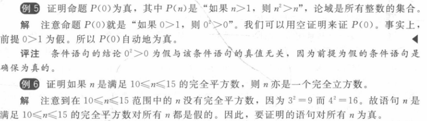

#### Trivial Proof 平凡证明

*Q* 为真, 则 *P* → *Q* is ***trivially*** 真

F → T and T → T are both true.

> 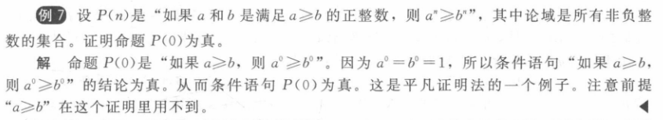

### Proof by Contradiction 归谬证明法

$$\neg p\to(q\wedge\neg q)$$ 为真

直接的说，就是先假设p为假，然后推出两个相矛盾的结论

它与反证法的差别就在于反证法是找到与假设相悖的结论，而归谬证明法是由假设推出两个相悖的结论，即**矛盾的产生处不同**

> 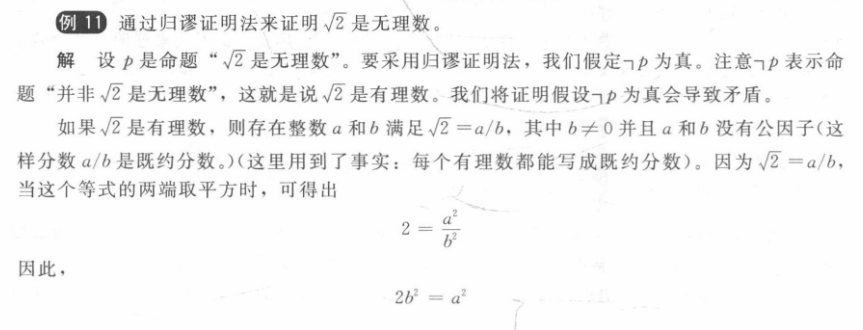
>
> 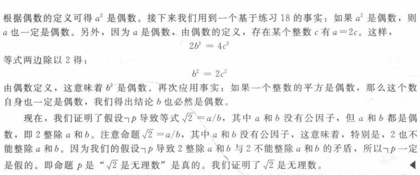

#### Proof  *p* → *q* by Contradiction 运用归谬证明法证明蕴含关系

1. assumes that both *p* and *¬q* are true

2. shows that $$(p\wedge\neg q)\to F$$

#### Proofs of Equivalence by Contradiction 运用归谬证明法的等价iff证明法(当且仅当)

$$p\leftrightarrow q\equiv(p\to q)\wedge(q\to p)$$

$$[p_1\leftrightarrow p_2\leftrightarrow...p_n]\equiv[(p_1\to p_2)\wedge(p_2\to p_3)\wedge...\wedge(p_n\to p_1)]$$==条件语句链==

### Counterexamples 反例证明法

When presented with a statement of the form ∀xP(x), which we believe to be false or which has resisted all proof attempts, we look for a counterexample.

## Proof by Cases 分情形证明法

就是分类讨论
$$
[({{p}_{1}}\vee {{p}_{2}}\vee ...\vee {{p}_{n}})\to q]\underset{{}}{\longleftrightarrow}[({{p}_{1}}\to q)\wedge ({{p}_{2}}\to q)\wedge ...\wedge ({{p}_{n}}\to q)]
$$

### Exhaustive Proof 穷举证明法

分类讨论的特例

#### 不是一般性 without loss of generality (WLOG)

比如x,y交换一样，不妨令x满足~~~~

## Existence Proof 存在性证明

要求证明$\exist xP(x)$

#### Constructive Existence Proof 构造性证明

找到一个这样的x

### Nonconstructive Existence Proof 非构造性证明

常用的是归谬法

> **Example**:
>
> 对所有正数n，都存在一个素数p使得 *p* > *n*
>
> **Proof**:
>
> Let *n* be an arbitrary任意integer, and consider *n*! + 1.  
>
> - If (*n*! + 1) is prime, we are done since (*n*! + 1) > *n*.  
>
> - But what if (*n*! + 1) is composite?
>
>   If (*n*! + 1) is composite then it has a prime factorization:
>   $$
>   p_1×p_2×…×p_k=(n!+1)
>   $$
>   Consider the smallest $$p_1$$, it is still larger than n
>
>   Let *p =* $$p_1$$ , then  *p* > *n*, and we are done.  
>  
>   由于这道题的p没有真正被找出证明说这是一个树，因此这是非构造性的
>

> 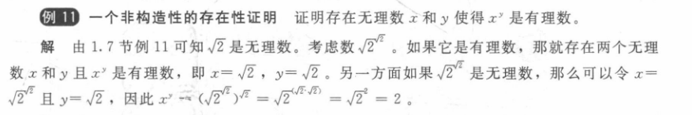

## Uniqueness Proof 唯一性证明

两步骤

- ***Existence***:存在
- ***Uniqueness*** : 唯一（如果x和y都具有相同的性质，那么只能$x=y$）.

> 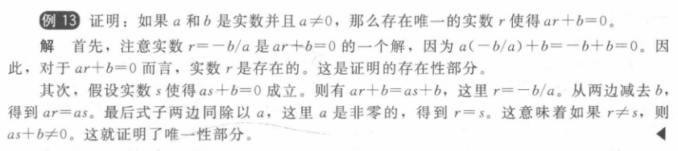

# Proof Strategies 证明策略

## Forward Reasoning 正向推理

使用前提，公理和已知定理来得出结论

> 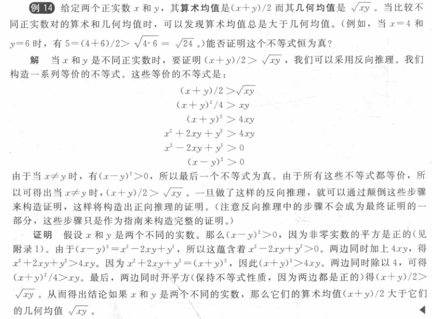

## Backward Reasoning 反向推理

To reason backward to prove a statement *q*, we find a statement *p* that we can prove with the property that *p* → *q*.

> **Example**:
>
> Suppose that two people play a game taking turns removing, 1, 2, or 3 stones at a time from a pile that begins with 15 stones. The person who removes the last stone wins the game. Show that the first player can win the game no matter what the second player does.
>
> **Proof**:
>
> - **Step n**   : Player1 can win if the pile contains 1,2, or 3 stones. 
>
> - **Step n-1**: Player2 will have to leave such a pile if the pile that he/she is faced with has 4 stones. 
>
> - **Step n-2**: Player1  can leave 4 stones when there are 5,6, or 7 stones left at the beginning of his/her turn. 
>
> - **Step n-3**: Player2  must leave  such a pile, if there are  8 stones.
>
> - **Step n-4**: Player1 has to have a pile with 9,10, or 11 stones to ensure that there are 8 left. 
>
> - **Step n-5**: Player2  needs to be faced with  12 stones to be forced to leave 9,10, or 11. 
>
> - **Step n-6**: Player1  can leave  12 stones by removing 3 stones. 
>
>  Now reasoning forward, the first player can ensure a win by removing 3 stones and leaving 12.

# 作业题

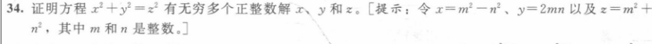

我们令$x = m^2 - n^2$，$y = 2mn$，和$z = m^2 + n^2$。那么$x^2 + y^2 = (m^2 - n^2)^2 + (2mn)^2 = m^4 - 2m^2n^2 + n^4 + 4m^2n^2 = m^4 + 2m^2n^2 + n^4 = (m^2 + n^2)^2 = z ^ 2 $。因此我们找到了无穷多个解，因为$m$和$n$可以任意大。

​	下图在p91，骨牌不说明就是默认的两个格子的(书上的几道例题的答案似乎都是不行)

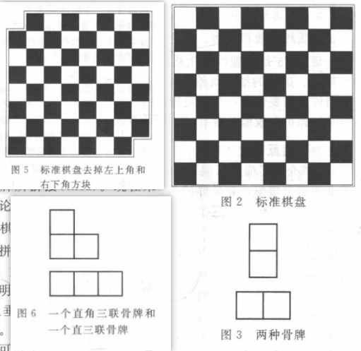