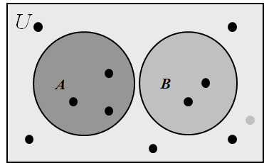

 Chaptcer 02 Basic Structures 基本结构

Covering2.1 ~ 2.2

>集合：布尔代数，尤其是幂集等，函数肯定是要考（2.3）（和第九章有关系，可能通过关系考察）
>
>（无限里面的可数和不可数，可数建立11对应的关系，不可数一样的）
>
>证明方法：对角线法

------

# Set 集合

 **unordered**无序不重复

### Description 描述方法

穷举

> S = {a, b, c, d}

Brace Notation with Ellipses 省略号记法

> S = {1, 2, 3, . . . , 99 }

Set Builder 构造器

> {x | x is an odd positive integer less than 10}
>
> $\mathbb{C}  复数集合$

[]  闭区间

注意不要混淆  空集$\empty$和一个空的单元素集$\{ \empty\}$

### Venn Diagrams 文氏图

- 在维恩图中，通用集*U*用矩形表示。
- 在这个矩形内，圆圈或其他几何图形被用来表示集合。
- 点用于表示集合中的特定元素。

## Property 性质

### The  Relations Between Two Sets 集合间的关系

#### Subset 子集

$$A\subseteq B\Leftrightarrow\forall x\in A\to x\in B$$

> For any set A
>
> - $$\phi\subseteq A$$
>
> - $$A\subseteq A$$ 
>
>   

#### Equal 相等

$$\begin{aligned}&A=B\\\Leftrightarrow&\forall x[(x\in A\to x\in B)\wedge(x\in B\to x\in A)]\\\Leftrightarrow&(A\subseteq B)\wedge(B\subseteq A)\end{aligned}$$

> To show that two sets A and B are equal, show that A ⊆ B and B ⊆ A.

#### Proper subset 真子集

$$\begin{aligned}&A\subset B\\\Leftrightarrow&\forall x(x\in A\to x\in B)\wedge\exists x(x\in B\wedge x\notin A)\\\Leftrightarrow&(A\subseteq B)\wedge(A\ne B)\end{aligned}$$

### The Size of a Set 集合的大小

$n=|S|$   称n为S的基数**cardinality**  为集合中元素的个数

### Power Set 幂集

$\mathcal{P}(S)$     S的所有子集的集合

$|\mathcal{P}|=2^{|S|}$

> $\mathcal{P}(∅) = \{∅\}$
>$\mathcal{P}({∅}) = \{∅, \{∅\}\}$

### Cartesian Products 笛卡尔积

#### Tuple 元组

The **ordered n-tuple**（有序n元组）$ (a_1, a_2, . . . , a_n) $

The Cartesian product of A and B, denoted by A × B, is the set of all ordered pairs (a, b), where a ∈ A and b ∈ B. 

$$A\times B = \{(a, b) | a\in A\wedge b\in B\}$$

$$A_1\times A_2\times· · ·\times A_n = \{(a_1, a_2, . . . , a_n) | a_i\in A_i\ for\ i = 1, 2, . . . , n\}$$

> **Note**:
>
> If |A|=m, |B|=n, then |A×B|=|B×A|=mn
>
> A×B≠B×A
>
> A×∅ = ∅×A = ∅
>
> 
>
> 另外，注意一下$A^2$这种表达是笛卡尔积

笛卡儿积A×B的一个子集$R$被称为从集合A到集合B的关系$(relation)$。R的元素是序偶，其中第一个元素属于A而第二个元素属于B。例如，R={(a，0)，(a，1)，(a，3)，(b,l)，(b，2)，(c，0)，(c，3)}是从集合{a，b，c}到集合{0，1，2，3}的关系，它也是一个从集合{a，b，c，d，e}到集合{0，1，3，4}的关系。(这解释了一个关系不一定要包含A的每个元素x的序偶(x，y)。)从集合A到其自身的一个关系称为是A上的一个关系。

### 带量词

$\exist x \in S(P(x))$是 $\exist X(x\in S \wedge P(x))$ 的简写

> 

### 真值集

对于谓词P和论域D, $P(x)$的真值集为$\{ x \in D|P(x) \}$

## Set Operations 集合运算

### Intersection 交集

$$A\cap B=\{x|x\in A\wedge x\in B\}$$

$$A_1\cap A_2\cap...\cap A_n=\bigcap_{i=1}^{n}A_i$$

### Union 并集

$$A\cup B=\{x|x\in A\vee x\in B\}$$

> $$|A\cup B|=|A|+|B|-|A\cap B|$$

$$A_1\cup A_2\cup...\cup A_n=\bigcup_{i=1}^{n}A_i$$

> 如果$A_i=(i,\infin)$     注意这是一个区间
>
> 则$\bigcup_{i=1}^\infty A_i = (1;\infty)$ （所有大于 1 的实数） $\bigcap_{i=1}^\infty A_i = \emptyset$. 注意 $\infty $ 不是一个实数，所以我们不能写 $\bigcap_{i=1}^\infty Ai={\infty}$.

### Difference 差集

$$A-B=\{x|x\in A\wedge x\notin B\}$$

### Complement 补集

$$\overline{A} = {x\in U | x\notin A}$$

(U is the universal set)

> $$A-B=A\cap\overline{B}$$

### Symmetric Difference 对称差分

$$A\oplus B=(A\cup B)-(A\cap B)$$

> 满足消去律
>
> 设x∈B，则有两种情况：
>
> 1. x∈A，则$x∉A\oplus B$，$x∉A\oplus C$，所以x∈C。
> 2. x∉A，则$x∈A\oplus B$，$x∈A\oplus C$，所以x∈C。
>
> 因此，B⊆C。同理可证，C⊆B
>
> 所以，B=C。

## Set Identities 集合恒等式

|                       Identity 恒等式                        |         Name 名称          |
| :----------------------------------------------------------: | :------------------------: |
|               $$A\cap U = A\\A\cup\empty =A$$                |    Identity laws 恒等率    |
|             $$A\cup U = U\\A\cap\empty=\empty$$              |   Domination laws 支配率   |
|                 $$A\cup A = A\\A\cap A = A$$                 |   Idempotent laws 幂等律   |
|                $$\overline{\overline{A}}=A$$                 |  Complementation law 补率  |
|           $$A\cup B = B\cup A\\A\cap B = B\cap A$$           |  Commutative laws 交换律   |
| $$A\cup (B\cup C) = (A\cup B)\cup C\\A\cap (B\cap C) = (A\cap B)\cap C$$ |  Associative laws 结合律   |
| $$A\cup (B\cap C) = (A\cup B)\cap(A\cup C)\\A\cap (B\cup C) = (A\cap B)\cup(A\cap C)$$ |  Distributive laws 分配律  |
| $$\overline{A\cap B} = \overline{A} ∪ \overline{B}\\\overline{A\cup B} = \overline{A}\cap \overline{B}$$ | De Morgan’s laws 德·摩根率 |
|         $$A\cup (A\cap B) = A\\A\cap (A\cup B) = A$$         |   Absorption laws 吸收率   |
|    $$A\cup \overline{A} = U\\A\cap\overline{A} = \empty$$    |   Complement laws 互补率   |

### Ways to Prove Set Identities 集合恒等式的证明方法

#### I. 证明 A ⊆ B 并且 B ⊆ A

> 证明$(B-A)\cup (C-A)=(B\cup C)-A$
>
> 为了建立等式，我们需要证明两个方向的包含关系. 为了证明 $(B-A)\cup (C-A)\subseteq (B\cup C)-A$, 假设 $x\in (B-A)\cup (C-A)$. 那么要么 $x\in (B-A)$ 要么 $ x\in (C-A)$. 不失一般性地, 假设前者成立(后者情况下的证明完全相同.) 那么有 $ x\in B $且有$ x\notin A$. 从第一个断言中, 我们可以推出有 $x\in B\cup C$. 因此我们可以得出结论有 $x\in(B\cup C)-A$, 正如所愿. 反过来, 即要显示 $(B\cup C)-A\subseteq(B-A)\cup(C-A)$ , 假设 $x\in(B\cup C)-A$. 这意味着有 $x\ in(B\Cup C)$ 且有$x \notin A$. 第一个断言告诉我们要么 x in B 要么 $x \in C$. 因此要么$x \in B-A$ 要么 $x \in C-A$. 无论哪种情况, 都有$ x \in(B-A)\cup(C-A)$. 

#### II. 用定义

非常麻烦

#### III. 使用成员表（类似真值表）

#### IV. 直接计算

Like ≡

## Computer Representation of Set 集合的计算机表示

1. 用一串有序数来表示，并且用0和1表示是否在集合中
2. Union -> bitwise OR
3. Intersection -> bitwise AND

> **Example**:
>
> Let *U* ={1, 2, 3, 4, 5,6,7,8,9}, *A*={1, 2, 3, 4, 5}, *B*= (1, 3, 5, 7, 9). 
>
> The bit string for the set *A*: 11 1110 000
>
> The bit string for the set *B*: 10 1010 101

## 多重集

元素钱

前的数字表述重复数（mulitiplicity）——重复出现的次数

Р和Q的**并**是多重集，其中元素的重复数是它在Р和Q中重复数的最大值

P和Q的**交**是多重集，其中元素的重复数是它在Р和Q中重复数的最小值

P和Q的**差**是多重集，其中元素的重复数是它在Р中的重复数减去在Q中的重复数，如果差为负数，重复数就为0

P和Q的**和**是多重集，其中元素的重复数是它在Р和Q中的重复数之和

P和Q的并、交、差分别记作PUQ、P∩Q和P一Q(不要将这些运算与集合中类似的运算相混淆)。P和Q的和记作P＋Q

