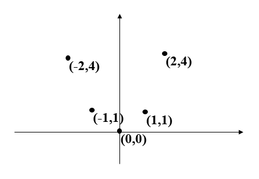
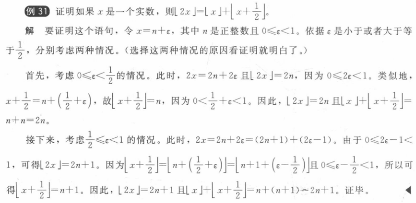

 Chaptcer 02 Basic Structures 基本结构

Covering 2.3~2.4

------

# Functions 函数

## Definitions 定义

两个非空集合之间的对应关系

If f is a function from A to B, we write f : A → B.

> A → B is a subset of A × B

> If f is a function from A to B, we say that f **maps**（**映射**） A to B.

$$f:A\to B$$

$$\forall a(a\in A\to\exists!b(b\in B\wedge f(a)=b))$$    !的意思是唯一

- A : **domain**（**定义域**）

- B : **codomain**（**陪域**）

- b : **image**（**像**）
- a : **preimage**（**原像**）
- **range**（**值域**）

> **Two Notations**:
>
> $$(f_1+f_2)(x)=f_1(x)+f_2(x)$$
>
> $$(f_1f_2)(x)=f_1(x)f_2(x)$$

$ f: A \to B$   $S$是$A$的一个子集

$$f(S)=\{f(s)|s\in S\}={t|\exist s \in S(t=f(s))}$$

> $$f(S\cup T)=f(S)\cup f(T)$$
>
> $$f(S\cap T)\subseteq f(S)\cap f(T)$$          注意这里是**等于**
>
> **Explaination**:
>
> For the first equivalent, just prove $$f(S+T)\subseteq f(S)+f(T)$$ and $$f(S)+f(T)\subseteq f(S+T)$$ using the method proof by cases
>
> For the second one, itself is easy to prove, but the interesting part is how to give a counterexample to prove that $$f(S)\cap f(T)\subseteq f(S\cap T)$$ is wrong.
>
> 这个反例是，当f()不是一对一的(这将在下面提到)，后一个可以比前一个更大!

The **graph**（图） of the function f is the set of ordered pairs

$$\{(a,b)|a∈A\wedge f(a)=b\}$$

### monotonic（单调）

A **monotonic**（**单调**） function f is either **monotonically (strictly) increasing** ($$\forall x\forall y(x<y\to f(x)<f(y))$$) or **monotonically (strictly) decreasing** (($$\forall x\forall y(x<y\to f(x)>f(y))$$))

## Correspondences 对应关系

### One-to-One Function 一对一

像$B$中的每一个值都只被射一次，但是不要求$B$被用光，（有个隐藏的前提就是$|B|>|A|$,否则不够射）

A function f is **one-to-one**（**一对一**） (denoted 1-1), or **injective**（**单射函数**）if

$$\forall a\forall b(f(a)=f(b)\to a=b)$$

> $f:A→B。$
> 要证明$f$是单射的:证明对于任意$x,y∈A$,如果$f(x)=f(y)$，则$x=y$
>
> 要证明$f$不是单射的:找到特定的$x，y∈A$，使得$x≠y$且$f(x)=f(y)$。

> Suppose$|A|=6$ and $| B|= 12$ The number of one-to-one functions  $ f : A→B $
>
> - For $|A|=6 $and $| B|= 12$, we just need to choose 6 elements in $B$ to match $A$,so there are $P(12,6)$ one-to-one functions.
>
> If$|A|= 12$ and $| B|=6$, then the number of one-to-one functions $f :A→B$
>
> - For $|A|= 12$ and $| B|=6$, there are not enough elements in B to be matched toA, so there are **0** one-to-one functions.

### Onto Functions ==映上函数==

像$B$被用完了

A function f from A to B is called **onto**（**映上**）, or **surjective**（**满射**） if

$$\forall b\in B\exists a\in A(f(a)=b)$$

> 要证明$f$是满射的:考虑任意元素$y∈B$,并找到一个元素$x∈A$使得$f(x)=y$
>
> 要证明$f$不是满射的:找到一个特定的$y∈B$,使得对于任意$x∈A$有$f(x)≠y$

### One-to-one Correspondence Functions 一一对应

单射+满射  = or a **bijection**（**双射**）

假定f是从集合A到自身的函数。如果A是有限的，那么f是一对一的当且仅当它是映上的。(可由练习74的结论推出。)当A为无限的时，这一结论不一定成立(将在⒉.5节中予以证明)

### Inverse Functions 反函数

对于一一映射的函数（**充要条件**）有反函数 $$f^{-1}$$

$$f^{-1}(y)=x$$ iff $$f(x)=y$$

> 注意$1/f$表示一个函数$\frac{1}{f(x)}$
>
> $(f^{-1})^{-1}=f$
>
> 不满足交换律 $f \circ f^{-1} \neq f^{-1} \circ f$ 这两个函数方向不一样

> 如果f是从Y到Z的可逆函数，g是从X到Y的可逆函数，那么复合函数f · g 的反函数可以表示为$ (f \circ g)^{-1} = g^{-1} \circ f^{-1}$
>
> 设 $x \in X$，则 $(f \circ g)^{-1}(f(g(x))) = x$。由于 $f$ 和 $g$ 都是可逆函数，所以 $g^{-1}(f^{-1}(f(g(x)))) = x$。根据复合函数的定义，我们可以将其写成 $(g^{-1} \circ f^{-1})(f(g(x))) = x$。由于这个等式对于所有 $x \in X$ 都成立，所以 $(f \circ g)^{-1} = g^{-1} \circ f^{-1}$。

### **Compositions of Functions** 复合函数

$$f\circ g(a)=f(g(a))$$

> $g$的值域要位于$f$的定义域内

## Two Important Functions 两大重要函数

### floor function 取底函数

向下取整

$$\lfloor x\rfloor$$  （也被称为greatest integer function $[x]$）

### ceiling function 取顶函数

$$\lceil x\rceil$$

$$\lfloor -x\rfloor = -\lceil x\rceil$$     $$\lceil -x\rceil  =\lfloor -x\rfloor $$

> 

# Sequence 序列

A **sequence** is a function from a subset of the set of intergers (usually either the set {0,1,2,…} or the set {1,2,3,…}) to a set S. We use the notation **$$a_n$$** to denote the image of the image of the integer **n**. We call $$a_n$$ a term of the sequence $$\{a_n\}$$.

> **The order in a sequence matters!**

## Some Sequences 数列

### Geometric Progression 几何级数

$$a,ar,ar^2,ar^3,...,ar^n,...$$

### Arithmetic Progression 算术级数

$$a,a+d,a+2d,...,a+nd,...$$

## Summations 求和

$$
\begin{equation*}
\sum_{i=m}^na_i=\sum\nolimits_{i=m}^na_i=\sum\nolimits_{m≤i≤n}a_i=a_m+a_{m+1}+...+a_n
\end{equation*}
$$

$$
\sum_{s∈S}f(s)
$$

### Some Useful Summation Formulae 求和公式

$$
\sum_{k=1}^nk^2=\frac{n(n+1)(2n+1)}{6}
$$

$$
\sum_{k=1}^nk^3=\frac{n^2(n+1)^2}{4}
$$

$$
\sum_{k=0}^{\infin}x^{k}=\frac{1}{1-x},|x|<1 \\
\sum_{k=1}^{\infin}kx^{k-1}=\frac{1}{(1-x)^2},|x|<1
$$

> 一个数列，其中每个整数 $k$ 出现的次数为 $k$ 次。例如，1 只出现了 1 次，2 出现了 2 次，3 出现了 3 次，以此类推。数列的前几项为：
>
> 1,2,2,3,3,3,4,4,4,4,5,5,5,5,5,6,6,6,6,6,6,…1,2,2,3,3,3,4,4,4,4,5,5,5,5,5,6,6,6,6,6,6,…
>
> 证明$a_n = \lfloor \sqrt{2n } + \frac{1}{2} \rfloor$
>
> 我们可以将数列分成若干个“段”，每个段包含若干个相等的数。第 $k$ 个段包含 $k$ 个数，它们的值都是 $k$。例如，前三个段分别为 1，2，2；3，3，3；4，4，4，4。
>
> 容易发现，数列中前 $1+2+\cdots+k=\frac{k(k+1)}{2}$ 个数属于前 $k$ 个段，且第 $k$ 个段中最大的数为 $k$。因此，当 $\frac{k(k-1)}{2}<n\leq \frac{k(k+1)}{2}$ 时，第 $n$ 个数就是第 $k+1$ 个段中的数，即第 $n-\frac{k(k-1)}{2}$ 个 $k+1$。
>
> 接下来，我们需要确定 $k$ 的值。根据上述的分段方式，可以得到：
> $$
> \begin{aligned} \frac{k(k-1)}{2}< n \leq \frac{k(k+1)}{2} \\ k^2-k < 2n \leq k^2+k \\ k^2 < 2n+k \leq k^2+2k+1 \\ k < \sqrt{2n}+\frac{1}{2} \leq k+1 \end{aligned}
> $$
> 因此，当 $\lfloor \sqrt{2n}+\frac{1}{2} \rfloor=k$ 时，第 $n$ 个数就是第 $k+1$ 个段中的数，即第 $n-\frac{k(k-1)}{2}$ 个 $k+1$。即 $a_n=k+1$。
>
> 因此，可以得到 $a_n=\lfloor \sqrt{2n}+\frac{1}{2} \rfloor$

