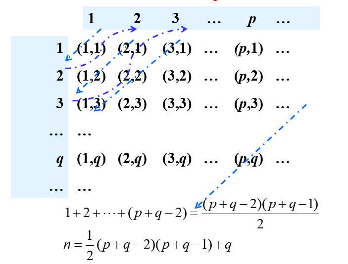
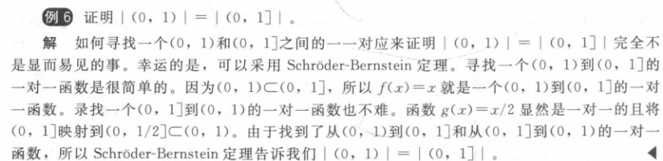

 Chaptcer 02 Basic Structures 基本结构

Covering 2.5

------

# Cardinality of Sets 集合的基数

## Relation between Sets and Mapping 集合与映射的关系

$A$和$B$的基数相等 $| A | = | B |$, 当且仅当**there exists a bijection双射 from A to B**.

对于无限集，$|A|$和$|B|$同样可以比大小

## Countable Sets 可数集

有限集或者与**自然数集$|Z^+|$**有相同的基数则 called **countable**（**可数的**）

对于无限集，如果可数，则$$|S|=\aleph_0$$ (**aleph null**（**“阿里夫零”**）)

### Show that a set is countable 可数性证明

> **Key**: ***Find a bijection!***

#### Method 1. Linear Mapping 简单的线性映射

##### e.g.1 The set E of even positive integers 偶数集

Let f(x) = 2x. Then,  f is a bijection from $$Z^+$$ to $$E$$

| **x**    | **1** | **2** | **3** | **4** | **……** |
| -------- | ----- | ----- | ----- | ----- | ------ |
| **f(x)** | **2** | **4** | **6** | **8** | **……** |

> The numbers of positive even integers is the same as positive integers
>
> E is a proper subset of $$Z^+$$, but $$|E|=|Z^+|$$

##### e.g.2 The set of integers Z 整数集

$$Z=\{0,1,-1,2,-2,...\}$$

$$f(n)=
\begin{cases}
-(n-1)/2& \text{n is odd}\\
n/2& \text{n is even}\\
\end{cases}$$

#### Method 2. Cantor Table 利用Cantor表构造映射

##### e.g.3 The set of positive rational numbers $Q^+$ 有理数集(下面的证明是正有理数。负有理数也是可数的)

$$\forall x\in Q^+,x=p/q,\ p,q\in Z^+$$

Let $$S=\{(p,q)|p,q\in Z^+\}=Z^+\times Z^+$$

###### Step 1 Prove $|Q^+|\leq|S|$

$$r=\frac{p}{q}\in Q^+$$

$$\frac{p}{q}\to(p,q)$$ is injective

Hence, $$|Q^+|\leq|S|$$

###### Step 2 Prove $|S|=|Z^+|$

Cantor Table($(p,q)$表示$\frac{p}{q}$)

|       | **1** | **2** | **3** | **…** | **p** | **…** |
| :---: | :---: | :---: | :---: | :---: | :---: | :---: |
| **1** | (1,1) | (2,1) | (3,1) |   …   | (p,1) |   …   |
| **2** | (1,2) | (2,2) | (3,2) |   …   | (p,2) |   …   |
| **3** | (1,3) | (2,3) | (3,3) |   …   | (p,3) |   …   |
| **…** |   …   |   …   |   …   |   …   |   …   |   …   |
| **q** | (1,q) | (2,q) | (3,q) |   …   | (p,q) |   …   |
| **…** |   …   |   …   |   …   |   …   |   …   |   …   |

for any pair (p,q), $$n=1+2+3+...+(p+q-2)+q=\frac{(p+q-2)(p+q-1)}{2}+q$$

这个映射是可逆的，这意味着我们发现了一个**双射**

> 一个无限集合是可数的，只要它能把这个集合的所有元素列成一个序列

###### Step 3 Prove $|Z^+|\leq|Q^+|$

$$\because Z^+\subseteq Q^+$$

$$\therefore|Z^+|\leq|Q^+|$$

All in all, $$|Q^+|=|S|=|Z^+|$$

##### (补充）e.g.4 Show that the set of the real numbers with decimal representations consisting of all 1s is countable

We can arrange the numbers in a 2-dimensional table as follows:

|       |       **1**       | **2**  |  **3**   |   **4**   |   **5**   | **…** |
| :---: | :---------------: | :----: | :------: | :-------: | :-------: | :---: |
| **1** |   $$.\overline1$$   |  $$.1$$  |  $$.11$$   |  $$.111$$   |  $$.1111$$  |   …   |
| **2** |  $$1.\overline1$$   |  $$1$$   |  $$1.1$$   |  $$1.11$$   |  $$1.111$$  |   …   |
| **3** |  $$11.\overline1$$  |  $$11$$  |  $$11.1$$  |  $$11.11$$  | $$11.111$$  |   …   |
| **4** | $$111.\overline1$$  | $$111$$  | $$111.1$$  | $$111.11$$  | $$111.111$$ |   …   |
| **5** | $$1111.\overline1$$ | $$1111$$ | $$1111.1$$ | $$1111.11$$ | $$1111.111$$ |   …   |
| **…** |         …         |   …    |    …     |     …     |     …     |       |

排列后医用同上一样的康托尔表Then number these numbers as before, like 1 to $$.\overline1$$, 2 to $$.1$$, 3 to $$1.\overline1$$, 4 to $$.11$$, 5 to $$1$$……

Thus, we found a bijection!

#### Method 3. Define an order for strings 字符串的重载

##### e.g.5 证明有限字母表A上的有限字符串集S是可数无限的。

假设A中符号的字母顺序。证明字符串可以按顺序列出。首先列出

1. 按字母顺序排列的长度为0的所有字符串。（由于有限，可以编码1~26)
2. 然后按字典顺序排列长度为1的所有字符串。 （由于有限，可以编码1~x)
3. 然后按字典顺序排列长度为2的所有字符串。  （由于有限，可以编码x+1~...)
4. 依此类推。

这意味着从$N$到$S$的双射，因此它是一个可数无限集

> 但是，只含字母a,b的无限长字符串**不可数** 0.ababba... 这样的

##### e.g.6所有Java程序的集合是可数的

用编程语言编写的计算机程序可以看作是一串来自有限字母的符号

因此，利用上一个例子的结论，我们知道这个说法是正确的。

### The properties of the countable sets 可数集性质

1. 没有无限集的基数比可数集的基数小

2. ==两个可数集合的并集是可数的==

   > **Proof**:
   >
   > Suppose that A and B are both countable sets. Without loss of generality, we can assume that A and B are disjoint.
   >
   > - (i):注意当$A$和$B$均为有限的时，$A \cup B$也是有限的，因此是可数的。
   > - 情形(ii):因为$A$是可数无限的，所以它的元素就可以排列成一个无限序列$a_1,a_2,a_3,…，a_n，…$同时因为$B$是有限的，所以其元素可以排列成$b_1，b_2，b_3，…，b_m$，$m$是某个正整数。我们可以把$A \cup B$的元素排列成$b_1，b_2，b_3，…，b_m，a_1，a_2，a_3，…，a_n，…$。这意味着$A \cup B$是可数无限的。
   > - 情形(iii):因为$A$和$B$均为可数无限的，可以分别把它们的元素排列成$a_1,a_2,a_3,…,a_n,…$和$b_1,b_2,b_3,…,b_n,…$。通过交替这两个序列的项，我们就可以把$A \cup B$的元素排列成无限序列$a_1,b_1,a_2,b_2,a_3,b_3,…,a_n,b_n,…$。这意味着 $A \cup B $是可数无限的。
   >

3. 有限个可数集的并集是可数的

   > 假设$A_1，A_2，A_3，…$是可数集合。因为 $A_i$是可数的，我们可以把它的元素列成一个序列 ==$a_{i1}, a_{i2}, a_{i3},…$==。集合 $\bigcup\nolimits_{i=1}^{n}{{{A}_{i}}}$的元素可以通过列出所有满足$i + j = 2$的项$a_{ij}$，然后列出所有满足$i + j = 3$的项$a_{ij}$，然后列出所有满足$i + j = 4$的项$a_{ij}$，依此类推

4. 可数个可数集合的并集是可数的

## Uncountable Sets 不可数集

> We mainly talks about how to prove a set is uncountable

### Examples of Proof 证明举例

#### Method 1. Cantor Diagonalization Argument==康托尔对角线法==

##### e.g.1 The set of real numbers between 0 and 1 is uncountable

$$A=\{x|x\in(0,1)\wedge x\in R\}$$

###### Step 1 Prove ==$|Z^+|\leq|A|$==

$$B=\{\frac{1}{n+1}|n\in Z^+\}$$

$$\because|B|=|Z^+|$$

and $$B\in A$$

$$\therefore|Z^+|\leq|A|$$

###### Step 2 Prove ==$|Z^+|\ne|A|$==

Assume A is countable, then let $$A=\{r_1,r_2,r_3,...,r_n,...\}$$

Represent each real number in the list using its **decimal expansion**（**十进制表示**）

> List:
>
> - $$r_1=0.d_{11}d_{12}d_{13}d_{14}d_{15}d_{16}...$$
> - $$r_2=0.d_{21}d_{22}d_{23}d_{24}d_{25}d_{26}...$$
> - $$r_3=0.d_{31}d_{32}d_{33}d_{34}d_{35}d_{36}...$$
>
> - …

**Now construct a new number x**

$$x=0.x_{1}x_{2}x_{3}x_{4}x_{5}x_{6}x_{7}...$$

$$x_i=
\begin{cases}
4& d_{ii}\ne4\\
5& d_{ii}=4\\
\end{cases}$$

(例如，假定$r =0.237 94102…$，$r =0.44590138…$，$r=0.091 18764…$，$r =0.805 539 00…$,等等。于是，就有$r=0.d_1d_2d_3d_4…=0.4544…$，其中因为$d_1≠4$，所以$d_1=4$，因为$d_2≠4$，所以$d_2=5;$因为$d_s≠4$，所以$d_3=4;$因为$d_4≠4$，所以$d_4=4;$等等。)每个实数都有唯一的十进制展开式(排除结尾全部由数字9组成的展开式的可能性)。所以，实数$r$不等于$r_1,r_2,…$中的任何一个，因为对每个$i$来说，$r$的十进制展开式与$r_i$的十进制展开式在小数点右边第$i$位是不同的。

**则这个新构造出来的数**(“对角线法”将对角线上的元素$$d_{ii}$$​换掉)**没有包含在上述列表中**

所以无论我们构造什么数列，总有至少一个新数字没有被包含进去!

因此，不可能存在这样的列表，因此区间(0,1)是不可数的

##### （补充）e.g.2 Show that the set of the real numbers with decimal representations consisting of all 1s or 9s is uncountable

Denote the set as A, assume A is countable, then let $$A=\{r_1,r_2,r_3,...,r_n,...\}$$

Represent each real number in the list using its **decimal expansion**（**十进制表示**）

> List:
>
> - $$r_1=0.d_{11}d_{12}d_{13}d_{14}d_{15}d_{16}...$$
> - $$r_2=0.d_{21}d_{22}d_{23}d_{24}d_{25}d_{26}...$$
> - $$r_3=0.d_{31}d_{32}d_{33}d_{34}d_{35}d_{36}...$$
>
> - …

**Now construct a new number x**

$$x=0.x_{1}x_{2}x_{3}x_{4}x_{5}x_{6}x_{7}...$$

$$x_i=
\begin{cases}
1& d_{ii}=9\\
9& d_{ii}=1\or d_{ii}=0\\
\end{cases}$$

Then x is not equal to any number in the list

So whatever sequence we construct, there is always at least a new number that is not included!

Hence, no such list can exist and hence A is uncountable

> 这题与可数集的例题4很像，但是一个可数一个不可数，本质原因在于例题4中的基数为$$\aleph_0$$，而这里增加了一个9后，基数变为了$$2^{\aleph_0}$$，而这个数是不可数的，后面会给它一个记号$c$或者$$\aleph_1$$

#### Method 2. Find a bijection to an uncountable set 找出到已知不可数集的双射

##### e.g.3 证明有理数集合$\R$不可数The set of real numbers has the same cardinality as the set (0,1)

 $$f(x)=tan(x)$$

f(x) is a bijection from $$(-\frac{\pi}{2},\frac{\pi}{2})$$ to R

$$∵|(-\frac{\pi}{2},\frac{\pi}{2})|=|(0,1)|$$

$$∴|R|=|(0,1)|=c$$

> $$c=2^{\aleph_0}$$

#### Method 3. Schroder-Bernstein  施罗德-伯恩斯坦  定理：

如果$A$和$B$是集合且$|A|≤|B|$和$|B|≤|A|$，则$|A|=|B|$。换言之，如果存在一对一函数$f$从$A$到$B$和$g$从$B$到$A$，则存在$A$和$B$之间的一一对应函数。

> 

### [Summary 小总结] How to Prove $|A|\leq|B|$

通过以上几道例题可以发现，$$|A|\leq|B|$$的证明经常被用到，这里总结证明此式子的三大方法

#### Method 1. Find an injective 找到一个单射

> in e.g.1 Step1
>
> Prove $$|Z^+|\leq|A|$$

#### Method 2. Prove $A\subseteq B$

> in e.g.3
>
> $$A=[0,1]=\{x|x\in R,0\leq x\leq 1\}$$
>
> $$B=(0,1)=\{x|x\in R,0<x<1\}$$
>
> $$B\subseteq A\Rightarrow|B|\leq|A|$$

#### Method 3. Prove $|A|=|C|,C\subseteq B$ 在B中找到与A基数相同的子集

> in e.g.3
>
> $$|A|=[\frac{1}{4}, \frac{3}{4}]$$ and $$[\frac{1}{4}, \frac{3}{4}]\subset (0,1)$$
>
> Thus $$|A|\leq|B|$$

## Applications 理论应用

### Computability 可计算性

函数称为是**可计算的(computable)**，如果存在某种编程语言写的计算机程序能计算该函数的值

为了证明存在不可计算的函数，我们需要证明两个结果。

首先，我们需要证明任何特定编程语言中所有计算机程序的集合是可数的。(已经证明过)

接下来，我们证明从某个可数无限集合到其自身有不可数多个不同的函数。

**所以现在，只有可数数量的计算机程序。因此，只有可数数量的可计算函数。然而，有不可数数量的函数，所以并非所有函数都是可计算的。**

### The Continuum Hypothesis 连续统假设(还没有人证明)

 $$\aleph_0=|Z^+|<|\mathcal{P}(Z^+)|=|R|=2^{\aleph_0}=\aleph_1$$

即不存在介于$\aleph_0$和$\aleph_1$之间的基数$X$

#### 1. （补充）Show that $|\mathcal{P}(Z^+)|=|R|$

- First, for any $$S\in P(Z^+)$$, there is a real number r in (0,1) whose **decimal** expansion is

  $$r=0.d_1d_2d_3...$$

  $$d_i=
  \begin{cases}
  6& i\in S\\
  7& i \notin S\\
  \end{cases}$$

  用康托尔对角线法建立一对一映射 $$P(Z^+)$$ to (0, 1)

- Second, for any r in (0,1), it has a **binary** expansion $$r=0.d_1d_2d_3...$$ 

  Then there is a set $$\{i|d_i=1\}$$

  建立了一个一对一映射 (0, 1) to $$P(Z^+)$$

  > **P.S.**
  >
  > In order that our function from (0, 1) to $$P(Z^+)$$ to be well-defined, we must choose which of two equivalent expressions to represent numbers thath ave terminating binary expansions to use (for example, $$0.10010\overline1$$ versus $$0.10011\overline0$$); we can decide to always use the terminating form, the one ending in all 0’s.)

- By the Schrőder-Bernstein theorem we have $$|P(Z^+)|=|(0,1)|=|R|=c$$
- Hence, $$c=2^{\aleph_0}$$

#### 2. (补充）Show that $|Z^+|<|\mathcal{P}(Z^+)|$

> **Cantor’s theorem**
>
> The cardinality of the power set of an arbitrary set has a greater cardinality than the original arbitrary set
>
> > **Proof**:
> >
> > ***Step 1***
> >
> > >  We convert this problem into showing that ***there does not exist an onto function f from S to P(S)***
> >
> > Suppose that f is a function from S to P(S). We must show that f is not onto.
> >
> > Let $$T=\{s\in S|s\notin f(s)\}$$. Although T is in the codomian of f, which is P(S), we will show that T is not in the range of f.
> >
> > If it were, then we would have f(t) = T for some $$t\in S$$
> >
> > 1. Suppose that $$t\in T$$, then according to the definition of T, $$t\notin f(t)$$, thus, $$t\notin T$$, which is a contradiction
> > 2. Suppose that $$t\notin T$$, then $$t\notin f(t)$$, then t follows the definition of T, so $$t\in T$$, which is again a contradiction
> >
> > Hence, f is not onto. 
> >
> > In other words, ***there does not exist an onto function f from S to P(S)***
> >
> > ***Step 2***
> >
> > The function sending x to {x} for each $$x\in S$$ is a one-to-one function from S to P(S), hence $$|S|\leq|P(S)|$$
> >
> > ***Step 3***
> >
> > Since there is no onto from S to P(S), then there is no one-to-one correspondence, which implies that $$|S|\neq|P(S)|$$
> >
> > ***All in All***
> >
> > $$|S|<|P(S)|$$

Hence, by the Cantor’s theorem, $$|Z^+|<|P(Z^+)|$$, which can be expressed as $$\aleph_0<2^{\aleph_0}=c$$

> 通过证明多项式函数$f∶Z^+×Z^+ →Z^+$，$f(m，n)=(m+n-2)(m+n-1)/2＋m$是一对一和映上的来证明$Z^+ ×Z^+$是可数集
>
> 
>
> 对于任意的正整数$n$，假设$n$可以表示为$n = (m+n-2)(m+n-1)/2 + k$，其中$1≤k≤m$，那么我们定义$f(n) = (m, k)$。
>
> 为了证明$f$是一一映上的，我们需要证明以下两个性质：
>
> 1. $f$是一对一的。
>
> 假设$f(n_1) = (m_1, k_1)$和$f(n_2) = (m_2, k_2)$，其中$n_1 \neq n_2$。因此，我们需要证明$(m_1, k_1) \neq (m_2, k_2)$。
>
> 首先，注意到$(m+n-2)(m+n-1)/2$是一个关于$m$和$n$的**严格单调递增**的函数。因此，如果$n_1 < n_2$，那么$(m_1+n_1-2)(m_1+n_1-1)/2 < (m_2+n_2-2)(m_2+n_2-1)/2$，这意味着$m_1 < m_2$。但是，这意味着$k_1 = n_1 - (m_1+n_1-2)(m_1+n_1-1)/2 > n_2 - (m_2+n_2-2)(m_2+n_2-1)/2 = k_2$，因此$(m_1, k_1) \neq (m_2, k_2)$。
>
> 如果$n_1 > n_2$，同样可以得到$(m_1, k_1) \neq (m_2, k_2)$。因此，$f$是一对一的。
>
> 1. $f$是映上的（满射）。
>
> 对于任意的$(m, k) \in Z^+ ×Z^+$，我们需要找到一个正整数$n$，使得$f(n) = (m, k)$。
>
> 假设$n = (m+k-2)(m+k-1)/2 + k$，那么根据我们的定义，$f(n) = (m, k)$。因此，$f$是映上的。
>
> 综上所述，我们已经证明了$f$是一个一一映上函数，从$Z^+$到$Z^+ ×Z^+$。因此，$Z^+ ×Z^+$是可数的。

> 证明从正整数到集合$\{0，1，2，3，.4，5，6，7，8，9\}$的函数集合是不可数的。[提示:首先在0到1之间实数集与这些函数的子集之间建立—一对应。为此，让实数$0. d_1, d_2…d_n...$对应到函数$f$以使$f(n)=d_n$]
>
> 0和1之间的实数集是不可数的。让我们将每个在这个范围内的实数（包括0但不包括1）与一个从正整数集到集合$\{ 0,1,2,3,4,5,6,7,8,9\}$的函数相关联，如下：如果$x$是一个实数，它的小数表示为$0.d_1d_2d_3...$(用禁止小数以无限个9结尾的方式解决歧义)，**那么我们将$x$与函数$f$相关联，它的规则是$f(n) = d_n$**。显然，这是一个从0和1之间的实数集到所有从正整数集到集合的函数子集的$\{ 0,1,2,3,4,5,6,7,8,9\}$一一对应函数。两个不同的实数必须有不同的小数表示，所以相应的函数也是不同的。（有少数函数被排除了，因为禁止了像$0.239999...$这样的表示。）由于0和1之间的实数集是不可数的，所以我们与它们相关联 的函数子集也必须是不可数的。但所有这样的函数集合至少有这样大 的基数，所以它也必须是不可数的。
