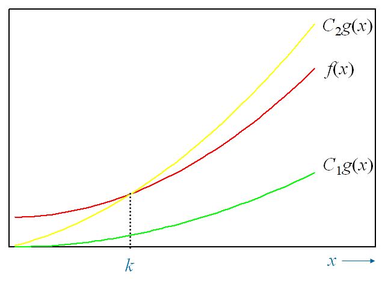

<font size=6> Chaptcer 03 Algorithms 算法</font>

covering 3.1~3.3

> 算法：基本算法 
>
> 搜索算法，排序算法（重要）（需要知道排序方法）其他的并不重要
>
>  函数增长性（bigO等三个）（一定做要求，重要）
>
>  算法复杂性（可能不太重要，很简单的会就可以，复杂的不做要求）

------

# Definition 定义

一个**算法**是一个**有限**的精确指令集，用于执行计算或解决问题

**Pseudocode**（伪代码）:用类似于计算机语言(如c++或Pascal)的通用语言给出的指令

：后是该值的定义域

```pseudocode
procedure  max(a1, a2, ..., an :integers)
max := a1
for i := 2 to n
	if max < ai then max:= ai
return max{max is the largest element}
```

# Properties 属性

- 输入，算法从一个指定的集合得到输入值。
- 输出，对每个输人值集合，算法都要从一个指定的集合中产生输出值。输出值就是问题的解。
- 确定性,算法的步骤必须是准确定义的。
- 正确性，对每一组输人值，算法都应产生正确的输出值。
- 有限性，对任何输人算法都应在有限(可能很多)步之后产生期望的输出
- 有效性，算法的每一步都应能够准确地在**有限时间**内完成。
- 通用性，算法过程应该可以应用于期望形式的所有问题，而不只是用于一组特定的输入值。

# Examples 算法举例

## Searching Algorithms 查找算法

### Linear Search or sequential search 线性查找


### Binary Search 二分查找

## Sorting 排序算法

```c
// 冒泡排序  （从后往前冒泡）
void Bubble_Sort(ElementType A[], int N){
    int P, i, flag;
    for (P=N-1; P>0; P--){  // 最后一位下标是N-1
        flag = 0;
        for (i=0; i<P; i++){
            if(A[i] > A[i+1]){
                Swap(&A[i], &A[i+1]);
                flag = 1;  // 标识发生了交换
            }
        }
        if (flag==0)
            break; // 若全程无交换，已经排好了
    }
}
// 插入排序
void Insertion_Sort(ElementType A[], int N){  //从小到大，模拟摸牌的过程
    ElementType Tmp;
    int P, i;
    for(P=1; P<N; P++){  //从第二张牌开始摸牌
        Tmp = A[P]; // 摸下一张牌
        for (i = P; i >0 && A[i-1] >Tmp; i--){
            if(A[i-1] > Tmp) // 若前一张牌比新摸的牌大
                A[i] = A[i-1]; // 移出空位
        }
        A[i] = Tmp; // 新牌落位
    }
}
```

## Optimization problem 最优化问题

### Greedy Algorithm 贪心算法

一旦贪婪算法求出了一个可行解，就要确定它是否找到了一个最优解。为此，要么证明这个解是最优的，要么证明该算法产生了一个非最优解的反例

> *63.a)设计一个贪婪算法，给定每个讲座的开始时间和结束时间，确定容纳n个讲座所需要的最少的报
> 告厅数目。
> b)证明你的算法是最优的。
>
> a) 按开始时间对演讲进行排序。将演讲厅编号为1，2，3...对于每个演讲，将其分配给当前可用的编号最小的演讲厅
>
> b) 如果这个算法使用了$n$个演讲厅，那么在第$n$个厅第一次被分配时，它必须被使用（否则一个编号更小的厅会被分配），这意味着$n$个演讲同时进行（刚刚分配的这个演讲和当前在1到$n-1$号厅进行的$n-1$个演讲）

# Halting Problem 停机问题

该过程以一个计算机程序以及该程序的一个输人作为输人，并判断该程序在给定输人运行时是否最终能停止


假设停机问题有一个解，一个称为H(P，I)的过程。过程H(P，I)有两个输入项,一个是程序P，另一个是程序Р的一个输入I。如果H判定Р在给定输入Ⅰ时能终止，则H(P，I)将产生字符串“停机”作为输出。反之，H(P，I)将产生字符串“无限循环”作为输出。现在我们将导出一个矛盾。
编写一个过程的时候，它本身就表达为一个由字符构成的串，该串可以解释为一个比特序列。这意味着一个程序本身就可以当作数据使用。因此，一个程序可以作为另一个程序的输入，甚至是自身的输人。这样，H可以将一个程序Р作为它的两个输人，即一个程序和该程序的输入。H应该可以判断当Р给定其自身的副本作为输入时，P是否会停机。
为了证明不存在过程H能够求解停机问题，我们构造一个简单过程K(P)，它的工作原理如下，并利用H(P，P)的输出。如果 H(P，P)的输出是“无限循环”，即Р在自身作为输人时会无限循环，那么让K(P)停机。如果H(P，P)的输出是“停机”，即Р在自身作为输人时会停机，那么让K(P)无限循环。即，K(P)做出和H(P，P)的输出相反结果(如图3所示)。

# The Growth of Functions 函数的增长

Asymptotic Running Time 渐进运行时间

## Big-O Notation 大O记号

“$f(x)$ is $O(g(x))$”  当$x>k$
$$
|f(x)| ≤ C| g(x)|
$$
常数 C and k 称为 **witnesses**（**凭证**） to the relationship $f (x)$ is $O(g(x))$

其他表达  $$f(x)=O(g(x))$$    $$f(x)\in O(g(x))$$


直觉上，$f(x)$是$O(g(x))$的定义是说当$x$无限增长时$f(x)$的增长慢于$g(x)$的某个固定的倍数

### Some Important Big-O Results

Let $$f(x)=a_nx^n+a_{n-1}x^{n-1}+...+a_1x+a_0$$, where $$a_i(i=1,2,3,...)$$ are real numbers, then f(x) is $$O(x^n)$$

==$N! = O(N^N)$==

==${log{N}}^{k}=O(N)$==


If $$f_1(x)$$ is $$O(g_1(x))$$ and  $$f_2(x)$$ is $$O(g_2(x))$$

和  $$(f_1+f_2)(x)$$  is  $$O(max(g_1(x),g_2(x)))$$

积 $$(f_1f_2)(x)$$ is $$O(g_1(x)g_2(x))$$

## Big-Omega and Big-Theta Notation

$$f(x)$$ is $$\Omega(g(x))$$ if there are constants *C* and *k* such that $$|f(x)|\geq C|g(x)|$$ whenever *x* > *k*.


$$f(x)$$ is $$\Theta(g(x))$$ if $$f(x)$$ is $$O(g(x))$$ and $$f(x)$$ is $$\Omega(g(x))$$

> 存在 $$C_1$$ and $$C_2$$ 和 $k$
>
> $$C_1|g(x)|\leq|f(x)|\leq C_2|g(x)|$$



#### Complexity of Algorithms 算法复杂度

Worst-case analysis 最坏情形

Best-case analysis 最好情形

Average-case analysis 平均情形(往往很复杂，不是简单的最好和最坏的平均)

#### algorithmic paradigm算法范型

如贪婪算法，蛮力算法

# Understanding the complexity of algorithm

**Tractable**（**易解的**）:最坏情况下是多项式复杂度，否则是**Intractable**（**难解的**）

**Unsolvable**（**不可解**）:比如停机问题

## P&NP

**Class P**（**P类问题**）: tractable problems

**Class NP** (nondeterministic polynomial time（非确定性多项式时间）)（**NP类**）: problems for which a solution can be checked in polynomial time. 

**NP-complete**（**NP完全问题**）:  an important class of problems with the property that if any of these problems can be solved by a polynomial worst-case time algorithm, then all can be solved by polynomial worst-case time algorithms.

**The P versus NP problem**（**P与NP问题**） asks whether NP, the class of problems for which it is possible
to check solutions in polynomial time, equals P, the class of tractable problems. If P=NP, there
would be some problems that cannot be solved in polynomial time, but whose solutions could
be verified in polynomial time.

|     Complexity      |              Terminology               |
| :-----------------: | :------------------------------------: |
|     $$\Theta(1)$$     |     Constant complexity 常量复杂度     |
|  $$\Theta(log\ n)$$   |   Logarithmic complexity 对数复杂度    |
|     $$\Theta(n)$$     |      Linear complexity 线性复杂度      |
| $$\Theta(n\ log\ n)$$ | Linearithmic complexity 线性对数复杂度 |
|    $$\Theta(n^b)$$    |   Polynomial complexity 多项式复杂度   |
|  $$\Theta(b^n),b>1$$  |   Exponential complexity 指数复杂度    |
|    $$\Theta(n!)$$     |    Factorial complexity 阶乘复杂度     |

