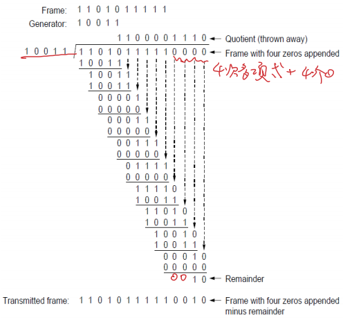
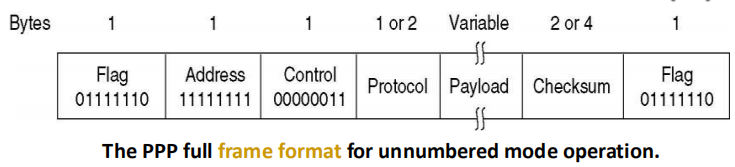
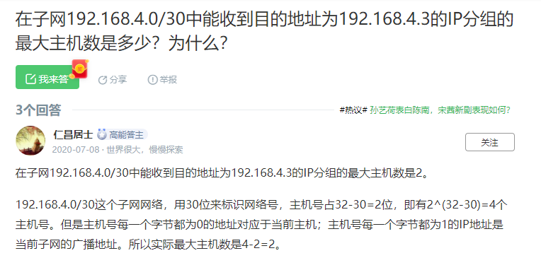

[TOC]

# Chapter 1 Introduction

计算机网络（computer networks）：大量相互独立的但彼此连接的计算机共同完成计算任务。

## 1.2 网络硬件

传播技术

- 广播式链路broadcasting 其中有些还支持给一组机器发送数据包，称为组播multicasting

- 点到点链路point-to-point 单播unicasting

网络尺度

## 1.3 网络软件

绝大多数网络都组织成一个层次栈(stack of layer)或协议栈(stack of level)，每一层建立在下一层的基础上，每一层的目的是向上一层提供特定的服务，而对实现的细节加以隐蔽。

不同机器上构成相应层次的实体称为**对等体(peer)**，每一对相邻层次之间的是

- 接口(interface)，接口定义了下层向上层提供哪些原语(primitive)操作和服务。

- Services：各层向它上层提供的一组原语（操作) 
- Protocols：定义同层对等实体之间交换的帧、分组和报文的格式及意义的一组规则


层和协议的集合称为**网络体系结构(network architecture)**，一个特定的系统使用的一组协议称为协议栈(protocol stack)。

服务原语：

- LISTEN
- CONNECT
- ACCEPT
- RECEIVE
- SEND
- DISCONNECT


## 1.4 参考模型

### OSI模型

OSI模型的核心概念：**服务(service)；接口(interface)；协议(protocol)**

OSI模型在**网络层**支持**无连接和面向连接**的通信，但是在**传输层**只支持**面向连接**的通信

通信子网 (communication subnet)包括物理层，数据链路层和网络层。

共7层

- **物理层 (physical layer)**：任务是在一条通信信道上传输比特。要确定用什么电子信号表示1和0，一个比特持续多少纳秒，传输是否可以在两个方向上同时进行，连接如何建立，如何撤销等。is concerned with transmitting raw bits over a communication channel
- **数据链路层 (data link layer)**：任务是将一个原始的传输设施变成一条没有漏检传输错误的线路。发送方将输入数据拆分成数据帧（data frame），然后顺序发送这些数据帧。接收方必须确认收到的每一帧，保证数据的顺序和完整性，然后发回确认帧（acknowledgement frame）。为了防止发送方淹没慢速接收方，需要对流量进行调节。**介质访问控制子层**则是控制对共享信道的访问。**不具有拥塞控制功能**transform a raw transmission facility into a line that appears free of undetected transmission errors. 
- **网络层 (network layer)**：控制子网运行。将数据包从源端路由到接收方；需要处理拥塞；允许异构网络相互连接成互联网络。controls the operation of the subnet and determines how packets are routed from source to destination
- **传输层 (transport layer)**：接收上一层(会话层)的数据，并将数据分割成较小的单元（分组排序），然后把数据单元传到网络层。**传输层是真正地端到端的层**，始终将源数据从源端带到接收方。1\~3层是链式连接的，而4\~7层是端到端的。
- **会话层 (session layer)**：允许不同机器上的用户建立会话。（负责管理主机间的会话进程，利用传输层提供的端到端的服务，向表示层提供它的增值服务。服务主要表现为表示层实体或用户进程建立连接并在连接上传输数据，也称建立同步。）会话提供各种服务包括对话控制（dialog control）（记录由谁来传递数据），令牌管理（token management）（禁止双方同时执行同一个关键操作），同步功能（synchronization）（在一个长传输过程中设置一些断点，以便在系统崩溃后还能恢复到之前的状态）。
- **表示层 (presentation layer)**：关注传递信息的语法和语义。主要是实现数据的格式转换和压缩。
- **应用层 (application layer)**：包含了各种各样的协议，比如HTTP协议，提供了用户和网络的接口。contains a variety of protocols that are commonly needed by users


路由器：网络层

交换机：数据链路层

集线器：物理层

### TCP/IP模型

在**网络层**仅支持**无连接** connection-less的通信，而在**传输层**支持**无连接和面向连接** connection-oriented的通信。

- 链路层
- 互联网层
- 传输层
- 应用层


MPLS协议介于IP层和数据链路层之间。

# Chapter 2 Physical Layer 物理层

## 2.1 Theoretical Basis 理论基础

### Maximum Data Rate of a Channel 信道的最大传输速率

Signal-to-noise ratio 信噪比(SNR) = $S/N$  

分贝(DB) 为$10log_{10}S/N$

波特（baud)、比特率（bit per second, bps)

**Nyquist Theory （无噪声信道）**

Max Data Rate = $2Hlog_2 V$ bps = $Blog_2 V$ bps

H为滤波器的(频率)带宽(bandwidth of a low-pass filter) Hz，B是波特率Baud，V为信号的离散等级(discrete levels of a signal)

==eg.== 无噪声的3kHz信道传输二进制信号(二阶2 level signals)的最大传输速率为$2\times 3k\times log_2 2=6k\ \mathrm{bps}$

**Shannon Theory（有噪声信道）**

Max Data Rate = $Blog_2 (1+S/N)$ bps      

==eg.== If a binary signal is sent over a 3-kHz channel whose signal-to-noise ratio (SNR) is 20dB, what is the maximum achievable data rate?

Solution: According to Shannon theorem which specifies the maximum data rate in a noisy channel as B\*log_2^(1+S/N) where B is the bandwidth, S/N is the signal-to-noise ratio. Usually, S/N is given in "decibel", not just a ratio. decibel is calculated by dB=10log_10^(S/N)

Therefore, we get S/N first by 20dB=10log_10^(S/N) ==> S/N=10^2=100Substitude S/N into Shannon's theorem, we get the maximum bps as 3k*log2^(1+S/N)=3log2^101kbps=19.97kbps.

However, the maximum data rate, assuming the channel is noise free, is only 6kbps, according to Nyquist rate. Therefore, the final answer should be 6kbps.

## 2.2 Guided(Bounded) Transmission Media 有线传输介质 

### **Magnetic media (磁介质)**

### **Twisted pair（双绞线）**

- consists of ***two insulated copper wires*** typically about 1 mm thick.  防止信号受到干扰

- can run several kilometers without amplification, but for longer distances, ***repeaters*** are needed. 

  

- Category 5 (100Mbps, 1Gbps)

- Category 6 (10Gbps)

- Category 7 (Shielded Twisted Pair) 

### **Coaxial cable（同轴电缆）**

- a ***stiff copper wire*** as the core (硬铜线为芯)

- surrounded by an ***insulating material*** 

- The insulator is encased by a ***cylindrical conductor***, often as a closely-woven breaded mesh. (绝缘体由圆柱形导体包裹着，通常是密织的网)

- The outer conductor is covered in a ***protective plastic sheath***. 

- Two types: 50-ohm (digital), 75-ohm (analog and digital) 

- Used to be widely used for ***long-distance*** lines. 

  .png)

- 基带（baseband)同轴电缆：

  - 基带信号：将数字信号1和0直接用两种不同的电压表示，然后送到数字信道上传输，称为基带传输。
  - 50Ω电缆– 数字传输
  - 75Ω电缆– 模拟传输
  - 10BASE5 uses a thick and stiff coaxial cable up to 500 meters (1,600 ft) in length.

- 宽带(broadband)同轴电缆

  - 宽带信号：将基带信号调制后形成频分复用模拟信号，然后送到模拟信道上传输，称为宽带传输。
  - 75Ω电缆– 模拟传输、有线电视、多信道
  - 宽带网络：双电缆系统、单电缆系统、顶端器

### **Power Lines (电源线)**

### **Fiber optics (光纤)**

- Multimode (多模): many different rays 

- Unimode (单模): single rays, ***longer distance*** 

- Fiber optic cables are similar to coax, except ***without the braid*** 

  

和铜线相比：带宽高、衰减小、抗干扰(最强 几乎不受电磁干扰 无线最容易受干扰)、轻、安全性高


## 2.3 Wireless Transmission 无线传输

**The Electromagnetic Spectrum(电磁波谱)**

**Radio Transmission(无线传输)** 

- In the VLF, LF, and MF bands, radio waves follow the curvature of the earth. 

  特点: 穿透力强, 但传输距离近

- In the HF band, they bounce off the ionosphere. 

  特点: 直线传输,遇到障碍物反射

**Microwave Transmission(微波传输)** 

- 100MHz以上，直线传输，可集中于一点(方向性好) 
- Inexpensive 
- Problem at about 4GHz : absorption by water

**Infrared and Millimeter Waves(红外线和毫米波)**

- Short range communication
- they do not pass through solid objects

**Lightwave Transmission (光波传输)**

## 2.4 Communication Satellites

Geostationary Satellites(GEO, 地球同步卫星) 

Medium-Earth Orbit Satellites (MEO, 中轨道卫星) 

Low-Earth Orbit Satellites(LEO, 低轨道卫星) 

## 2.5 Digital Modulation and Multiplexing 数字调制和多路复用

数字调制(Digital Modulation)：The process of converting between bits and signals that represent them.

### 基带传输(baseband transmission)

信源发出的没有经过调制的原始信号对应的频带

- 归零（RZ）：归零码的特性就是在一个周期内，用二进制传输数据位，在数据位脉冲结束后，需要维持一段时间的低电平。
- 不归零（NRZ）：用高电平表示1，低电平表示0。它与RZ码的区别就是它不用归零，也就是说，一个周期可以全部用来传输数据，这样传输的带宽就可以完全利用。有Nyquist Theory得，NRZ**至少需要B/2 Hz的带宽才能获得B bps的比特率**。
  - Problem: ***a long run of 0s or 1s leaves the signal unchanged***. After a while it is hard to tell the bits apart, as 15 zeros look much like 16 zeros unless you have a very accurate clock. 
- 不归零逆转（NRZI）：信号电平翻转表示1，信号电平不变表示0。
- 曼彻斯特编码（Manchester）：时钟信号与比特异或。**传输每个信号需要2个时钟周期**。
- 二级编码（AMI）
- 4B/5B编码：每4位一组，按照编码法则转换成5位码，共32组合，其余16种作为控制码。


### 通带传输(passband transmission)

幅移键控(ASK, Amplitude Shift Keying)：通过两个或多个振幅表示码元

频移键控(FSK)：通过两个或多个频率表示码元

相移键控(PSK)：通过两个或多个相位表示码元

- 正交相移键控(Quadrature Phase Shift Keying, QPSK)：使用45°，135°，225°，315°四个偏移


**星座图(Constellation diagrams)**


(a) QPSK (Quadrature Phase Shift Keying,正交相移键控)

--2 bits/symbol

(b) QAM-16.(Quadrature Amplitude Modulation, 正交振幅调制) 

--4 bits/symbol

(c) QAM-64. --6 bits/symbol

对于此类编码方式，比特率$R=Blog_2(mn)$，其中B是波特率

**码元传输速率**

单位是波特(Baud) ，1波特表示数字通信系统每秒传输1个码元，码元速率与进制数无关，即可以是多进制的也可以是二进制的。**若一个码元携带$n$比特的信息，则$M$波特率对应的信息传输速率为$Mn$bps**

**Bit rate (bps)= baud rate x the number of bit per baud**

**Baud** – the number of samples per second

==eg.== If a channel has the baud rate as 1000 and its signal levels as <u>16</u>, then its data rate can be 4k bit/s.

bit/baud=4

signal level 2^4

### 频分复用(FDM, Frequency Division Multiplexing)

利用通带传输的优势使多个用户共享信道，每个用户拥有一个频段来发送自己的信号。


**OFDM**


**WDM, Wave Division Multiplexing** 


PCM (Pulse Code Modulation, 脉冲编码调制)、T1(1.544Mbps)、E1(2.048Mbps)、T2/T3/T4

**An T1 channel contains 24 PCM signals, its data rate is 1.544Mbps**

**An E1 channel contains 32 PCM signals, its data rate is 2.048Mbps**

1. What is the percent overhead on a T1 carrier? That is, what percent of the 1.544 Mbps are not delivered to the end user?  How does it relate to the percent overhead in OC-1 or OC-768 lines?

The end users get 7 × 24 = 168 of the 193 bits in a frame. The overhead is therefore 25/193 = 13%. 

From Figure 2-41, percent overhead in OC-1 is (51.84 − 49.536)/51.84 = 3.63%. In OC-768, percent overhead is (39813.12 − 38043.648)/39813.12 = 4.44%.

2. What is the percent overhead on a E1 carrier; that is, what percent of the 2.048 Mbps are not delivered to the end user? How does it relate to the percent overhead in OC-I or OC-768 lines? 

32 PCM signals

E1 2/32=0.0625 


**DWDM, Dense Wave Division Multiplexing**

### 时分复用(TDM, Time Division Multiplexing)

每个用户周期性地获得整个带宽非常短的一个时间。每个输入流的比特从一个固定的时间槽取出并输出到混合流。TDM被广泛地应用到电话网络和蜂窝网络。


### 码分复用(CDM, Code Division Multiplexing)

**码分多址(CDMA)：在CDMA中，每个比特时间被分为m个更短的时间间隔，称为码片(chip)**

若要发送比特1，则站就发送分配给它的码片序列，若要发送比特0，就发送其码片序列的反码。

发送站的任何两个码片序列两两正交，归一化内积为0。


## 2.6 Public Switched Telephone System

### 公用电话交换网 PSTN(Public Switched Telephone System)

The PSTN is suitable for ***transmitting the human voice*** in a more or less recognizable form.


End office(端局)、 Toll office(长途局) Tandem office(汇接局) Intermediate switching office(中心交换局）、Toll connecting trunk(准长途干线)

**Major Components of the Telephone System**

- Local loops (本地回路): ***Analog twisted pairs*** going to ***houses and businesses*** (not open-loop).
- Trunks (干线): ***Digital fiber optics*** connecting the switching offices (used to be coaxial cables).
- Switching offices (交换局): to ***switch calls from one trunk to another*** (manual operators + jumpers → automatic switching computer) 

### Switching(交换)

**Circuit switching**

- 数据直达，通信时延小
- 有序传输
- 不同通信双方拥有不同，没有冲突
- 实时性强，控制简单
- 但是连接建立时间长，线路独占使用效率低，灵活性差，难以规格化

**Packet switching(store-and-forward)**

- 无需建立连接
- 动态分配线路
- 线路可靠性高
- 线路利用率高
- 但是会有转发时延

​	


# Chapter 3 Data Link Layer

## 3.1 Data Link Layer Design Issues

### 3.1.1 Services Provided to the Network Layer 

- Unacknowledged connectionless service：无确认无连接，对丢失的帧不负责重发而是交给上层处理，适用于实时通信等或误码率低的信道，如以太网。
- Acknowledged connectionless service：有确认无连接，如无线通信。
- Acknowledged connection-oriented service ：有确认有连接，帧的传输需要建立数据链路、传输帧、释放数据链路。适用于长距离不可靠链路如卫星通信或者长途电话链路。

##### 功能

- Provide service interface to the network layer 向上提供网络层的服务
- Dealing with transmission errors 处理传输错误(Error Control)
- Regulating data flow 调节数据流，Slow receivers not swamped by fast senders 确保慢速接收方不会被快速发送方淹没(Flow Control)

##### 数据包和帧


### 3.1.2 成帧 Framing Methods

**字节计数法Byte Count**

- 如果计数字段出错将导致失去同步


**字节填充的标志字节法 Flag Bytes With Byte Stuffing**

Starting and ending character, with character stuffing （带字符填充的首尾界符法 ） 

- 每个帧用标志字节FLAG作为开始和结束
- 使用转义字节ESC转义FLAG和ESC
- 下图显示的是***PPP(Point-to-Point Protocol)***协议的字节填充方案
  - 成帧
  - 链路控制协议LCP (link control protocol)
  - 网络控制协议NCP (network control protocol)


**比特填充的标志比特法 Flag Bits With Bit Stuffing**

Starting and ending flags,with bit stuffing（带位填充的首尾界符法 ）

- 每个帧的开始和结束由**01111110**标记
- **连续遇到5个1的时候就在输出的比特流中自动填充一个0**，这样确保正文不会出现连续的6个1，也就是不会与FLAG产生相同的标记
- 接收方在接收时，每当接收到5个连续的1，就自动删除后面紧跟的0


**物理层编码违禁法 Physical Layer Coding Violations** 

- 只适合采取冗余编码的特殊编码环境
- 通过保留信号来指示开始和结束

## 3.2 Error Detection and Correction 检错和纠错

**检测** $d$个错误，需要一个海明距离为 $d+1$ 的编码方案。

**纠正** $d$ 个错误，需要一个海明距离为 $2d+1$ 的编码方案。 

### 纠错码 Error-Correcting Code

假设一帧由 $m$ 个数据位和 $r$ 个冗余位组成，记 $n=m+r$， 并将该编码描述成$(m,n)$码

海明距离(Hamming Distance): 两个码字(codeword)中不同的位的个数，如果两个码字的汉明距离为 $d$ ，则需要 $d$ 个1位错误才能把一个码字转换成另一个码字。

纠正单个错误所需要的校验位数下限：

对于每$2^m$个合法消息，任何一个消息都有$n$个非法码字（即距离为1的非法码字有$n$个），因此每个合法消息都需要用$n+1$个位模式来标识它，由于总共只有$2^n$个位模式，有：$(n+1)2^m≤2^n$

即$(m+r+1)≤2^r$

**海明编码**

**海明距离为3，能够发现双比特错，但是只能纠正单比特错**

将码字内的位从左到右依次编号$1..n$ 其中满足2的幂的位为校验码，其余为数据码

以消息$ 010100111111$(反向)的编码为例**（好像有点问题，编号反了）**：

 

海明编码纠错


**Binary Convolutional Codes 二进制卷积码**

**Reed-Solomon Codes 里所码**

**Low-Density Parity Check Codes (LDPC) 低密度校验码**

### 检错码 Error-Detecting Code

**奇偶校验码(Parity)**

- 可以检验出**奇数**个比特错误
- 海明距离为2
- 奇校验码，若传输后1的个数是偶数个则能检测出错误，若是奇数个则不能检测出错误

**Cyclic Redundancy Checks 多项式编码(循环冗余码, CRC码)**

- 发送方和接收方约定一个生成多项式$G(x)$，最高位和最低位系数都为1
- 在帧的尾部附加一个校验和，如果附加之后的帧对应的多项式能被$G(x)$除尽，则没有错误，如果有余数，则表明传输的过程中出现错误
- CRC码可以检测出所有的单比特错误
- 带$r$个校验位的多项式编码可以检测到所有长度小于等于$r$的突发性错误

Keep in mind of a few rules in deriving the checksum.

- If you want to detect all the odd number of errors, x+1 has to be a factor of the generator G(x)
- If you want to detect burst errors of length less than or equal to r, the degree of your generator polynomial must be r
- If the degree of the generator is r, then you pad r zeros at the end of the message, and append the remainder to the zeros. Therefore, the number of bits in the checksum should be r
- If r is less than (i-j) where i and j are the locations of the two isolated single-bit error, then it might not be detected.
- The checksum is calculated by modulo-2 division.

采用生成多项式$G(x)=x^4+x+1$计算帧110101111校验和**checksum**的例子

- 要点1：假设$G(x)$的阶为$r$，则需要在被除数(数据段)后面加上$r$个0
- 要点2：减法操作为**XOR**操作，即不借位
- 要点3：除法后得到的余数即为冗余码
- 要点4：最后发出的帧即为原序列跟上$r$个0再加上余数，下面例子发送的数据就是：$11010110111110$
- 要点5：接收方接收到信息后只需使用$G(x)$来除信息即可验证



常见的CRC

- CRC-12

- CRC-16

  

- CRC-32

- CRC-ITU

具有r检测位的多项式能够检测所有长度<=r的突发错误

长度大于r+1的错误逃脱的概率为$\frac{1}{2^r}$

## 3.3 Elementary Data Link Protocols 基本数据链路协议

ARQ：Automic Reapeat Request

### Stop-and-Wait Protocol (Protocol2 & Protocol 3)

- 发送方每发送一帧，都要等待接收方的应答信号，之后才能发送下一帧


## 3.4 Sliding Window Protocols（滑动窗口协议）

- 在任何时刻，发送方都维持一组连续的允许发送帧的窗口，称为发送窗口，同时接收方维护一组连续的允许接收帧的窗口，称为接收窗口。

- 发送方每收到一个确认帧，发送窗口就向前移动一个帧的位置。
- 接收端收到数据帧后，将窗口向前移动一个位置，并发回确认帧，若数据帧落在接收窗口之外则一律丢弃。


### Go Back N Protocol 后退n帧

line/channel utilization 链路利用率$P≤(w)/(1+2BD)$


当发生错误时，丢弃错误帧后所有的帧，不发回确认，要求发送方重传开始错误之后的帧

发送方窗口 > 1， 接收方窗口 = 1   且发送窗口的大小W_SIZE <= 最大序列号MAX_SEQ

- 若使用$n$比特编号，则发送方窗口尺寸的范围应该是$1<=SIZE<=2^n-1$
- 当W_SIZE = 8, MAX_SEQ = 7时，是非法的，即存在一种特殊情况，当发送方发送完了0\~7号的数据包后，接收方收到了0\~7帧，但是确认帧全都丢失，于是发送方重传，但是此时接收方就不知道这些帧是新的数据帧还是旧的数据帧了。
- 即在后退N协议中，序列号的数量最少应该是W_SIZE + 1
- 对于窗口大小为$n$的滑动窗口，最多可以有$n-1$ (MAX_SEQ) 帧已发送但没有确认


### Selective Repeat Protocol 选择性重传

发送方窗口 > 1， 接收方窗口 > 1

所需缓冲器的数量=W 

所需计时器的数量=W 

否定性确认帧-NAK

为了保证没有序号重叠，窗口的最大尺寸不应该超过序号空间的一半，即**W_SIZE <= (MAX_SEQ+1)/2**


eg. The maximum window size for data transmission using the selective repeat protocol with n bit frame sequence numbers is $2^{n-1}$

We know-

- With n bits, total number of sequence numbers possible = 2n.
- In SR Protocol, sender window size = receiver window size = W (say)

For any sliding window protocol to work without any problems,

Min Available Sequence Numbers= Sender window size + Receiver window size 

$2^n = W + W$

**Solution-**

 We know-

- With n bits, total number of sequence numbers possible = 2n.
- In SR Protocol, sender window size = receiver window size = W (say)

For any sliding window protocol to work without any problems,

Min Available Sequence Numbers= Sender window size + Receiver window size

So, we have-

2n = W + W

2n = 2W

### PPP（Point to Point Protocol 点到点协议） 



A standard protocol called PPP (Point to Point Protocol) is used to ***send packets over the links***, including the SONET fiber optic links and ADSL links.

PPP的特性：

- A **framing method** that unambiguously delineates the end of one frame and the start of the next one. The frame format also handles error detection. 
- A **link control protocol (链路控制协议, LCP)** for bringing lines up, testing them, negotiation options, and bring them down again gracefully when they are no longer needed.
- A way to negotiate network-layer options in a way that is independent of the network layer protocol to be used. The method chosen is to have a different **NCP (Network Control Protocol, 网络控制协议)** for each network layer supported. 


# Chapter 4 MAC Layer （The Medium Access Control Sublayer, 介质访问子层）

网络链路的两大分类

- Point-to-point connections 点到点连接 
- Broadcast channels 广播信道(多路访问信道 MultiAccess Channel, 随机访问信道 Random Access Channel)

介质访问控制(MAC, Medium Access Control)： 确定多路访问信道的下一个使用者的协议 bottom part of the data link layer

## 4.1 The Channel Allocation Problem 信道分配 

### Static Channel Allocation in LANs and MANs（局域网和城域网中信道的静态分配）

- 可以采用频分多路复用(FDM)或时分多路复用(TDM)，只适合少量用户且固定不变的情况

- 假设信道的容量为C bps，随机到达帧的平均到达率为$\lambda$帧/秒，帧的平均长度为$1/\mu$位，利用这些数据可以算出信道的服务率为$\mu C$帧/秒（信道容量/每帧长度），假设发送一帧所需要的时间延迟为$T$，则$$T=\frac{1}{\mu C-\lambda}$$

- 将单个信道分成N个子信道的时间延迟为NT

  mean time delay $\mathrm{T_{FDM}=NT}$

  - N---number of Sub-Channel after FDM
  - T---original mean delay of frame before FDM

- 缺陷：无通信量时信道白白浪费

### Dynamic Channel Allocation in LANs and MANs（局域网和城域网中信道的动态分配）

五个关键假设

**1. Independent Traffic**. Station model（站） 

– N independent stations、the frame be generated、waiting for transmittal、until the frame has been successfully transmitted

**2. Single Channel** （单通道） 

– A single channel is available for all communication

**3. Observable Collision** （冲突） 

– A collided frame must be transmitted again later

**4. Continuous or Slotted Time**

a. Continuous time（连续时间） 

– Frame transmission can begin at any instant.

b. Slotted time（时隙） 

– Frame transmissions always begin at the start of a slot. A slot may contain 0,1,or more frames

**5. Carrier Sense or No Carrier Sense**

a. Carrier sense（载波侦听）

– Stations can tell if the channel is in use before trying to use it

b. No carrier sense（非载波侦听）

– Only later can they determine whether or not the transmission was successful

## 4.2 MULTIPLE ACCESS PROTOCOLS 多路访问协议

### **ALOHA**(Additive Link On-Line Hawaii system)

**Pure ALOHA**

- 用户有数据要发送时就传输
- $S=Ge^{-2G}$，最好的信道利用率为18.4%

**Slotted ALOHA**

- 将时间分成离散的间隔，要求用户遵守统一的时间槽边界
- $S=Ge^{-G}$

### Carrier Sense Multiple Access（CSMA, 载波侦听多路访问协议）

检测其它站点，调整自己的动作，大大提高利用率

**1-persistent (CSMA 1-坚持载波检测多路访问)**

- 先侦听，有空闲就发送
- 如果信道忙，则持续侦听
- 如果发生冲突则等待一段随机的时间
- 带宽延迟乘积(BD)越大，协议性能越差

**nonpersistant CSMA (非坚持CSMA)**

- 如果当前信道正在使用中，则不持续监听，而是随机等待时间，然后重复
- 信道利用率高，但是延迟大
- 如果发生冲突则等待一段随机的时间

**p-坚持CSMA (p-persistant CSMA)**

- 侦听信道，如果空闲则以概率p发送数据，以1-p推迟到下一个时间槽
- 如果忙则持续侦听，等待下一个时间段再重复
- IEEE 802.11使用优化的p-CSMA

**CSMA/CD (载波监听多点接入/碰撞检测, 带冲突检测的CSMA, CSMA with Collision Detection)**

- 假设两个最远的站传播的时间需要$\tau$，只有一个站传输了$2\tau$后没监听到冲突，才保证抓到了信道
- 3个状态：contention(争用),transmission(传输),or idle(空闲)
- “多点接入”表示许多计算机以多点接入的方式连接在一根总线上。
- “载波监听”是指每一个站在发送数据之前先要检测一下总线上是否有其他计算机在发送数据，如果有，则暂时不要发送数据，以免发生碰撞。
- “碰撞检测”就是计算机边发送数据边检测信道上的信号电压大小。
  - 当某个站监听到总线是空闲时，也可能总线并非真正是空闲的。
  - A 向 B 发出的信息，要经过一定的时间后才能传送到 B。B 若在 A 发送的信息到达 B 之前发送自己的帧(因为这时B 的载波监听检测不到 A 所发送的信息)，则必然要在某
    个时间和 A 发送的帧发生碰撞。碰撞的结果是两个帧都变得无用。


### Collision Free Protocol 无冲突协议

**A Bit Map Protocol 基本位图法**

- 竞争槽中表示哪个Station需要传输
- 假设数据长度为d，槽的个数为N。低负载情况下，低序号的站发送需要等待平均1.5N，高序号的站平均等待0.5个槽，对所有站而言平均等待N个槽，即每一帧的额外开销为N位。因此低负载情况下信道利用率为$d/(N+d)$
- 高负载情况下，N位竞争期被分担到N个帧上，每一帧额外开销1位，利用率位$d/(1+d)$


**Token Passing 令牌传递**

- Token Ring：环状，向下一个站发送令牌
- Token Bus：令牌总线，利用总线发送帧

**Binary CountDown 二进制倒计数**

- 高序站的优先级高于低序站

- 信道利用率为$d/(d+log_2N)$

  

### Limited-Contention Protocol 有限竞争协议

- Adaptive Tree Walk Protocol 适应树搜索协议

  - 二叉树中的叶节点代表Station

  - 某个节点冲突时，只有其左子树下的节点才有竞争权

    

### Wireless LAN Protocols 无线局域网协议

无线局域网中的站可能无法给所有其他站发送帧，也无法接收来自所有站的其他帧。

假设每个无线电发射器有某个固定的传播范围，用圆形覆盖区表示。

- Hidden Station Problem(隐藏终端问题)：由于竞争者离得太远而无法检测到潜在得竞争者，即当A和C同时给B传输时，C不知道A已经发送帧了，所以会在B处产生冲突。

- Exposed Station Problem(暴露终端问题)：由于非竞争者离得太近而错误判断，即当B给A发送，C给D发送时，C如果在侦听，则会接收到B的传输而错误地认为不能够发送。

  

**MACA(冲突避免多路访问, Multiple Access with Collition Avoidance)**

- the sender stimulate the receiver (RTS), make it send a frame (CTS), all stations nearby can detect this transmission, avoid collision.

- RTS (Request to Send): 30字节，包含随后要发送地数据帧长度

- CTS (Clear to Send)：应答帧

  

- CSMA／CA Rule

  - If station X received RTS,but did not receive CTS,then X can transmit its data and will not interfere with other stations. 
  - If station X has not received RTS, but received CTS,then X may not transmit its data. 
  - If station X has received both RTS and CTS,then X may not transmit its data.

**MACAW**: tune MACA to improve its performance

- MAC for Wireless 

- introducing an ACK after each successful data frame, avoid losing the frame


## 4.3 Ethernet 以太网(IEEE 802.3)

以太网的分类

- 经典以太网(Classic Ethernet)
- 交换式以太网(Switched Ethernet)

### Classic Ethernet Physical Layer


IEEE 802.1──高级接口High Level Interface(Internetworking)

IEEE 802.1d──生成树协议(Spanning Tree)

IEEE 802.1p──General Registration Protocol

IEEE 802.1Q──虚拟局域网(Virtual LANs;VLAN)

IEEE 802.1X──基于端口的访问控制(Port Based Network Access Control)

IEEE 802.2──逻辑链路控制(Logical Link Control)

IEEE 802.3──带冲突检测的载波侦听多路访问协议CSMA/CD(半双工以太网)

IEEE 802.3u──快速以太网(Fast Ethernet) 

- 802.3u是IEEE 802.3u的简称， IEEE 802.3u(100Base-T)是100兆比特每秒以太网的标准。100Base-T技术中可采用3类传输介质，即100Base-T4、100Base-TX和100Base-FX

IEEE 802.3z──千兆以太网(Gigabit Ethernet)

IEEE 802.3ae──万兆以太网(10 Gigabit Ethernet)

IEEE 802.4──令牌环总线(Token-Passing Bus)

IEEE 802.5──令牌环(Token-Passing Ring)

IEEE 802.6──城域网(Metropolitan Area Networks，MAN)

IEEE 802.7──宽带局域网(Brandband LAN)

IEEE 802.8──光纤局域网

IEEE 802.9──集成数据和语音网络(Integrated Voice and Data Networks，VoIP

IEEE 802.9a──IsoENET(proposed)

IEEE 802.10──网络安全(Network Security)

IEEE 802.11──无线以太网 

- 是现今无线局域网通用的标准

IEEE 802.12──100VG-AnyLAN(Voice Grade – Sprache geeignet)

IEEE 802.14──有线电视(CATV)

IEEE 802.15──无线个人局域网路(Wireless Personal Area Network，WPAN)

IEEE 802.16——主要与用户收发站和基站间的无线接口相关

IEEE 802.17──弹性分组环(Resilient Packet Ring)

### Classic Ethernet MAC Sublayer Protocol 经典以太网的MAC子层协议 

- 前导码(Preamble)为8个字节，每个字节包含比特模式10101010(除了最后一个字节为(SOF, 10101011)

- 目标地址和源地址均为6个字节长

  - 如果目标地址第1位是0，表示一个普通地址
  - 如果目标地址第1位是1，则是一个组播(Multicasting)地址
  - 如果目标地址字段全位1，则是广播(Broadcasting)

- 类型(或长度)字段为2个字节，取决于协议类型

- 数据字段最多可以包括1500个字节

- 以太网要求有效帧(从目标地址到校验和)必须至少需要64字节长，因此填充区为0~46字节

  - 限制最小帧长应该满足能够传输2t的时间

- 校验和4字节，一般是32为CRC

  


**CSMA/CD with Binary Exponential Backoff 二进制指数后退的CSMA/CD**

- 在第$i$次冲突后，随机等待$0\to2^i-1$个时间槽，但最大不超过1023
- After 10 collisions have been reached, the randomization interval is frozen at a maximum of 1023 slots. After 16 collisions, the controller throws in the towel and reports failure back to the computer.
- 如果只有少量站冲突可以确保较低的延迟，当许多站发生冲突时，可保证一个相对合理的时间解决冲突

**truncated binary exponential type 二进制指数类型退避算法**

- 发生碰撞的站在停止发送数据后，要推迟（退避）一个随机时间才能再发送数据。
- 对于 10 Mb/s 以太网，在争用期内可发送512 bit，即 64 字节。
- 以太网在发送数据时，若前 64 字节没有发生冲突，则后续的数据就不会发生冲突。

争用期

- 最先发送数据帧的站，在发送数据帧后至多经过时间 2t（两倍的端到端往返时延）就可知道发送的数据帧是否遭受了碰撞。
- 以太网的端到端往返时延 2t 称为争用期，或碰撞窗口。

- 经过争用期这段时间还没有检测到碰撞，才能肯定这次发送不会发生碰撞。

最短有效帧长

- 如果发生冲突，一定在前64 bytes
- 凡长度小于 64 字节的帧都是由于冲突而异常中止的无效帧

**Switched Ethernet**

- collision domain 冲突域
  - Ethernet上数据碰撞所影响的范围
  - 总线、Hub、Repeater所连接的设备都在同一个碰撞域中
  - 交换机的每个端口是一个碰撞域

- broadcast domain
  - 数据帧广播所覆盖的范围
  - Hub、Switch都在同一广播域中，但VLAN能划定广播域

- **交换机(switch)**每个端口具有独立的冲突域
- **集线器(hub)**中所有站位于同一个冲突域

- 交换机和网桥可以分割冲突域，但是不能分割广播域

- **网桥(bridge)**减少了冲突域增加了广播域

- **路由器(router)**既可以分隔冲突域也可以分隔广播域

- VLAN能够隔离冲突域和广播域

All the nodes connected to a hub share the bandwidth among themselves, while a device connected to a switch port has the **full bandwidth** all to itself. 

For example, if 10 nodes are communicating using a **hub** on a 10-Mbps network, then each node may only get a **portion** of the 10 Mbps if other nodes on the hub want to communicate as well. But with a **switch**, each node could possibly communicate at the **full** 10 Mbps. 

physical：repeater hub 

datalink：Bridge switch

network：Router

### Fast Ethernet


## 4.4 Wireless LANs

**Transparent bridge**

routing procedure for an incoming frame:

– If destination and source LANs are the same, discard the frame

– If destination and source LANs are different, forward the frame

– If the destination LANs is unknown, use flooding

**Parallel bridges**


- **Repeaters**: amplify signal. do not understand frames, packets, or headers, only understand volts

• **Hubs:** not amplify incoming signals, not examine 802 addresses. The 

entire hub forms a single collision domain

• **Bridges**: connect LANs, route on frame address, each line is its own 

collision domain 

• **Switches:** connect individual computers, route on frame address, 

never lose frames to collisions [see Fig.4-47(c)]

– cut-through switches

• **Routers:** see chap.5

**transport gateways****:** connect two computers that use different 

connection-oriented transport protocols

• **application gateways****:** understand the format and contents of 

the data and translate messages from one format to another. 

e.g. e-mail gateway.


# ==Chapter 5 Network Layer==

## 5.1 Network Layer Design Issues（网络层设计概述）

网络层设计思想

- Store-and-Forward Packet Switching 存储转发分组交换
- Services Provided to the Transport Layer 为传输层提供的服务
  - 独立于路由器技术
  - 屏蔽路由器的数量、类型、拓扑关系
  - 传输层可用的网络地址应该有一个统一的编址方案
- Implementation of Connectionless Service 无连接服务的实现
- Implementation of Connection-Oriented Service 面向连接服务的实现
- Comparison of Virtual-Circuit and Datagram Subnets 虚电路或数据报子网的比较


网络层提供的服务

- connection-less service 无连接的服务 -> 数据报(Datagram)
  - 所有的数据包被独立地注入到网络中，并且每个数据包独立路由
- connection-oriented service 面向连接的服务 -> 虚电路VC(Virtual Circuit)
  - 要先建立起源路由器到目标路由器的链路

## 5.2 Routing Algorithms (路由算法) 

中继系统

- 物理层：中继器(repeater) 集线器
- 数据链路层：网桥或交换机
- 网络层：路由器
- 网络层以上：网关

路由器的作用

- Forwarding：To forward the incoming packet according to the routing table
- Routing： To fill in and update the routing table 

路由算法期待拥有的性质

- Correctness (正确性), simplicity (简单性)
- Robustness (健壮性)
- Stability(稳定性)
- Fairness (公平性), Efficiency (高效率)

最优化原则(Optimality principle)

- If router J is on the optimal path from router I to router K (I→J→K), then the optimal path from J to K also falls along the same route. 

汇集树(Sink tree)

- The set of ***optimal routes*** from all sources to a given destination form a tree rooted at the destination. (a) A subnet. (b) A sink tree for router B.


### 5.2.1 Shortest path routing - Dijkstra Algorithm


### 5.2.2 Flooding 扩散法

- Every incoming packet is sent out on every outgoing line ***except the one it arrived on***.

### 5.2.3 Distance Vector Routing(DV, Bellman-Ford Algorithm) 距离矢量路由

每个路由器维护一张表，以网络中每个路由器为索引，并且每个路由器对应一个表项，该表项包括**到达目标路由器的首选出境线路**以及**到达目标路由器的距离估计值**。


These tables are updated by ***exchanging information with the neighbors***. To update the table, a node: 

- 向每个邻居发送一个列表，该表包含了它到每个目标的延迟估计值
- 从邻居那接收一个类似的表
- 计算新的路由向量

**无穷计数(count-to-infinity)问题**


对于图B中值的计算$a[row][col]=min\{a[row-1][col-1],a[row-1][col+1]\}+1$

***Poisoned Reverse：***在基于路由信息协议的网络中，当一条路径信息变为无效之后，路由器并不立即将它从路由表中删除，而是用无穷大，即不可达的度量值将它广播出去。但是它不能完全解决无穷计数问题。


应用

- RIP协议

- BGP协议

### 5.2.4 Link State Routing(LS Routing) 链路状态路由协议

每个路由器的职责

- ***Discover its neighbors***, learn their network address. 了解直连网络，向邻居发送Hello数据包
  - 一个路由器在每条点对点线上发送一个特殊的HELLO包。另一端的路由器需要发送回一个回复，告诉它是谁。这些名称必须是全局惟一的。
- Set the distance or ***cost metric*** to each of its neighbors.
  - 可通过RTT (round-trip time)作为指标
- ***Construct a packet*** containing all it has just learned. 每台路由器创建一个链路状态数据包（LSP），其中包含与该路由器直连的每条链路的状态。

- ***Send*** this packet to and ***receive*** packets from all other routers. 每台路由器将LSP泛洪到所有邻居，然后邻居将收到的所有LSP存储到数据库中。
  - 只有链路状态变化时才会发送数据包
  - Sequence number increments for each new packet sent
  - If packet is new, forward to lines except the incoming one Else (duplicate), discard.
  - If age hits 0, discard the information.

- ***Compute the shortest path*** to every other router. 每台路由器使用数据库构建一个完整的拓扑图并计算通向每个目的网络的最佳路径。


应用

- IS-IS (Intermediate System – Intermediate System)
- OSPF (Open Shortest Path First)

LS协议和DV协议的比较


### 5.2.5 Hierarchical Routing

代价是增加路径长度


### 5.2.6 Broadcast Routing 广播路由

Broadcasting：to send a packet to all destinations ***simultaneously***(同时地).

- The source simply sends a distinct packet to every destination. 

- Flooding：当每个源实现了序号，Flooding能够有效利用链路。

- Multidestination Routing：每个数据包包含一组目标地址，或者一个位图，由该位图指定所期望到达的目标地址。

- Sink-tree based broadcast： 最优的传输数据包的方法。

- Reverse Path Forwarding：当一个广播数据包到达一个路由器时，路由器检查它到来的那条线路是否是通常用来给广播源端发送数据包的线路：如果是，则将该数据包转发到除了到来的那条线路之外的所有线路上；如果不是，作为副本被丢弃。

    


a. a subnet	b. a sink tree	c. the tree built by reverse path forwarding

### 5.2.7 Multicast Routing 组播路由

**Prune the spanning tree**


Core-Based Tree


### 5.2.8 Anycast Routing 选播路由

选播模式下，数据包被传递给最近的一个组成员。

## 5.3 Congestion Control Algorithms 拥塞控制算法

**Congestion**: When too much traffic is offered, congestion sets in and performance degrades sharply.

原因

- Burst packets on one output line.
- Mismatch between parts of the system
  - Insufficient memory
  - Slow CPU
  - Low bandwidth

Traffic-Aware Routing

Admission control

Traffic Throttling(流量节流)

Load shedding

## 5.4 Quality of Service 服务质量

## 5.5 Internetworking 网络互连

### How Networks Can Be Connected


### Tunneling


### Fragmentation 存储残片


Fragmentation when the elementary data size is 1 byte.


## 5.6 The Network Layer in the Internet 互联网中的网络层

**Top 10 principles for the Internet**

1. Make sure it works.

2. Keep it simple.

3. Make clear choices.

4. Exploit modularity.

5. Expect heterogeneity.

6. Avoid static options and parameters.

7. Look for a good design; it need not be perfect.

8. Be strict when sending and tolerant when receiving.

9. Think about scalability.

10. Consider performance and cost.

1. 保证工作。直到确认原型系统可以正常运行，才可以完成设计或确定标准。
2. 保持简单。有疑问时应该使用最简单的解决方案。即如果一项特性并非绝对必要，就应该被砍掉，尤其当可以通过其他简单特性的组合也可以达到相同效果的时候。（注：也许这里的难点在于确认一套最小功能集）
3. 明确选择。解决一个问题应当有且只有一种解决方案，这与 Python 的理念相同。
4. 模块开发。使用栈结构组织功能。
5. 期望异构性。设计必须通用且灵活，保证兼容性。
6. 避免静态选项和参数。如果不可避免要使用参数的话，那么最好的办法是让发送和接收方协商一个值，而不是定义静态参数。（注：这一条对 app 的指导意义也许可以转换为，设计对象的时候，请尽可能多地将可配置项添加到参数里，而非使用内部常量）
7. 寻找好的而不是完美的设计。不必为应对特殊情况而牺牲设计的简单性。特殊情况可以特别处理。
8. 严格发送，宽容接收。保证自己发出的数据都是严格符合标准的，但在接收时可以尝试对非标准请求进行处理。（注：个人认为这里需谨慎对待，付出额外精力和风险对错误的 api 请求做出正确的相应可能得不偿失）
9. 考虑可扩展性。即分布式支持。这点还好
10. 考虑性能和成本。

### IPv4协议

**Header fields**

IP头前一部分长度固定，共20B，最大长度60B(由IHL决定)

头和数据最多不能超过65535个字节

协议字段表示使用的上层协议(TCP为6, UDP为17)，版本字段表示IP的版本(目前为4)


- **Version**
- IHL：指明头有多长，以32位字长度为单位（4字节单位），最小值为5表示没有可选项，该4位字段的长度最大值为15，也就是最大是60字节，因此Option最多为40字节。
- **Differentiated service**
- Total length：包含了数据报中的所有内容，**包括头和数据**，最大是65535个字节
- Identification：***Datagram ID***. 主要是为了让目标主机确定一个新到达的分段属于哪个数据报
- DF: 不分段
- MF: 除了最后一个段之外，其他所有的段都必须设置这一位，当***MF=1***时表示后面还有，否则没有。
- Fragment offset: 指明该段在数据包中的位置，由于有13位，因此最多可以***有8192个段***，以8字节为单位
- TTL
- Protocol：指明将数据包交给哪个传输进程，比如TCP/UDP
- checkSum：**仅校验分组首部，不校验数据**
- **Source and destination address**

**注意点：IHL、TOTAL LENGTH、 FRAGMENT OFFSET的单位分别是4B、1B、8B**

### **IP Addresses** 地址分类

IP address formats


注意点：

- 0.0.0.0表示本机
- 127.\*.\*.\*表示本机回送地址 Loopback Address
  - 127.0.0.1是回送地址，指本地机，一般用来测试使用。
- 主机号全1表示广播

Special IP addresses


**RFC 1918 指明的专用地址 private address**

- 10.0.0.0/8
  - 10.0.0.0~10.255.255.255
- 172.16.0.0/12
  - 172.16.0.0~172.31.255.255
- 192.168.0.0/16
  - 192.168.0.0~192.168.255.255

/8(16, 24, 32)是掩码的位数，2进制中从前往后1的位数

- A类IP地址的默认子网掩码为255.0.0.0（/8，表示网络号占了8位）; 即11111111.00000000.00000000.00000000

- B类的为255.255.0.0（/16）; 即11111111.11111111.00000000.00000000

- C类的为255.255.255.0(/24)；即11111111.11111111.11111111.00000000

- /30就是255.255.255.252；即11111111.11111111.11111111.11111100

- /32就是255.255.255.255；即11111111.11111111.11111111.11111111

CIDR：无类域间路由

**NAT（Network Address Translation）**

- To assign each company a single IP address (or at most, a small number of them) for Internet traffic

- Within the company, every computer gets a unique IP address (10.x.x.x, 172.16.x.x, 192.168.x.x)

Addressing

- Permanent addresses: too few

- Temporary addresses (DHCP): large users 

需要注意的是，NAT工作在传输层

### IPv6

- IPV6首部长度是固定不变的，没有校验和字段
- IPV6地址占16个字节，128位
- 有效载荷长度指明了40个字节后还有多少数据，不包括头


**冒号十六进制记法(colon hexadecimal notation)** 

- 每个 16 位的值用十六进制值表示，各值之间用冒号分隔 8000:0000:0000:0000:0123:4567:89AB:CDEF 

- First, leading zeros within a group can be omitted
  
  - e.g. 0123 can be written as 123 
  
- 零压缩(zero compression)，即一连串连续的零可以为一对
  
  冒号所取代。

**点分十进制记法的后缀**

- IPv4 addresses can be written as a pair of colons and an old dotted decimal number
  - e.g. ::192.31.20.46 

### ICMP协议

- ICMP 不是高层协议，而是 IP 层的协议。

- ICMP 报文作为 IP 层数据报的数据，加上数据

报的首部，组成 IP 数据报发送出去。


应用：PING (Packet InterNet Groper) 

### ARP协议 (Address Resolution Protocol, 地址辨析/解析协议)

可根据网络层IP数据包包头中的IP地址信息解析出目标硬件地址（MAC地址）信息


- NIC根据48位以太网地址来发送和接收帧
- ARP协议将发送广播包到以太网络上请求拥有IP地址的主机，应答后可以得到以太网地址，且可以在缓冲中找到映射关系，但是缓存会有时间限制

### DHCP协议(Dynamic Host Configuration Protocol, 动态主机配置协议)

### **Label Switching and MPLS**


### 内部网关协议(IGP, Interior Gateway Routing Protocol)

 within an AS 

#### RIP

- 应用层协议
- 使用DV
- UDP

#### OSPF

- 网络层协议
- 使用LS
- IP

### 外部网关协议(EGP)

between ASes (autonomous systems)

#### BGP (Border Gateway Protocol)

tcp

### **Mobile IP**

eg. What is the number of subnets in a 192.168.10.0/27 IP address? 192.168.10.0/27 IP 地址中子网的数量是多少？

It can be further sub-divided into upto 32 single address subnets, although generally keeping the normal subnet structure you could use it for up to eight 4-address subnets. For example:

192.168.10.0/30

192.168.10.4/30

192.168.10.8/30

… skipping four subnets

192.168.10.28/30 each with four addresses.


Another example:

192.168.10.0/28

192.168.10.16/29

192.168.10.24/29

These three subnets have 16, 8 and 8 addresses respectively.

2. 

A host configuration has an IP configuration of 192.168.10.17 255.255.255.248. What are the subnet, broadcast address, and host range that this host is a member of? The answer is: 256-248=8, 16, 24. This host is in the 16 subnet, the broadcast address of the 16 subnet is 23, and the valid host range is 17-22. Pretty easy!

主机配置的 IP 配置为192.168.10.17255.255.255.248。这台主机所属的子网、广播地址和主机范围是什么？答案是: 256-248 = 8,16,24。该主机位于16个子网中，16个子网的广播地址为23，**有效主机范围**为17-22。

有效主机去掉全0和全1 如16 31


To determine the number of subnets, use the 2x-2, where the x exponent is the number of subnet bits in the mask.

To determine the number of hosts, use the 2x-2, where the x exponent is the number of host bits in the mask.

To determine the mask you need for your network, you must first determine your business requirements. Count the number of networks and the number of hosts per network that you need. Then determine the mask by using the equations shown above--and don't forget to factor for growth.

For example, if you have eight networks and each requires 10 hosts, you would use the Class C mask of 255.255.255.240. Why? Because 240 in binary is 11110000, which means you have four subnet bits and four host bits. Using our math, we'd get the following:

24-2=14 subnets

24-2=14 hosts

要确定子网的数量，请使用2x-2，其中 x 指数是掩码中子网位的数量。若要确定主机的数量，请使用2x-2，其中 x 指数是掩码中主机位的数量。要确定网络所需的掩码，必须首先确定业务需求。计算每个网络所需的网络数量和主机数量。然后用上面显示的方程式来确定遮罩---- 不要忘记考虑增长因素。例如，如果您有八个网络，每个网络需要10台主机，那么您可以使用 c 类掩码255.255.255.240。为什么？因为240在二进制文件中是11110000，这意味着你有4个子网位和4个主机位。使用我们的数学计算，我们得到了以下结果: 24-2 = 14个子网24-2 = 14个主机

Here are the answers using 255.255.255.192:

1. How many subnet bits are used in this mask? Answer: 2 2^2-2=2 subnets
2. How many host bits are available per subnet? Answer: 6 2^6-2=62 hosts per subnet
3. What are the subnet addresses?Answer: 256-192=64 (the first subnet)64+64=128 (the second subnet)64+128=192. However, although 192 is the subnet mask value, it's not a valid subnet. The valid subnets are 64 and 128.
4. What is the broadcast address of each subnet?Answer: 64 is the first subnet and 128 is the second subnet. The broadcast address is always the number before the next subnet. The broadcast address of the 64 subnet is 127. The broadcast address of the 128 subnet is 191.
5. What is the valid host range of each subnet? Answer: The valid hosts are the numbers between the subnet number and the mask. For the 64 subnet, the valid host range is 64-126. For the 128 subnet, the valid host range is 129-190.

下面是使用255.255.255.192的答案: 

这个掩码使用了多少子网位？

答: 22 ^ 2-2 = 2个子网

每个子网有多少主机位？

答: 62 ^ 6-2 = 每个子网有62个主机

子网地址是什么？答案: 256-192 = 64(第一个子网)64 + 64 = 128(第二个子网)64 + 128 = 192。然而，尽管192是子网掩码值，但它不是一个有效的子网。有效的子网分别为64和128。每个子网的广播地址是什么？答: 64是第一个子网，128是第二个子网。广播地址始终是下一个子网之前的数字。64子网的广播地址是127。128子网的广播地址是191。每个子网的有效主机范围是什么？答: 有效的主机是子网号和掩码之间的数字。对于64个子网，有效的主机范围是64-126。对于128子网，有效的主机范围是129-190。


网络掩码有 32 位，它确定 IP 地址有多少属于网络。对于所有为 `1` 的位，将它们在 IP 地址中的相应位标记为属于网络。对于所有值为 `0` 的位，标记其属于子网内。这意味着值为 `1` 的位越多，子网就越小。因为网络掩码总是由多个连续的 `1` 位组成，所以也可通过计算网络掩码中的位数来确定。

第一个 24 位的网络也可写作 `192.168.0.0/24`。

###### 例 16.2︰ 将 IP 地址链接到网络掩码

```
IP address (192.168.0.20):  11000000 10101000 00000000 00010100
Netmask   (255.255.255.0):  11111111 11111111 11111111 00000000
---------------------------------------------------------------
Result of the link:         11000000 10101000 00000000 00000000
In the decimal system:           192.     168.       0.       0

IP address (213.95.15.200): 11010101 10111111 00001111 11001000
Netmask    (255.255.255.0): 11111111 11111111 11111111 00000000
---------------------------------------------------------------
Result of the link:         11010101 10111111 00001111 00000000
In the decimal system:           213.      95.      15.       0
```



https://stackoverflow.com/questions/27011515/cidr-ip-assignment


如果是六次 是10kb

1 1
2 2
3 4
4 8
5 min(9.16)
6 10


# Chapter 6 The Transport Layer 传输层

## Function

Connection-oriented or connectionless service

• Addressing

– For application layer

• Flow control

• Congest control

• Error control

– More reliable than the network service

• Multiplex

– Use several network connection for one data transit

• Standard transport service interface

– Independent to different network service primitives

**Three-way handshake**

- SYN=1, ACK=0
- SYN=1, ACK=1
- SYN=0, ACK=1


TCP(Transmission Control Protocol)传输控制协议

TCP是主机对主机层的传输控制协议，提供可靠的连接服务，采用三次握手确认建立一个连接：

位码即tcp标志位，有6种标示：

SYN(synchronous建立联机) 

ACK(acknowledgement 确认) 

PSH(push传送) FIN(finish结束) RST(reset重置) URG(urgent紧急)

Sequence number(顺序号码) 

Acknowledge number(确认号码)

> 区别ack和ack number

在 TCP 协议中，一般采用**累积确认**的方式，即每传送多个连续 TCP 段，可以只对最后一个 TCP 段进行确认。

对方通过回复一个确认号，来表示确认已经接收到了哪个 TCP 段。比如发送方发送了一个**报文段序号**为 301 的 TCP 段，这个段携带了 100 字节数据，则接收方应当回复的确认号是 401，它表示接收方已经收到了**字节序号为** [0, 400] 的数据，现在期望你发送字节序号为 401 以及以后的数据。


第一次握手：主机A发送位码为syn＝1，随机产生seq number=1234567的数据包到服务器，主机B由SYN=1知道，A要求建立联机；

第二次握手：主机B收到请求后要确认联机信息，向A发送ack number=(主机A的seq+1)，syn=1，ack=1，随机产生seq=7654321的包；

第三次握手：主机A收到后检查ack number是否正确，即第一次发送的seq number+1，以及位码ack是否为1，若正确，主机A会再发送ack number=(主机B的seq+1)，ack=1，主机B收到后确认seq值与ack=1则连接建立成功。

FTP协议及时基于此协议。

**Congestion Control**

## The Internet Transport Protocols: UDP

a) Introduction to UDP


b) Remote Procedure Call

c) The Real-Time Transport Protocol

## The Real-Time Transport Protocol: RTP

## The Internet Transport Protocols: TCP

a) Introduction to TCP

b) The TCP Service Model

c) The TCP Protocol

d) The TCP Segment Header

e) TCP Connection Establishment

f) TCP Connection Release

g) TCP Connection Management Modeling

h) TCP Transmission Policy

i) TCP Congestion Control

j) TCP Timer Management

k) Wireless TCP and UDP

l) Transactional TCP

https://www.quora.com/What-is-the-number-of-subnets-in-a-192-168-10-0-27-IP-address


https://blog.csdn.net/weixin_42193813/article/details/105868943


2 4 8 9


# Chapter 7 Application Layer 应用层

## Network Application Model 网络应用模型

- 客户服务器模型(C/S, Client/Server)  

- 对等模型(P2P, Peer-to-Peer) 

## 域名系统DNS The Domain Name System

- 域名对大小写不敏感(case insensitive)
- 成员名最长63个字符，路径名不能超过255个字符
- 可以是绝对域名也可以是相对域名

name server


## Electronic Mail 

**MIME – Multipurpose Internet Mail Extensions**

base 64: 64个基本字符编码 24bit->4个6bit字符

**SMTP – 邮件发送协议**

- ASCII协议

- 端口号：25

- TCP连接

**接收协议**

- 邮局协议POP3 
  - 110
  - 从远程邮箱中读取电子邮件的简单协议
- 交互式电子邮件访问协议IMAP 
  - 143
  - 邮件服务器维护一个中心数据库，能够被各种其它机器访问
- 分布式电子邮件系统协议DMSP
  - 将邮件从服务器上下载(download)到机器上，断开连接后再阅读


## WWW World Wide Web 

**The Client Side**

Steps that occur when link is selected:

1. Browser determines the URL

2. Browser asks DNS for the IP address of the server

3. DNS replies

4. The browser makes a TCP connection

5. Sends HTTP request for the page 

6. Server sends the page as HTTP response

7. Browser fetches other URLs as needed

8. The browser displays the page

9. The TCP connections are released

**域名 URLs – Uniform Resource Locaters**

the protocol (http):// the DNS name of the host (www.zju.edu.cn)/ and the file name (index.html)

<协议>://<主机>:<端口>/<路径>

- Web is **stateless** 无状态的
- The server uses **cookies** to keep track of the contents of the 
  client accessing
  - 一个cookie包含：domain，path，contents，expire，secure

CSS

XML XSL

Four techniques (languages) to generate dynamic content on the server side (dynamic HTML):

- CGI(Common Gateway Interface)
  - 在服务器 (cgi-bin)上运行的一段脚本程序，最终将运行结果传回客户端
  - Perl
- PHP(PHP: Hypertext Preprocessor)
- JSP (Java Server Pages)
  - Java的服务器页面，它是Servlet的一个特殊的类，在根本上是一个简化的Servlet设计，JSP是在传统的网页HTML文件（*.html或*.htm）中插入Java的程序段，从而形成了JSP文件（通常为*.jsp）；JSP实现了Html语法中的java扩展（以 <%, %>形式）。JSP与Servlet一样，是在服务器端执行的。
  - Servlet（Server Applet)是用Java编写的服务器端程序，其主要功能为交互式的浏览和修改数据，生成动态的Web资源；Servlet可以让Java语言依据类似的CGI技术开发运行在服务器端的动态web资源，但在通信量大的服务器上，Java Servlet 的优点在于它们的执行速度更快于 CGI 程序。各个用户请求被激活成单个程序中的一个线程，而无需创建单独的进程，这意味着服务器端处理请求的系统开销将明显降低。
- ASP (Active Server Pages)
  - Microsoft’s version of PHP and JSP

The various ways to generate and display content

- JavaScript
  - Easier to write
- Java applet
  - `<applet/> … </applet>`
    - Applet是采用Java编程语言编写的，经过编译后Applet小程序可以嵌入到HTML中去，然后client端的浏览器中只要安装JRE插件就可以在client端运行这个Apple应用小程序，并将结果显示在client上，这便是客户端动态网站
  - Execute faster
- ActiveX controls
  - Microsoft’s answer to Sun’s Java applets
  - Run fastest of all

AJAX (Asynchronous JavaScript And XML)

**HTTP– Hyper Text Transfer Protocol 超文本传输协议**

- ASCII request
- RFC 822 MIME-like response
- TCP Connection: port 80 on server 
- HTTP 1.1, supports persistent connections 保持连接
- 3 methods to improve network performances
  - cache
  - server replication (mirroring)
  - content delivery networks

## FTP  (File Transfer Protocol) 文件传送协议

端口


21：FTP
22：SSH
23：Telnet
25：SMTP
53：DNS（UDP）
69：TFTP（cisco，类似FTP）
79：Finger
80：HTTP/TCP
110：POP3
111：RPC 远程过程调用
113：windows 验证服务
119：NNTP 网络新闻组传输协议
135：RPC 远程过程调用
137：NetBIOS
139：windows文件和打印机共享，Unix中的samba服务
143：IMAP
161：SNMP 简单网络管理协议
389：LDAP
443：HTTPS
445：SMB
1080：socks代理服务
2601,2604：zebra路由，默认密码zebra
5900：vnc
8080：用户www代理服务

Java知识点：https://blog.51cto.com/11107124/1887949

# Chapter 8 Network Security 网络安全

## 8.1 Cryptography（传统加密技术）

**Substitution Ciphers（替换密码）** 

**substitution ciphers/Transposition Ciphers（变位密码）** 

**One-Time Pads（一次性加密）** 

Quantum Cryptography 量子加密

**Two Fundamental Cryptographic Principles (两条基本加密原则)** 

- Redundancy(冗余度）：所有的加密信息都包含有冗余信息(Message must contain some redundancy)

- Freshness（新鲜度）：必须采取措施，防止主动入侵者发回旧的信息(Some method is needed to foil replay attacks)

## 8.2 Symmetric-Key Algorithms 对称加密算法

**DES – The Data Encryption Standard**

3DES Triple DES

**AES – The Advanced Encryption Standard**

**Cipher Mode**

- Electronic Code Book Mode (电子代码簿模式)
- Cipher Block Chaining Mode (密码块链接)
- Cipher Feedback Mode (密码反馈方式)
- Stream Cipher Mode(流加密方式）
- Counter Mode （计数模式）

## 8.3 Public-Key Algorithms（公开密钥算法）

RSA: Public-key algorithms

**Digital signatures**

- Hash algorithms: MD5 or SHA-1 

## 8.5 Management of Public Keys（公开密钥的管理）

**Certificates**

sign with CA's private key

A return result after clicking: 

1. the certificate (public key, algorithm, key distribution center, identity, digest) and 

2. the signature block (the signed SHA-1 hash of the certificate)

CA(数字证书认证中心) – Certification Authority: an organization that certifies **public keys** (the public key of the CA who signed the certificate)


**Firewalls**

## 8.7 Authentication Protocols（鉴别协议）

- **鉴别(Authentication):**验证通信对象是原定的那位而不是冒名顶替者的技术 (the technique by which a process verifies that its communication partner is who it’s supposed to be and not an imposer) 
  - 关心是否和一个特定的进程进行通信（deals with the question of whether you are actually communicating with a specific process ） 

- **授权(Authorization):**允许进程或某实体作什么
  - is concerned with what that process or entity is permitted to do.

使用查问-应答协议的双向鉴别 Two-way authentication using a challenge-response(查问—应答) protocol

- 可通过“反射攻击 The reflection attack”来挫败协议

Diffie-Hellman key exchange: the protocol that allows strangers to establish a shared secret key

- The bucket brigade or man-in-the-middle attack (传递队列攻击, 也称（水桶队列攻击）或（中间人攻击）)

## 8.9 Web Security

SSL – The Secure Sockets Layer


HTTPS 118

# Lab

交换机 VLAN

静态路由

动态路由**OSPF** BGP的配置

思科命令会给


Wireshark

- 显示过滤器
  - 协议 tcp

  - ip ip.addr==x.x.x.x

- 捕获过滤器 capture filter
  - ip host x.x.x.x
  - 协议 tcp port 80 