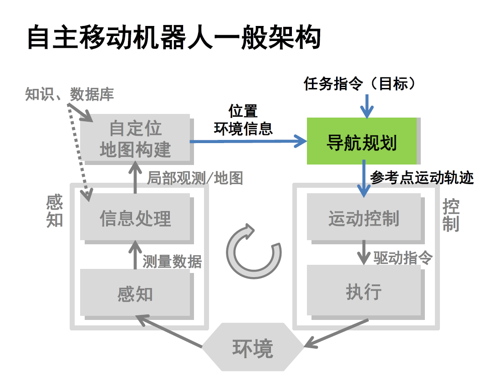

## 避障规划

根据所得到的实时传感器测量信息，规划 调整路径轨迹，以避免发
生碰撞，也称为反应式避障

- 输出一条避障路径
- 输出一个避障速度

### 避障方法

- 反应式避障，不改变全局大路径
  - 很快
  - 适用于障碍物没有改变、破坏地图的拓扑结构（即连通关系）
- 向量势直方图法
  - 类似于人工势场法，对局部有很好的解决
- 动态窗口法

## 向量势直方图法  VFH: V ECTOR F IELD H ISTOGRAM

基本思想：考虑到 势场法仅用推斥势来表示障碍物，从而丢失了局部障碍
物分布的详细信息 ，提出根据环境详细栅格地图构建机器人坐标系下障碍
物概率直方图，根据概率直方图评估选择最优运动方向

- 极坐标离散化表达势场，作直方图

- 统计每个扇形覆盖的障碍物数量

- 可以在线计算，把扇形半径缩小到局部

- 划一条threshold，高于阈值的路径统统剪掉

- 剩余的通道中计算通过成本，选择最低的

  - 成本函数（老司机评价函数）

  - $$
    G = a \cdot target\_direction + b \cdot wheel\_orientation + c \cdot previous\_direction
    $$

  - 方向评价，路径与目标之间的对齐量

  - 转弯评价，新方向当前机器人方向的差异量，和少打方向盘

  - 一致评价，之前选择方向方向和新方向的差异量，不要犹豫

  - 用$a, b, c$做权重调节三个量都是角度量，不需要做归一化

  - 应选择“局部终点”做人工势场

- 转变到速度

## 动态窗口法   (DWA, Dynamic Window)

- 基本思想：在速度空间中搜索适当的平移速度和旋转速度指令——把$v, \omega$离散化

- 从几何空间搜索转化为速度空间搜索

  - 横轴：角速度

  - 纵轴：速度

  - 行驶$\Delta T$的时间，看看是否撞墙，撞哪一面墙

路线是无限段弧的结合，==$\frac{v}{\omega}$==就是转弯半径，倒数就是曲率。不同的速度指令`（v,w）` 会得到不同的运动半径，同样的时间间隔到达不同的终止位置。有些位置是安全的，有些会与障碍物发生碰撞

- 为了算碰撞，每条路都得连续算过去，需要更小的仿真周期，计算量更大

- 限制条件：最大速度、最大加速度

  - 在这一个限制范围内计算就行了，减小计算量

- 此时的老司机函数：

  - $$
    evaluation(v, \omega) = \alpha \cdot heading(v, \omega) + \beta \cdot dist(v, \omega) + \gamma \cdot velocity(v, \omega)\\
    \alpha+\beta+\gamma=1(\alpha,\beta,\gamma \geq0)
    $$
    
    `heading(v, \omega)`朝向目标点:保证机器人朝目标点运动
    
    `dist(v, \omega)`远离障碍物:  保证机器人避开障碍物，安全不碰撞
    
    `velocity(v, \omega)`速度最大化（膨胀项）:保证机器人以最大速度运动
    
    因此预先设计一个十分详细的轨迹实际上也没有意义
    
    少了一项previous direction，因为隐含在采样空间里了，天然考虑加速度

存在问题：

- 根据单步信息数据计算期望速度，在评估选择速度时不考虑速度和路径平滑，容易导致机器人运动存在震动和轨迹扭动问题
- 参数较多，实际实现依赖工程经验，难以适应各种情况
