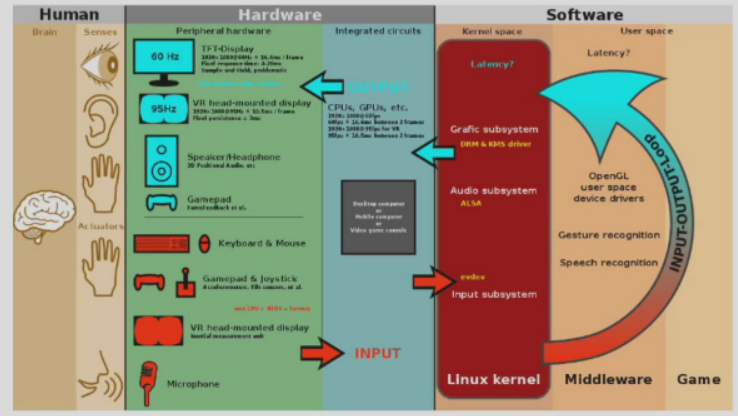
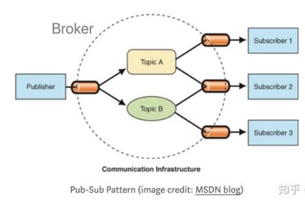
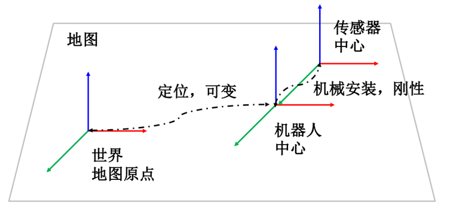
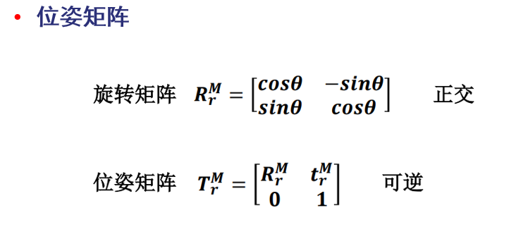
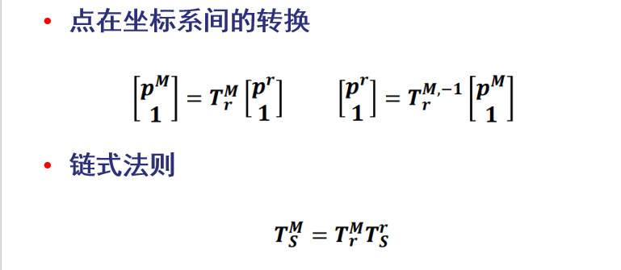
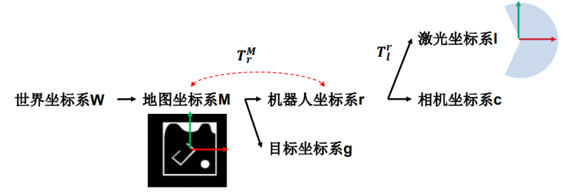
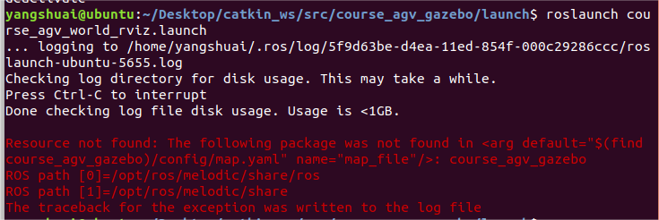

# Introduction to Ros

## ROS - Robot Operating System

扮演了中间件的角色，而非真正意义上的操作系统



* hardware abstraction

* low-level device control

* implementation of commonly used functionality

* message-passing between processes

  通信机制是•**消息采用发布-订阅模式，互相不阻塞**

  

* package management

Instructions in Tutorials on http://wiki.ros.org/ROS/Tutorials

# 坐标系





用右手系来定义，右下角$r$是当前基，右上角$M$是目标基



链式法则：$S \to r \to M$

坐标系树(一般实操的时候为了方便，我们用的都是地图坐标系为基准)



# ROS实操

```shell
# 激活环境变量   再~/catkin_ws/目录下运行
source devel/setup.bash  
```

如何构建一个`catkin_ws`

```shell
# 我的ros版本是melodic
apt install python-catkin-tools
#####  Creating a workspace for catkin
#####  http://wiki.ros.org/cn/catkin/Tutorials/create_a_workspace
mkdir -p ~/catkin_ws/src
cd ~/catkin_ws/
catkin_make
source devel/setup.bash
#####  创建ROS软件包
#####  http://wiki.ros.org/cn/ROS/Tutorials/CreatingPackage
cd ~/catkin_ws
catkin_create_pkg <name> std_msgs rospy roscpp   # <name>可以自己改
catkin_make  # 构建一个catkin工作区并生效配置文件
. ~/catkin_ws/devel/setup.bash
##### http://wiki.ros.org/cn/ROS/Tutorials/WritingPublisherSubscriber%28python%29
roscd <name> #roscd和cd没啥区别
```

**Gazebo 仿真和 Rviz 可视化** 

```shell
# 运行ros程序之前一定要  source devel/setup.bash  
roslaunch /catkin_ws/src/course_agv_gazebo/launch course_agv_world.launch
roslaunch /catkin_ws/src/course_agv_gazebo/launch course_agv_world_rviz.launch
```

# 踩坑笔记

>  如下错误
>
> 
>
> 这个错误并不是因为虚拟机内存开太大或者需要清理ROS日志，而是没有source devel/setup.bash ，明哥ros的命令行窗口都需要使用这个命令

