> 5-8周， 授课内容主要为规划
>
> 仍然和1-4周的思路一直，前2周在python上实现基本的算法，后两周将算法部署到ROS上

## 导航规划

在给定环境的全局或局部知识以及一个或者一系列目标位置的条件下，使机器人能够根据知识和传感器感知信息高效可靠地到达目标位置

- 固定路径导引：有人工标识导引

  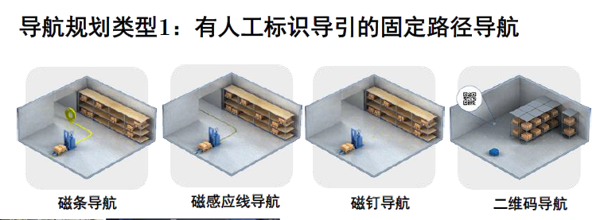

  **AGV**(Automatic Guided Vehicle)自动导引车

  优点：技术成熟、稳定可靠、价格优惠
  缺点：需要施工和维护、路线无法调整

- 无轨导航：有人工标识导引的无固定路径（无轨）导航

  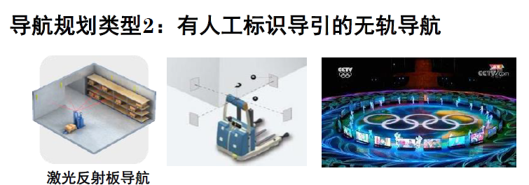
  优点：技术成熟、路径可调
  缺点：需要施工和维护、价格昂贵

- 无轨导航：无标识导引的自然无轨导航

  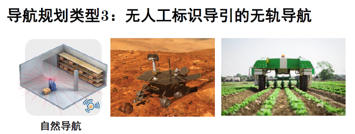

  优点：无需施工、路径可调、精确定位、室内外通用
  缺点：算法复杂，环境变化影响定位可靠性和稳定性

从遥控到自动

路径：世界坐标系下连续的点构成一条路径

## 导航规划类型

- 有人工标识导引的固定路径导航
  - 方式
    - 磁条导航
    - 磁感应线导航
    - 磁钉导航
    - 二维码导航
  - 缺点：自由度不够高
- 有人工标识导引的无轨导航
  - 方式：激光反射板导航等
  - 优点：技术成熟、路径可调
  - 缺点：需要施工和维护，价格昂贵
- 无人工标识导引的无轨导航
  - 自然导航
  - 适用于无法提前布置的位置
  - 优点：无需施工、路径可调、精确定位、室内外通用
  - 缺点：算法复杂、

## 导航规划问题

在给定环境的全局或局部知识以及一个或者一系列目标位置的条件下，使机器人能够根据知识和传感器感知信息高效可靠地到达目标位置

存在的约束“

- 环境几何约束
- 机器人执行约束

## 导航规划的主要内容

- 路径规划
  
  全局概念：怎么走。只考虑工作空间的几何约束，不考虑机器人的运动学模型
  和约束
- 避障规划
  
  局部概念：根据实时传感器测量信息调整路径
  
  如果输出速度，就不需要轨迹规划了
- 轨迹规划
  
  根据运动学模型和约束，用控制命令，将可行路径转化为可行轨迹
  
  - 转化为对时间的函数
  - 求导即可得速度

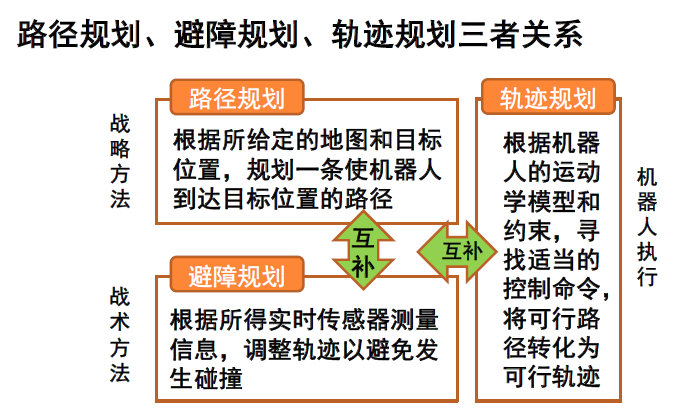

## 工作空间与位形空间(C-Space)

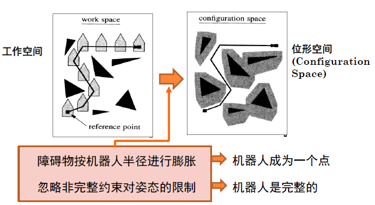

- 工作空间
  
  考虑机器人为刚体
- 位形空间 == 位姿空间 == 姿态空间 (Configuration Space)
  
  考虑$\theta$，是“三维”空间
  
  考虑将机器人做成“圆形”以降维
  
  把障碍扩大，将机器人考虑为点

## 路径规划的完备性要求

- 完备性：当解存在时，能够在有限时间内找到解
  - 放弃完备性换取时间有时也有意义
  - 可以在时间上权衡
- 路径规划算法挑战: 在连续空间内搜索，难以保证时间

## 拓扑连通图构建方法

- 基本思路：空间离散化
- 分辨率完备 Resolution Completeness
  - 权衡：低清化
  - 解析性离散化，确保获得可行解
    - 行车图法：根据分解姿态空间
    - 单元分解法：区分空闲单元和被占单元
    - 势场法：根据障碍物和目标对空间各点施加虚拟力
- 概率完备 Probabilistic Completeness
  - 用有限次模拟采样

### 最优路径搜索方法

- 精确最优搜索法：深度优先法、宽度优先法
- 近似最优搜索法
  - 启发式搜索法： A* D*
  - 准启发式搜索算法： 退火、进化和蚁群优化等

### 1. 行车图法

基于障碍物几何形状分解位形空间，将自由空间的连通性用一维曲线的网格表示，在加入起始点和目标点后，在该一维无向连通图中寻找一条无碰路径

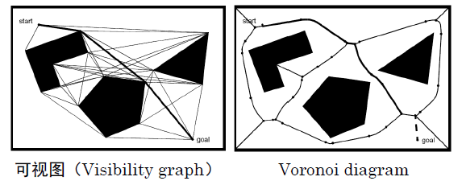

#### 1. 可视图法

可视图由所有**连接可见顶点对的边**组成

- 多边形描述
- 最优解
- 算法复杂
- 不够安全
  - 可膨胀障碍物，不过可能导致
  - 修改路径使与障碍物保持一定距离

#### 2. Voronoi Diagram

基本思想：取障碍物之间的中间点，以最大化机器人和障碍物之间的距离

1. 对于自由空间中的每一点，计算它到最近障碍物的距离；
2. 在垂直于二维空间平面的轴上用高度表示该点到障碍物的距离，类似于画直方图；
3. 当某个点到两个或多个障碍物距离相等时，其距离点处出现尖峰， Voronoi diagram 就由连接这些尖峰点的边组成。

安全性高，但是算起来也很复杂

### 2.单元分解法 - 栅格表示法（四叉树）

1. 首先，将位形空间中的自由空间分为若干的小区域，每一个区域作为一个单元， **以单元为顶点、以单元之间的相邻关系为边** 构成一张连通图；
2. 其次，在连通图中寻找包含初始姿态和目标姿态的单元，搜索连接初始单元和目标单元的路径；
3. 最后，根据所得路径的单元序列生成单元内部的路径

#### 精确单元分解

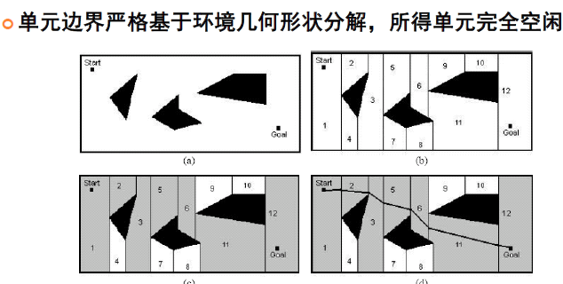

优点：机器人不需要考虑它在每个空闲单元中的具体位置，只需要考虑如何从一个单元移动到相邻的空闲单元
单元数与环境大小无关
缺点： 计算效率极大地依赖于环境中物体的复杂度

#### 近似单元分解

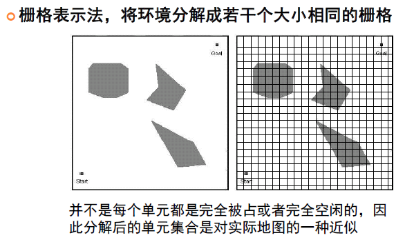
优点:非常简单，与环境的疏密和物体形状的复杂度无关
缺点：对存储空间有要求

#### 可变大小的近似单元分解

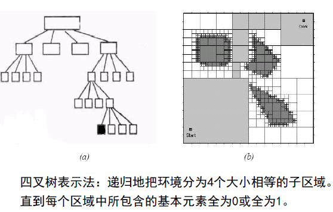

### 3.人工势场法

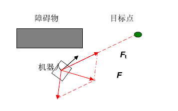

- 构建人工势场
  - 目标点吸引，障碍物排斥
  - 力的合成构成控制律
  - 梯度下降
- 缺点
  - 有稳定平衡点时方法失效
  - 不完备
- 是一个好的实时避障算法

## 路径搜索算法

#### DIJKSTRA 算法

DFS, BFS

#### 启发式搜索算法：A*

基于优先级定义的广度优先搜索
根据启发式评估函数在连通图中寻找最优路径
当选择下一个探索结点时，通过启发式评估函数进行评估，选择路径代价最小的结点作为下一步探索结点而跳转其上
$$
评估函数： f(n)=g(n)+h(n)
$$
$g(n) $表示从起始点到节点的实际代价,$h(n)$为从节点到目标点的最佳路径的估计代价

## 概率完备的连通图构建

### PRM(Probabilistic Roadmap)

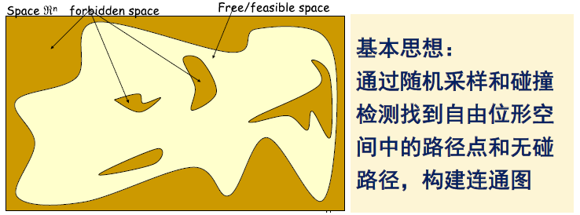

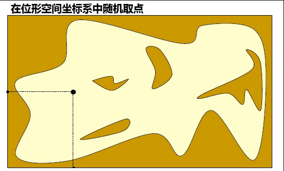

PRM需要考虑的几个问题:

- 随机位形选择:通常采用均匀随机采样方式

- 寻找最近邻点:可以采用KD 树方法加速

- 生成局部路径: 在一定范围内直接连接图节点

- 检查路径无碰: 可以增量式取点或者二分法取点，判断点是否在障碍物区域内

优点：

- 简化了对环境的解析计算，可以快速构建得到行车图

- 适用于高维度自由位形空间中的规划

- 是一个近似完备的路径规划方法

缺点：
- 对自由空间连通性表达的完整性依赖于采样次数
- 从算法通用性上来讲难以评估需要多少时间做充分采样
- 不考虑机器人执行的可行性

### RRT   RRT(Rapid Exploring Random Tree)

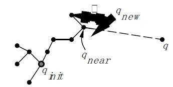

连通图采用树的形式，以起始点作为树的根节点。采用在空间中随机采样、连接树中最近节点的方式拓展树，考虑机器人的运动执行能力，通过树结构可以直接回溯得到路径

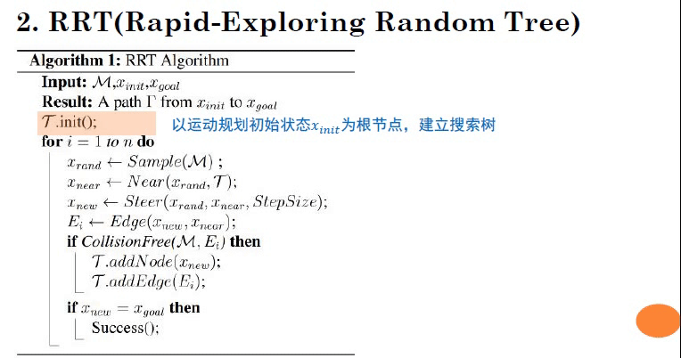

### RRT

### *针对问题：随机性小步扩展导致路径曲折，成本高
RRT* 为实现渐近最优，考虑路径成本

- 寻找树中新节点 邻域内 到 新节点路径 最短的节点，建立连接，加入树集合
- 对树中新节点 邻域 内节点进行判断，如果从新节点到该节点形成的路径优于现有树中路径，则将该节点父节点修改为新节点

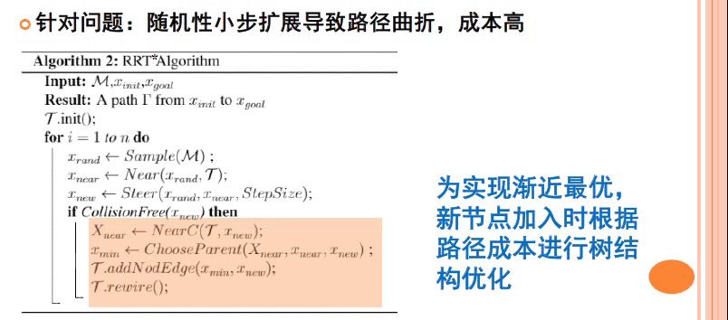

### 分辨率完备与概率完备方法比较

- 空间离散采样：
  分辨率完备是基于解析计算的姿态空间分解
  概率完备是基于随机采样生成连通图或者树
- 位形空间连通性表示：
  分辨率完备完全表达了自由空间的连通性 高维情况下计算负担重
  概率完备方法是近似表达了连通性，但计算快速，只需要计算单个
  机器人姿态是否存在碰撞，其效率与碰撞检测模块效率相关
