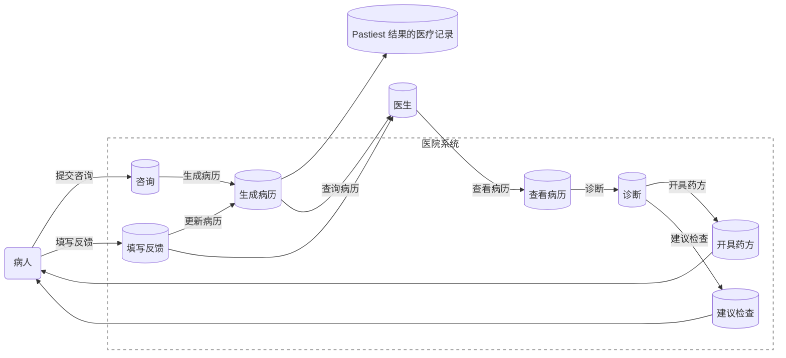

# 03


# 04.2

```
@startuml
[*] --> 登录系统

state 登录系统 {
    [*] --> 用户访问登录页面
    用户访问登录页面 --> 用户输入账号密码: 输入账号密码
    用户输入账号密码 --> 登录成功: 验证成功
    登录成功 --> [*]
    用户输入账号密码 --> 登录失败: 验证失败
    登录失败 --> [*]
}

登录系统 --> 服务选择

state 服务选择 {
    [*] --> 查看医生列表
    [*] --> 查询处方
    [*] --> 访问电子病历
    [*] --> 参与医疗服务评价
    [*] --> 查看科室信息
    [*] --> 预约挂号与问诊服务
    [*] --> 时段灵活性与个性化预约
    [*] --> 医疗费用账单管理
    [*] --> 缴费与退费流程
    查看医生列表 --> [*]
    查询处方 --> [*]
    访问电子病历 --> [*]
    参与医疗服务评价 --> [*]
    查看科室信息 --> [*]
    预约挂号与问诊服务 --> [*]
    时段灵活性与个性化预约 --> [*]
    医疗费用账单管理 --> [*]
    缴费与退费流程 --> [*]
}

服务选择 --> 预约挂号与问诊服务
预约挂号与问诊服务 --> 完成问诊 : 完成问诊
完成问诊 --> 电子问诊单与后续跟进 : 接收电子问诊单
电子问诊单与后续跟进 --> [*] : 结束

服务选择 --> 时段灵活性与个性化预约
时段灵活性与个性化预约 --> 预约成功 : 确认预约
预约成功 --> [*] : 结束

服务选择 --> 缴费与退费流程
缴费与退费流程 --> 完成支付 : 完成在线支付
完成支付 --> [*] : 结束

服务选择 --> 医疗费用账单管理
医疗费用账单管理 --> 查看费用账单 : 查看账单
查看费用账单 --> [*] : 结束

服务选择 --> 查询处方
查询处方 --> 查看处方详情 : 查看详情
查看处方详情 --> [*] : 结束

服务选择 --> 访问电子病历
访问电子病历 --> 查看病历详情 : 查看详情
查看病历详情 --> [*] : 结束

服务选择 --> 参与医疗服务评价
参与医疗服务评价 --> 提交评价 : 填写并提交评价
提交评价 --> [*] : 结束

@enduml
```


# 04.3

```
@startuml
class User {
  +String username
  +String password
  +String email
  +List<Prescription> prescriptions
  +List<MedicalRecord> medicalRecords
  +makeAppointment()
  +consultDoctor()
  +viewPrescriptions()
  +viewMedicalRecords()
}

class Prescription {
  +String prescriptionID
  +Date date
  +String doctorName
  +String details
}

class MedicalRecord {
  +String recordID
  +Date date
  +String doctorName
  +String diagnosis
  +String treatment
}

User "1" -- "*" Prescription : has >
User "1" -- "*" MedicalRecord : has >
@enduml
```

```uml
@startuml
class AppointmentService {
  +List<Appointment> appointments
  +makeAppointment(User user, Doctor doctor, DateTime datetime)
  +cancelAppointment(Appointment appointment)
}

class Appointment {
  +DateTime datetime
  +Doctor doctor
  +User user
  +Status status
}

class Doctor {
  +String doctorID
  +String name
  +String specialty
  +List<Appointment> appointments
  +consult(User user)
}

class ConsultationService {
  +conductConsultation(Appointment appointment)
  +providePrescription()
  +provideMedicalRecord()
}

enum Status {
  Scheduled
  Cancelled
  Completed
}

AppointmentService "1" -- "*" Appointment
Appointment "*" -- "1" Doctor : consults >
Appointment "*" -- "1" User : booked by >
Doctor "1" -- "*" Appointment : has >
@enduml
```


```
@startuml
class EvaluationSystem {
  +List<Evaluation> evaluations
  +submitEvaluation(User user, Doctor doctor, String content, int rating)
  +viewEvaluations(Doctor doctor)
}

class Evaluation {
  +String evaluationID
  +User user
  +Doctor doctor
  +String content
  +int rating
  +DateTime datetime
}

class Doctor {
  +String doctorID
  +String name
  +String specialty
  +receiveEvaluation(Evaluation evaluation)
}

EvaluationSystem "1" -- "*" Evaluation : collects >
Evaluation "*" -- "1" Doctor : evaluated >
Evaluation "*" -- "1" User : submitted by >
@enduml

```

# 顶层数据流


# 中层数据流图





