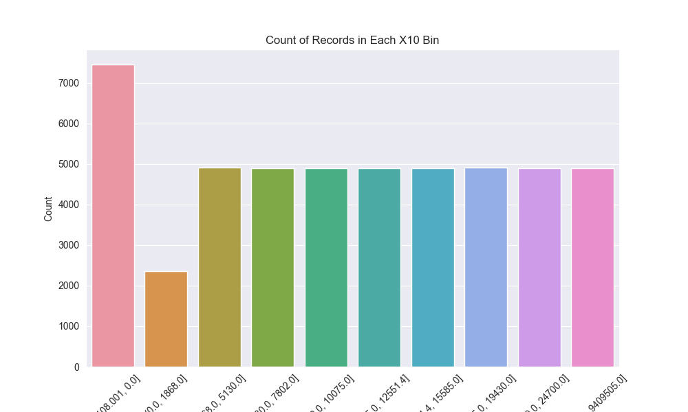

<center>
  <font face="黑体" size = 5>
    《金融科技导论与实践》
  </font>
   <center><font face="黑体" size = 5>
     实验1
  </font>
   <center><font face="黑体" size = 4>
     金融数据预处理
  </font>
  <center><font face="黑体" size = 4>
    姓名： 周炜
  </font>
  <center><font face="黑体" size = 4>
    学号： 32010103790
  </font>
</center> 

### 实验目的

1. 掌握数据预处理的几个基本流程
2. 学习`Pandas`, `Numpy`等软件包的使用,学会基于Pandas进行数据预处理

### 环境要求

**所有的环境要求我都写了一份**`requirement.txt`(已经定义换源)放在各自的工程文件中, 以下我列出了一些重要的配置，并且给出了`conda`配置环境的`shell`命令：

```shell
conda create -n fintech python=3.8
conda activate fintech
python -m pip install -r requirements.txt
```

### 文件组织

```shell
└── lab1 数据处理
    ├── data  # 数据集       
    │   ├── feature_x 
    │   ├── test_new
    │   ├── test # 切分后用于测试的数据
    │   ├── train_new
    │   └── train # 切分后用于训练的数据
    ├── code.ipynb
    └── requirements.txt # 环境配置文件  
```

### 实验内容

实验数据来源于基于某互金公司 2018 年累计的贷后数据，每个用户数据原始特征维度在70 左右

##### 读入数据集

```python
test = pd.read_csv('data/test_new.csv')
train = pd.read_csv('data/train_new.csv')
feature = pd.read_csv('data/feature_x.csv')
```

分别使用`data.shape`来打印`DataFrame`大小，用`data.head()`方法打印输出前$5$行，输出结果不再赘述，具体可见于`code.ipynb`

```python
print("train_new\n shape :", train.shape, '\n',train.head())
print("test_new\n shape :", test.shape, '\n',test.head())
print("feature_x\n shape :", feature.shape, '\n',feature.head())
```

绘制`train`和`test`两个数据集的可视化图表（这里代码只展示了`train`,`test`类似）：

```python
import seaborn as sns
import matplotlib.pyplot as plt
sns.set_style("darkgrid") 
sns.set_palette("pastel") 
# 绘制train数据集中X1特征的直方图
plt.figure(figsize=(8, 6))
sns.histplot(data=train, x='X1', bins=30, kde=True)
plt.title('Distribution of X1')
plt.xlabel('X1')
plt.ylabel('Count')
plt.savefig('1.png')
# 绘制train数据集中X2和X3特征之间的散点图
plt.figure(figsize=(8, 6))
sns.scatterplot(data=train, x='X2', y='X3')
plt.title('Scatter Plot of X2 vs X3')
plt.xlabel('X2')
plt.ylabel('X3')
plt.savefig('2.png')
# 计算train数据集中特征的相关系数矩阵
correlation_matrix = train.corr()
# 绘制相关系数矩阵的热力图
plt.figure(figsize=(10, 8))
sns.heatmap(data=correlation_matrix, annot=True, cmap='coolwarm')
plt.title('Correlation Matrix')
plt.savefig('3.png')
# 绘制train数据集中X4特征的箱线图
plt.figure(figsize=(8, 6))
sns.boxplot(data=train, y='X4')
plt.title('Box Plot of X4')
plt.ylabel('X4')
plt.savefig('4.png')
```

下图均为左侧`train`，右侧`test`

直方图（Histogram）：用于展示数值型特征的分布情况


散点图（Scatter Plot）：用于展示两个数值型特征之间的关系


箱线图（Box Plot）：用于展示数值型特征的分布和离群值


绘制feature数据集中output_feat特征的柱状图

```python
plt.figure(figsize=(8, 6))
sns.countplot(data=feature, x='output_feat')
plt.title('Count Plot of output_feat')
plt.xlabel('output_feat')
plt.ylabel('Count')
plt.savefig('5.png')
```


##### 观察数据

- 数据缺失情况

```python
test_new_missing_count = test.isnull().sum()
train_new_missing_count = train.isnull().sum()
feature_x_missing_count = feature.isnull().sum()
print("test_new :\n", test_new_missing_count[0:10])
print("train_new:\n", train_new_missing_count[0:10])
print("feature_x:\n", feature_x_missing_count[0:10])
```

绘制条形图，由于feature没有缺失值，因此没有绘制

```python
test_missing_df = pd.DataFrame({'Feature': test_new_missing_count.index, 'Missing Count': test_new_missing_count.values})
train_missing_df = pd.DataFrame({'Feature': train_new_missing_count.index, 'Missing Count': train_new_missing_count.values})
missing_df = pd.concat([test_missing_df, train_missing_df], keys=['test_new', 'train_new'])
plt.figure(figsize=(10, 6))
sns.barplot(data=missing_df, y='Missing Count', x='Feature', hue=missing_df.index.get_level_values(0))
plt.title('Missing Values in Test and Train Datasets')
plt.xlabel('Missing Count')
plt.ylabel('Feature')
plt.legend(title='Dataset')
plt.savefig('missing')
```


- 特征之间、特征与Label的相关度等

```python
# 绘制测试集相关系数矩阵的热力图
plt.figure(figsize=(10, 8))
sns.heatmap(data=test.corr(), cmap='coolwarm', annot=True)
plt.title('Correlation Heatmap - Test Dataset')
plt.savefig('Correlation Heatmap - Test Dataset')
# 绘制训练集相关系数矩阵的热力图
plt.figure(figsize=(10, 8))
sns.heatmap(data=train.corr(), cmap='coolwarm', annot=True)
plt.title('Correlation Heatmap - Train Dataset')
plt.savefig('Correlation Heatmap - Train Dataset')
# 相关性矩阵
print(test.corr())
print(train.corr())
```


由于`feature`是非数字类型，需要先编码再绘图

```python
# 使用独热编码转换非数值型特征
encoded_feature = pd.get_dummies(feature['output_feat'], prefix='output_feat')
# 计算特征相关系数矩阵
correlation_matrix = encoded_feature.corr()
# 绘制热力图
plt.figure(figsize=(10, 8))
sns.heatmap(data=correlation_matrix, cmap='coolwarm', annot=True)
plt.title('Correlation Heatmap - Feature Dataset')
plt.savefig('Correlation Heatmap - Feature Dataset')
```


#### 处理缺失数据

- 默认值填充

直接处理成`np.nan`会有一些问题，`nan`同样会被识别为空

```python
train_1 = train.copy()
#缺失值填充为-1
train_1.fillna(-1, inplace=True)
#将所有值为-1的数据置为np.NAN
train_1.replace(-1, np.NAN, inplace=True)
print(train_1.X5.head())
print(train_1.isnull().sum())
```

- 平均值填充

```python
train_2 = train.copy()
train_2.X5.fillna(train_2.X5.mean(), inplace=True)
print(train_2.X5.head())
print(train_2.isnull().sum())
```

- 删除不完整的行

```python
train_3 = train.copy()
#任何包含空值的行
print(train_3.dropna(inplace=False).shape)
#删除label为空的行
print(train_3.dropna(subset=['X5'], inplace=False).shape)
#删除所有值为空的行
print(train_3.dropna(how='all', inplace=False).shape)
#删除至少有50个非空值的行
print(train_3.dropna(thresh=50, inplace=False).shape)
```

输出结果为：

```shell
(97, 74)
(41109, 74)
(50000, 74)
(45861, 74)
```

#### 数据变换与离散化

##### 1. 缩放

```python
# 找到数值属性
train_4 = train.copy()
num_feats = train_4.dtypes[train_4.dtypes!="object"].index
# 最大最小值规范化
train_4[num_feats] = train_4[num_feats].apply(lambda x: (x - x.min()) / (x.max() - x.min())) 
print(train_4.head())
```

##### 2. 规范化

缩放只会改变数据的范围，而规范化会同时改变数据范围和分布，使之符合正态分布

```python
# 使用零均值规范化
train_4[num_feats] = train_4[num_feats].apply(lambda x: (x - x.mean()) / x.std())
# 绘制经过零均值规范化后的X1特征的密度图
plt.figure(figsize=(8, 6))
sns.set_palette("viridis")
sns.kdeplot(data=train_4, x='X1')
plt.title('Density Plot of X1 (Normalized)')
plt.xlabel('X1 (Normalized)')
plt.ylabel('Density')
plt.savefig('Gauss.png')
```

绘制的密度函数图像为：


##### 3. 离散化

等深分箱将数据集按记录行数分箱，每箱具有相同的记录数，这里选择了10

```python
# 等深分箱, 记录数为10
train_5 = train.copy()
train_5_X10_bin = pd.qcut(train_5.X10, q=10, duplicates='drop')
print(train_5_X10_bin.value_counts())
# 绘制柱状图
train_5_X10_bin_counts = train_5_X10_bin.value_counts().reset_index()
train_5_X10_bin_counts.columns = ['X10_bin', 'count']
plt.figure(figsize=(10, 6))
sns.barplot(x='X10_bin', y='count', data=train_5_X10_bin_counts)
plt.xlabel('X10 Bin')
plt.ylabel('Count')
plt.title('Count of Records in Each X10 Bin')
plt.xticks(rotation=45)
plt.savefig('Count of Records in Each X10 Bin')
```



```python
# 等宽分箱, 用两种分箱方式
train_5_X41_width_bin = pd.cut(train_5.X41, bins=10, duplicates='drop')
print(train_5_X41_width_bin.value_counts())
train_5_X41_width_bin2 = pd.cut(train_5.X41, bins=[100, 200, 300, 400, 500, 600])
print(train_5_X41_width_bin2.value_counts())

plt.figure(figsize=(10, 6))
sns.countplot(x=train_5_X41_width_bin, data=train_5)
plt.xticks(rotation=45)
plt.xlabel('X41 - Width Bins')
plt.ylabel('Count')
plt.title('Count Distribution - X41 Width Bins')
plt.savefig('p4.png')
plt.figure(figsize=(8, 6))
sns.countplot(x=train_5_X41_width_bin2, data=train_5)
plt.xticks(rotation=45)
plt.xlabel('X41 - Custom Bins')
plt.ylabel('Count')
plt.title('Count Distribution - X41 Custom Bins')
plt.savefig('p5.png')
```


#### 特征交叉

将X5和X10交叉,根据指定的两个特征（`feature_1`和`feature_2`），创建一个新的交叉特征（`feature_1 + '_' + feature_2`）

```python
def cross(data, feature_1, feature_2):
    comb_index = data[[feature_1, feature_2]].drop_duplicates()
    comb_index[feature_1 + '_' + feature_2] = np.arange(comb_index.shape[0])
    data = pd.merge(data, comb_index, on=[feature_1, feature_2], how='left')
    return data
train_6 = train.copy()
train_6 = cross(train_6, 'X5', 'X10')
print(train_6[['X5', 'X10', 'X5_X10']])
# 绘制散点图和拟合曲线
plt.figure(figsize=(8, 6))
sns.scatterplot(data=train_6, x='X5', y='X10', hue='X5_X10', palette='coolwarm')
sns.regplot(data=train_6, x='X5', y='X10', scatter=False, color='black')
plt.title('Relationship between X5 and X10')
plt.xlabel('X5')
plt.ylabel('X10')
plt.legend(title='X5_X10')
plt.savefig('x5x10')
```


可见交叉之后关联度提高

#### 数据集切分

```python
num_train = int(train.shape[0] * 0.8)
new_train = train[:num_train]
new_test = train[num_train:]
print(new_train.shape, new_test.shape)
new_train.to_csv('data/train.csv')
new_test.to_csv('data/test.csv')
```

切分后的数据可以见于文件夹
