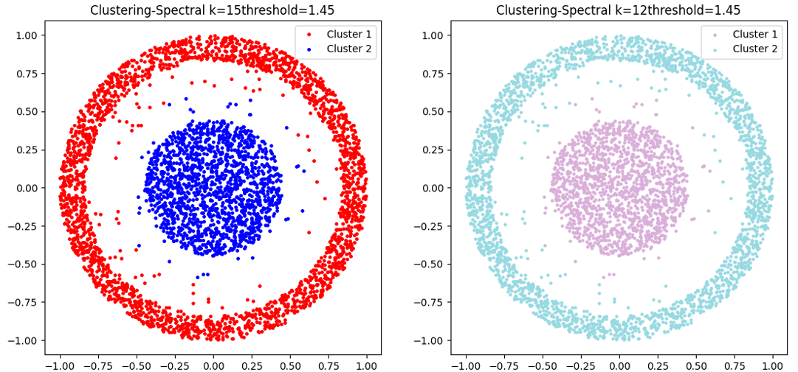
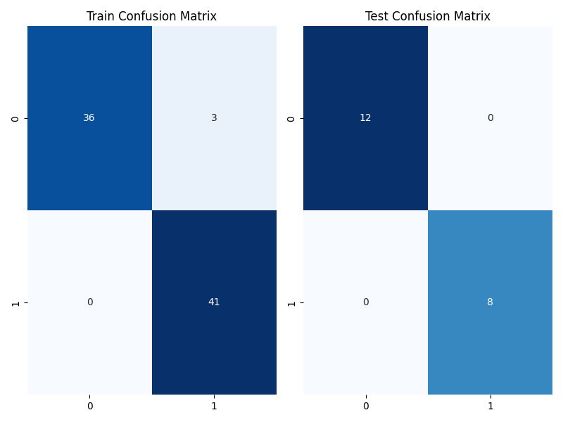

<center>
  <font face="黑体" size = 5>
    《金融科技导论与实践》
  </font>
   <center><font face="黑体" size = 5>
     实验2
  </font>
   <center><font face="黑体" size = 4>
     聚类与分类
  </font>
  <center><font face="黑体" size = 4>
    姓名： 周炜
  </font>
  <center><font face="黑体" size = 4>
    学号： 3210103790
  </font>
</center> 


### 实验目的

1. 通过实验了解聚类与分类的应用场景
2. 熟练掌握至少两种聚类算法的原理，并了解不同算法的优劣势
3. 熟练掌握至少一种分类算法的原理

### 环境要求

**所有的环境要求我都写了一份**`requirement.txt`(已经定义换源)放在各自的工程文件中, 以下我列出了一些重要的配置，并且给出了`conda`配置环境的`shell`命令：

```shell
conda create -n fintech python=3.8
conda activate fintech
python -m pip install -r requirements.txt
```

### 文件组织

```shell
└── lab2 
    ├── classification  # 分类      
    │   ├── classification.py 
    │   ├── gen_data.py  # 数据生成
    │   ├── plot.py
    │   ├── todo.py  # 实现分类算法
    ├── clustering   # 聚类
    │   ├── cluster_data.mat # 聚类的训练集 
    │   ├── clustering.py
    │   ├── plot.py
    │   ├── todo.py  # 实现聚类算法
    └── requirements.txt # 环境配置文件  
```

### 聚类算法实现

####  k-means 算法实现

`clustering/todo.py`中实现`k-means `算法


```python
def kmeans(X, k):
    N, P = X.shape
    idx = np.zeros(N)
    centers = X[np.random.choice(N, k, replace=False)]      # k x P 矩阵，从X中随机选择k个不同的点作为聚类中心
    while True:
        idx_old = idx.copy()
        for i in range(N):
            idx[i] = np.argmin(cdist(X[i].reshape(1, P), centers))
        if np.array_equal(idx, idx_old):
            break
        for i in range(k):                                  # 更新聚类中心
            centers[i] = X[idx == i].mean(axis=0)
    return idx
```

#### k-medoids 算法实现

在`clustering/todo.py`中实现`k-medoids`算法

`K-Medoids`是一种基于`K-Means`的聚类算法，不同之处在于`K-Medoids`选择的聚类中心是实际数据点，而不仅仅是数据集中的某个均值

```python
def kmedoids(X, k):
    N, P = X.shape
    idx = np.zeros(N)
    centers = X[np.random.choice(N, k, replace=False)]  # k x P 矩阵，从X中随机选择k个不同的点作为聚类中心
    while True:
        idx_old = idx.copy()
        for i in range(N):
            distances = cdist(X[i].reshape(1, P), centers)  # 计算点X[i]到所有聚类中心的距离
            idx[i] = np.argmin(distances)  # 将点分配给最近的聚类中心的索引
        if np.array_equal(idx, idx_old):
            break
        for i in range(k):
            cluster_points = X[idx == i]  # 获取分配给当前聚类中心的所有点
            medoid_index = np.argmin(np.sum(cdist(cluster_points, cluster_points), axis=1))  # 找到Medoid的索引
            centers[i] = cluster_points[medoid_index]  # 将聚类中心更新为Medoid
    return idx
```

两种算法的效果为：


#### 实现谱聚类算法

在`clustering/todo.py`中的`spectral`函数下实现谱聚类算法

```python
def spectral(W, k):
    N = W.shape[0]
    idx = np.zeros((N, 1))
    D = np.diag(np.sum(W, axis=1)) # 支持数矩阵和拉普拉斯矩阵
    L = D - W
    eig_value, eig_vector = np.linalg.eig(L) # 得到特征值和特征向量
    index = np.argsort(eig_value) # 对特征值和特征向量进行排序
    X = eig_vector[:, index[:k]]
    X = X.astype(float)  # keep real part, discard imaginary part
    idx = kmeans(X, k)
    return idx
```

之后在`clustering.py`调试 `knn_graph `的参数，优化谱聚类的效果

首先使用默认参数： `k=15`, `threshold=1.45`得到效果如下：


使用控制变量法，首先保持`threshold=1.45`不变，改变`k`的值依次为`12`, `8`, `4` , `2`

`k=2` 的时候效果非常差，几乎没有聚类。`k=4`有一定的聚类的倾向，但仍然有一块外圈点没能成功聚类


`k=8` 的时候已经成功聚类，且分类效果与`k=15`已经相差无几，但整体上，在两环中央的点还是更容易分类到外圈


`k=12`的时候已经基本一致



如果增加`k`, 使得`k=25` 可以看到，分类效果基本没什么区别, 只有极少数的点分类结果不一致，说明`k`增到足够大后，其效果不再明显


接下来固定`k=15`, 依次改变`threhold`的值
`threhold=0.2`, 几乎没有分类


 而`threhold=0.2`以及`threhold=0.5`, 基本实现了分类，并且效果差不多


而`threhold=5`, 分类结果仍然类似， 说明足够大以后效果也基本一致


这说明`k`和`threhold`这两个参数都是足够大以后即可发挥其聚类效果, 而 `k=15`, `threshold=1.45`已经能够非常好的实现聚类

### 分类算法实现

在`classification/classification.py`中将数据集，按照`4:1`划分为训练集和测试集合

```python
no_train = 80 # number of training data
no_test = 20 # number of testing data
```

在每次迭代中计算训练和测试数据的预测结果

```python
train_pred = np.sign(np.dot(w_l.T, train_a))
test_pred = np.sign(np.dot(w_l.T, test_a))
```

计算训练和测试数据的混淆矩阵

```python
train_cm = confusion_matrix(y_train.flatten(), train_pred.flatten())
test_cm = confusion_matrix(y_test.flatten(), test_pred.flatten())
```

使用Seaborn库中的热图函数可视化混淆矩阵

```python
plt.figure(figsize=(8, 6))
plt.subplot(121)
sns.heatmap(train_cm, annot=True, cmap="Blues", fmt="d", cbar=False)
plt.title("Train Confusion Matrix")

plt.subplot(122)
sns.heatmap(test_cm, annot=True, cmap="Blues", fmt="d", cbar=False)
plt.title("Test Confusion Matrix")

plt.tight_layout()
plt.savefig('pic/Confusion Matrix'+ type_choice[ch])
```

#### 线性回归算法实现

`classification/todo.py`中实现线性回归算法

```python
    else:
        A = np.vstack((np.ones((1, N)), X)).T
        w = np.dot(np.dot(np.linalg.inv(np.dot(A.T, A)), A.T), y.T)
```


所得错误率：

```
Training error: 0.04148749999999998
Testing error: 0.05174999999999991
```

混淆矩阵为


说明分类效果较好

#### 支持向量机（SVM）回归实现

`classification/todo.py`中实现SVM回归算法

```PYTHON
    if type == "svm":
        func = lambda t: np.dot(t, t)
        cons = ({'type': 'ineq', 'fun': lambda t: np.dot(np.dot(t, np.vstack((np.ones((1, N)), X))), y.T) - 1})
        w = minimize(func, w, constraints=cons).x
```


所得错误率：

```
Training error: 0.15517499999999992
Testing error: 0.16449999999999998
```

混淆矩阵为：



可以看到，SVM模型训练出来的结果与实际直线的平行度更好，但其拟合直线其实和线性回归模型相比偏差反而较大

#### 感知机（Perceptron）回归实现

`classification/todo.py`中实现Perceptron回归算法

感知机算法是一个迭代算法，它通过不断更新权重来减少误分类样本的数量。在每次迭代中，如果存在误分类样本，则更新权重 `w`。如果没有误分类样本，则算法停止迭代

```python
    elif type == 'perceptron':
        max_iter = 1000
        alpha = 0.1
        X = np.vstack((np.ones((1, N)), X))
        y = y.reshape(1, -1)
        for _ in range(max_iter):
            misclassified = False
            for i in range(N):
                if np.sign(np.dot(w.T, X[:, i])) != y[:, i]:
                    w += alpha * y[:, i] * X[:, i].reshape(-1, 1)
                    misclassified = True
            if not misclassified:
                break
```


所得错误率：

```
Training error: 1.25e-05
Testing error: 0.017050000000000065
```

混淆矩阵为：


可以发现**感知机的分类效果最好**， 特别是训练集，为前两个分类算法错误率的$10^{-4}$倍

#### 分类算法比较

##### 目标：

- 线性回归的目标是通过拟合一个线性模型，最小化实际观测值与预测值之间的平方误差，以预测连续的数值输出
- 感知机的目标是通过寻找一个**线性超平面**
- SVM的目标是找到一个**最大间隔的超平面**，使得不同类别的样本在特征空间中的投影距离最大化

##### 方法：

- 线性回归使用最小二乘法或梯度下降等优化算法，直接拟合数据来学习线性模型的参数
- 感知机使用迭代的方式，根据样本的误分类情况不断更新权重，直到找到一个能够将样本正确分类的超平面
- SVM通过求解凸优化问题来找到最优的超平面，可以使用核函数来处理非线性可分的情况

##### 分类能力：

- 线性回归主要用于**回归问题**，对于分类问题效果可能不理想，因为它只能输出连续的数值。
- 感知机适用于**线性可分的二分类问题**，但对于线性不可分的问题，它可能无法收敛或找到一个较好的超平面
- SVM在处理线性可分问题时表现良好，并且通过使用核函数，可以有效处理线性不可分和非线性问题

在本次实验中，感知机的表现最好，推测可能的原因为：

- 线性可分性：感知机在处理线性可分问题时具有收敛性保证，即使初始权重随机选择，它也能找到一个将样本正确分类的超平面
- 迭代更新：感知机通过在每次迭代中更新权重，不断调整超平面的位置，以减少误分类样本的数量。这种迭代更新的机制使得感知机能够适应较大的样本空间和复杂的决策边界
