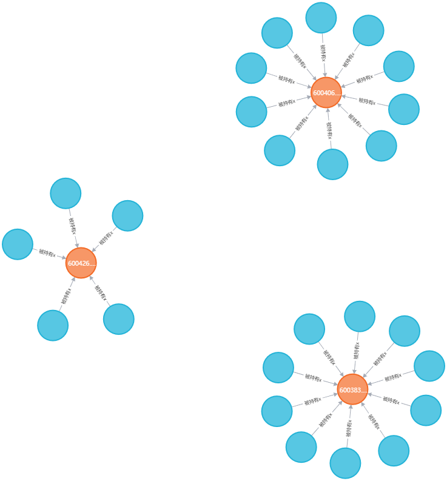
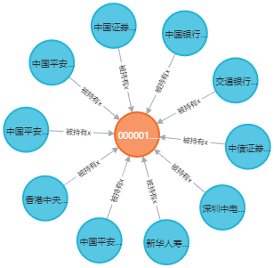
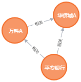

<center>
  <font face="黑体" size = 5>
    《金融科技导论与实践》
  </font>
   <center><font face="黑体" size = 5>
     实验7
  </font>
   <center><font face="黑体" size = 4>
     智能营销
  </font>
  <center><font face="黑体" size = 4>
    姓名： 周炜
  </font>
  <center><font face="黑体" size = 4>
    学号： 32010103790
  </font>
</center> 


### 实验目的

基于企业数据集，学习知识图谱构建以及知识图谱的可视化分析

利用上市企业数据集，构建创建企业、行业、股东、概念等实体，构建企业-企业、企业-行业、企业-股东、企业-概念等关系，形成企业知识图谱，并进行可视化分析

### 数据集

```bash
• enterprise_basic.csv # 上市企业基本信息
• enterprise_concept.csv # 企业股票的相关概念
• enterprise_holders.csv # 企业前10名股东
• enterprise_notices.csv # 企业相关公告标题
• stock_prices.csv # 企业股票2022年的股票价格
```

### 环境配置

参考[教程](https://blog.csdn.net/jing_zhong/article/details/112557084)以及实验指导文档，完成`JDK 11`在内的基础环境配置

用`java --version`验证`JDK11`是否安装成功

```bash
C:\Users\Administrator>java -version
java version "11.0.19" 2023-04-18 LTS
Java(TM) SE Runtime Environment 18.9 (build 11.0.19+9-LTS-224)
Java HotSpot(TM) 64-Bit Server VM 18.9 (build 11.0.19+9-LTS-224, mixed mode)
```

本地安装`Neo4j Community 4.x.x`的最新版客户端版

`Neo4j`是一款[NoSQL](https://en.wikipedia.org/wiki/NoSQL)图数据库，具备高性能的读写可扩展性，基于高效的图形查询语言`Cypher`，更多介绍可访问[neo4j官网](https://neo4j.com/)，官网还提供了[Online Sandbox](https://neo4j.com/sandbox/)实现快速上手体验

并且用`pip`安装工具配置与`Neo4j`对应版本的`py2neo`

```bash
pip install py2neo==2021.2.3
```

安装完成后的效果如下图


然后按照下列步骤新建并且打开一个数据库：

（1）访问页面：http://localhost:7474

（2）初始账户为`neo4j`,`host`类型选择`bolt`, 密码为建立数据库时的密码


### 基于py2neo在Neo4j数据库上构建企业知识图谱

> [参考代码](https://github.com/jm199504/Financial-Knowledge-Graphs

##### a. 数据读取

基于`pandas`读取所有的数据文件

我把数据集放在了桌面上，因此使用绝对地址进行读取

```python
holder = pd.read_csv('C:/Users/Administrator/Desktop/data/enterprise_holders.csv')
stock = pd.read_csv('C:/Users/Administrator/Desktop/data/enterprise_basic.csv')
concept = pd.read_csv('C:/Users/Administrator/Desktop/data/enterprise_concept.csv')

notice = pd.read_csv('C:/Users/Administrator/Desktop/data/enterprise_notices.csv')
price = pd.read_csv('C:/Users/Administrator/Desktop/data/stock_prices.csv')
```

##### b. 连接neo4j

注意由于py2neo版本差异，一些版本对应的代码不同， 直接使用参考代码所给的

```python
# 连接Neo4j数据库
graph = Graph('bolt://localhost:7687',username='neo4j',password='123')
```

会发生报错，应该采用

```python
# 连接Neo4j数据库
uri = 'bolt://localhost:7687'
auth = ('neo4j','123')
graph = Graph(profile='http://localhost:7474/', auth = auth)
```

##### c. 创建实体

基于`py2neo.Node`依次创建企业、行业、股东、概念实体，并且补充相关节点属性，请避免实体重复创建问题

```python
# 股东实体
for i in holder.values:
   a = Node('股东',TS代码=i[0],股东名称=i[3],持股数量=i[4],持股比例=i[5])
   #print('TS代码:'+str(i[0]),'股东名称:'+str(i[3]),'持股数量:'+str(i[4]))
   graph.create(a)
```


```python
# 股票实体
for i in stock.values:
   a = Node('股票',TS代码=i[0],企业名称=i[1],行业=i[2], 交易所=i[3])
   # print('TS代码:'+str(i[0]),'股票名称:'+str(i[1]),'行业:'+str(i[2]))
   graph.create(a)
```


```python
# 概念实体
for i in concept.values:
   a = Node('概念',概念名称=i[0],股票代码=i[1])
   # print('概念:'+str(i[0]),'股票代码:'+str(i[1]))
   graph.create(a)
```


```python
# 行业实体
for i in stock.values:
   a = Node('行业',行业=i[2],企业名称=i[1])
   graph.create(a)
```


##### 额外：价格实体

```python
# 价格实体
for i in price.values:
   a = Node('价格',股票代码=i[0], 交易日期=i[1], 开盘价=i[2], 最高价=i[3], 最低价=i[4], 收盘价=i[5],成交量=i[6])
   graph.create(a)
```


##### d. 创建关系

基于`py2neo.Relationship`依次创建企业-企业、企业-行业、企业-股东、企业-概念关系，并且补充相关关系属性

i. 基于`py2neo.NodeMatcher`查找`node`

```python
# 企业-概念
for i in concept.values:
   a = matcher.match("股票",TS代码=i[1]).first()  # 这里应该匹配股票代码，而不是概念名称
   b = matcher.match("概念",概念名称=i[0]).first()
   if a and b:
       r = Relationship(a,'概念属于',b)
       graph.create(r)
```


```python
# 企业-行业关系
industry_nodes = {}
for i in stock.values:
    stock_node = Node('股票', TS代码=i[0])
    industry_name = i[2]
    if industry_name in industry_nodes:
        industry_node = industry_nodes[industry_name]
    else:
        industry_node = Node('行业', 行业=industry_name)
        graph.create(industry_node)
        industry_nodes[industry_name] = industry_node
    graph.create(stock_node)
    r = Relationship(stock_node, '属于', industry_node)
    graph.create(r)
```


```python
# 股东-股票关系
holder_nodes = {}
for i in holder.values:
    holder_name = i[3]
    stock_code = i[0]
    holding_quantity = i[4]
    holding_ratio = i[5]
    if holder_name not in holder_nodes:
        holder_node = Node('股东', 股东名称=holder_name)
        graph.create(holder_node)
        holder_nodes[holder_name] = holder_node
    stock_node = Node('股票', TS代码=stock_code)
    graph.create(stock_node)
    r = Relationship(holder_node, '持有股票x', stock_node, 持股数量=holding_quantity, 持股比例=holding_ratio)
    graph.create(r)
# 股东-股票关系
stock_nodes = {}  # 用于存储已创建的股票节点
for i in holder.values:
    holder_name = i[3]
    stock_code = i[0]
    if stock_code not in stock_nodes:
        stock_node = Node('股票', TS代码=stock_code)
        graph.create(stock_node)
        stock_nodes[stock_code] = stock_node

    holder_node = Node('股东', 股东名称=holder_name)
    graph.create(holder_node)
    r = Relationship(holder_node, '被持有x', stock_node, 持股数量=i[4], 持股比例=i[5])
    graph.create(r)
```

持有和被持有的效果图分别为:




ii. 基于企业的股票之间的皮尔逊相关系数来创建企业-企业关系

由于数据集中并没有直接提到`stock return`,  因此可以考虑用开盘价减去收盘价的差除以收盘价得到`stock return`（**我计算的为回报率而非回报的值**）

```python
def calculate_return(df):
    df['return'] = (df['开盘价'] - df['收盘价']) / df['收盘价']
    return df
price_grouped = price.groupby('股票代码').apply(calculate_return)
def compute_corrcoef(stock_return : np.ndarray):
    corrcoef = np.corrcoef(stock_return)
    corrcoef[np.isnan(corrcoef)] = 0 # nan的位置赋0
    return corrcoef
# 将数据转换成每一行包含所有股票在一天的收益率的格式
return_matrix = price_grouped.pivot(index='交易日期', columns='股票代码', values='return')
# 计算股票收益的皮尔逊相关系数
corr_matrix = compute_corrcoef(return_matrix.values)
# 定义相关系数阈值
threshold = 0.5
# 获取股票代码列表
stock_codes = return_matrix.columns.tolist()
# 遍历相关系数矩阵的上半部分
for i in range(corr_matrix.shape[0]):
    for j in range(i+1, corr_matrix.shape[1]):
        # 如果相关系数超过阈值
        if abs(corr_matrix[i, j]) > threshold:
            # 获取两个股票的节点
            a = matcher.match('股票', TS代码=stock_codes[i]).first()
            b = matcher.match('股票', TS代码=stock_codes[j]).first()
            if a and b:
                # 创建关系
                r = Relationship(a, '相关', b, corrcoef=corr_matrix[i, j])
                graph.create(r)
```

结果为：


### 基于Cypher语言，以平安银行为例完成可视化查询

##### a. 查看平安银行的持股股东

```cypher
MATCH p=()-[r:`被持有x`]->(m:股票) WHERE m.TS代码='000001.SZ' RETURN p
```

查询结果如下：



##### b. 查看与平安银行的相关系数绝对值>0.8的企业实体

```cypher
MATCH p=(n:股票)-[r:`相关`]->() WHERE n.企业名称='平安银行' RETURN p
```



查询结果与**基于企业的股票之间的皮尔逊相关系数来创建企业-企业关系**中画出的关系图结果一致

```cypher
MATCH p=(n:股票)-[r:`相关`]->() WHERE n.企业名称='平安银行' AND abs(r.corrcoef) > 0.8 RETURN p
```

此时查询结果为空

可以看到万科A，华侨城A和平安银行的相关系数均小于0.8， 这说明查询结果符合预期


##### c. 查看所有与平安银行共处一个行业的企业

```cypher
MATCH p=(n:股票)-[r:`属于行业`]->() WHERE n.TS代码='000001.SZ' RETURN p
```

可以发现平安银行属于银行业


```cypher
MATCH (m:股票)-[:属于行业]->(i:行业) WHERE m.TS代码='000001.SZ'
MATCH (n:股票)-[:属于行业]->(i) RETURN n
```


即为和平安银行同为银行业的股票代码

##### 额外 d. 查看平安银行属于什么概念

```cypher
MATCH p=(m:股票)-[:概念属于]->(n:概念) WHERE m.企业名称='平安银行' RETURN p
```

查询结果为


