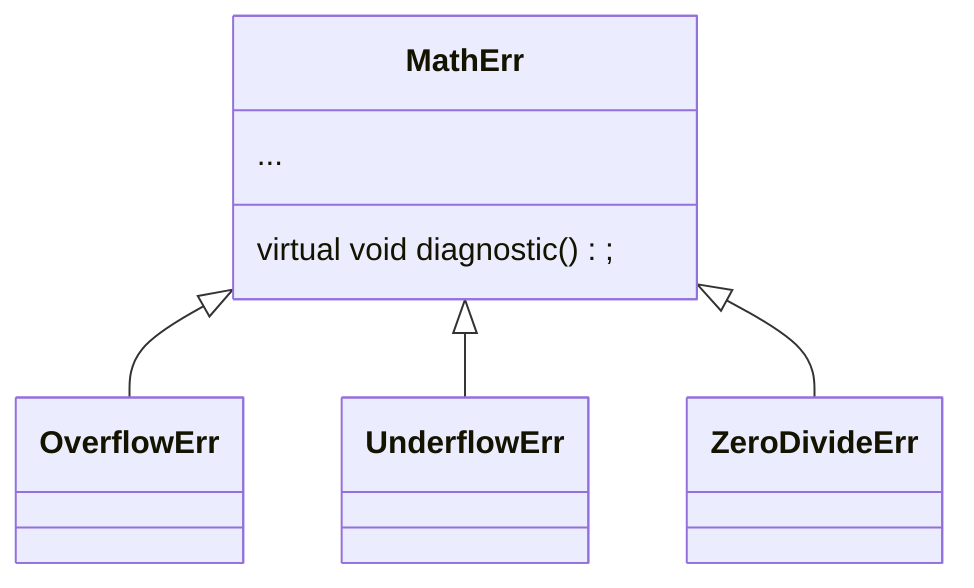
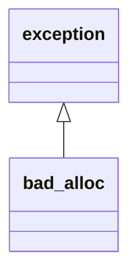

# Exception

考虑run-time error

错误处理方式

1. 使用错误返回码(正确返回0，错误返回给定的错误码)
    * 写的代码像面条，正常代码和错误处理代码混杂
    * 返回必须是错误返回码的话本来可以返回其他正常东西的(可以通过参数传递错误码的引用解决)
        * (tuple不香吗，怕浪费时间返回静态变量的引用也好呢
    * 如果调用链很长的话不好处理，可能不得不层层return
2. 用异常处理
    * 正常逻辑(try block)和错误处理(cathc block)分开
    * 不需要手动搞异常传递，会自动抓取
    * 如果本层不能解决，会自动向上传递直到有人能处理了为止
3. exit(EXITCODE)
4. assert()
    * `assert(idx >= 0 && idx < m_size)`
    * 但是assert只有debug版会进行，release版不会检查


## throw

```cpp
{
    if() {
        throw VectorIndexError(idx);
    }
    return m_elems[idx];
}
```

## Handle

**Case 1)** Doesn’t care
 –Code never even suspects a problem

```cpp
int func() {
    Vector<int> v(12);
    v[3] = 5;
    int i = v[42]; // out of range
    // control never gets here!
    return i * 5;
}
```

**Case 2)** Cares deeply

```cpp
try {
    func();
    func2();
} catch (VectorIndexError& e) {
    e.diagnostic();
    // This exception does not propagate
}
```

**Case 3)** Mildly interested

```cpp
void outer2() {
    String err("exception caught");
    try {
        func();
    } catch (VectorIndexError) {
        cout << err;
        throw;	// propagate the exception
    }
}
```

**Case 4)** Doesn’t care about the particulars

```cpp
void outer3() {
    try {
        outer2();
    } catch (...) {	// "..." catches ALL exceptions!
        cout << "The exception stops here!";
    }
}
```

## Review

* Throw statement raises the exception
    * Control propagates back to first handler for that
        exception
    * Propagation follows the call chain
    * Objects on stack are properly destroyed
        * 包括析构函数也会被调用
* `throw exp;`
    * 哪里都能写
    * throws value for matching
* `throw;`
    * 只能写在catch块里
    * re-raises the exception being handled
    * valid only within a handler

## catch block

* Can have any number of handlers
* Handlers are checked in order of appearance
    1. Check for exact match
    2. Apply base class conversions Reference and pointer types, only
    3. Catch-all handler (...)

## 用继承来实现异常类

例如



```cpp
try {
   // code to exercise math options
   throw UnderFlowErr();
} catch (ZeroDivideErr& e) {
   // handle zero divide case
} catch (MathErr& e) {
    // handle other math errors
} catch (UnderFlowErr& e) {
    // handle underflow errors
} catch (...) {
    // any other exceptions
}
```

编译后warning：`UnderFlowErr& will be catched by an earlier handler`，因为会被`MathErr&`接走，所以子类应该放上面，基类放下面，`...`再放在最后

### Standard library exceptions



## 其他

**[noexcept](https://en.cppreference.com/w/cpp/language/noexcept)**关键字

让编译器检查是否调用链上没有异常处理


**new异常**

```cpp
void func() {
    try {
        while(1) {
            char *p = new char[10000];	// 死循环？？？？？？？？？？？？？？？？？？？？？？？？？？？？？？？？？？？？？
        }
    } catch (std::bad_alloc& e) {
        //
    }
}
```


**不能把try-catch当作正常的代码逻辑**

```cpp
try {
    for (;;) {
        p = list.next()
    ...
} catch (List::end_of_list) {
    // handle end of list here，sb处理方式
}
```


```cpp
void func() {
    File f;	// 自定义类
    if (f.open("somefile")) {
        try {
            // work with f
        } catch (...) {
            f.close()	// 不应该放这里，放在File的析构函数里挺好的
        }
    }
}
```

## ctor

如果ctor中出现异常，且出现异常时已经分配了部分资源(但还有部分没分配)，那dtor执行也不是，不执行也不是

**解决思路0**

```cpp
class A {
  public:
    int *data;
    A() : data(new int[10]) {
        cout << "A:A()" << endl;
        {
            delete[] data;
            throw 1;
        }
    }
    ~A() {
        delete[] data;
        cout << "A:~A()" << endl;
    }
}
int main() {
    try {
        A a;
    } catch {
        cout << "catched" << endl;
    }
}
/*
 * 输出没有析构函数，正因如此才要在ctor的throw之前干析构函数干的事情
 * 但是这个又麻烦
 */
```

**解决思路1**

用另外一个`init()`成员函数

```cpp
class T {
  public:
    T() { cout << "T:T()" << endl; }
    ~T() { cout << "T:~T()" << endl; }
}
void foo() {
    T t();
    throw 2;
}

int main() {
    try {
        foo();
    } catch {
        cout << "catched" << endl;
    }
}
/*
 * 这里ctor和dtor都会被调用
 * 之前说过的，函数调用即使throw了也会给栈上的东西析构
 * 因此提供了一个思路，可以在类里面写一个init()，
 * 然后ctor写成 `A() { init(); }`
 */
```

**解决思路2**

用其他类作为Wrapper来存储指针及其指向内容，然后在类里存一个Wrapper对象

可以自己写也可以用智能指针

## dtor

dtor里面不抛异常到外面，必须内部解决

## Exceptions wrap-up

* Develop an error-handling strategy early in design.
* Avoid over-use of try/catch blocks. Use objects to acquire/release resources.
* Don’t use exceptions where local control structures will suffice.
* Not every function can handle every error.
* Use exception-specifications for major interfaces.
    * 不要在太底层的地方抛异常
* Library code should not decide to terminate a program.Throw exceptions and let caller decide.

