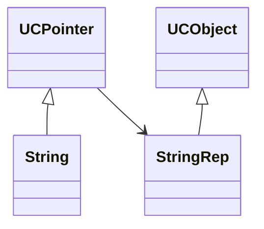

# Smart Pointers

## Intro

### unique_ptr

```cpp
unique_ptr<int> pa = new int();	// Error
unique_ptr<int> pa(new int());	// OK
unique_ptr<int> pa{new int()};	// std=c++14

// 防止其他东西偶然获得了new int()导致之后delete异常
unique_ptr<A> pa = make_unique<A>();	// 可以auto

auto pa2(pa);	// Error，unique_ptr<>类型的coptCtor被delete了
auto pa2 = move(pa);  // 之后pa就不再管理这个int了，管理权交给了pa2
```

数组

```cpp
unique_ptr<int[]> ary = (new int[10]);
```


### shared_ptr

```cpp
auto pa = make_shared<A>();	// 这里是shared_ptr<A>
auto pa2 = pa;	// 虚拷贝，管理的是同一份资源
```

### weak_ptr

可以看底层有多少次调用，但是不能参与管理

作用：shared_ptr有可能形成环(互相引用)，因此两者都无法被释放

### 保持unique_ptr的ownership的传参方法

考虑by value, by const ref, by raw ptr三种

首先不能直接传值，因为这必然会触发拷贝构造

常引用是可以的(但是缺点是参数只能是智能指针，不能是裸指针，灵活性因此降低)

传智能指针的指针也是可以的，但是别在函数生存期内把他delete了就好

#### 用move转移ownership

```cpp
std::unique_ptr<Resource> newOwner {std::move(resPtr)};
```

因此传参也可以用这个进行传值传参

```cpp
callByValue(Resource v) { /* ... */ }
callByValue(std::move(resPtr)) {
    ...
}
```

### shared_ptr的传参方法

三个都可以了，注意第一种在进入时use_count()会加一，退出函数后由于指针生存期到了，use_count()会减一


## Reference Counting

**共享指针计数的实现**

shared_ptr的成员函数`::use_count()`返回底层对象当前被使用的次数

如何实现“所有管理者离开生存期后释放内存”？

```cpp
// p = q; Have to do the following
p->decrement(); // p's count will decrease
p = q;
p/q->increment(); // p/q's count will increase
```

两个模板类：

**UCObject**

封装了计数的功能

```cpp
class UCObject {
  public:
    UCObject() : m_refCount(0) {}
    virtual ~UCObject() { assert(m_refCount == 0); }
    UCObject(const UCObject &) : m_refCount(0) {}
    void incr() { m_refCount++; }
    void decr() {
        m_refCount -= 1;
        if (m_refCount == 0) {
            delete this;
        }
    }
    int references() { return m_refCount; }

  private:
    int m_refCount;
};
```

**Class UCPointer**

封装好的指针，指向UCObject

```cpp
template <class T>
class UCPointer {
  public:
    UCPointer(T *r = 0) : m_pObj(r) { increment(); }
    ~UCPointer() { decrement(); }
    UCPointer(const UCPointer<T> &p) {
        m_pObj = p.m_pObj;
        increment();
    }
    UCPointer &operator=(const UCPointer<T> &p) {
        if (m_pObj != p.m_pObj) {  // could be ignored
            decrement();  // 旧的减一
            m_pObj = p.m_pObj;
            increment();  // 新的加一
        }
        return *this;
    }
    T *operator->() const { return m_pObj; }
    T &operator*() const { return *m_pObj; }

  private:
    T *m_pObj;
    void increment() {
        if (m_pObj)
            m_pObj->incr();
    }
    void decrement() {
        if (m_pObj)
            m_pObj->decr();
    }
};
```

A possible way

以String为例

* UCPointer: Smart pointer to UCObject, a template
* UCObject: Implements the reference count
* String: Public interface to clients
* StringRep: Details of string representation, is sharable



```cpp
class StringRep : public UCObject {
  public:
    StringRep(const char *s) {
        if (s) {
            int len  = strlen(s) + 1;
            m_pChars = new char[len];
            strcpy(m_pChars, s);
        } else {
            m_pChars  = new char[1];
            *m_pChars = '\0';
        }
    }
    StringRep(const StringRep &sr) {
        int len  = sr.length();
        m_pChars = new char[len + 1];
        strcpy(m_pChars, sr.m_pChars);
    }
    ~StringRep() { delete[] m_pChars; }
    int length() const { return strlen(m_pChars); }
    int equal(const StringRep &sp) const { return (strcmp(m_pChars, sp.m_pChars) == 0); }

  private:
    char *m_pChars;
};

class String {
  public:
    String(const char *s) : m_rep(new StringRep(s)) {}
    ~String() {}
    String(const String &s) : m_rep(s.m_rep) {}
    String &operator=(const String &s) {
        m_rep = s.m_rep;  // let smart pointer do work!
        return *this;
    }
    int operator==(const String &s) const { return m_rep->equal(*s.m_rep); }
    String operator+(const String &) const;
    int length() const { return m_rep->length(); }
    operator const char *() const;

  private:
    UCPointer<StringRep> m_rep;
};
```

但是这是一种侵入式的设计方式