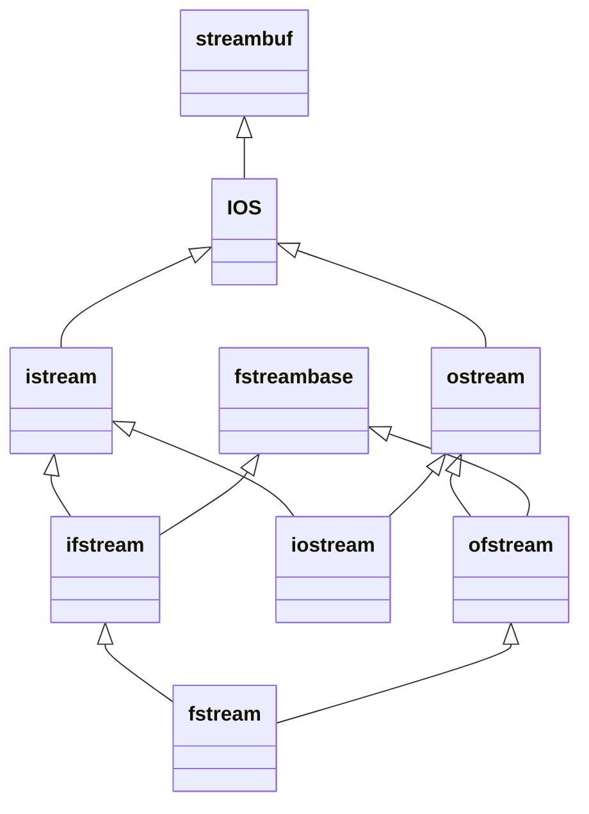

p = **(double\*)** &a; // ok (but a is not a double)

p = **static_cast<double\*>**(&a); // error

p = **reinterpret_cast<double\*>**(&a); // ok: I really // mean it

int a = 7; double* p;Name casts

C里面吧不同的类型转换都放一起，容易有歧义，C++里面更明确

* static_cast (less likely to make mistakes)
* dynamic_cast
* reinterpret_cast
* const_cast
*  ...

**static**

```cpp
double d = 7.1;
int a;
a = d; // implicit
a = (int) d; // explicit
a = static_cast<int>(d); // exact meaning
```

仅在有操作符重载时使用

**reinterpret** (重新理解)

```cpp
int a = 7;
double* p;
p = (double *) &a; // ok (but a is not a double)
p = static_cast<double*>(&a); // error
p = reinterpret_cast<double*>(&a); // ok: I really mean it
```

**const**

```cpp
const int c = 7;
int* q;
q = &c; // error
q = (int*)&c; // ok (but is *q2=2 really allowed?)
q = static_cast<int*>(&c); // error
q = const_cast<int*>(&c); // I really mean it
```

**与类关系**

```cpp
struct A {
    virtual void f() {}
};
struct B : public A {};
struct C : public A {};
int main() {
    A *pa = new B;
    C *pc = static_cast<C *>(pa);   // OK: but *pa is B!
    C *pc = dynamic_cast<C *>(pa);  // return nullptr表示转换不成功
    return 0;
}
```

```cpp
struct A {
    // virtual void f() {}
};
struct B : public A {};
struct C : public A {};
int main() {
    A *pa = new B;
    C *pc = static_cast<C *>(pa);   // OK: but *pa is B!
    C *pc = dynamic_cast<C *>(pa);  // Error! 没有VTable所以没法编译
    return 0;
}
```

```cpp
struct A {
    // virtual void f() {}
};
struct B : public A {};
struct C : public A {};
struct D {};
int main() {
    A *pa = new B;
    D *pd = static_cast<D *>(pa);  // Error! 这D和A没任何关系
    return 0;
}
```

被dynamic_cast的一定要是多态的基类，然后就可以使用子类的实函数了(虚函数不行的，会崩)

```c++
using namespace std;

class Base {
  public:
    virtual void any_virfun() { std::cout << "Base::any_virfun()" << std::endl; }
};

class Derived : public Base {
  public:
    void special() { std::cout << "Derived::special()" << std::endl; }
    virtual void any_virfun() { std::cout << "Derived::any_virfun()" << std::endl; }
};

int main(int argc, char const *argv[]) {
    Base *p = new Base;
    dynamic_cast<Derived *>(p)->special();	//Derived::special()
    p->any_virfun();						// Base::any_virfun()
    dynamic_cast<Derived *>(p)->any_virfun();	// Segmentation fault: 11	
    return 0;
}
```


# Multiple inheritance



问题：如iostream会有两分streambuf，一份来自istream，一份来自ostream，导致👇这样

```cpp
struct B1 {
    int m_i;
};
struct D1 : public B1 {};
struct D2 : public B1 {};
struct M : public D1, public D2 {};
int main() {
    M m;  // OK
    m.m_i++;  // ERROR: D1::B1.m_i or D2::B1.m_i?
    B1 *p  = &m;  // ERROR: which B1???
    B1 *p1 = dynamic_cast<D1 *>(&m);  // OK B1* p2 = dynamic_cast<D2*>(&m); // OK
}
// B1 is a replicated sub-object of M.
```

所以一般禁止使用多重继承，除非是接口类(即类中没有成员变量且函数都是纯虚函数的类)

或者可以用virtual继承来消灾：

```cpp
struct B1 {
    int m_i;
};
struct D1 : virtual public B1 {};
struct D2 : virtual public B1 {};
struct M : public D1, public D2 {};
int main() {
    Mm;             // OK
    m.m_i++;        // OK, there is only one B1 in m
    B1 *p = new M;  // OK
}
```

# Namespace

```cpp
// old1.h
namespace old1 {
    void f();
    void g();
}

// old2.h
namespace old2 {
    void f();
    void g();
}
```

## using

```cpp
int main() {
    using MyLib::Cat;
    using MyLib::foo;
    foo();
    Cat c;
    c.Meow();
}
```

强烈建议不要在全局写`using namespace`

```cpp
int main() {
    using namespace std;
    using namespace MyLib;
    foo();
    Cat c;
    c.Meow();
    cout << "hello" << endl;
}
```

## Ambiguities

```cpp
namespace XLib {
    void x();
    void y();
}  // namespace XLib
namespace YLib {
    void y();
    void z();
}  // namespace YLib

int main() {
    using namespace XLib;
    using namespace YLib;
    x();        // OK
    y();        // Error: ambiguous
    XLib::y();  // OK, resolves to XLib z(); // OK
}
```

## Namespace composition

```cpp
namespace first {
    void x();
    void y();
}  // namespace first
namespace second {
    void y();
    void z();
}  // namespace second
namespace mine {
    using namespace first;
    using namespace second;
    using first::y;  // resolve clashes void y(); 如果first和second只有一个y()那不用写这行也行
    ...
}  // namespace mine
int main() {
    mine::x();
    mine::y();  // call first::y()
    mine::mystuff();
}
```

## Namespace selection

Namespace can be distributed across multiple files.

```cpp
// header1.h
namespace X {
    void f();
}

// header2.h
namespace X {
    void g();  // X now has f() and g();
}
```

