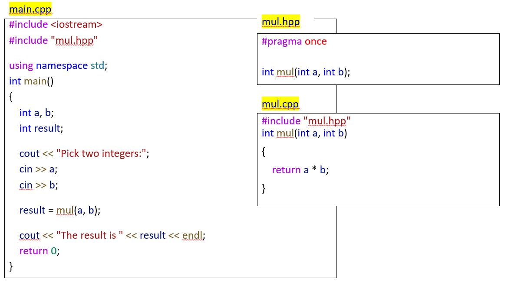
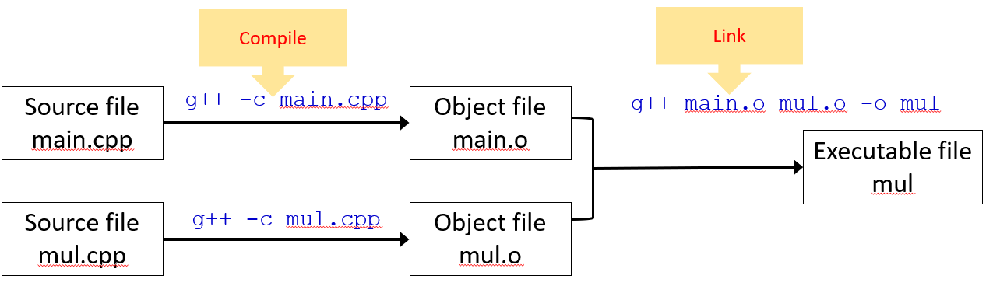

## hello
```c++
#include<iostream>
using namespace std; //名空间 std，cout等定义在std内
int main(void){
    int  a;
    cout<<"hello"<<endl;   //送到out里面
}
```
运行

```shell
g++ hello.cpp   #用g++来编译
g++ hello.cpp --std=c++11   #按照c++11的标准
g++ hello.cpp --std=c++11 -o hello   #指定输出文件的名称为 hello
###执行
./hello
```

头文件组织





## String

```c++
#include <string>

string str = "Hello";   string str("Hello");  //两种方式等价
string str1(str);  //str1复制str的值
string str2(str, 2, 3);	// str[2]开始持续3个字符，2+3溢出了没关系（读到\0会截断），但是2溢出了会异常
cin >> str;
cout << str;

char 	str1[8] = "abc";
string 	str2 	= "def";
char 	*p1 	= str1;
string 	*p2 	= &str2;
```

==初始化：`int a[10] = {1};`非零的情况下只有第一个会被赋为1，其他全部为0==

## 引用

取了另外一个名字,两者等价
定义引用时，一定要将其初始化。引用只能引用变量，不能是常量或者是表达式

```c++
int n = 4;
int &m = n;
```
##### 改变形参
```c
void swap( int & a,int & b){
    ...
}
swap(j,k);  //j,k的值会被交换
```
##### 作为函数的返回值
```c
int & SetValue(){
    return n;
}
int main(){
    SetValue() = 40;   //n就变成了40
}
```
##### 常引用
不能通过常引用去修改其引用的内容，但是可以通过其本身修改
``const type &``不能用来初始化``type &``

##### C++中的for扩展

```c++
int my_array[5] = {1, 2, 3, 4, 5};
// 每个数组元素乘于 2
for (int &x : my_array)  //若for (auto &x : my_array)  则为自动获取变量类型
{
    x *= 2;
    cout << x << endl;  
}
```


## Const
##### 常量指针
- 不能通过常量指针，修改它所指向的内容，但是可以通过其本身修改
- 不能把常量指针赋给普通指针（否则通过改普通指针可修改指向的值；除非将常量指针强制类型转换），但是反之可以
```c++
int n;
const int*p =&n;
```

## 动态分配
```c++
p1 = new type;  /*动态分配一个大小为sizeof(type)大小的空间
并将起始地址给p。 p是类型为type *的指针*/
p2 = new type[n] ;  //sizeof(type)*n

delete p1;  //释放
delete [] p2;  
```
## 内联函数
前加``inline``，为了提高运行速度
调用时，类似于宏替换，把函数替换为函数内语句
```c
inline int Max(int a, int b){
    ...
}
```

## 函数重载
- 函数名相同，但是参数个数或者参数类型不同，或者一个const另一个不是，否则是重复定义
- 调用时编译器根据参数来判断具体调用哪个函数，但是如果无法判断，就会报二义性的error，如下方错误
```c++
void fun (int val =0){ x=val;}
int fun(){ return x;}
//这个时候  fun()就有二义error
```

## 函数缺省参数
- 为了提高程序的可扩充性
- 可以让**最右边的连续**若干个参数有缺省值，若不写相应实参，就按缺省值调用
```c++
void fun( int a, int b=1; int c=2){
    ...
}
fun(10);     
fun(10,8);  //等效于fun(10, 8, 2)
fun(10,,8);  //error，需要连续
```
