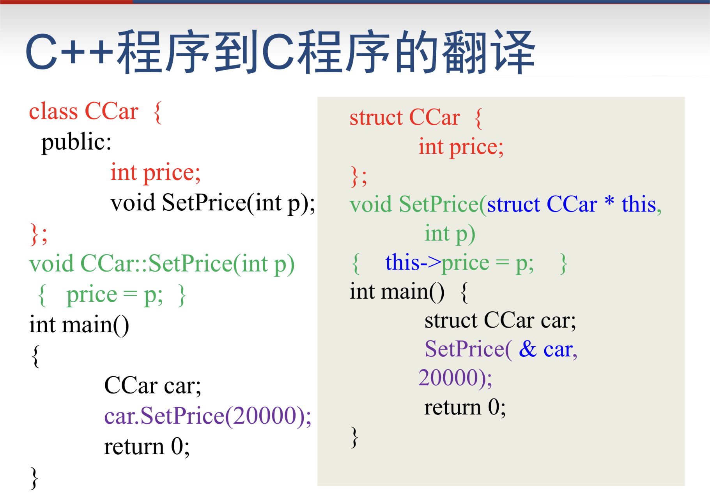

## 类
- sizeof(类)的大小（只计算成员变量，不计算成员函数）和结构的大小计算方法一样
- 可以用``=``赋值，但是不能用``==``,``>=``等进行比较，除非进行过重载
- 类函数也可以重载和缺省参数
```c++
class 类名{
    private:   //如果缺省关键字，被认为是私有的。只能被自身成员函数和友元函数访问
        ...
    public:
        ...
    protected:   //在private的基础上，允许子类的函数访问
        ...
}; //这三种关键字的出现次数和先后顺序没有关系
```
如果用``struct``定义类，唯一的区别是，未说明的成员是**公有的**
###### 访问
``对象名.成员名``
``指针.成员名``
``引用名.成员名``
类的成员函数外，只能访问类的公有成员，私有成员被“隐藏”，私有属性只能通过成员函数来改变其值的大小

## 构造函数 constructor
成员函数的一种，前不加返回值类型（void也不行），名字与类名一致，作用是初始化，如给成员变量赋值。构造函数只能执行一次，一个类可以有多个构造函数
- 如果定义类的时候如果没有构造函数，则编译器生成一个默认的无参数的构造函数，此时用该类定义对象的时候不会有任何操作。
- 如果定义了构造函数，一定要用构造函数来定义对象
- 可以有多个构造函数，参数个数或类型不同
- 构造函数最好是public的，private构造函数不能直接用来初始化对象
- 构造函数只负责初始化赋值，不会分配空间
```c++
class Complex{
    private:
        double real,imag;
    public:
        void Set(double r, double i);
        Complex(double r, double i);
        Complex(double r);
        Complex();
};
/*直接写在class里面也可以，下同*/
Complex::Complex(double r,double i){          //1
    real = r;
    imag = i;
}
Complex::Complex(double r){             //2
    real = r;
    imag = 0;
}
Complex::Complex(){                       //3
    real = 1;
    imag = 1;
}
//初始化
Complex c1(3), c2(1,0)
```
##### 构造函数在数组中的使用
```c++
/*接上Complex */
Complex array[3] ={ 1, Complex(1,1)}//*三元素按(2)(1)(3)
Complex *p[3] ={ new Complex(1), new Complex(1,1)} //两元素按(2)(1)初始化，p[2]为空
```
## 复制构造函数 copy constructor
类内，形如``X::X(X &)``或者``X::X(const X&)``,都是**引用**
复制构造函数只有一个，自己写的或者是编译器自动生成的
起作用的三种情况：
- 用一个对象初始化另一个对象（非已经定义好再赋值）
```c++
Complex c2(c1);等价于 Complex c2 = c1;
```
- 实参被赋值为形参（但是，形参不一定是实参的复制品，如果自己构造了一个复制构造函数不是copy的）
- 函数的返回值是类A的对象时，函数返回时，A的复制构造函数会被调用
- **注意**：<font color = Red>对象定义后，再赋值（非初始化），不会导致构造函数调用</font>
常引用``X::X(const X&)``可以避免调用复制构造函数产生的花销,并且避免被修改

## 类型转换构造函数
只有一个参数，并且不是复制构造函数
```c++
class Complex{
    public:
        double real,imag;
        Complex(int i){//类型转换构造函数
            real = i;
            imag = 0;
        }
        Complex(double r, double i){
            real = r;
            imag = i;
        }
};
int main(){
    Complex c2 =12;
    c2 = 9; //9被自动转换为一个Complex对象
}

/*显式类型构造函数*/
class Complex{
    public:
        ...
        explicit Complex(int i){  
            ...
        }
}
int main(){
    ...
    c2 = 9;   //error
}
```
## 析构函数
析构函数只有一个，如果不是自己定义的，编译器自动生成的析构函数什么都不做。对象消亡后，析构函数回**自动**被调用
```c++
class String{
    private:
        char *p;
    public:
        String(){
            p = new char[10];
        }
        ~String();
};
String::~String(){
    delete []p;    //析构函数，用于自动释放空间
}
```
调用：
- 该类型的数组的每个元素都会调用析构函数
- 形参消亡、mian消亡、全局消亡都会引发析构函数
- new出来的，不调用delete，不会析构
- 静态要整个函数结束才会消亡

不同的编译器会有差异。不是用于释放空间，比如拆房子的不是他，他只负责拆房子之前搬东西

## this指针
作用是指向成员函数所作用的对象。起初C++没有编译器，需要先翻译成C，this就是在使用成员函数的过程中用（感觉类似于python的self）
- **非静态**成员函数中可以直接使用this来代表指向该函数作用的对象的指针。因此，类的非静态成员函数，真实参数比所写的参数多1
- 静态成员函数中不能使用this指针，因为静态成员函数并不具体作用于某个对象，静态成员函数的真是参数个数，就是程序写出的参数个数

```c++
class A{
    int i;
    public:
        void Hello(){
            cout<<"hello"<<endl;  
            //翻译为  void Hello(A *this){cout<<"hello"<<endl;}
        }
}
int main(){
    A *p = NULL;
    p->Hello();   //翻译为  Hello(p);
}
```
## 静态成员 static
该类的所有对象共享这一个变量，存储于对象外，sizeof(对象)不会算入静态成员。静态成员不需要通过对象就能访问。设置静态成员是为了将与某些类紧密相关的全局变量和函数写到类里面，看上去像一个整体，易于理解和维护
- 静态成员变量本质上是全局变量，哪怕一个对象都不存在，静态成员变量也存在。必须在定义类的文件中对静态成员函数**进行一次说明或者初始化**，否则编译能通过，链接不能通过
- 静态成员函数本质上是全局函数。其中不能调用非静态成员函数和非静态成员变量，因为不知道具体指向的是哪个
- 如果想用一个计数器计算目前有多少个这个类的对象，要定义，构造函数，复制构造函数和析构函数
##### 访问
``类名::成员名``
``对象名.成员名`` , ``引用.成员名``
``指针->成员名``

## 常量 const
- 成员常量函数不能修改任何属性的值，也不能调用非常量成员函数（静态成员函数和静态成员变量除外，因为它们在类的外部）
- **常量对象上只能使用常量函数**
## 友元 friend
##### 友元函数
- 一个类的友元函数可以访问该类的私有成员
``frined type 函数名``
- 可以将一个类的成员函数(包括构造、析构函数)说明为另一个类的友元``friend class XXX``
- 友元类之类的关系**不能传递，不能继承**
## 封闭类 enclosing
有成员对象的类，叫封闭类
- 任何生成封闭类对象的语句，都要让编译器明白，对象中的成员对象，是如何初始化的，否则会编译出错。具体的做法是：通过封闭类的构造函数的初始化列表。成员对象初始化列表中的参数可以是任意复杂的表达式，可以包括函数，变量
```c++
class A{
    public:
        int x;int y;
        A(int a, int b):x(a),y(b){ }  //构造表达式
};
class Aplus{ //封闭类
    public:
    A _A_;
    int z;
    Aplus(int q, int w, int t):z(q),x(w),y(t){ }   //构造表达式
};
```
- <font color=red>生成</font>时，先执行**成员对象**的构造函数（按在**类中的说明次序**，与初始化列表中的出现次序无关），再执行**封闭类**的构造函数（最后打包）
- 析构时，先执行封闭类的析构函数（打开包装），总次序与构造函数的调用次序相反（看作栈）