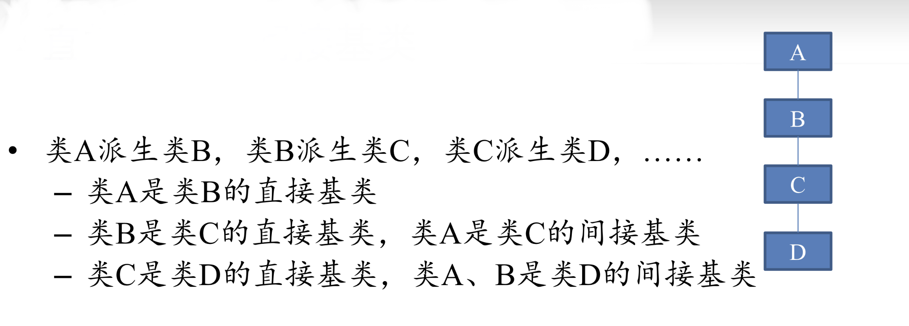

#### 关系
- 复合关系：一个类中有另一个类的对象（如果时private的成员需要访问，还需要设置**友元**）。注意避免<font color=Red>循环定义</font>
- 继承关系，父子
## 基类，派生类（子类）
- 子类拥有父类的全部成员(不论public,private,protected)。
- 但是子类的成员函数不能访问父类的private成员
```c++
class sonname: public fathername{
    ...
};
```
- 当成员重名时，子类**覆盖**原父类的成员(并且可以在其内调用父的同名成员,用作用域符号``::``），子类对象包括父类对象的所有成员，并且这些成员的存储位置位于子类独有的成员位置之前。但是一般避免写重名成员变量，写成员函数很常见
```c++
class father{
    function(){...}
};
class son:public father{
    function(){
        function();
        ...
    }
};
```

#### 子类初始化包含的父类的值
如果成员时private或者protected的，只能在初始化的时候==调用父类的构造函数==来实现初始化。一般都用**初始化列表**初始化
例子：
```c++
class Bug{
    private:
        int nlegs;
        int ncolor;
    public:
        int ntype;
        Bug(int legs, int color):nlegs(legs),ncolor(color){ }
};
class FlyBug: public Bug{
    int n2ings;
    public:
        FlyBug(int legs, int color , int wings):Bug(legs,color),nwings(wings){ }
}
```
- 执行子类的构造函数前，总是先执行其父类的构造函数（析构则相反），其调用有两种方式：
>  显式：调用构造函数（或直接public参数初始化）
>  隐式：省略父类构造函数，子类构造函数自动调用父类的（默认）==无参==构造函数（没有就error）

#### ==封闭子类构造==
> 一般也用初始化列表初始化，构造（析构顺序相反）顺序为：
> 1. 父类
> 2. 成员对象类
> 3. 自己的构造函数

#### public继承
```c++
class father{...};
class son:public father{...};
father f;
son s;
```
1. 子类对象可以赋值给父类对象
   ``f = s;``
2. 子类对象可以初始化父类引用
   ``father &fr = s;``
3. 子类对象的地址可以赋值给父类指针
   ``father *fp = &s``
上述三条在非public继承时失效
#### 直接父类和间接父类

在声明子类时，只需要列出它的直接父类。子类会沿着父类的层次自动向上继承它的间接父类
