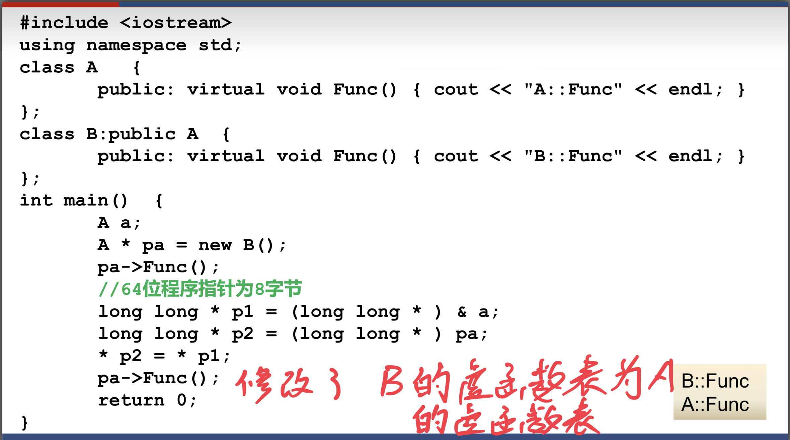

##### 虚函数
``virtual``只在类定义的函数声明中，写函数体时不用。``virtual type function()=0;``为纯虚函数.(子类和父类中虚函数同名同参数表的函数，不加virtual修饰也能自动成为虚函数)
```c++
class classname{
    virtual int A( );
    //virtual int A( )=0;
};
int classname::A{
    ...
}
```
## 多态
##### 作用
增加程序的可扩充性
##### 表现
子类的==指针==可以赋给父类，子类的对象可以赋给父类==引用==
- 当通过指针调用父类和子类中的同名虚函数时，调用的虚函数是哪个，视指针指向哪里
- 引用调用同名虚函数时，调用的虚函数是哪个，视引用的哪个决定

在非构造/析构函数的成员函数中调用虚函数，是多态；在构造函数/析构函数中调用虚函数就**不是多态**， 编译时即可确定，调用的函数是自己的类或基类中定义的函数，不会等到运行时才觉得调用自己的还是派生类的函数
> 用父类指针数组存放指向各种子类对象的指针，然后遍历该数组，就能对各个派生类对象做各种操作，是很常用的做法
##### 原理
运行时才确定——动态联编
每一个有虚函数的类（或有虚函数的类的派生类）都有**一个**虚函数表（**占4个字节**），该类的任何对象中都放着虚函数表的指针。虚函数表中放着该类虚函数的地址。用的时候在虚函数表里面查找即可
如果一个对象的虚函数表被其他的虚函数表替换，查找会出现问题

##### 虚析构函数
通过指针删除子类对象时，**通常情况下只调用父类的虚构函数**
如果把基类的析构函数声明为``virtual``，派生类的析构函数不声明``virtual``也行（自动），再执行该操作时，先调用子类的析构函数，再调用父类的析构函数
一般来收都会把析构函数定义为虚函数，但是==不允许构造函数为虚函数==

## 抽象类
包含纯虚函数（相当于虚函数啥都不干）的类叫做抽象类（抽象的子类只有实现了所有的虚函数才能成为非抽象类）
- 抽象类只能作为父类，不能独立创建对象
- 可以作为指针或者引用来调用子类
- 在抽象类的成员函数内可以调用纯虚函数（多态），但是在构造函数或析构函数内部不能调用纯虚函数（不是多态，纯虚函数函数体都没，编译一定会出错）