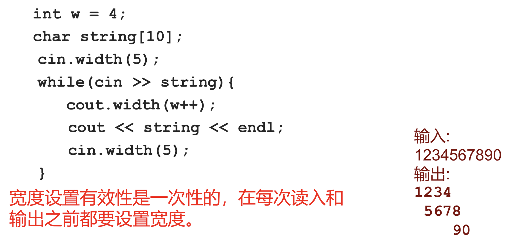

## 流
```c++
#include <iostream>
```
``cin``读入，可以被重定向为从文件读入
``cout``输出，可以被重定向为输出到文件
``cerr``,``clog``输出错误信息，但cerr直接输出，clog先放在缓冲区，缓冲区满了或者刷新时才会输出到屏幕

# cin cout规范

```c++
// 开头设置宽度为 4，后面的 runoob 字符长度大于 4，所以不起作用
cout << setw(4) << "runoob" << endl;
```

#### 输入流
- 判断输入流结束：如果是**文件**，读到尾部算输入结束；如果是从键盘输入，则在单独一行输入Ctrl+Z表示结束
```c++
char x;
while(cin>>x){   //cin>>x返回的是istream对象，会自动转换为bool型
    ...
}
```
#### istream成员函数
```c++
cin.getline(char *buf,int bufSize);
//从输入流读取bufSize-1个字符到缓冲区buf，遇到'\n'停止
cin.getline(char *buf,int bufSize,char delim);
//遇到'\n'或者delim停止
//此上两种函数都会自动在buf中读入数据的结尾添加'\0'。'\n'或者delim不会写入buf，但是会从留中取走
//如果字符数在终止前已超bufSize,就导致读入出错，虽然本次读入已经完成，但是之后的读入都会失败

if(!cin.getline(...)) //判断是否结束
bool eof();//判断输入流是否结束
int peek()://返回下一个字符，但不从流中去掉
cin.putback(char c);//将字符c放到流头部
cin.ignore(int nCount=1, int delim=EOF);//从留中最多删掉nCount个字符，遇到EOF结束
```

#### 流操纵算子
```c++
#include <iomanip>
```
##### 整数流:dec,oct,hex,stbase(自定义进制)

```c++
int n=10;
cout << hex << n <<endl; //输出为十六进制
```
##### 浮点数：precision, setprecision
```c++
cout.precision(n); 
cout.setprecision(n);  //于precision一样，但是可以连续输出
//默认为非定点：保留有效位数n位，
seriosflags(ios::fixed); //设置为定点模式：保留小数点后n位
reseriosflags(ios::fixed);  //清楚定点模式

例子：
double x = 1234567.89;
cout << setiosflags(ios::fixed) << setprecision(6) << x <<endl <<resetiosflags(ios::fixed) << x;
//输出为1234567.890000 \n 1.23457e+006
```
##### 域宽：setw , width。两者功能想相同，用法有差异，是**一次性**的
```c++
cin >>setw(n); cin.width(n);
cout << setw(n);  cout.width(n);
```

##### 自定义的流操纵算子

## 文件操作（和流本质一样）
```c++
#include <fstream>  //包含头文件

/*直接打开*/
ofstream outFile("name.txt",ios::out|ios::binary); //创建文件
/*先创建对象*/
ofstream f;
f.open("test.out",ios::out|ios::binary);
//判断是否打开成功
if(!f){
    cout << "File open error!" << endl;
}
```
- 打开文件方式，``ios::out``输出到文件，删除原有内容。``ios::app ``输出到文件，尾部添加
- ``ios::binary``,以二进制格式打开文件
- 如果没有交代路径星系，就是在当前文件夹下找文件
一定要记得关闭文件，因为打开文件数量有上限，达到一定程度后就不能再打开任何新的文件