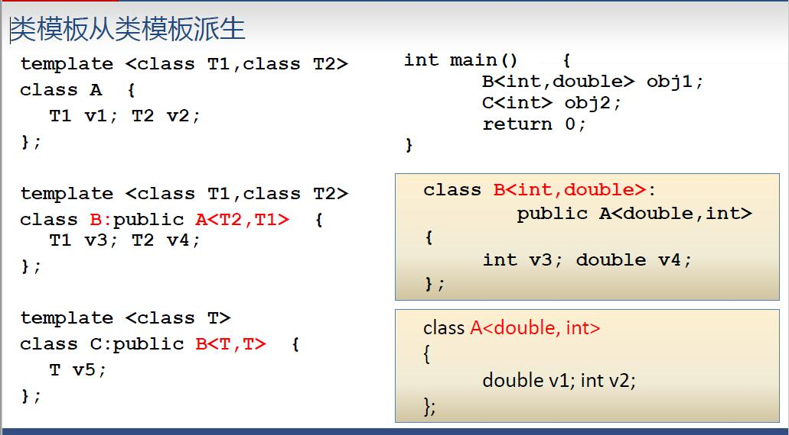
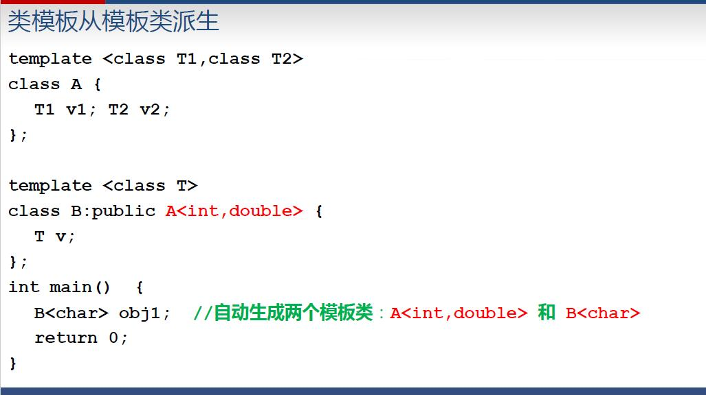
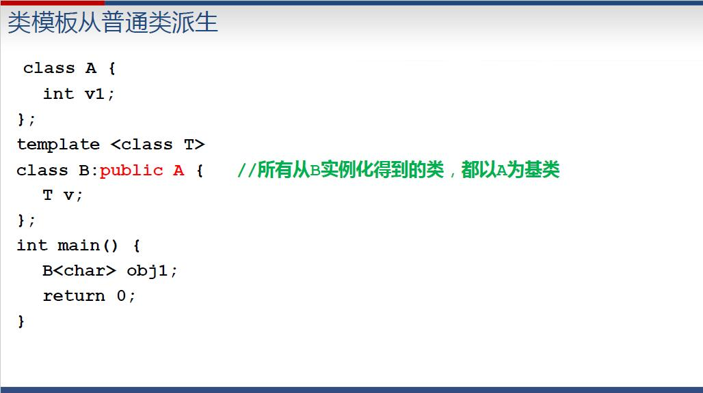
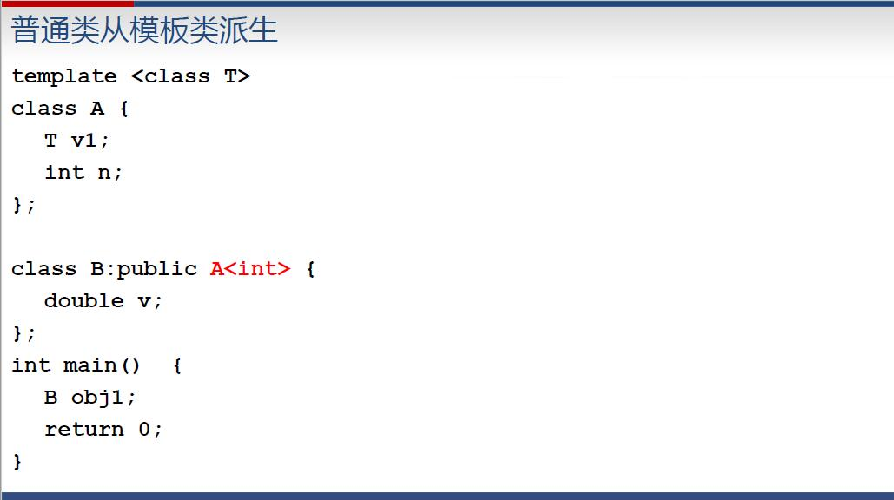

> 以下``template``后是==class==或者==typename==均可
# 函数模板
```c++
template <class T, class S ...>
返回值类型  模板名( T 形参名, S 形参名,...){
    函数体
};
```
编译的时候会把T换为具体的类型
- 用形参的类型具体化
- 不通过参数，如
```c++
#include<iostream>
using namespace std;
template <class T>
T Inc(T n){
    return 1+n;
}
int main(){
    cout<<Inc<double>(4)/2 ; //输出2.5
}
```
函数模板可以重载，只要它们的形参表或者参数类型不同。在有多个函数和函数模板重名时，编译器会:
1. 参数完全匹配的**普通函数**(非由模板实例化得到)
2. 找参数完全匹配的**模板函数**
3. 实参经过自动类型转换后能匹配的**普通函数**
4. 报错

==匹配函数模板时不会进行类型自动转换==，所以形参如``(int , double)``会报错

# 类模板
```c++
template <class T, class S ...>
class  模板名{
    成员函数和成员变量
};
//成员函数写法：
返回值类型 类模板名<形参名列表>::成员函数名(参数表){
    ...
}
//用类模板定义对象的写法：
template <class T, class S ...>
类模板名<真实类型参数表> 对象名(构造函数实参表);
```
实例：
```c++
template <class T1,class T2>
class Pair{
    public:
        T1 key;
        T2 value;
        Pair(T1 k. T2 v):key(k),value(v){ };
        bool operator < (const Pair<T1,T2> &p) const;
};
template<class T1, class T2>
bool Pair<T1,T2>::operator < (const Pair<T1,T2> &p) const{
    return key <p.key;
}
int main(){
    Pair<string,int> student("Tom",19);  //实例化一个类
}
```
编译器由类模板生成类的过程叫做类模板的实例化。由类模板实例化得到的类，叫**模板类**，同一个类的两个模板类是不兼容的

#### 类模板与派生





#### 类模板与静态成员
```c++
#include <iostream>
using namespace std;
template <class T>
class A{
    private:
        static int count;
    public:
        A(){ count++; }
        ~A(){ count--; }
        A(A&){ count++; }
        static void PrintCount(){ cout<< count << endl; }
};

//注意静态变量需要重新申明一下
template<> int A<int>::count = 0;
template<> int A<double>::count = 0;
int main(){
    A<int> ia;
    A<double> da;
    ia.PrintCount();
    da.PrintCount();
    return 0;
}   //输出1 \n 1
```
## String类
```c++
#include<string>

//初始化
string s1("Hello");
string month = "March";
string s2(8,'x');  //字符串中包含8个x
string s; s= 'n'; //可将字符赋值给string对象

```
