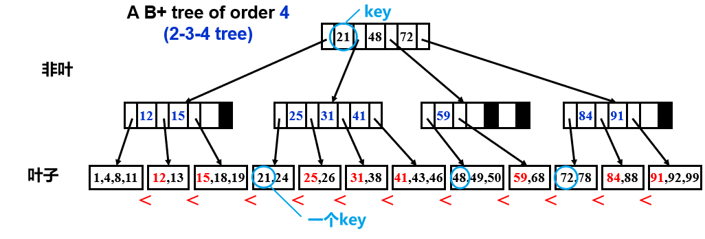

# ADS

定个目标是4.5（期末≥72分）

要特别当心后半部分的NP问题，随机算法，近似算法，局部搜索等内容，考试最难的就是这一块

数据结构部分一定保证尽量不失分，因为这是最简单的一部分。算法部分基础题同样如此，否则成绩可能不是很好看。

一般程序填空是**树和堆 + 动态规划**,掌握上课的例子和作业题就能拿到大部分分数，期末project应该不考

26分10道判断，20个选择3分，6分程序填空，8分编程

> 后面的算法部分和摊还分析，掌握ppt的例子就好，作业很多也很难而且考试和作业不同，所以作业里面不会的也可以跳过

具体xiayan🦐，他的笔记后面算法部分完全不行

### AVL&Splay

AVL左小右大，左减右。然后如何插入新的点；高为h的**最少**节点： $n_h=n_{h-1}+n_{h-2}+1=F_{h+2}-1$      高为$h$的树节点总量为$n_h$。 LL是P走,LR是自己走

zig-zag就和RL,LR差不多；zig-zig就是在原来的LL/RR的情况下再提一次

Splay Trees 通过**将被访问到的节点放于根**，提升访问速度 Splaying not only moves the accessed node to the root, but also roughly halves the depth of most nodes on the path**不仅将访问的节点移动到根，而且还将路径上大多数节点的深度大致减半**

核算法是对<u>不同的操作</u>赋予<u>**不同**的摊还代价</u>，这是与聚合法的主要不同（聚合法直接累计）

势能法最好刚开始的时候势能最低$\hat c_i = c_i + Φ(D_i)-Φ(D_0)$，但是$D_i-D_{i-1}$没要求一定非负,但是要求$Φ(D_0)$是最小的以及$credit=Φ(D_i)-Φ(D_0) \ge0$

势能函数的核心就是让大操作的复杂度降低很多

### Red-black & B+

重点关注这种情况，红要么有两个黑子，要么没有

包含N个节点(也称为内部节点)的红黑树的高度最大是  $2log_2(N+1)$ 注意外面海有个2

以x为根节点的树节点数**N>=2^bh(x)^-1 ** 并且 $2bh(h)\ge h$

插入：父子都红的时候才要调整，G的两个P都是红的时候黑下放（P黑,G红，除非G是root则G也黑），只有P的兄弟是红的时候通过G变红（自己还是P变红看情况）然后类似于AVL的操作即可

| Number of rotations | AVL       | Red-Black |
| ------------------- | --------- | --------- |
| 插入                | $\le 2$   | $\le 2$   |
| 删除                | $O(logN)$ | $\le 3$   |

儿子要求：每个有**$\lceil$m/2$\rceil$到m**个儿子（非叶）/keys（叶子），根节点可以为**leaf**或有**2到m**个儿子 （2到3，或者2到4）

2-3树：**M=3**；2-3-4树：**M=4**（非叶有2-3-4个指针，叶最多有4个key）；

从小到大，但不是BST了

超过m就分裂（分裂的时候喜欢平分，**奇数则喜欢右边多点**），向上插入新的索引，递归，若到根还超了则向上长一层

### Inverted File Index & Leftist Heap  & skew Heap

##### Leftist Heap 

**right path** 有$r$个节点，那么这个左偏树至少有 $2^r – 1$ 个节点 （数归证明）

反过来有$N$个节点的左偏树，右路径最多有$\lfloor log(N+1) \rfloor$个节点

leftist合并为从上向下检查，skew为合并的那一层无脑交换（插入在最右边，马上变左子，是从下往上每层都要交换）

### Binomial Queue

内部每个都是一个堆

深度为even的nodes数 ≥ odd的nodes数

从大到小

被第一个H1赋值的置为NULL, 出前两个情况无脑后面不用管Carry

### 回溯

关键就是比第二层的兄弟min/max(第二层是min就min)，然后剪枝

### 分治

### 动规

分解的（一般就中间切，或者看最后怎么分这两种），基本都可以用动态规划求解

OMM是$O(N^3)$

⚡ 重点背一下ppt上的代码(6,11)

### 贪心

只找本地最优，全局不一定是最优，并且不能反悔

活动安排$NlogN$

举反例排除。**加权的一般不能贪心，只能动规**。贪心时选择不唯一一般都是错的

霍夫曼树 , 总节点数 = 2×对象数-1

### NP

⚡ppt上哪些问题是NPC

### 近似：

⚡ppt上的复杂度

### 局部：

Hopfield Neural Networks负表示希望相同

max-cut 2>ρ>17/16

势能函数都是好边的数量

### 随机

通过随机来避免worst case提高效率

QS：随机挑，分完不满足¼\~¾就重新挑，最坏$O(N^2)$, 一般来说是$O(NlogN)$, 注意随机算法的O有点不一样

### 并行

⚡ppt上的复杂度

### 外排

k+1 way 滚动，一直往右移动。 最大和最小是相邻的斐波那契

passes = , N是总长,M是最多一次处理的个数

# 复杂度整理

树(前3个是BST，复杂度都是$O(logN)$)

|              | 访问x                                                       | 插入(amo)                                | m次插入 | 删除(amo) | m次删除 |
| ------------ | ----------------------------------------------------------- | ---------------------------------------- | ------- | --------- | ------- |
| AVL          | O(logN)                                                     | O(logN)                                  |         | O(logN)   |         |
| Splay        | O(logN) 摊还。删除也是移到root然后删                        | O(logN)                                  |         | O(logN)   |         |
| RB           | O(logN)                                                     | O(logN)                                  |         | O(logN)   |         |
| B+(M为order) | O(logN) (深度为$O(\lceil \log_{\lceil M/2\rceil} N\rceil)$) | $O(\frac{M}{\log M}\log N)$ 可能不用掌握 |         |           |         |

堆

|               | 访问最小                     | 插入(amo)         | m次插入  | 删除最小(amo) | Merge   |
| ------------- | ---------------------------- | ----------------- | -------- | ------------- | ------- |
| BinHeap       |                              | O(logN)           |          | O(1)          |         |
| Leftiest      | O(1) 因为在顶上              | O(1)              |          | O(logN)       | O(logN) |
| Skew          | O(1) 因为在顶上              | O(logN)因为要旋转 | O(MlogN) | O(logN)       | O(logN) |
| BinomialQueue | O(logN) or O(1),如果索引给出 | O(1)              |          | O(logN)       | O(logN) |
| skip list     |                              | 全是$logN$        |          |               |         |

Amo

* BQ: $\Phi_i$ 摊还树的数目🌳
* Spaly: $\Phi_i$ = $\sum_{i\in T}\log  (S(i))$  ($ S(i)$表示子树i中总节点数，日中R(i)=logS(i)又被称为rank)
* Multi_Pop: $\Phi_i$ 栈中的元素个数
* Skew heap: $\Phi_i$ = number of *heavy* node (如果节点 p 的右子树的后代数量至少为 p 后代数量的一半，则该节点为重节点，否则为轻节点。节点的后代数量包括节点本身)

