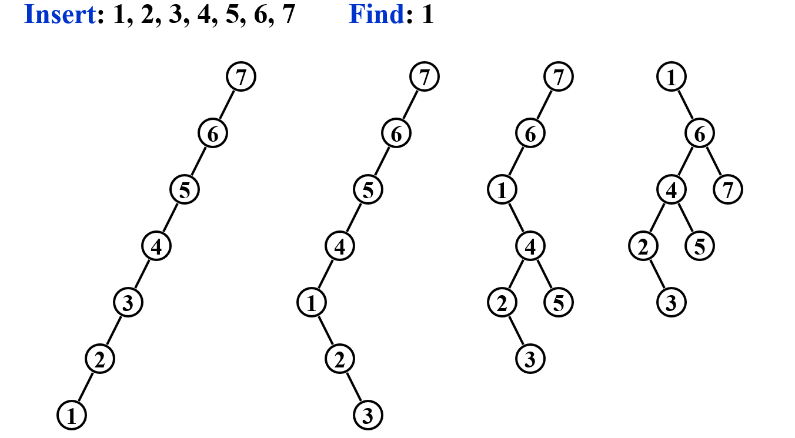

# AVL Trees, Splay Trees and Amortized Analysis

[TOC]

[看xyx的笔记](https://note.isshikih.top/cour_note/D2CX_AdvancedDataStructure/Lec01/#lr--rl)

## AVL

要求每个节点的左右子树高度差的绝对值不能大于1(定义空的二叉树的高度为-1)

BF(Balance Factor)：**左子树高减右**

- 左子树$T_L$和右子树$T_R$的高度$h_L$和$h_R$满足$|h_L-h_R|\le1$

- $BF(node)=h_L-h_R$ 
- AVL树的 $BF(node) = -1, 0, 1$

每次操作需要遍历从最底端到root的各个节点，时间复杂度为$O(h)$，调整操作时间复杂度为$O(1)$（只需要调整3个节点）

AVL 树的搜索、插入和删除操作的时间复杂度为 $O(h)=O(log n)$

> 证明 $h = O(lnN)$:
>
> 将给定结点个数求最高的树高问题，转化为给定树高，求最小结点个数的对偶问题，然后转化为斐波那契数列即可
>
> 高为h的**最少**节点： $n_h=n_{h-1}+n_{h-2}+1=F_{h+2}-1$      高为$h$的树节点总量为$n_h$
>
> *F*(1)=1，*F*(2)=1
>
> 

### 插入

(删除操作不做要求)

在保持平衡的同时要注意二叉搜索树条件==左小右大==的保持，从下到上找到第一个平衡出问题的节点

我们需要$O(log n) $的时间找到插入的位置，接下来的问题是，插入可能会破坏树的平衡结构。需要注意的是，**被破坏平衡性的结点显然只能在新加入的结点到根节点的路径上**，因为只有这些结点的子树高度变化了。因此我们需要**从插入的结点开始向上走找到第一个被破坏平衡性质的结点**。此时，平衡被破坏的原因我们可以分为四种情况：LL，LR，RL，RR。其中LL 和RR 只需一次旋转即可，LR 和RL 需要两次旋转。此处读者应当结合PPT 的动态图像，参考Data Structures and Algorithm Analyses in C 理解具体代码实现，包括如何记录和更新结点信息，如何判断平衡条件被破坏，以及如 何具体写rotation 操作（2022 年期末考试编程题直接要求写AVL 树的实现，得分情况很糟糕）。

- 插入的时候有可能很多个结点的平衡性质都被破坏
- 一次旋转（Double rotation 也视为一个整体）操作能让所有平衡受到破坏的结点恢复(只有新加入的结点到根节点的路径上的结点可能平衡属性被破坏，因为此时是插入操作，所以平衡被破坏是因为新加的结点太深了，但如果观察可以发现，无论是LL、RR 还是LR、RL，事实上都会使得插入的结点深度减少1，所以一定能使得路径上所有结点平衡属性恢复)
- BF改变不一定就需要调整树（树高差没变的话）

右旋 B向A的方向旋转，一轮旋转之后 旋转的一边高度增加了1 另一边减少了1，时间复杂度 $O(1)$

出问题的插入的Nov在找出问题的Mar的右子树的右子树上，所以叫RR rotation

- A是第一个出问题的，插入的位置是B的子树上的节点（不一定是B直接下面插入的）

一个上去了一个掉下来

C带着$C_R$向上走了两次

## Splay

Splay Trees 通过**将被访问到的节点放于根**，提升访问速度，使得$m$次连续搜索的复杂度为$O(mlogN)$即——摊还分析，摊还代价（**整**体的复杂度）为$O(logN)$

Splay 树在访问（特别注意访问包括搜索、插入和删除）时都需要将元素移动到根结点，这非常符合程序局部性的要求

Splaying not only moves the accessed node to the root, but also roughly halves the depth of most nodes on the path**不仅将访问的节点移动到根，而且还将路径上大多数节点的深度大致减半**

- 搜索：使用普通二叉搜索树的方法找到结点，然后通过splay 操作经过一系列旋转将搜索的结点移动到根结点的位置；
- 插入：使用普通二叉搜索树的方法找到要插入的位置进行插入，然后把刚刚插入的结点通过splay操作经过一系列旋转移动到根结点的位置；
- 删除：使用普通二叉搜索树的方法找到要删除的结点，然后通过splay 操作经过一系列旋转将要删除的结点移动到根结点的位置，然后删除根结点（现在根结点就是要删除的点），然后和普通二叉搜索树的删除一样进行合理的merge 即可。

### navie的方法

不断把访问的结点与其父结点更换父子关系，从而翻到根结点的方法行不通过，比如下例，先插入N个结点，再依次查找，复杂度为$O(N^2)$

### 真正的方法

1. case 1 就是简单的交换X 和P 的父子关系，然后调整子树满足搜索树性质即可；

2. **zig-zag**(三个不是一条线) 的操作方法与AVL 树的**LR 或者RL** 是一致的，是上面**的naive** ，三者等价；

3. **zig-zig** (三个一条线) 才是与naive 的方法不一样的地方！特别注意naive 的方法先交换X 和P 的位置关系，然后交换X 和G 的位置关系，但是zig-zig 的标准操作方式是，**先交换P-G 边需按照，再X - P 边旋转**！这个区别就是它与naive 方法的唯一区别，却能实现我们最终均摊的目标；

   注意虽然**zig-zig** 在PPT 上写的是single rotation，但实际上转了两次，这里的single 大概就是为了表示和AVL 的double rotation 不一样吧，zig-zag 有底气称为double rotation 是因为它和AVL 一样

一个例子

- 为什么全部用单旋转(Zig)不行：不会显著改变path上其他节点的深度甚至有可能会往下推

- Zig：SingleRotation，仅在parent为根节点时进行

**势能函数**：$\displaystyle \Phi(T) = \sum_{i=1}^n\log S(i)$    ($ S(i)$表示子树i中总节点数，日中R(i)=logS(i)又被称为rank)

高度变化太大，如果用根的节点数变化的话势能就会太大导致最后的结论过于松

$a+b \le c$, 则$loga+logb\le 2logc+2$

## Amortized(均摊) Analysis

M种**从空结构开始的连续操作**的平均，均摊界与测试数据分布无关

**worst-case bound $\ge$ amortized bound $\ge$ average-case bound**   都是upper bound

第一种聚合分析建立在寻找可能出现的操作序列中的最差情况的想法，后两种建立在截长补短的思想，这两种思想是描述摊还分析等价的两种思想。然后要注意，在核算法中我们是对每个操作定义摊还代价，而势能法是对每一步操作定义，这使得整体分析时，步骤之间可以消去很多中间计算项，从而使得我们设计起来更加简单

### Aggregate analysis 聚合分析

$n$个操作（任意操作）序列worst是$T(n)$，则摊还代价为$T(n)/n$

`pop()`和`multiPop()`都需要`push()`来支持，三种栈操作的代价都是$O(n)/n=O(1)$

从空栈开始的连续n 次操作中，最差的操作代价是$2n − 2$,  $n-1$次`push`，$1$次`multipop`

### Accounting method 核算法

- The difference between aggregate analysis and accounting method is that the later one assumes that the **amortized costs of the operations may differ from each other.**

核算法是对<u>不同的操作</u>赋予<u>**不同**的摊还代价</u>，这个代价可能与其实际操作代价不同，但是通过整体的调整，会使得对一系列操作的整体摊还代价的分析变得简单。

初始估计的为amortized cost，实际需要食品量为actual cost，差值就是credit

$\rm \Large T_{amortized}= \frac{\sum \hat c_i(\geqslant \sum c_i)}{n}{}$

只要有办法保证估计的肯定不小于实际的就可以了，例如push=2 (估计$ \Delta_i=\hat c_i-c_i$是影响误差的最重要的一步)

### Potential method势能法

<u>For potential method, a good potential function should always assume its **minimum** at the start of the sequence</u>

- 势能与整个数据结构相关联，而不是特定对象

$D$表示状态

$\hat c_i = c_i + Φ(D_i)-Φ(D_0)$，但是$D_i-D_{i-1}$没要求一定非负,但是要求$Φ(D_0)$是最小的以及$credit=Φ(D_i)-Φ(D_0) \ge0$

注意这里的i 不再是核算法中表示第i 种操作，而是n 个操作组成的序列中的第i 个

其中Φ()为势能函数

$\large\displaystyle \sum \hat c_i = \sum c_i+\Phi(D_n)-\Phi(D_0)$

动态数组的势能函数$\Phi(D_i) = 2T_{num}-T_{size}$(元素个数的两倍减去动态数组占用大小)

