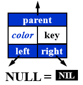
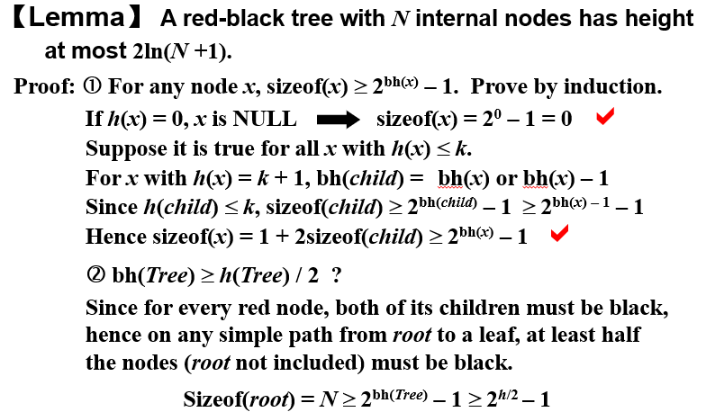
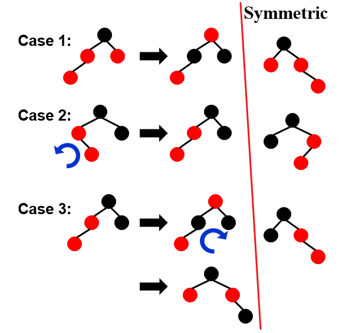
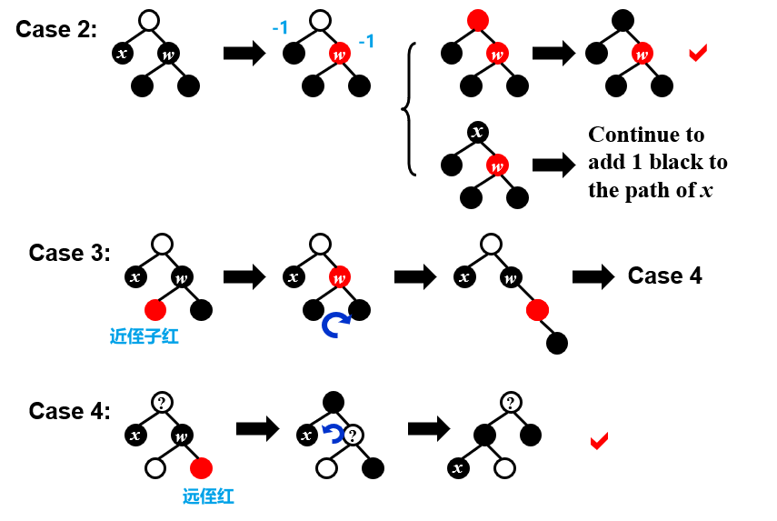
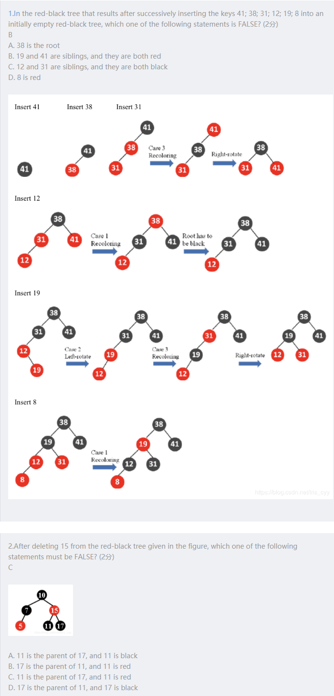
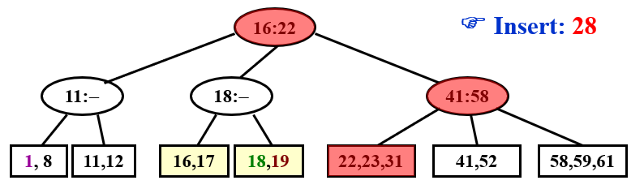
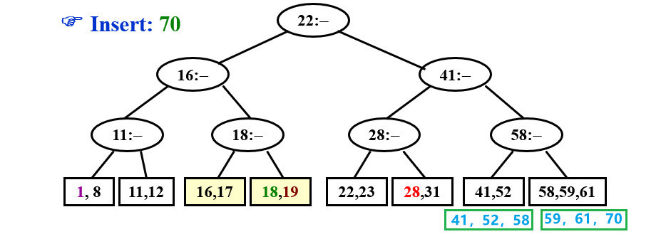
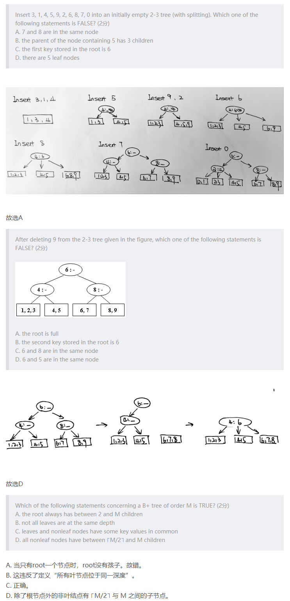

[TOC]

AVL, Splay, RB的插入删除均为$O(logN)$

## Red-black tree

也是平衡二叉搜索树



### 性质

1. 非黑即红

2. 😀根黑

3. 叶子都是哨兵，哨兵黑

   (一个**哨兵节点NIL=NULL** ， root的父和leaf的子都指向它 ，被称为External node) 

4. 😀**红结点的儿子黑**（相邻节点不能出现挨着的红

5. 对每个节点，**到后裔的所有简单路径上的黑结点数相同** bh

😀 染红插入可能破坏

### black-height 黑高

$bh(x)$到叶结点的黑结点数（<font color='red'>不包括$x$</font>）,    $bh(Tree)=bh(root)$   由于性质5，所以路径只要随便挑一条就可以了

包含N个节点的红黑树的高度最大是  <font color='red'>$2ln(N+1)$</font>

以x为根节点的树节点数为**sizeof(x)>=2^bh(x)^-1**

bh(t) >= h(tree)/2

> 证明：
>
> 

### Insert 插入

具体定义可以看下🦐

染红再插入，侄子离自己远一点

case 1 可能破坏根节点的性质 爸爸红的，甩锅爷爷 （可能会迭代）

case 2 左旋  ，case2旋转之后递归到case3

case 3 父节点和祖先节点颜色交换 （哪边高哪边拎起来）

记得时候就直接背就行了



$T=O(h)=O(lnN)$

红黑树的插入最多进行三次旋转

**迭代**

循环不变式（这三条性质在循环开始前和循环中一直不变）

1. z红
2. z.p是根节点，则z.p为黑
3. 最多一个红黑性质被破坏，要么是性质2要么是性质4(性质4的破坏都是往上走的)

### Deletion 删除

$O(log n)$

##### 删叶子节点

红节点直接删；**黑色就要调整**

##### 删degree=1的节点

用子节点代替该节点，并且保持该节点颜色不变

##### 删degree=2的节点

1. 左子树中最大的节点或右子树中最小的节点代替该节点，并且保持该节点颜色不变
2. 从子树中删除替代节点


x是要删除的点，到时候就按照插入一样毛估

黑1，红0；删除的时候x要先+1变成2




| Number of rotations | AVL       | Red-Black |
| ------------------- | --------- | --------- |
| 插入                | $\le 2$   | $\le 2$   |
| 删除                | $O(logN)$ | $\le 3$   |

------

### 题目



第二题11，17谁是爸爸没关系，但是爸爸一定是黑的，儿子一定是红的

# B+ tree

### 定义

具体定义可以看下🦐

A B+ tree of a order **M** (M一般是3或者4)

已经不是二叉搜索树了，所有的**叶结点有相同的depth**

儿子要求：每个有**$\lceil$m/2$\rceil$到m**个儿子（非叶）/keys（叶子），根节点可以为**leaf**或有**2到m**个儿子 （2到3，或者2到4）

注意：m是分支个数不是非叶节点中**数据个数(最多m-1**)来隔断M个

叶节点存数据，非叶节点存索引(指针和索引)

2-3树：**M=3**；2-3-4树：**M=4**（非叶有2-3-4个指针，叶最多有4个key）；


### Insert

超过m就分裂（分裂的时候喜欢平分，**奇数则喜欢右边多点**），向上插入新的索引，递归，若到根还超了则向上长一层

$T=O(M)$

$Depth(M,N)=O(\lceil log_{\lceil M/2\rceil}N\rceil)$

$T_{Find}(M,N)=O(logN)$



但是插入70这个操作只会走向兄弟而不会走向堂兄



```pseudocode
Btree  Insert ( ElementType X,  Btree T ) 
{ 
	Search from root to leaf for X and find the proper leaf node;
	Insert X;
	while ( this node has M+1 keys ) { //这个操作的复杂度是O(M)
    		split it into 2 nodes with ⌈(M+1)/2⌉ and $\lfloor$(M+1)/2$\rfloor$ keys, respectively;
    		if (this node is the root)
        		create a new root with two children;
    		check its parent;
	}
} 
```

#### Deletion

课上没讲，只有下面这么一句话

Deletion is similar to insertion except that the root is removed when it loses two children.

------

### 题目

>1. In a B+ tree, leaves and nonleaf nodes have some key values in common. 
>
>  T



**效果分析**

$Depth(M,N) = O(\lceil \log_{\lceil M/2\rceil} N\rceil)$ 

$T_{Insert}(M,N) = O(M\log_MN) = O(\frac{M}{\log M}\log N)$

$T_{Find}(M,N) = O(\log M \log_MN) = O(\log N)$


