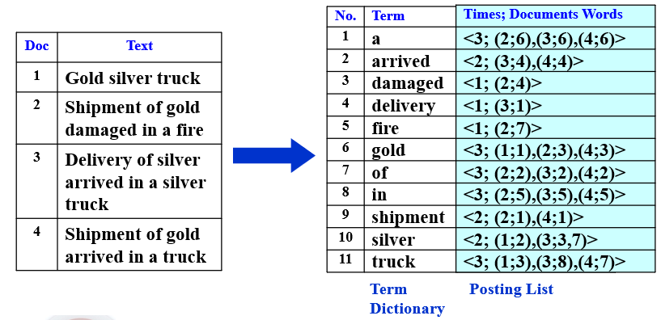
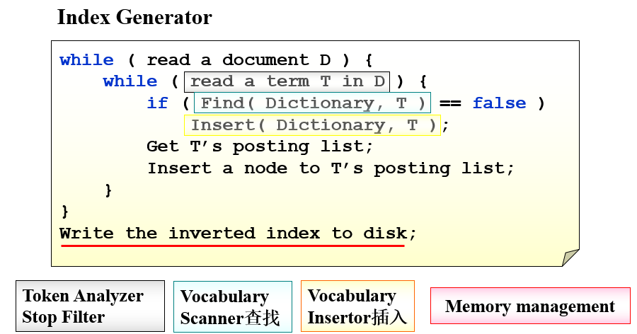
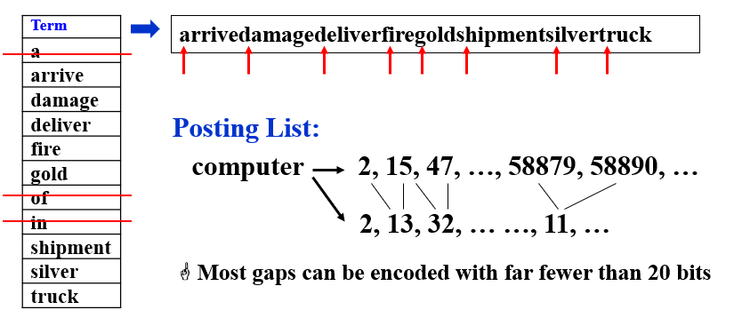
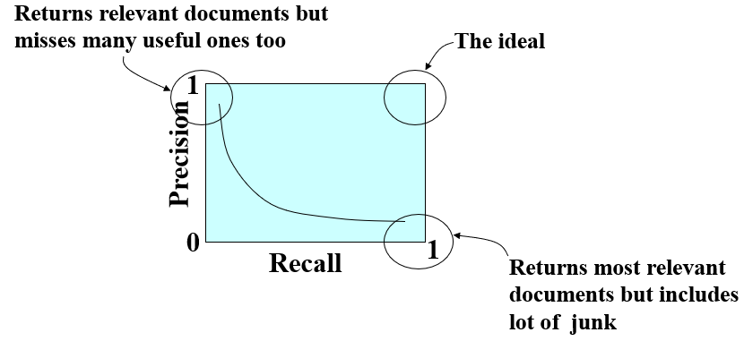
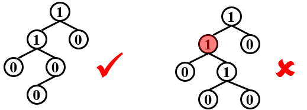
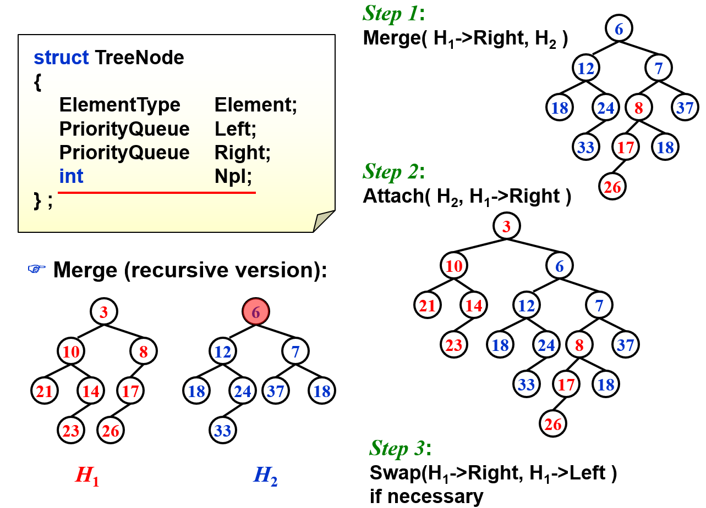
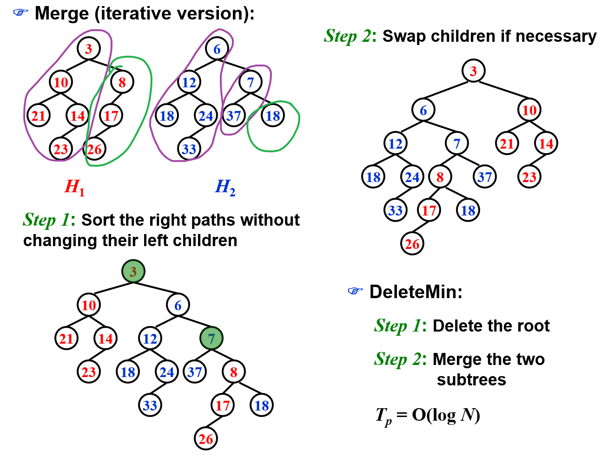
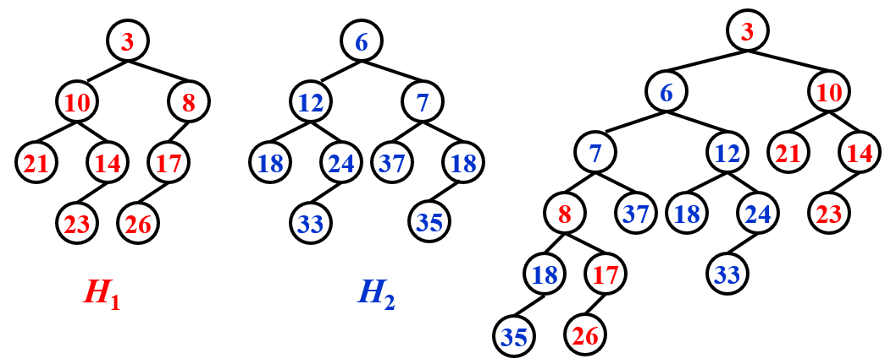
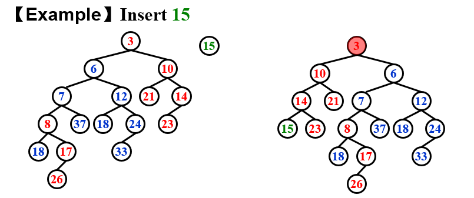

[TOC]

## Inverted File Index 文件倒排索引

**【Definition】** **Index** **is a mechanism for locating a given term in a text. **  为什么叫Inverted？<u>由Inverted File可以倒推出原文</u>

【Definition】 **Inverted file（倒置是因为它列出了某个术语以及包含该术语的所有文档） **contains a list of pointers (e.g. the number of a page) to all occurrences of that term in the text.  求交的时候先挑频率低的，可以加快检索

### 文件倒排索引建立过程 Index Generator

1. 从文件中读取词
2. Token Analyzer过滤:  将该词提取为词干(**word stemming**)，即去除第三人称形式、过去式、进行时等形式，留下词干），并去除分词(**stop word**)——即”a”, “is”等没有意义的词。
3. 检查该词是否已经在词典之中。
4. 若不在，则将该词添加入词典之中。更新索引信息。
5. 建立完毕后，将索引文件存入磁盘。

### 访问 accessing a term

- 搜索树 Search trees(B- trees, **B+ trees**(这个最好，会把相邻的一起读进来), Tries)

- 哈希表 Hashing （range access很麻烦，因为相邻的不存在附近）

  > 花费常数时间，**访问更快**；
  >
  > 但存储不灵活，需要扩展空间

### 倒排索引分布式存储 Distributed indexing

这两个方法不能相互比较

- Term-partitioned Index   A~C D~F ............ X~Z

  > 按照关键词的（字典序）将文件存在不同的主机上，全局建立索引。
  >
  > **查找性能更高**（一台挂全部寄了）

- Document-partitioned Index 更好，即使并行仍然会更慢一点   1~ 10001~ 90001~ 10000 20000 100000

  > 按照文件号（按照文档）将文件存在不同主机上，在每台主机上建立局部索引。
  >
  > **更加可靠**

### 动态索引 dynamic indexing

- 需要被索引的文档集可能是动态变化的（添加新文档、删除现有文档）

- 索引需要定时更新，并建立主索引(**Main Index**)和辅助索引(**auxiliary index**)

  > 大的主索引，保存在磁盘中;
  >
  > **小的用于存储新文档信息的辅助索引**，保存在内存中。
  >
  > 检索时可以同时遍历两个索引并将结果合并。
  >
  > 文档的**删除记录**在一个无效位向量中，在返回检索结果之前可以利用它过滤掉已经删除的文档。**每当辅助索引变得很大时，就将它合并到主索引中**。

### 压缩 compression

- 将词典看为单一字符串，（先删除一些值）以消除用定长方法来存储单词所存在的空间浪费；
- docID的存储只记录与上一项docID的**差值**(**gap**)来减少docID存储长度。（但是牺牲时间换空间，因为加上值还会比较麻烦

### 阈值 thresholding

- 通过只检索权重(**weight**)为前x%(**thresholding**)的来提高效率

- 评估搜索引擎性能 接口友好不重要

  - index建立索引速度
  - search响应时间
  - query language表达能力

### User happiness

- **Data Retrieval** Performance Evaluation (after establishing correctness)
  - Response time
  - Index space
- **Information Retrieval** Performance Evaluation
  - How relevant is the answer set?

### 评估相关度 relevance measurement （评价infomation retrieval）

|               | Relevant | Irrelevant |
| ------------- | -------- | ---------- |
| Retrieved     | R~R~     | I~R~       |
| Not Retrieved | R~N~     | I~N~       |

- **精确度(Precision)**

  所有收回的中相关的占的比例 retrieved documents that are irrelevant

  $P=\frac{R_R}{R_R+I_R}$  分母是检索到的 检索到的准不准

- **收回度(Recall)**

  所有相关的中收回的所占比例 relevant documents retrieved

  $R=\frac{R_R}{R_R+R_N}$  分母是相关的

  

## 堆 (默认顶最小)

堆：完全二叉树

堆的删除：把最下面的换到顶上，找最小的子然后交换

## Lefist Heap

lefist heap 的存在是为了使得《《两个都是$N$大小的二叉堆的合并，一共进行$N$次插入，从花费$O(N)$的代价到$O(logN)$》》

和一般的堆相比：**高度不平衡**

**null path length**, $Npl(X)$：从任意节点X出发**到没有俩儿子**的节点的**最短距离**

$Npl(NULL) = –1$ 没有的节点就是-1.这就要求没左子的时候一定不能有右子

Npl(X) = min { Npl(C) + 1, for all C as children of X } 所以自下而上去算比较方便

对堆中的每个结点$X$， $Npl(\mathrm{left\ child})\geq Npl(\mathrm{{right\ child}})$  整个树尽量往左

 **right path** 有$r$个节点，那么这个左偏树至少有 $2^r – 1$ 个节点 （数归证明）

反过来有$N$个节点的左偏树，右路径最多有$\lfloor log(N+1) \rfloor$个节点

插入是合并的一种特殊情况

### Merge

$T=O(logN)$  **把大值的插到小值的右子就对了** 迭代一次$O(1)$,迭代$logN$次

==用迭代来解题，然后把递归的伪代码背一下==

#### recursive version

1. 对比根节点 将$H_1$的右子树和$H_2$合并(递归，8和6比，8和7比，8和18比，这个时候8没有右子，直接插入)
2. 把合并后的H2作为H1的新右子树
3. 失去了Leftist性之后再交换小的左右子树

#### Iterative version

1. 右路径排序（这样左边都一定是左偏树，但还是右边不能保证）。从最大的开始合并，无脑插右边
2. 交换孩子（==**从根节点往下检查**==进行交换）

### DeleteMin

1. Delete root
2. Merge

$O(logN)$

## Skew Heaps 斜堆

一种简单的不需要维护NPL的左偏树

Any $M$ consecutive operations take at most $O(M log N)$ time.

### Merge

类似Iterative version的合并（从最大的开始合并，无脑插右边），但是**插入的层交换一次即可**，可见于[https://en.wikipedia.org/wiki/Skew_heap#Non-recursive_merging]

### 插入

插入一个值则从最底层开始，**每层都需要交换(包括第一次插入操作，这意味着刚插入是右子但是马上会变成左子)，层层向上**

### Amortized Analysis

$T_{amortized} = O(log N)$ 

