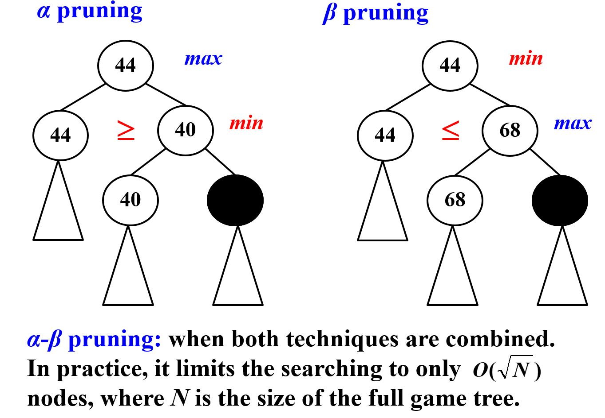

# Backtracking 回溯法

- 一个一个检查

  列出所有候选答案的清单，逐一审查，并在审查所有或部分候选答案后，宣布确定的答案

- pruning 剪枝

  回溯使我们能够消除对大量候选子集的明确检查，同时仍能保证在算法运行到终点时找到答案。

​       依次尝试所有的解空间，如果不可行回退到上一个

### 八皇后问题

不能在同一行同一列也不能在对角线

通过去掉一些重复状态，缩小解空间


### 加油站问题 **Turnpike Reconstruction Problem**

给定距离集合$\frac{n(n-1)}{2}$ 求$n$个加油站的位置


```c
bool Reconstruct ( DistType X[ ], DistSet D, int N, int left, int right )
{ /* X[1]...X[left-1] and X[right+1]...X[N] are solved */
    bool Found = false;
    if ( Is_Empty( D ) )
        return true; /* solved */
    D_max = Find_Max( D );
    /* option 1：X[right] = D_max */ 从右边开始往中间插
    /* check if |D_max-X[i]|\in D is true for all X[i]’s that have been solved */
    OK = Check( D_max, N, left, right ); /* pruning */
    if ( OK ) { /* add X[right] and update D */
        X[right] = D_max;
        for ( i=1; i<left; i++ )  Delete( |X[right]-X[i]|, D);
        for ( i=right+1; i<=N; i++ )  Delete( |X[right]-X[i]|, D);
        Found = Reconstruct ( X, D, N, left, right-1 ); // right + 1
        if ( !Found ) { /* if does not work, undo */ 如果失败了则恢复
            for ( i=1; i<left; i++ )  Insert( |X[right]-X[i]|, D);
            for ( i=right+1; i<=N; i++ )  Insert( |X[right]-X[i]|, D);
        }
    }
    /* finish checking option 1 */ 改为插在left开始往中间插
    if ( !Found ) { /* if option 1 does not work */
        /* option 2: X[left] = X[N]-D_max */
        OK = Check( X[N]-D_max, N, left, right );
        if ( OK ) {
            X[left] = X[N] – D_max;
            for ( i=1; i<left; i++ )  Delete( |X[left]-X[i]|, D);
            for ( i=right+1; i<=N; i++ )  Delete( |X[left]-X[i]|, D);
            Found = Reconstruct (X, D, N, left+1, right ); // left +1
            if ( !Found ) {
                for ( i=1; i<left; i++ ) Insert( |X[left]-X[i]|, D);
                for ( i=right+1; i<=N; i++ ) Insert( |X[left]-X[i]|, D);
            }
        }
        /* finish checking option 2 */
    } /* finish checking all the options */
    
    return Found;
}

```

### Template

```c
bool Backtracking ( int i )
{   Found = false;
    if ( i > N )
        return true; /* solved with (x1, …, xN) */
    for ( each xi in Si ) { 
        /* check if satisfies the restriction R */
        OK = Check((x1, …, xi) , R ); /* pruning */
        if ( OKin ) {
            Count xi in;
            Found = Backtracking( i+1 );
            if ( !Found )
                Undo( i ); /* recover to (x1, …, xi-1) */
        }
        if ( Found ) break; 
    }
    return Found;
}

```

注：回溯的效率跟**S的规模**、**约束函数的复杂性**、**满足约束条件的结点数**相关。约束函数决定了剪枝的效率，但是如果函数本身太复杂也未必合算。满足约束条件的结点数最难估计，使得复杂度分析很难完成。


### Tic-tac-toe

连成线就赢了(斜着也算)

例如井字棋，设**评估函数**W为当前状态下某方的可能赢的三条(Win Line)有W个，则$f(P) = W_{Computer} - W_{Me}$，我要使$f(P)$尽可能小

评估函数很重要 

另外的评估函数：$\begin{cases}赢了：1\\平局：0\\输了：-1\end{cases}$


这个是全部是O有几种赢法 - 全是X有几种书法


#### α-β pruning

关键就是比第二层的兄弟min/max



一般从左开始DFS，所以c先被搞掉


