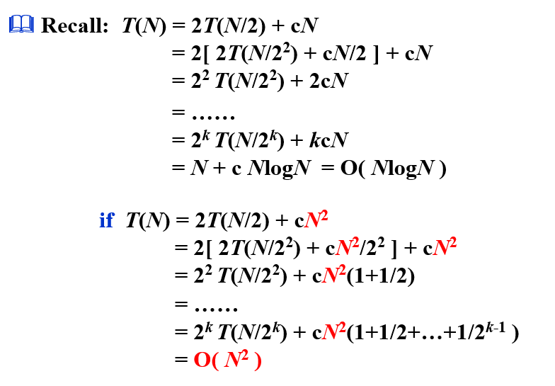
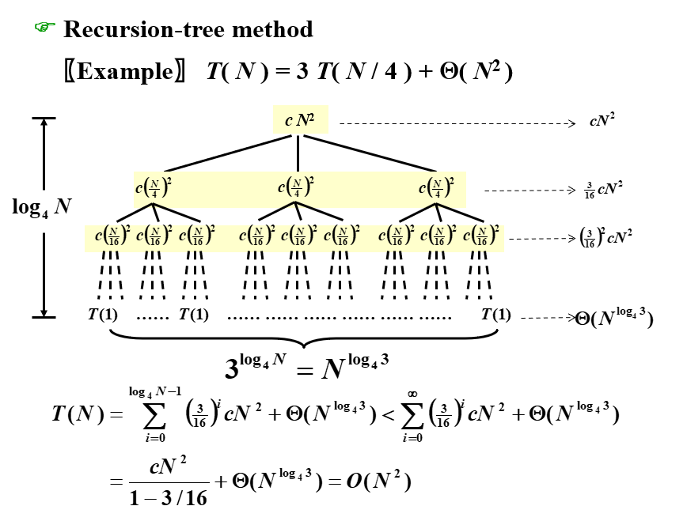
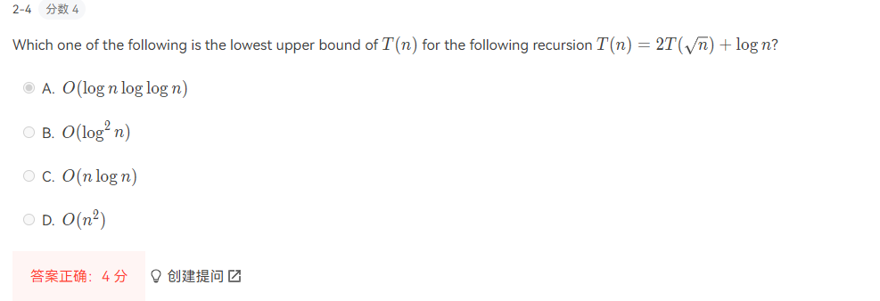

# Divide and conqure

最重要的应该就是背主公式, 具体的几个案例，感觉[xy的笔记](https://note.isshikih.top/cour_note/D2CX_AdvancedDataStructure/Lec07/#%E5%88%86%E6%B2%BB%E6%96%B9%E6%B3%95)挺好的

### 最短点对问题

将点集分为两部分，求左边的最短路，右边的最短路，跨越分界线的最短路

其中跨越分界线的最短路的时间即为f(N), 不同f(N)开销下总的复杂度如下



找σ-strip，只在挡板内找，其中σ=min(左最短，右最短)/2

(假设挡板内节点个数为O(√N)(均匀分布的结论)

算法一，求挡板内任意两个点的距离，O(√N×√N)，但是如果不均匀，则会变成WorstCase：O(N^2^)

```cpp
/* points are all in the strip */
for ( i=0; i<NumPointsInStrip; i++ )
    for ( j=i+1; j<NumPointsInStrip; j++ )
        if(Dist(Pi ,Pj) < σ)
            σ = Dist( Pi , Pj );
```

算法二，在纵轴上也进行考虑

```cpp
/* points are all in the strip */
/* and sorted by y coordinates */
for ( i = 0; i < NumPointsInStrip; i++)			// O(√N)~O(N)
    for ( j = i + 1; j < NumPointsInStrip; j++)	// O(1)
        if ( Dist_y( Pi , Pj ) > σ ) // sorted 就是要确保这里能break
            break;
        else if ( Dist( Pi , Pj ) < σ )
            σ = Dist(Pi ,Pj );
```

## 三种方法证明分治复杂度

### Substitution Method 纯猜

### Recursion-tree method 边画边猜



### Master Method 主方法

前半部分是分，后半部是治


> 
>
> [换元然后用主定理](https://cs.stackexchange.com/questions/96422/how-to-solve-tn-2t%E2%88%9Anlog-n-with-the-master-theorem)
